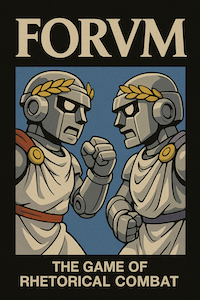

# Roman Senate Game using AI Agents & LLMs



"AI Agents yelling at each other in historically adjacent Latin"


In development -- "Cave lusor, cimices adsunt!"


## Overview

The Roman Senate Game is an immersive political simulation set in the late Roman Republic. Experience the power dynamics, political maneuvering, and eloquent debates of ancient Rome's most influential legislative body. Whether you want to watch AI senators debate or participate as a senator yourself, this game offers a unique glimpse into Roman political life.

## Key Features

- **AI-Powered Senators**: Interact with AI senators with unique personalities, backgrounds, and political alignments
- **Historical Authenticity**: Set in the late Republic era with historically accurate debate topics and context
- **Sophisticated Speech Generation**: Experience speeches with classical structure, rhetorical devices, and Latin flourishes
- **Faction Politics**: Navigate the complex dynamics between Optimates and Populares factions
- **AI-Generated Narrative System**: Experience a living, evolving Rome with dynamic daily events, rumors, and interactions
- **Three Game Modes**:
  - **Simulation Mode**: Watch autonomous senator agents with memory, dynamic relationships, and advanced decision-making
  - **Traditional Simulation Mode**: Watch basic AI senators debate and vote (legacy mode)
  - **Interactive Mode**: Create your own senator and participate in debates and votes
- **Dynamic Voting System**: Influence votes through persuasive speeches and political relationships

## Installation

### Prerequisites

- Python 3.8 or higher
- pip (Python package installer)

### Setup

1. Clone the repository:
   ```bash
   git clone https://github.com/yourusername/roman-senate-game.git
   cd roman-senate-game
   ```

2. Install the required dependencies:
   ```bash
   pip install -e .
   ```

3. Configure your LLM provider:
   The game uses an LLM (Large Language Model) for speech generation. By default, it uses OpenAI's GPT-4 (non-turbo) model for optimal Latin generation. Simply set your OPENAI_API_KEY environment variable:
   
   ```bash
   export OPENAI_API_KEY=your_api_key_here
   ```
   
   Alternative LLM providers can be configured if needed. See [LLM Provider Configuration](docs/llm_providers.md) for details.

## Playing the Game

### Simulation Mode

Watch AI senators debate and vote on important matters facing Rome:

```bash
python -m roman_senate.cli play
```

### Interactive Mode

Participate as a senator yourself:

```bash
python -m roman_senate.cli play-as-senator
```

### Command-line Options

#### Simulation Mode (Agent-Driven)

```bash
python -m roman_senate.cli simulate
```

Run a simulation with autonomous senator agents that have memory and develop relationships (default):

- `--senators`: Number of senators to simulate (default: 10)
- `--debate-rounds`: Number of debate rounds per topic (default: 3)
- `--topics`: Number of topics to debate (default: 3)
- `--year`: Year in Roman history (negative for BCE, default: -100)
- `--provider`: LLM provider to use (defaults to config)
- `--traditional`: Use traditional simulation instead of agent-driven

Example:
```bash
python -m roman_senate.cli simulate --senators 15 --topics 5 --year -50
```

#### Simulation Mode Options

- `--senators`: Number of senators to simulate (default: 10)
- `--debate-rounds`: Number of debate rounds per topic (default: 3)
- `--topics`: Number of topics to debate (default: 3)
- `--year`: Year in Roman history (negative for BCE, default: -100)

Example:
```bash
python -m roman_senate.cli play --senators 15 --topics 5 --year -50
```

#### Interactive Mode Options

- `--senators`: Number of NPC senators to simulate (default: 9)
- `--topics`: Number of topics to debate (default: 3)
- `--year`: Year in Roman history (negative for BCE, default: -100)

Example:
```bash
python -m roman_senate.cli play-as-senator --senators 12 --topics 4 --year -75
```

### Game Information

View information about the game:

```bash
python -m roman_senate.cli info
```
## Game Modes Explained

### Simulation Mode (`roman_senate.cli simulate`)

In Simulation Mode, senators function as autonomous agents with memory, goals, and decision-making capabilities:

1. Senators remember past debates, votes, and interactions
2. They form dynamic relationships that evolve based on voting alignment
3. They provide detailed reasoning for their stances, rhetorical approaches, and votes
4. The simulation displays the evolving relationship network between senators

This mode is ideal for:
- Observing emergent political behavior and coalition formation
- Studying how relationships influence political decision-making
- Experiencing a dynamic and unpredictable simulation

### Traditional Simulation Mode (`roman_senate.cli simulate --traditional`)

In Traditional Simulation Mode, you watch as AI-controlled senators debate and vote on important matters facing Rome. The game will:

1. Initialize a set of senators with unique personalities and political alignments
2. Generate historically appropriate debate topics
3. Simulate debates with multiple rounds of speeches
4. Conduct voting and display results

This mode is useful for:
- Learning how the Roman Senate functioned
- Enjoying the political drama without active participation
- Studying the sophisticated speech generation system
- Faster simulations when agent memory is not needed
- Experiencing a more dynamic and unpredictable simulation

### Interactive Mode (`roman_senate.cli play-as-senator`)

In Interactive Mode, you create and play as your own Roman senator, participating actively in the Senate. You will:

1. Create your senator character with a name, faction, and background
2. Join Senate sessions alongside AI senators
3. Make speeches, interject during others' speeches, and cast votes
4. Build relationships with other senators that affect their voting behavior

This mode offers a more engaging experience where your decisions directly impact the outcome of Senate votes.

## Technical Architecture

The Roman Senate Game is built with a modular architecture that separates core gameplay components from user interface and player interaction systems.

### Key Components

```
┌────────────────────────────────────────────────────────────┐
│                     Core Game Components                   │
├─────────────┬─────────────┬────────────────┬───────────────┤
│ Game State  │  Senators   │ Topic Generator│ Senate Session│
└─────────────┴─────────────┴────────────────┴───────────────┘
                                 │
                ┌────────────────┼────────────────┐
                │                │                │
┌───────────────▼─────┐ ┌───────▼──────┐ ┌───────▼──────┐
│   Debate System     │ │ Vote System  │ │Player System │
└─────────────────────┘ └──────────────┘ └──────────────┘
        │                                        │
┌───────▼──────────────┐              ┌──────────▼─────────┐
│  Speech Generation   │              │  Player UI/Actions │
└──────────────────────┘              └────────────────────┘
```

The game features:

1. **Integrated Game Loop**: Connects core components (game state, senators, topics, debates, voting)
2. **Speech Generation Framework**:
   - Archetype system for senator personalities
   - Classical speech structure
   - Rhetorical devices
   - Latin flourishes
3. **Narrative System**:
   - AI-generated daily events and rumors
   - Narrative consistency processing
   - Relationship tracking between entities
   - Integration with game state
4. **Player Interaction System**: Allows users to participate as senators

## Example Gameplay Scenarios

### Scenario 1: Land Reform Debate

In this scenario, the Senate debates a proposed land reform bill that would redistribute land to veterans and poorer citizens.

**Simulation Mode**: Watch as Populares senators argue for the redistribution while Optimates defend traditional property rights. The speeches will include historical references to previous land reforms and the Gracchi brothers.

**Interactive Mode**: As a Populares senator, you might make a speech emphasizing the loyalty of veterans and the need for social stability. You could interject during an Optimate's speech to challenge their arguments. Your relationships with other senators will influence their votes.

### Scenario 2: Military Funding Crisis

The Senate must decide whether to allocate additional funds for a military campaign.

**Simulation Mode**: Observe as militarist senators advocate for the funding while others argue for fiscal restraint. Notice how senators use different rhetorical devices based on their archetypes.

**Interactive Mode**: You decide whether to support or oppose the funding. If you've built strong relationships with military-aligned senators, your speech might sway more votes. Your choice of rhetoric will affect how persuasive your argument is.

### Scenario 3: Narrative Events and Rumors

Experience how the narrative system enriches the simulation with daily events and rumors:

**Simulation Mode**: As the Senate debates important issues, you'll receive updates about events happening in Rome - from market fluctuations to religious ceremonies. You'll also hear rumors that might influence senators' opinions on current topics.

**Interactive Mode**: Use information from daily events and rumors to inform your speeches and political strategy. Reference recent events to make your arguments more persuasive or use rumors to your advantage.

## Demo Scripts

### Narrative System Demo

Try the narrative system demo to experience the AI-generated storytelling:

```bash
python demo_narrative.py
```

This demo showcases:
- Dynamic generation of daily events and rumors
- Narrative consistency processing
- Relationship tracking between entities
- Rich text output for better readability

Run `python demo_narrative.py --help` for additional options.

## Further Documentation

For more detailed information about the game components and architecture, see the documentation in the `docs` folder:

> **New: Improved CLI Usage**
> We've added new convenient ways to run the Roman Senate CLI:
> - Use the `run_senate.py` script: `python run_senate.py simulate`
> - Install as a command: `python setup_cli.py` (then use `senate` command)
> - See [CLI_USAGE.md](CLI_USAGE.md) for detailed instructions
- [User Guide](docs/user_guide.md)
- [Speech Generation Framework](docs/speech_generation.md)
- [Interactive Mode Guide](docs/interactive_mode.md)
- [System Architecture](docs/architecture.md)
- [Agent-Driven Simulation Guide](docs/agent_simulation.md)
- [Agent Architecture Documentation](docs/agent_architecture.md)
- [Narrative System Documentation](docs/components/narrative_system.md)
- [Roman Senate Traditions](docs/roman_senate_traditions.md)
- [LLM Provider Configuration](docs/llm_providers.md)

## License

[MIT License](LICENSE)

## Inspiration
https://en.wikipedia.org/wiki/Caesar_III


