# Abstracted Agentic Game Architecture

**Author:** Architecture Team  
**Version:** 1.0.0  
**Date:** April 19, 2025

## Table of Contents

- [1. Introduction](#1-introduction)
- [2. Architecture Overview](#2-architecture-overview)
- [3. Core Systems Layer](#3-core-systems-layer)
  - [3.1 Event System](#31-event-system)
  - [3.2 Agent System](#32-agent-system)
  - [3.3 Memory System](#33-memory-system)
  - [3.4 Relationship System](#34-relationship-system)
  - [3.5 Decision Making System](#35-decision-making-system)
- [4. Domain Adaptation Layer](#4-domain-adaptation-layer)
  - [4.1 Domain Registry](#41-domain-registry)
  - [4.2 Extension Points](#42-extension-points)
  - [4.3 Event Converters](#43-event-converters)
- [5. Domain Implementations](#5-domain-implementations)
  - [5.1 Senate Domain Implementation](#51-senate-domain-implementation)
  - [5.2 Generic Strategy Game Domain](#52-generic-strategy-game-domain)
- [6. Cross-Domain Integration](#6-cross-domain-integration)
- [7. Migration Path](#7-migration-path)
- [8. Performance and Scalability Considerations](#8-performance-and-scalability-considerations)
- [9. Extension Points and Customization](#9-extension-points-and-customization)
- [10. References](#10-references)

## 1. Introduction

This document presents an abstracted architecture for agentic game systems, derived from the Roman Senate AI simulation but designed to be applicable across multiple game domains. The architecture supports 1000-2000 agents with efficient event processing, memory management, and relationship tracking.

The key goals of this architecture are:

1. Create clear separation between domain-specific and domain-agnostic components
2. Preserve the best aspects of the current Roman Senate implementation, particularly the event-driven nature and relationship system
3. Address scalability and performance considerations from the best practices analysis
4. Provide well-defined extension points for new game domains
5. Define a clear migration path from the current architecture

## 2. Architecture Overview

The architecture follows a layered approach that separates domain-agnostic core systems from domain-specific implementations.

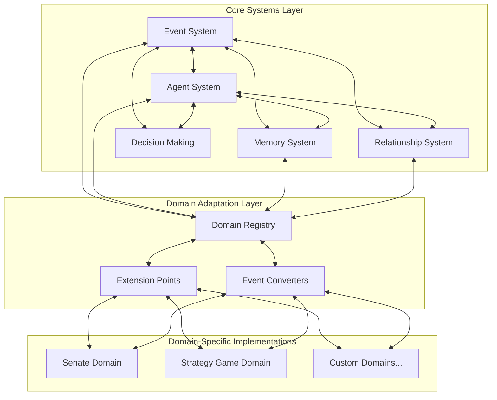

This architectural approach provides several benefits:

1. **Flexibility**: New domains can be added without modifying core systems
2. **Reusability**: Core systems can be reused across multiple games and simulations
3. **Maintainability**: Clear separation of concerns makes the system easier to maintain
4. **Scalability**: Core systems are designed with performance in mind for handling 1000-2000 agents
5. **Integration**: The Domain Adaptation Layer enables integration between different game domains

## 3. Core Systems Layer

### 3.1 Event System

The Event System is the backbone of the architecture, enabling communication between agents and components. It builds upon the current EventBus implementation with enhancements for scalability.

#### Components

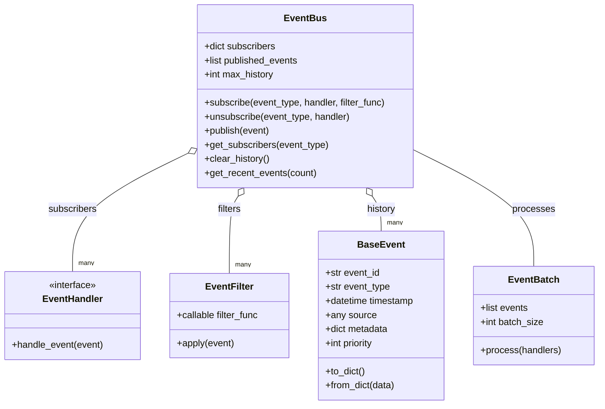

#### Key Improvements

1. **Event Filtering**: Handlers can specify filters to process only relevant events, reducing unnecessary processing
   ```python
   # Example filter that only processes events from a specific source
   def source_filter(event, source_id):
       return event.source == source_id
   
   # Subscribe with a filter
   event_bus.subscribe("speech", handler, 
                       filter_func=lambda event: source_filter(event, "senator_123"))
   ```

2. **Event Batching**: Process multiple events in batches for better performance
   ```python
   # Create and use an event batch
   batch = EventBatch(max_size=100)
   for event in events:
       batch.add_event(event)
   
   if batch.is_full():
       batch.process(handlers)
   ```

3. **Priority-based Processing**: Events are processed based on priority, ensuring critical events are handled first
   ```python
   # Create an event with high priority
   event = BaseEvent(event_type="emergency", priority=10)
   
   # Lower priority event
   normal_event = BaseEvent(event_type="routine", priority=5)
   ```

4. **Domain Partitioning**: Events can be partitioned by domain to prevent unnecessary cross-domain processing
   ```python
   # Create domain-specific event buses
   senate_bus = EventBus(domain="senate")
   market_bus = EventBus(domain="market")
   
   # Connect for cross-domain communication when needed
   parent_bus = EventBus(domain="global")
   senate_bus.set_parent(parent_bus)
   market_bus.set_parent(parent_bus)
   ```

### 3.2 Agent System

The Agent System manages the creation, lifecycle, and processing of agents. It provides a framework for creating different types of agents while maintaining a consistent interface.

#### Components

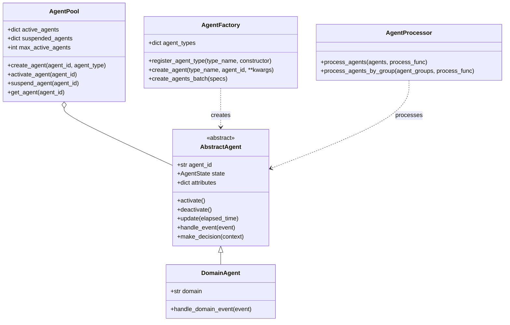

#### Key Features

1. **Agent Pooling**: Efficiently manage active vs. suspended agents for better resource usage
   ```python
   # Create an agent pool with a maximum of 500 active agents
   pool = AgentPool(max_active_agents=500)
   
   # Create and add an agent to the pool
   agent = pool.create_agent("agent_123", "senator")
   
   # Activate an agent when needed
   active_agent = pool.activate_agent("agent_123")
   
   # Suspend an agent when not needed
   pool.suspend_agent("agent_123")
   ```

2. **Agent Factory**: Create different types of agents using a factory pattern
   ```python
   # Register agent types
   factory = AgentFactory()
   factory.register_agent_type("senator", SenatorAgentConstructor)
   factory.register_agent_type("merchant", MerchantAgentConstructor)
   
   # Create agents
   senator = factory.create_agent("senator", "cicero", faction="optimates")
   merchant = factory.create_agent("merchant", "marcus", goods=["wine"])
   ```

3. **Batch Processing**: Process multiple agents in batches for better performance
   ```python
   processor = AgentProcessor()
   
   # Process a group of agents in parallel
   processor.process_agents(senators, update_agent_state)
   
   # Process agents by group
   processor.process_agents_by_group({"senators": senators, "merchants": merchants}, 
                                      update_agent_state)
   ```

4. **Lifecycle Management**: Standardized agent lifecycle with clear state transitions
   ```python
   # Agent lifecycle states
   class AgentState(Enum):
       CREATED = 1
       ACTIVE = 2
       SUSPENDED = 3
       TERMINATED = 4
   ```

### 3.3 Memory System

The Memory System handles the storage, retrieval, and management of agent memories. It provides mechanisms for storing experiences, knowledge, and relationships with proper importance and decay.

#### Components

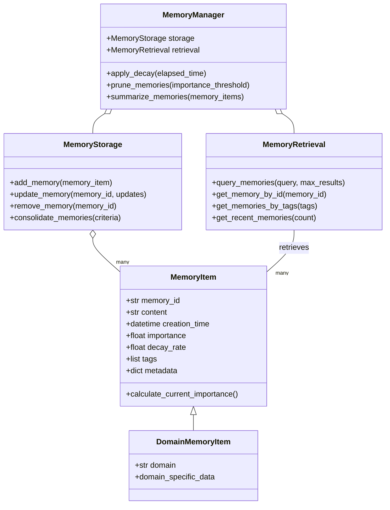

#### Key Features

1. **Memory Tiering**: Different types of memory with appropriate storage and retrieval mechanisms
   ```python
   # Define memory tiers
   class MemoryTier(Enum):
       WORKING = 1  # Short-term, high importance, fast access
       EPISODIC = 2  # Medium-term, event-based memories
       SEMANTIC = 3  # Long-term, knowledge-based memories
       PROCEDURAL = 4  # Skill and behavior memories
   
   # Create a memory with tier
   memory = MemoryItem(content="Met Senator Marcus", tier=MemoryTier.EPISODIC)
   ```

2. **Importance-based Retrieval**: Retrieve memories based on calculated importance
   ```python
   # Find the most important memories about a topic
   important_memories = memory_manager.retrieval.query_memories(
       query="Land Reform", 
       max_results=5,
       sort_by_importance=True
   )
   ```

3. **Memory Consolidation**: Consolidate multiple related memories to save space
   ```python
   # Consolidate old, related memories
   related_memories = memory_manager.retrieval.get_memories_by_tags(["senate_meeting"])
   consolidated = memory_manager.summarize_memories(related_memories)
   memory_manager.storage.add_memory(consolidated)
   
   # Remove original memories after consolidation
   for memory in related_memories:
       memory_manager.storage.remove_memory(memory.memory_id)
   ```

4. **Decay Mechanics**: Memories naturally decay over time based on importance and decay rate
   ```python
   # Apply decay to all memories
   memory_manager.apply_decay(days_elapsed=30)
   
   # Remove memories below threshold
   memory_manager.prune_memories(importance_threshold=0.2)
   ```

### 3.4 Relationship System

The Relationship System manages connections between agents, including different types of relationships and their dynamics.

#### Components

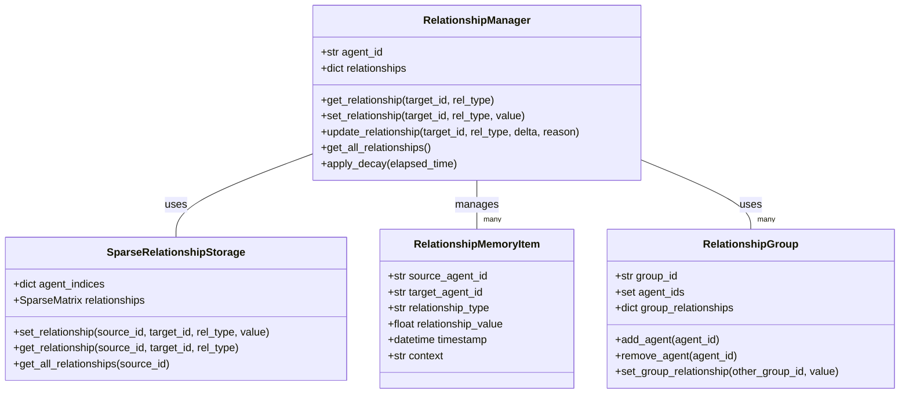

#### Key Features

1. **Sparse Matrix Storage**: Efficiently store relationships without wasting space
   ```python
   # Create a sparse relationship matrix
   storage = SparseRelationshipStorage(max_agents=2000)
   
   # Set relationships
   storage.set_relationship("agent_1", "agent_2", "political", 0.7)
   
   # Retrieve relationship
   rel = storage.get_relationship("agent_1", "agent_2", "political")
   ```

2. **Multi-dimensional Relationships**: Support different types of relationships with varying dynamics
   ```python
   # Define relationship dimensions
   class RelationshipDimension:
       def __init__(self, name, decay_rate):
           self.name = name
           self.decay_rate = decay_rate
   
   # Create dimensions
   political = RelationshipDimension("political", decay_rate=0.08)
   personal = RelationshipDimension("personal", decay_rate=0.04)
   family = RelationshipDimension("family", decay_rate=0.01)
   ```

3. **Group-based Relationships**: Aggregate relationships at group level for efficiency
   ```python
   # Create a group
   optimates = RelationshipGroup("optimates")
   populares = RelationshipGroup("populares")
   
   # Add agents to groups
   optimates.add_agent("cicero")
   optimates.add_agent("cato")
   populares.add_agent("caesar")
   
   # Set group relationship
   optimates.set_group_relationship(populares.group_id, -0.5)
   ```

4. **Contextual Activation**: Only consider relevant relationships in specific contexts
   ```python
   # Get relationships in a political context
   political_relationships = relationship_manager.get_relationships_in_context(
       "political_debate",
       ["political", "faction", "mentor"]
   )
   
   # Get relationships in a personal context
   personal_relationships = relationship_manager.get_relationships_in_context(
       "social_gathering",
       ["personal", "family", "friend"]
   )
   ```

### 3.5 Decision Making System

The Decision Making System determines agent actions based on context, goals, relationships, and other factors.

#### Components

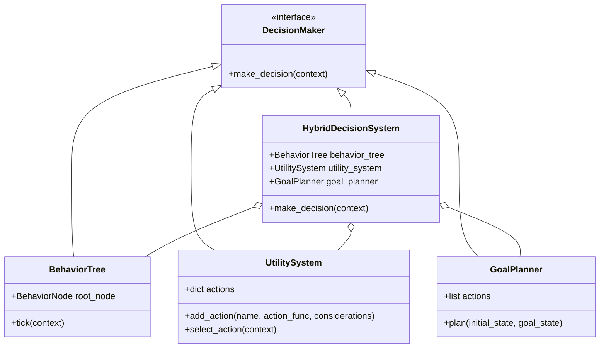

#### Key Features

1. **Behavior Trees**: Structured decision-making for complex agent behaviors
   ```python
   # Create a behavior tree
   tree = BehaviorTree()
   tree.root_node = Sequence([
       Condition(lambda ctx: ctx.is_in_debate()),
       Selector([
           Sequence([
               Condition(lambda ctx: ctx.is_my_turn_to_speak()),
               Action(lambda ctx: ctx.deliver_speech())
           ]),
           Sequence([
               Condition(lambda ctx: ctx.should_interject()),
               Action(lambda ctx: ctx.make_interjection())
           ])
       ])
   ])
   
   # Use the behavior tree
   result = tree.tick(agent_context)
   ```

2. **Utility-based Decision Making**: Select actions based on calculated utility
   ```python
   # Create a utility system
   utility_system = UtilitySystem()
   
   # Add possible actions with considerations
   utility_system.add_action(
       "support_proposal",
       lambda ctx: ctx.vote("support"),
       [
           (lambda ctx: ctx.personal_alignment, 0.4),
           (lambda ctx: ctx.faction_alignment, 0.3),
           (lambda ctx: ctx.relationship_with_proposer, 0.2)
       ]
   )
   
   # Select the best action
   action_name, action_func = utility_system.select_action(context)
   ```

3. **Goal-Oriented Action Planning**: Plan a sequence of actions to achieve goals
   ```python
   # Create a planner
   planner = GoalPlanner()
   
   # Add available actions
   planner.add_action(Action(
       "form_alliance",
       preconditions={"has_political_capital": True},
       effects={"has_alliance": True, "has_political_capital": False}
   ))
   
   # Plan to achieve a goal
   plan = planner.plan(
       initial_state={"has_political_capital": True, "has_alliance": False},
       goal_state={"has_alliance": True}
   )
   ```

4. **Hybrid Approach**: Combine multiple decision-making techniques
   ```python
   # Create a hybrid system
   hybrid = HybridDecisionSystem(
       behavior_tree=tree,
       utility_system=utility_system,
       goal_planner=planner
   )
   
   # Make a decision using the most appropriate technique
   decision = hybrid.make_decision(context)
   ```

## 4. Domain Adaptation Layer

The Domain Adaptation Layer bridges the core systems with domain-specific implementations, allowing for extension to different game domains.

### 4.1 Domain Registry

The Domain Registry manages the registration and discovery of domain-specific components.

#### Components

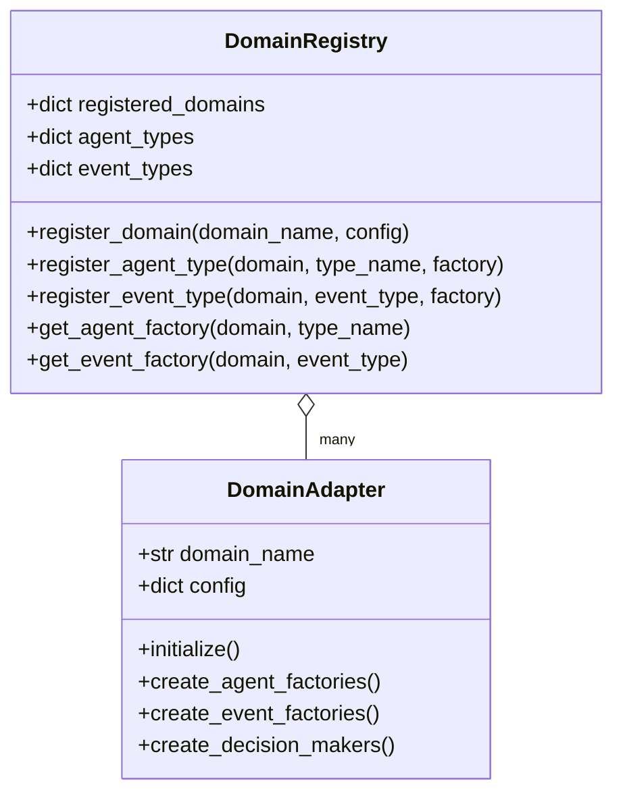

#### Key Features

1. **Domain Registration**: Register new domains with configuration
   ```python
   # Create the domain registry
   registry = DomainRegistry()
   
   # Register domains
   registry.register_domain("senate", {
       "max_agents": 500,
       "event_types": ["speech", "vote", "debate"],
       "agent_types": ["senator", "consul", "censor"]
   })
   
   registry.register_domain("market", {
       "max_agents": 1000,
       "event_types": ["transaction", "price_change", "shortage"],
       "agent_types": ["merchant", "customer", "supplier"]
   })
   ```

2. **Component Registration**: Register domain-specific components
   ```python
   # Register agent types for a domain
   registry.register_agent_type("senate", "senator", SenatorAgentFactory)
   registry.register_agent_type("market", "merchant", MerchantAgentFactory)
   
   # Register event types for a domain
   registry.register_event_type("senate", "speech", SpeechEventFactory)
   registry.register_event_type("market", "transaction", TransactionEventFactory)
   ```

3. **Component Discovery**: Discover components for a domain
   ```python
   # Get agent factory for a domain
   senator_factory = registry.get_agent_factory("senate", "senator")
   
   # Get event factory for a domain
   speech_factory = registry.get_event_factory("senate", "speech")
   ```

### 4.2 Extension Points

Extension Points provide hooks for domain-specific behavior while maintaining a consistent interface.

#### Components

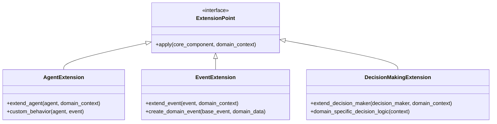

#### Key Features

1. **Agent Extensions**: Extend agent behavior for specific domains
   ```python
   class SenateAgentExtension(AgentExtension):
       def extend_agent(self, agent, domain_context):
           agent.faction = domain_context.get("faction")
           agent.rank = domain_context.get("rank")
           return agent
           
       def custom_behavior(self, agent, event):
           if event.event_type == "speech":
               # Senate-specific speech handling
               return agent.handle_speech_event(event)
           return None
   ```

2. **Event Extensions**: Extend events for specific domains
   ```python
   class SenateEventExtension(EventExtension):
       def extend_event(self, event, domain_context):
           if event.event_type == "speech":
               event.metadata["latin_content"] = domain_context.get("latin_content")
               event.metadata["stance"] = domain_context.get("stance")
           return event
           
       def create_domain_event(self, base_event, domain_data):
           if base_event.event_type == "communication":
               return SpeechEvent.from_base_event(base_event, domain_data)
           return base_event
   ```

3. **Decision Making Extensions**: Extend decision making for specific domains
   ```python
   class SenateBehaviorExtension(DecisionMakingExtension):
       def extend_decision_maker(self, decision_maker, domain_context):
           if isinstance(decision_maker, BehaviorTree):
               # Add senate-specific nodes to the behavior tree
               senate_nodes = self._create_senate_behavior_nodes()
               decision_maker.root_node.add_child(senate_nodes)
           return decision_maker
           
       def domain_specific_decision_logic(self, context):
           # Senate-specific decision logic
           if context.get("in_debate"):
               return self._debate_decision_logic(context)
           return None
   ```

### 4.3 Event Converters

Event Converters transform generic events to domain-specific events and vice versa, enabling cross-domain communication.

#### Components

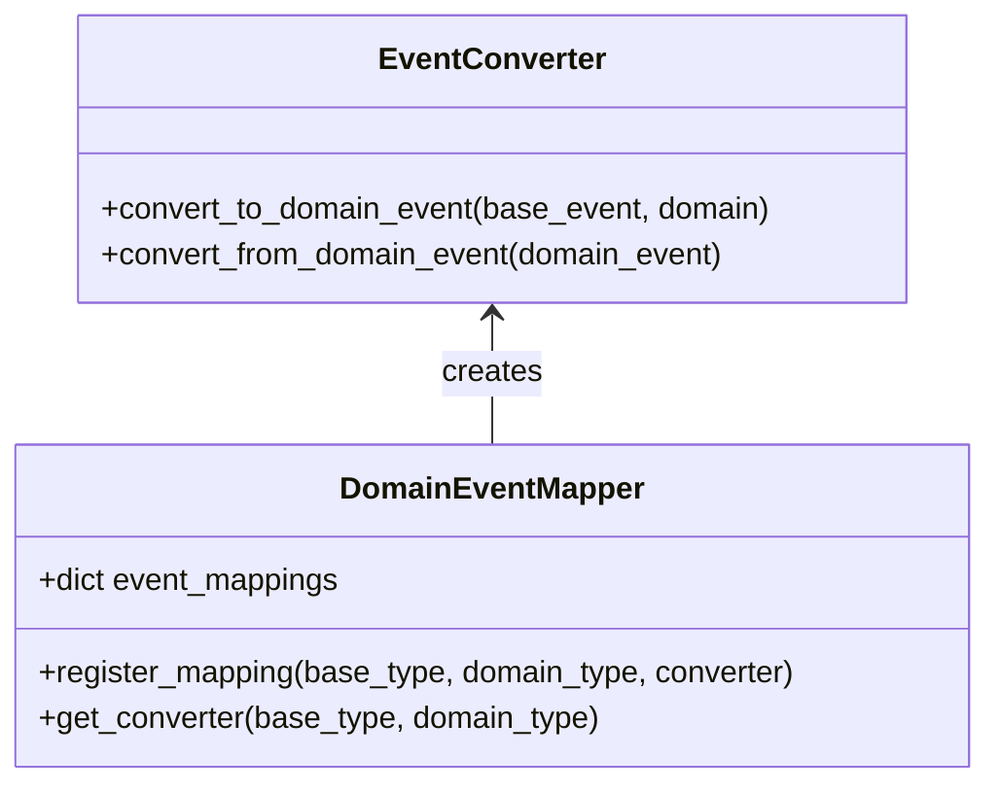

#### Key Features

1. **Event Type Mapping**: Map between generic and domain-specific event types
   ```python
   # Create an event mapper
   mapper = DomainEventMapper()
   
   # Register mappings
   mapper.register_mapping("communication", "speech", SpeechEventConverter)
   mapper.register_mapping("exchange", "transaction", TransactionEventConverter)
   
   # Get a converter
   converter = mapper.get_converter("communication", "speech")
   ```

2. **Bidirectional Conversion**: Convert events in both directions
   ```python
   # Convert a generic event to a domain-specific event
   base_event = BaseEvent(event_type="communication", 
                          metadata={"source": "agent_1", "target": "all", 
                                   "content": "Important message"})
   
   domain_event = converter.convert_to_domain_event(base_event, "senate")
   # Result: SpeechEvent with senate-specific attributes
   
   # Convert back to a generic event
   generic_event = converter.convert_from_domain_event(domain_event)
   # Result: BaseEvent with essential information preserved
   ```

3. **Metadata Preservation**: Preserve important metadata during conversion
   ```python
   # Event conversion preserving metadata
   def convert_to_domain_event(self, base_event, domain):
       domain_event = SpeechEvent(
           speaker=base_event.metadata.get("source"),
           content=base_event.metadata.get("content"),
           stance="neutral"  # Default for generic events
       )
       
       # Copy all metadata that doesn't conflict
       for key, value in base_event.metadata.items():
           if key not in ["source", "content"]:
               domain_event.metadata[key] = value
               
       return domain_event
   ```

## 5. Domain Implementations

### 5.1 Senate Domain Implementation

The Senate Domain implements the Roman Senate simulation using the abstracted architecture.

#### Components

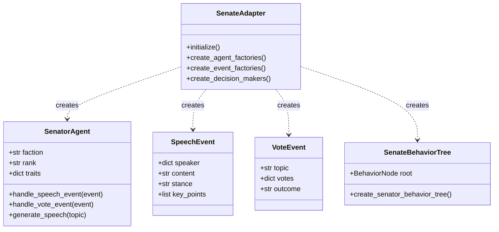

#### Implementation Approach

1. **Domain Adapter**: Create a Senate domain adapter
   ```python
   class SenateAdapter(DomainAdapter):
       def initialize(self):
           self.domain_name = "senate"
           self.config = {
               "max_agents": 500,
               "factions": ["optimates", "populares", "neutrals"],
               "ranks": ["consul", "praetor", "censor", "senator"],
               "default_event_bus": EventBus(domain="senate")
           }
           
       def create_agent_factories(self):
           # Create and register senator agent factory
           return {
               "senator": SenatorAgentFactory(),
               "consul": ConsulAgentFactory()
           }
           
       def create_event_factories(self):
           # Create and register senate event factories
           return {
               "speech": SpeechEventFactory(),
               "vote": VoteEventFactory(),
               "debate": DebateEventFactory()
           }
   ```

2. **Agent Types**: Implement senate-specific agent types
   ```python
   class SenatorAgent(AbstractAgent):
       def __init__(self, agent_id, faction, rank, traits=None):
           super().__init__(agent_id)
           self.faction = faction
           self.rank = rank
           self.traits = traits or {}
           
       def handle_event(self, event):
           if event.event_type == "speech":
               return self.handle_speech_event(event)
           elif event.event_type == "vote":
               return self.handle_vote_event(event)
           return super().handle_event(event)
           
       def make_decision(self, context):
           # Senate-specific decision making
           if context.get("decision_type") == "vote":
               return self.decide_vote(context.get("topic"))
           return super().make_decision(context)
   ```

3. **Event Types**: Implement senate-specific event types
   ```python
   class SpeechEvent(BaseEvent):
       def __init__(self, speaker, content, stance=None, key_points=None):
           super().__init__(event_type="speech", source=speaker)
           self.speaker = speaker
           self.content = content
           self.stance = stance
           self.key_points = key_points or []
           
       def to_dict(self):
           data = super().to_dict()
           data.update({
               "speaker": self.speaker,
               "content": self.content,
               "stance": self.stance,
               "key_points": self.key_points
           })
           return data
   ```

### 5.2 Generic Strategy Game Domain

The Strategy Game Domain shows how the architecture can be applied to a different game genre.

#### Components

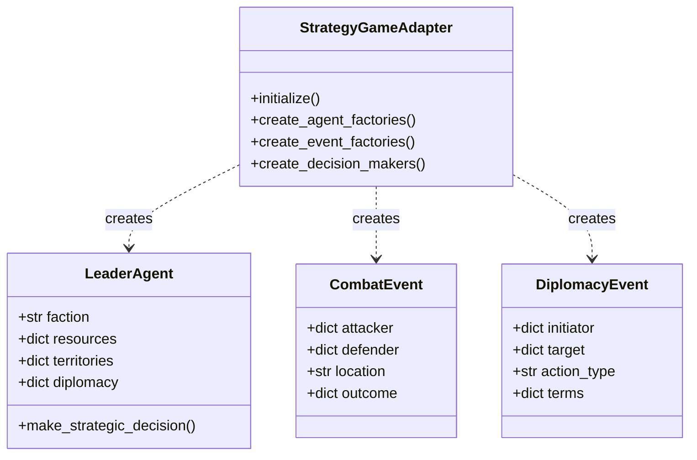

#### Implementation Approach

1. **Domain Adapter**: Create a Strategy Game domain adapter
   ```python
   class StrategyGameAdapter(DomainAdapter):
       def initialize(self):
           self.domain_name = "strategy"
           self.config = {
               "max_agents": 100,
               "factions": ["red", "blue", "green", "yellow"],
               "resources": ["gold", "wood", "stone", "food"],
               "default_event_bus": EventBus(domain="strategy")
           }
           
       def create_agent_factories(self):
           # Create and register strategy game agent factories
           return {
               "leader": LeaderAgentFactory(),
               "unit": UnitAgentFactory(),
               "city": CityAgentFactory()
           }
           
       def create_event_factories(self):
           # Create and register strategy event factories
           return {
               "combat": CombatEventFactory(),
               "diplomacy": DiplomacyEventFactory(),
               "resource": ResourceEventFactory()
           }
   ```

2. **Agent Types**: Implement strategy game-specific agent types
   ```python
   class LeaderAgent(AbstractAgent):
       def __init__(self, agent_id, faction, resources=None, territories=None):
           super().__init__(agent_id)
           self.faction = faction
           self.resources = resources or {}
           self.territories = territories or []
           self.diplomacy = {}
           
       def handle_event(self, event):
           if event.event_type == "combat":
               return self.handle_combat_event(event)
           elif event.event_type == "diplomacy":
               return self.handle_diplomacy_event(event)
           return super().handle_event(event)
           
       def make_decision(self, context):
           # Strategy game decision making
           if context.get("decision_type") == "diplomacy":
               return self.decide_diplomacy(context.get("target"))
           return super().make_decision(context)
   ```

3. **Event Types**: Implement strategy game-specific event types
   ```python
   class CombatEvent(BaseEvent):
       def __init__(self, attacker, defender, location, outcome=None):
           super().__init__(event_type="combat", source=attacker)
           self.attacker = attacker
           self.defender = defender
           self.location = location
           self.outcome = outcome or {}
           
       def to_dict(self):
           data = super().to_dict()
           data.update({
               "attacker": self.attacker,
               "defender": self.defender,
               "location": self.location,
               "outcome": self.outcome
           })
           return data
   ```

## 6. Cross-Domain Integration

Cross-domain integration allows agents from different domains to interact, creating a more complex and realistic simulation.

#### Integration Approach

1. **Cross-Domain Event Bus**: Central event bus for cross-domain events
   ```python
   # Create domain-specific event buses
   senate_bus = EventBus(domain="senate")
   market_bus = EventBus(domain="market")
   
   # Create global event bus for cross-domain events
   global_bus = EventBus(domain="global")
   
   # Connect domain buses to global bus
   senate_bus.set_parent(global_bus)
   market_bus.set_parent(global_bus)
   ```

2. **Event Translation**: Convert events between domains
   ```python
   # Create event converters
   senate_converter = SenateEventConverter()
   market_converter = MarketEventConverter()
   
   # Register with domain registry
   registry.register_event_converter("senate", senate_converter)
   registry.register_event_converter("market", market_converter)
   
   # Use in cross-domain event handling
   def handle_cross_domain_event(event, target_domain):
       # Get the appropriate converter
       converter = registry.get_event_converter(target_domain)
       
       # Convert the event to the target domain format
       domain_event = converter.convert_to_domain_event(event, target_domain)
       
       # Publish to the target domain
       domain_bus = registry.get_domain_event_bus(target_domain)
       domain_bus.publish(domain_event)
   ```

3. **Shared Agent Identity**: Maintain consistent identity across domains
   ```python
   # Agent with cross-domain identity
   class CrossDomainAgent(AbstractAgent):
       def __init__(self, agent_id):
           super().__init__(agent_id)
           self.domain_roles = {}
           
       def add_domain_role(self, domain, role_data):
           self.domain_roles[domain] = role_data
           
       def get_domain_role(self, domain):
           return self.domain_roles.get(domain)
           
       def handle_event(self, event):
           # Route event to domain-specific handling
           domain = event.metadata.get("domain")
           if domain and domain in self.domain_roles:
               return self.handle_domain_event(event, domain)
           return super().handle_event(event)
   ```

4. **Domain Connector**: Component for intentional cross-domain interactions
   ```python
   class DomainConnector:
       def __init__(self, registry):
           self.registry = registry
           self.domain_buses = {}
           
       def connect_domains(self, domains):
           for domain in domains:
               self.domain_buses[domain] = self.registry.get_domain_event_bus(domain)
               
       def publish_cross_domain(self, event, source_domain, target_domains):
           # Get source converter
           source_converter = self.registry.get_event_converter(source_domain)
           
           # Convert to base event
           base_event = source_converter.convert_from_domain_event(event)
           
           # Publish to each target domain
           for target_domain in target_domains:
               if target_domain == source_domain:
                   continue
                   
               target_converter = self.registry.get_event_converter(target_domain)
               target_event = target_converter.convert_to_domain_event(base_event, target_domain)
               
               target_bus = self.domain_buses.get(target_domain)
               if target_bus:
                   target_bus.publish(target_event)
   ```

## 7. Migration Path

This section outlines the recommended migration path from the current Roman Senate implementation to the abstracted architecture.

### Phase 1: Core Systems Extraction

1. **Event System**:
   - Refactor `EventBus` to support filtering and batching
   - Extract `BaseEvent` class with standardized interface
   - Add priority-based event handling

2. **Agent System**:
   - Create `AbstractAgent` interface
   - Extract common agent functionality from `SenatorAgent`
   - Implement `AgentPool` and `AgentFactory`

3. **Memory System**:
   - Extract `MemoryItem` and related classes
   - Implement memory tiering
   - Add consolidation and pruning capabilities

4. **Relationship System**:
   - Extract `RelationshipManager` as a domain-agnostic component
   - Implement sparse relationship storage
   - Add group relationship capabilities

### Phase 2: Domain Adaptation Layer

1. **Domain Registry**:
   - Create `DomainRegistry` for managing domains
   - Implement registration mechanisms for agent types, event types, etc.

2. **Extension Points**:
   - Identify extension points in core systems
   - Create interfaces for agent, event, and decision making extensions

3. **Event Converters**:
   - Implement event conversion system for cross-domain communication
   - Create default converters for common event types

### Phase 3: Senate Domain Implementation

1. **Senate Adapter**:
   - Create `SenateAdapter` implementing `DomainAdapter`
   - Register senate-specific components with domain registry

2. **Domain-Specific Types**:
   - Refactor `SenatorAgent` to extend `AbstractAgent`
   - Update event types to extend `BaseEvent`
   - Implement senate-specific decision making

3. **Integration**:
   - Integrate with existing code using adapter pattern
   - Create compatibility layer for legacy code

### Phase 4: Testing and Validation

1. **Unit Tests**:
   - Create tests for core systems
   - Test domain-specific implementations

2. **Integration Tests**:
   - Test cross-domain functionality
   - Validate end-to-end scenarios

3. **Performance Testing**:
   - Benchmark with 1000-2000 agents
   - Identify and address bottlenecks

### Compatibility Considerations

1. **API Compatibility**:
   - Create wrapper classes for existing API usage
   - Document migration path for client code

2. **Data Compatibility**:
   - Implement data migration for persistent storage
   - Create converters for existing data formats

3. **Runtime Compatibility**:
   - Support running both old and new components simultaneously
   - Implement feature flags for gradual migration

## 8. Performance and Scalability Considerations

The architecture is designed to support 1000-2000 agents with efficient resource usage and processing.

### Event Processing Optimizations

1. **Event Filtering**: Only process relevant events to reduce unnecessary computation
2. **Event Batching**: Process events in batches for better throughput
3. **Event Prioritization**: Handle critical events first
4. **Domain Partitioning**: Partition events by domain to reduce cross-domain traffic

### Agent Management Optimizations

1. **Agent Pooling**: Only keep active agents in memory
2. **Lazy Activation**: Activate agents only when needed
3. **Batch Processing**: Process multiple agents in batches
4. **State Minimization**: Keep agent state minimal and relevant

### Memory Optimizations

1. **Memory Tiering**: Use different storage strategies for different types of memory
2. **Importance-based Retrieval**: Focus on important memories
3. **Memory Consolidation**: Consolidate related memories to save space
4. **Pruning**: Remove low-importance memories

### Relationship Optimizations

1. **Sparse Matrix Storage**: Only store non-zero relationships
2. **Group Relationships**: Use group relationships to reduce individual relationships
3. **Contextual Activation**: Only consider relevant relationships in a context
4. **Relationship Decay**: Let unused relationships decay to zero

## 9. Extension Points and Customization

The architecture is designed to be extended and customized for different game domains and requirements.

### Adding New Domains

1. **Create Domain Adapter**:
   ```python
   class MyNewDomainAdapter(DomainAdapter):
       def initialize(self):
           self.domain_name = "my_new_domain"
           self.config = {
               # Domain-specific configuration
           }
           
       def create_agent_factories(self):
           # Create domain-specific agent factories
           
       def create_event_factories(self):
           # Create domain-specific event factories
   ```

2. **Register Domain**:
   ```python
   registry = DomainRegistry()
   registry.register_domain("my_new_domain", MyNewDomainAdapter())
   ```

3. **Implement Domain-Specific Components**:
   ```python
   class MyDomainAgent(AbstractAgent):
       # Domain-specific agent implementation
       
   class MyDomainEvent(BaseEvent):
       # Domain-specific event implementation
   ```

### Customizing Core Systems

1. **Event System**:
   ```python
   class CustomEventBus(EventBus):
       def __init__(self):
           super().__init__()
           # Custom initialization
           
       def publish(self, event):
           # Custom publication logic
           super().publish(event)
   ```

2. **Memory System**:
   ```python
   class CustomMemoryManager(MemoryManager):
       def consolidate_memories(self, memories):
           # Custom consolidation logic
           
       def apply_decay(self, elapsed_time):
           # Custom decay logic
   ```

3. **Relationship System**:
   ```python
   class CustomRelationshipManager(RelationshipManager):
       def update_relationship(self, target_id, rel_type, delta, reason):
           # Custom relationship update logic
           
       def get_relationships_in_context(self, context_name, relevant_types):
           # Custom context filtering
   ```

## 10. References

1. Roman Senate Architecture Analysis Plan
2. Game AI and Agent Best Practices
3. Event-Driven Architecture Documentation
4. Relationship System Documentation