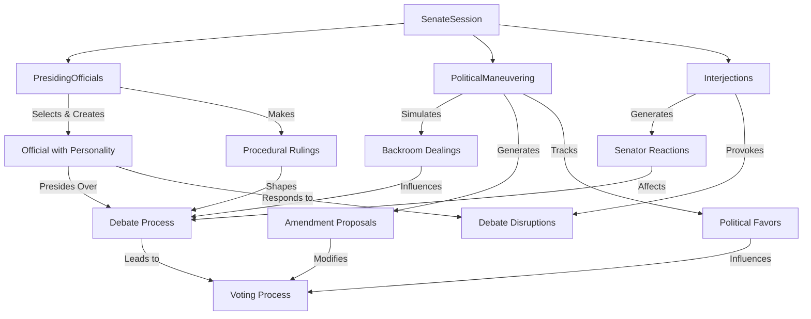
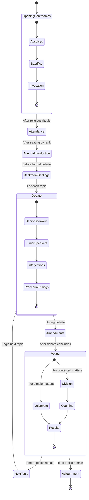
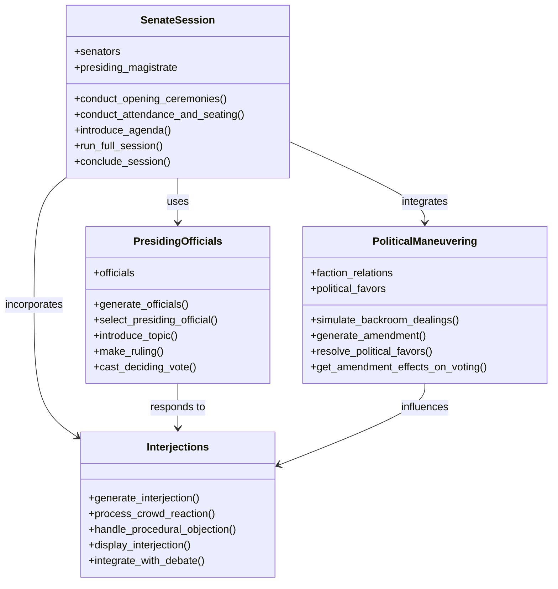

# Roman Senate Game Documentation

**Author:** Documentation Team  
**Date:** April 13, 2025  
**Version:** 1.0.0  

## Table of Contents

1. [Introduction](#introduction)
2. [Roman Senate Historical Overview](#roman-senate-historical-overview)
3. [Senate Session Flow](#senate-session-flow)
    - [Opening Ceremonies](#opening-ceremonies)
    - [Attendance and Seating](#attendance-and-seating)
    - [Introduction of Agenda (Relatio)](#introduction-of-agenda-relatio)
    - [Political Maneuvering](#political-maneuvering)
    - [Debate](#debate)
    - [Voting](#voting)
    - [Session Adjournment](#session-adjournment)
4. [Key Components](#key-components)
    - [SenateSession](#senatesession)
    - [PresidingOfficials](#presidingofficials)
    - [Interjections](#interjections)
    - [PoliticalManeuvering](#politicalmaneuvering)
5. [Component Interactions](#component-interactions)
6. [Historical Accuracy](#historical-accuracy)
    - [Senate Procedures circa 100 BCE](#senate-procedures-circa-100-bce)
    - [Latin Terms and Procedures](#latin-terms-and-procedures)
7. [Diagrams](#diagrams)
    - [Senate Session Flow](#senate-session-flow-diagram)
    - [Component Interaction Diagram](#component-interaction-diagram)
    - [Roman Senate Hierarchy](#roman-senate-hierarchy)

## Introduction

The Roman Senate Game is an immersive simulation of the political proceedings of the Roman Republic's Senate. This enhanced version introduces a historically accurate Senate session flow, complete with authentic procedures, political maneuvering, and interpersonal dynamics that characterized the actual Roman Senate circa 100 BCE.

The simulation recreates the formal and informal aspects of Roman politics, from religious ceremonies and procedural rules to backroom dealings and faction-based intrigue. Players can experience the complex political landscape of ancient Rome through realistic debates, voting procedures, and political strategies employed by actual Roman senators.

## Roman Senate Historical Overview

The Roman Senate was one of the most enduring institutions of the Roman Republic, serving as the advisory council to Rome's magistrates. Though technically only advisory, the Senate's *auctoritas* (authority) made its decisions nearly binding in practice. Composed primarily of patricians and wealthy plebeians who had served as magistrates, the Senate controlled public finances, directed foreign policy, and administered state religion.

During the period around 100 BCE, the Senate was at the height of its power but also experiencing growing tensions between the conservative *Optimates* (favoring aristocratic privilege) and the reform-minded *Populares* (advocating for popular interests), foreshadowing the Republic's eventual collapse.

## Senate Session Flow

The simulation implements the complete flow of a Roman Senate session with historical accuracy, following the established customs and procedures of the late Roman Republic.

```
┌────────────────────┐
│ Opening Ceremonies │
│  and Religious     │
│    Observances     │
└─────────┬──────────┘
          ↓
┌────────────────────┐
│  Attendance and    │
│ Seating by Rank    │
└─────────┬──────────┘
          ↓
┌────────────────────┐
│  Introduction of   │
│   Agenda (Relatio) │
└─────────┬──────────┘
          ↓
┌────────────────────┐
│     Political      │
│    Maneuvering     │
└─────────┬──────────┘
          ↓
┌────────────────────┐
│      Debate        │
│   with Interjections│
└─────────┬──────────┘
          ↓
┌────────────────────┐
│      Voting        │
└─────────┬──────────┘
          ↓
┌────────────────────┐
│      Session       │
│     Adjournment    │
└────────────────────┘
```

### Opening Ceremonies

The Senate session begins with essential religious observances, reflecting the Romans' deep connection between politics and religion:

- **Taking the Auspices**: The presiding magistrate consults with augurs to determine if the gods favor the meeting. Unfavorable omens could postpone proceedings.
- **Sacrificial Rituals**: A white animal (typically a bull for important matters) is sacrificed to seek divine approval.
- **Opening Invocation**: A formal Latin prayer (*invocatio*) is recited to request the gods' favor for the assembly.

These ceremonies weren't merely symbolic—Romans genuinely believed that conducting business without divine approval would lead to disaster for the Republic.

### Attendance and Seating

Seating in the Roman Senate reflected the strict hierarchical nature of Roman society:

- **Roll Call**: The presiding magistrate's scribes record attendance.
- **Seating by Rank**: Senators are seated according to their *dignitas* (rank and honor):
  - Consuls and ex-consuls (*consulares*) at the front
  - Praetors and ex-praetors (*praetorii*)
  - Aediles and ex-aediles (*aedilicii*)
  - Tribunes and ex-tribunes (*tribunicii*)
  - Quaestors and ex-quaestors (*quaestorii*)
  - Regular senators without previous office (*pedarii*) at the back

Attendance typically ranged from 75-95% of the total Senate membership, which was around 300 senators during the late Republic.

### Introduction of Agenda (Relatio)

The presiding magistrate (typically a consul) presents the day's agenda through a formal process called *relatio*:

- **Topic Announcement**: Each topic is introduced with formal language establishing its importance to the Republic.
- **Order of Business**: Topics are presented in order of religious matters first, followed by foreign policy, and finally domestic issues.
- **Procedural Notes**: Any special procedural requirements are established.

Senators could raise objections at this point about procedural matters, though substantive debate was reserved for later.

### Political Maneuvering

One of the most historically authentic aspects of the enhanced simulation is the recreation of informal political negotiations that occurred alongside formal proceedings:

- **Backroom Dealings**: Influential senators engage in private negotiations before formal debate.
- **Faction Coordination**: Optimates, Populares, and other factions coordinate their speaking and voting strategies.
- **Political Favor Trading**: The complex system of patronage and political debts (*beneficia* and *officia*) is simulated.
- **Amendment Planning**: Senators prepare potential amendments to proposals.

These behind-the-scenes activities were crucial to Roman politics and often determined outcomes before formal votes were taken.

### Debate

The formal debate (*disceptatio*) follows specific protocols:

- **Speaking Order**: Senators are recognized in order of rank, beginning with the *princeps senatus* (most senior senator).
- **Speaking Time**: Early in the Republic there were no time limits, but by the late Republic, limits were sometimes imposed.
- **Interjections**: Other senators may interject with acclamations of support, objections, or procedural points.
- **Responses**: Senators may reference and respond to previous speakers.

The debate focuses on the merits of proposals, with speakers often appealing to *mos maiorum* (ancestral customs) and historical precedent rather than pure innovation.

### Voting

After debate concludes, voting (*suffragium*) takes place:

- **Voice Votes**: Simple matters might be decided by voice acclamation (*per discessionem*).
- **Division**: For contested matters, senators physically move to different sides of the chamber to indicate their position (*pedibus in sententiam*).
- **Tabulation**: Scribes count the votes and announce results.
- **Deciding Vote**: In case of ties (rare in the large Senate), the presiding magistrate may cast a deciding vote.

The vote results determine the Senate's official position, recorded as a *senatus consultum* (Senate decree).

### Session Adjournment

The session concludes with formal procedures:

- **Results Announcement**: The presiding magistrate summarizes decisions made.
- **Closing Formalities**: Religious observations mark the end of business.
- **Publication**: Scribes prepare the official record (*acta*) to be published in the *acta diurna* (daily public record).

The Senate could only meet from sunrise to sunset—any business incomplete by nightfall had to be continued another day.

## Key Components

The enhanced simulation is built around four key components that work together to create a comprehensive and historically accurate Senate experience.

### SenateSession

`SenateSession` (in `senate_session.py`) is the core orchestrator of the simulation, managing the complete flow of a Senate session from opening to adjournment.

**Key Features:**
- Orchestrates all phases of the Senate session in historical sequence
- Manages the meeting location based on historical period (Curia Hostilia or Curia Cornelia)
- Implements the Roman calendar system for authentic dating
- Handles divine omens and religious aspects
- Coordinates between different components during the session flow
- Maintains the session log for record-keeping

**Historical Elements:**
- Implements the Roman date format using Kalendae, Nonae, and Idus
- Recreates appropriate meeting locations based on the year
- Incorporates religious elements like auspices and omens

The SenateSession component ensures that all aspects of the simulation follow the correct order and historical protocols.

### PresidingOfficials

`PresidingOfficials` (in `officials.py`) manages the magistrates who presided over Senate sessions, including their selection, powers, personality traits, and rulings.

**Key Features:**
- Implements historically accurate official types based on the year (Consuls, Praetors, etc.)
- Creates officials with unique personality traits that affect how they run sessions
- Handles procedural rulings during debates
- Manages the proper hierarchy of presiding officials
- Provides realistic introductions of topics based on official's character

**Historical Elements:**
- Accurate magistrate types by year (e.g., Praetors only after 366 BCE)
- Correct number of Praetors for different historical periods
- Proper ranking and precedence among officials
- Faction-based biases that affected Roman politics

This component recreates the significant impact that individual presiding magistrates had on Senate proceedings, from their speaking style to their procedural decisions.

### Interjections

`Interjections` (in `interjections.py`) adds dynamic interactions during Senate debates through various types of interruptions by other senators.

**Key Features:**
- Five types of interjections: acclamations, objections, procedural points, emotional outbursts, and collective reactions
- Interjections affected by senator relationships, faction alignment, and personality traits
- Procedural objections require rulings from presiding officials
- Includes authentic Latin expressions for historical immersion
- Impacts relationships between senators and debate outcomes

**Historical Elements:**
- Represents the often lively and contentious nature of Roman debate
- Incorporates the Roman practice of verbal acclamation and disapproval
- Implements procedural customs like points of order
- Includes authentic Latin phrases that would have been used

This component transforms what could be a static debate into a dynamic interaction among senators with competing interests and personalities.

### PoliticalManeuvering

`PoliticalManeuvering` (in `political_maneuvering.py`) simulates the crucial behind-the-scenes negotiations and faction politics that were central to Roman political life.

**Key Features:**
- Simulates backroom dealings before formal debates
- Manages political favors and debts between senators
- Handles faction relationships and alliances
- Implements amendment proposals as political tactics
- Models corruption and bribery mechanics 
- Affects voting outcomes through political pressure

**Historical Elements:**
- Recreates the patron-client relationships crucial to Roman politics
- Implements faction dynamics between Optimates, Populares, and other groups
- Models the amendment process used to alter legislation
- Represents the role of political favors (*beneficia*) in Roman decision-making

This component acknowledges that formal Senate procedures were only part of Roman politics—much of the real work happened through relationships, favors, and private negotiations.

## Component Interactions

The four key components interact in a sophisticated way to create a coherent simulation of the Roman Senate:



**Key Interaction Points:**

1. **SenateSession and PresidingOfficials**:
   - SenateSession selects a presiding magistrate through PresidingOfficials
   - The presiding official introduces topics and makes rulings during the session
   - Official personality traits influence debate management and rulings

2. **SenateSession and PoliticalManeuvering**:
   - Backroom dealings happen before formal debate begins
   - Amendment proposals emerge during the session
   - Political favor exchanges affect voting patterns

3. **SenateSession and Interjections**:
   - Senators interject during speeches with various reactions
   - Procedural objections require rulings from officials
   - Interjections can cause disruptions that affect the debate flow

4. **PoliticalManeuvering and Interjections**:
   - Political relationships affect likelihood and type of interjections
   - Interjections can strain or strengthen political relationships

5. **PresidingOfficials and Interjections**:
   - Officials rule on procedural objections raised during debate
   - Official personality affects how strictly they maintain order

6. **All Components and Voting**:
   - Debate content shapes senator opinions
   - Political favors influence voting decisions
   - Amendments modify the proposal being voted on
   - Interjections reveal faction positions

Together, these interactions create a complex, dynamic simulation that represents both the formal procedures and informal realities of the Roman Senate.

## Historical Accuracy

### Senate Procedures circa 100 BCE

The simulation focuses on the Roman Senate around 100 BCE, a crucial period in the Republic's history:

- **Late Republic Context**: This period saw increasing tension between the Optimates (conservative aristocrats) and Populares (populist reformers)
- **Gracchi Reforms**: The aftermath of the Gracchi brothers' reforms shapes political discussions
- **Marian Reforms**: Military reforms by Gaius Marius (107 BCE) influenced faction dynamics
- **Social War Prelude**: Growing Italian concerns about citizenship rights

The simulation incorporates historical developments that would have affected Senate proceedings during this period:

- Changes in Senate membership and faction strength
- Evolving procedures and precedents
- Introduction of new political tactics
- Rising importance of military leaders

### Latin Terms and Procedures

The simulation incorporates authentic Latin terminology and procedures to enhance historical accuracy:

| Latin Term | English Translation | Usage in Simulation |
|------------|---------------------|---------------------|
| *Senatus Populusque Romanus* | The Senate and People of Rome | Formal introduction of Senate business |
| *Patres conscripti* | Conscript fathers | Formal address to the senators |
| *Auspicia* | Bird signs | Religious observations before the session |
| *Relatio* | Referral | The formal introduction of topics |
| *Mos maiorum* | Ways of the ancestors | Appeals to tradition in debates |
| *Senatus consultum* | Senate decree | Formal decisions of the Senate |
| *Intercessio* | Veto | Right of certain magistrates to block proceedings |
| *Pedibus in sententiam ire* | To go with feet to a position | Physical movement during voting |
| *Acta diurna* | Daily acts | Official record of Senate business |
| *Beneficia* | Benefits/favors | System of political favors and debts |

These terms are incorporated throughout the simulation to provide an authentic experience of Roman political language and concepts.

## Diagrams

### Senate Session Flow Diagram



### Component Interaction Diagram



### Roman Senate Hierarchy

```mermaid
graph TB
    Senate[Roman Senate]
    Senate --> Magistrates[Presiding Magistrates]
    Senate --> Factions[Senate Factions]
    Senate --> Ranks[Senator Ranks]
    
    Magistrates --> Consuls[Consuls]
    Magistrates --> Praetors[Praetors]
    Magistrates --> Tribunes[Tribunes of the Plebs]
    Magistrates --> Interrex[Interrex]
    Magistrates --> Dictator[Dictator - Emergency]
    
    Factions --> Optimates[Optimates - Conservative]
    Factions --> Populares[Populares - Reformist]
    Factions --> Military[Military Faction]
    Factions --> Religious[Religious Faction]
    Factions --> Merchant[Merchant Interests]
    
    Ranks --> Consulares[Ex-Consuls]
    Ranks --> Praetorii[Ex-Praetors]
    Ranks --> Aedilicii[Ex-Aediles]
    Ranks --> Tribunicii[Ex-Tribunes]
    Ranks --> Quaestorii[Ex-Quaestors]
    Ranks --> Pedarii[Regular Senators]
    
    classDef senior fill:#f96,stroke:#333,stroke-width:2px;
    classDef optimates fill:#b6d7a8,stroke:#333,stroke-width:1px;
    classDef populares fill:#a4c2f4,stroke:#333,stroke-width:1px;
    classDef other fill:#d5a6bd,stroke:#333,stroke-width:1px;
    
    class Consuls,Consulares senior;
    class Optimates optimates;
    class Populares populares;
    class Military,Religious,Merchant other;
```



---

This documentation provides a comprehensive overview of the enhanced Roman Senate Game, highlighting its historical accuracy and the sophisticated interactions between components that create an immersive experience of Roman Republican politics.