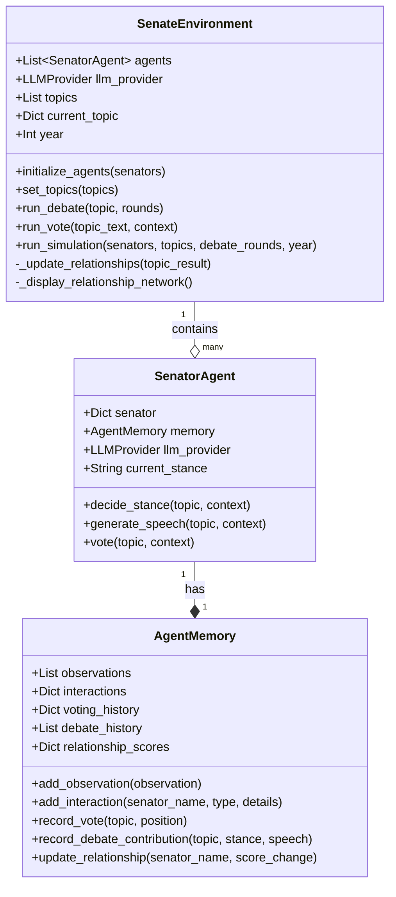
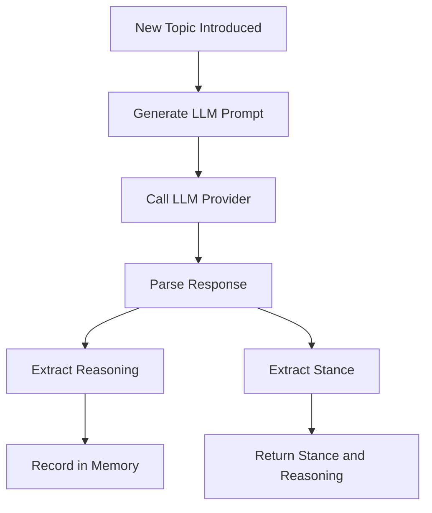
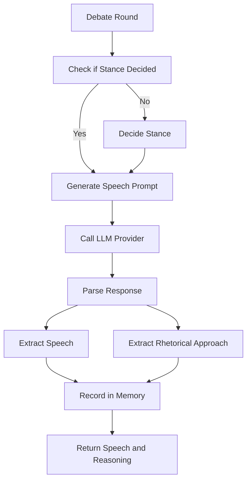
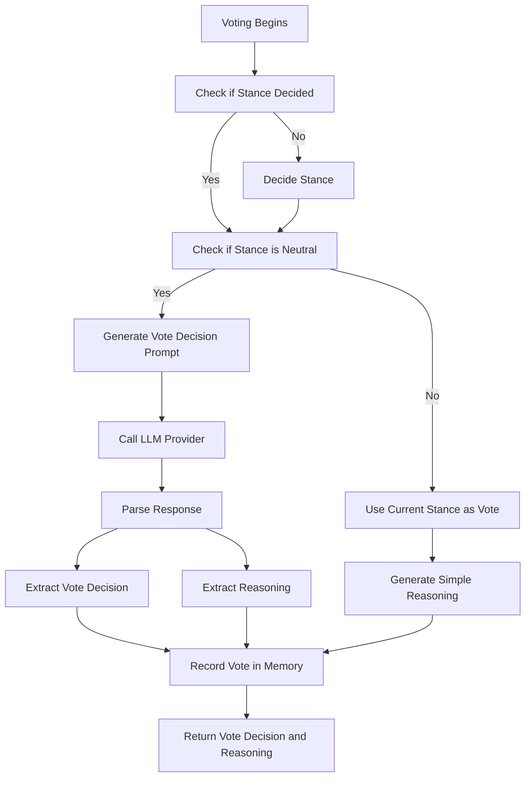
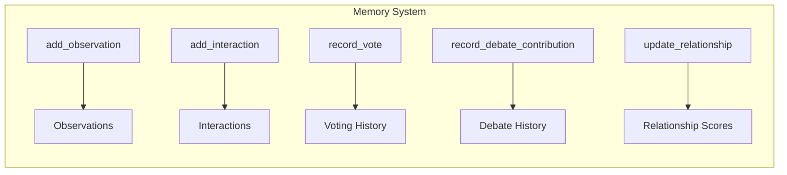
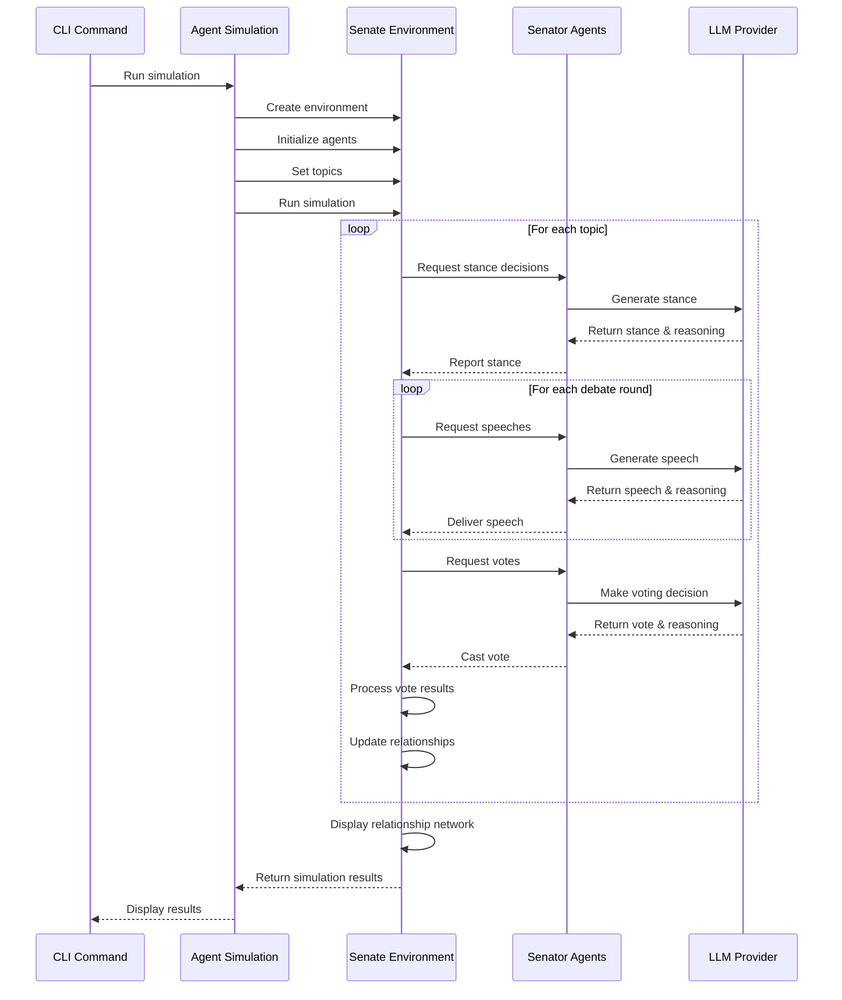
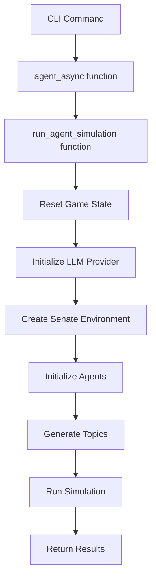

# Agent Architecture Technical Documentation

## Table of Contents

- [Overview](#overview)
- [Component Architecture](#component-architecture)
- [SenatorAgent](#senatoragent)
- [AgentMemory](#agentmemory)
- [SenateEnvironment](#senateenvironment)
- [Memory System](#memory-system)
- [Decision-Making System](#decision-making-system)
- [Relationship Dynamics](#relationship-dynamics)
- [Integration with Existing Systems](#integration-with-existing-systems)
- [Extending the Agent System](#extending-the-agent-system)
- [Implementation Examples](#implementation-examples)

## Overview

The agent-driven architecture transforms the Roman Senate simulation from a static, rule-based system into a dynamic, agent-based system where each senator functions as an autonomous agent with memory, goals, and decision-making capabilities. This creates a more realistic simulation where senators' behaviors evolve over time based on their experiences and relationships.

Key features of the agent architecture include:

- **Autonomous Decision-Making**: Senators independently form opinions, make decisions, and vote based on multiple factors.
- **Persistent Memory**: Senators remember past debates, votes, and interactions.
- **Relationship Dynamics**: Senators form dynamic relationships that change based on voting alignment.
- **Reasoning Capability**: Agents can explain the reasoning behind their decisions.
- **Emergent Behavior**: Complex group dynamics emerge from simple individual rules.

## Component Architecture

The agent system consists of three main components that work together:



## SenatorAgent

The `SenatorAgent` class is the core of the agent system. It wraps a senator dictionary with agent capabilities including memory, decision-making, and interaction with other senators.

### Key Properties

- `senator`: The senator dictionary with properties like name, faction, etc.
- `memory`: An instance of `AgentMemory` for storing observations and interactions
- `llm_provider`: The LLM provider to use for generating responses
- `current_stance`: The current stance on the active topic ("for", "against", or "neutral")

### Key Methods

#### `decide_stance(topic, context)`

This method determines the senator's position on a topic based on their characteristics:



#### `generate_speech(topic, context)`

Generates a speech for the current debate topic:



#### `vote(topic, context)`

Makes the final voting decision:



## AgentMemory

The `AgentMemory` class provides the memory system for agents, storing observations, interactions, and relationships.

### Memory Components

- `observations`: A list of general observations made by the agent
- `interactions`: A dictionary mapping senator names to lists of interaction records
- `voting_history`: A dictionary mapping topic texts to voting positions
- `debate_history`: A list of debate contributions with topic, stance, and speech
- `relationship_scores`: A dictionary mapping senator names to relationship scores

### Memory Operations



## SenateEnvironment

The `SenateEnvironment` class manages the simulation environment, facilitating interactions between agents and orchestrating debates and votes.

### Initialization

```python
# Initialize the environment
llm_provider = get_llm_provider(provider_type='openai')
environment = SenateEnvironment(llm_provider)

# Initialize agents from senators
environment.initialize_agents(senators_list)

# Set topics for debate
environment.set_topics(topics_list)
```

### Simulation Flow



## Memory System

The memory system allows senators to retain information about past events and interactions, influencing their future decisions.

### Memory Categories

1. **Observations**: General facts the senator has observed
   ```python
   # Example
   memory.add_observation("The Senate appears divided on military expansion.")
   ```

2. **Interactions**: Records of interactions with other senators
   ```python
   # Example
   memory.add_interaction("Marcus Tullius", "debate", "He strongly opposed my position on land reform.")
   ```

3. **Voting History**: Record of how the senator voted on each topic
   ```python
   # Example
   memory.record_vote("Should Rome expand its navy?", "for")
   ```

4. **Debate History**: Record of the senator's debate contributions
   ```python
   # Example
   memory.record_debate_contribution("Military funding", "for", "Rome must maintain its military strength...")
   ```

5. **Relationship Scores**: Numeric representation of relationships with other senators
   ```python
   # Example
   memory.update_relationship("Gaius Gracchus", -0.2)  # Relationship worsened
   ```

### Using Memory in Decision-Making

Memory influences decisions through the prompts sent to the LLM provider. For example, when deciding a stance:

```
You are Marcus Tullius, an Optimates senator in the Roman Senate.
Topic for debate: Should Rome increase grain imports from Egypt?

Based on your faction (Optimates) and your personality traits,
what stance would you take on this topic: for, against, or neutral?
Consider your past voting history and relationships with other senators.
```

## Decision-Making System

Senators make three main types of decisions during a simulation: stance, speech, and vote.

### Stance Decision

Determines the senator's initial position on a topic:

```python
async def decide_stance(self, topic: str, context: Dict) -> Tuple[str, str]:
    # Generate prompt including senator traits and context
    prompt = f"""
    You are {self.name}, a {self.faction} senator in the Roman Senate.
    Topic for debate: {topic}
    
    Based on your faction ({self.faction}) and your personality traits,
    what stance would you take on this topic: for, against, or neutral?
    Consider your past voting history and relationships with other senators.
    
    First provide your reasoning in 1-2 sentences, then on a new line
    return ONLY the word "for", "against", or "neutral".
    """
    
    response = await self.llm_provider.generate_text(prompt)
    
    # Parse the response to separate reasoning from stance
    # [parsing code]
    
    # Record the reasoning in memory
    self.memory.add_observation(f"Took {stance} position on '{topic}' because: {reasoning}")
    
    return stance, reasoning
```

### Speech Generation

Creates a speech based on the senator's stance and rhetorical style:

```python
async def generate_speech(self, topic: str, context: Dict) -> Tuple[str, str]:
    if not self.current_stance:
        await self.decide_stance(topic, context)
        
    prompt = f"""
    You are {self.name}, a {self.faction} senator in the Roman Senate.
    Topic for debate: {topic}
    Your stance: {self.current_stance}
    
    Generate a brief speech (3-4 sentences) expressing your views on this topic.
    Your speech should reflect your faction's values and your personal style.
    
    After the speech, on a new line, briefly explain your rhetorical approach
    and why you chose it (1-2 sentences).
    """
    
    # [implementation details]
    
    # Record the speech and reasoning in memory
    self.memory.record_debate_contribution(topic, self.current_stance, speech)
    self.memory.add_observation(f"On topic '{topic}', used rhetorical approach: {reasoning}")
    
    return speech, reasoning
```

### Voting Decision

Makes the final voting decision, which may differ from the initial stance if it was neutral:

```python
async def vote(self, topic: str, context: Dict) -> Tuple[str, str]:
    # If we haven't decided a stance yet, do so now
    if not self.current_stance:
        await self.decide_stance(topic, context)
        
    # For now, the vote aligns with the stance unless it was neutral
    if self.current_stance == "neutral":
        # Neutral senators need to make a final decision
        prompt = f"""
        You are {self.name}, a {self.faction} senator in the Roman Senate.
        Topic for vote: {topic}
        You were neutral during the debate, but now must vote either for or against.
        
        First explain your reasoning in 1-2 sentences considering faction interests,
        political allies, and personal ambitions.
        
        Then on a new line, return ONLY the word "for" or "against".
        """
        
        # [implementation details]
    else:
        vote_decision = self.current_stance
        reasoning = f"Consistent with my {self.current_stance} stance on this issue."
        
    # Record the vote in memory
    self.memory.record_vote(topic, vote_decision)
    self.memory.add_observation(f"Voted {vote_decision} on '{topic}' because: {reasoning}")
    
    return vote_decision, reasoning
```

## Relationship Dynamics

The simulation tracks relationships between senators based on voting patterns. These relationships influence future decisions.

### Relationship Updates

After each vote, relationships are updated based on voting alignment:

```python
def _update_relationships(self, topic_result: Dict):
    # Extract votes
    votes = topic_result['vote_result']['senators']
    
    # For each pair of senators
    for i, agent1 in enumerate(self.agents):
        for j, agent2 in enumerate(self.agents[i+1:], i+1):
            # Calculate relationship change based on voting alignment
            change = 0
            
            # Positive change if they voted the same way
            if votes[agent1.name] == votes[agent2.name]:
                change = 0.2
            else:
                change = -0.1
            
            # Update each agent's relationship with the other
            agent1.memory.update_relationship(agent2.name, change)
            agent2.memory.update_relationship(agent1.name, change)
```

### Relationship Visualization

At the end of the simulation, relationships are visualized:

```python
def _display_relationship_network(self):
    console.print("\n[bold cyan]===== SENATOR RELATIONSHIPS =====[/]")
    console.print("[dim]A simple visualization of senator relationships based on voting patterns:[/]")
    
    # For each senator, display their top allies and rivals
    for agent in self.agents:
        # Get all relationships for this senator
        relationships = agent.memory.relationship_scores
        
        if not relationships:
            continue
        
        # Sort relationships by score
        sorted_relationships = sorted(
            relationships.items(),
            key=lambda x: x[1],
            reverse=True
        )
        
        # Display the top allies (positive scores) and rivals (negative scores)
        allies = [f"{name} (+{score:.1f})" for name, score in sorted_relationships if score > 0]
        rivals = [f"{name} ({score:.1f})" for name, score in sorted_relationships if score < 0]
        
        console.print(f"\n[bold]{agent.name} ({agent.faction})[/]")
        
        if allies:
            console.print(f"  [green]Allies:[/] {', '.join(allies[:3])}")
        if rivals:
            console.print(f"  [red]Rivals:[/] {', '.join(rivals[:3])}")
```

## Integration with Existing Systems

The agent system integrates with the existing simulation through the `agent_simulation.py` module, which serves as the bridge between the CLI and the agent system.

### Integration Flow



### Key Integration Points

1. **CLI Integration**: The `agent` command in `cli.py` routes to the agent simulation
2. **Game State**: The agent simulation initializes and updates the shared game state
3. **LLM Providers**: The agent system uses the same LLM provider infrastructure
4. **Senator Data**: The agent system wraps the existing senator data structure
5. **Topic Generation**: The agent system uses the existing topic generation system

## Extending the Agent System

The agent system is designed to be extensible in several ways:

### Adding New Memory Types

To add a new type of memory, extend the `AgentMemory` class:

```python
class EnhancedAgentMemory(AgentMemory):
    def __init__(self):
        super().__init__()
        self.political_goals = []
        
    def add_political_goal(self, goal, priority):
        self.political_goals.append({
            "goal": goal,
            "priority": priority
        })
```

### Enhancing Decision-Making

To enhance decision-making, modify the prompt templates in the `SenatorAgent` methods:

```python
# Enhanced stance decision that considers political goals
async def decide_stance(self, topic: str, context: Dict) -> Tuple[str, str]:
    # Include political goals in the prompt
    political_goals = "\n".join([f"Goal: {g['goal']} (Priority: {g['priority']})" 
                                for g in self.memory.political_goals])
    
    prompt = f"""
    You are {self.name}, a {self.faction} senator in the Roman Senate.
    Topic for debate: {topic}
    
    Your political goals:
    {political_goals}
    
    Based on your faction ({self.faction}), your personality traits, and your political goals,
    what stance would you take on this topic: for, against, or neutral?
    Consider your past voting history and relationships with other senators.
    
    First provide your reasoning in 1-2 sentences, then on a new line
    return ONLY the word "for", "against", or "neutral".
    """
    
    # Rest of the implementation remains the same
```

### Adding New Agent Types

You can create new agent types by extending the `SenatorAgent` class:

```python
class ConsulAgent(SenatorAgent):
    """A special agent representing a Roman Consul with additional powers."""
    
    def __init__(self, senator: Dict[str, Any], llm_provider: LLMProvider):
        super().__init__(senator, llm_provider)
        self.veto_power = True
        
    async def consider_veto(self, topic: str, vote_result: Dict) -> Tuple[bool, str]:
        """Decide whether to veto a senate decision."""
        if not vote_result['passed']:
            return False, "No need to veto a failed vote."
            
        prompt = f"""
        You are {self.name}, a Consul of Rome.
        The Senate has voted to approve the following: {topic}
        
        As Consul, you have the power to veto this decision.
        Would you use your veto power? Consider your faction interests,
        personal goals, and the political ramifications.
        
        First provide your reasoning in 1-2 sentences, then on a new line
        return ONLY the word "veto" or "approve".
        """
        
        response = await self.llm_provider.generate_text(prompt)
        
        # Parse response to get decision and reasoning
        # [implementation details]
        
        return "veto" in decision.lower(), reasoning
```

## Implementation Examples

Here are some examples of how to use the agent system in different contexts:

### Basic Simulation

```python
async def run_basic_simulation():
    # Initialize LLM provider
    llm_provider = get_llm_provider()
    
    # Create environment
    environment = SenateEnvironment(llm_provider)
    
    # Generate senators
    senators = senators_module.initialize_senate(10)
    
    # Set up topics
    topics = [
        {"text": "Should Rome expand its navy?", "category": "Military"},
        {"text": "Should we increase grain subsidies?", "category": "Economy"},
        {"text": "Should we grant citizenship to Latins?", "category": "Politics"}
    ]
    
    # Run the simulation
    results = await environment.run_simulation(
        senators=senators,
        topics=topics,
        debate_rounds=3,
        year=-100
    )
    
    return results
```

### Accessing Agent Memory

```python
async def analyze_senator_memory(simulation_results, senator_name):
    # Find the senator in the environment
    senator_agent = next((agent for agent in environment.agents if agent.name == senator_name), None)
    
    if not senator_agent:
        return f"Senator {senator_name} not found."
        
    # Analyze voting patterns
    voting_history = senator_agent.memory.voting_history
    votes_for = sum(1 for v in voting_history.values() if v == "for")
    votes_against = sum(1 for v in voting_history.values() if v == "against")
    
    # Analyze relationships
    relationships = senator_agent.memory.relationship_scores
    strongest_ally = max(relationships.items(), key=lambda x: x[1]) if relationships else None
    strongest_rival = min(relationships.items(), key=lambda x: x[1]) if relationships else None
    
    # Return analysis
    analysis = f"Senator {senator_name} ({senator_agent.faction})\n"
    analysis += f"Voting record: {votes_for} for, {votes_against} against\n"
    
    if strongest_ally:
        analysis += f"Strongest alliance: {strongest_ally[0]} (score: +{strongest_ally[1]:.1f})\n"
    if strongest_rival:
        analysis += f"Strongest rivalry: {strongest_rival[0]} (score: {strongest_rival[1]:.1f})\n"
        
    return analysis
```

### Custom Decision Logic

```python
# Extended SenatorAgent with custom decision logic
class StrategicSenatorAgent(SenatorAgent):
    async def decide_stance(self, topic: str, context: Dict) -> Tuple[str, str]:
        # Check if any allies have already taken a stance
        ally_stances = {}
        for ally_name, score in self.memory.relationship_scores.items():
            if score > 0.5:  # Strong ally
                # Find the ally's stance in the environment
                for agent in context.get('environment').agents:
                    if agent.name == ally_name and agent.current_stance:
                        ally_stances[ally_name] = agent.current_stance
        
        # If strong allies have taken stances, consider them in the decision
        if ally_stances:
            ally_info = ", ".join([f"{name} ({stance})" for name, stance in ally_stances.items()])
            
            prompt = f"""
            You are {self.name}, a {self.faction} senator in the Roman Senate.
            Topic for debate: {topic}
            
            Your strong allies have taken the following positions:
            {ally_info}
            
            Based on your faction ({self.faction}), your personality traits, and your allies' positions,
            what stance would you take on this topic: for, against, or neutral?
            
            First provide your reasoning in 1-2 sentences, then on a new line
            return ONLY the word "for", "against", or "neutral".
            """
            
            # Rest of implementation follows the original
        else:
            # Use the original implementation if no ally information is available
            return await super().decide_stance(topic, context)