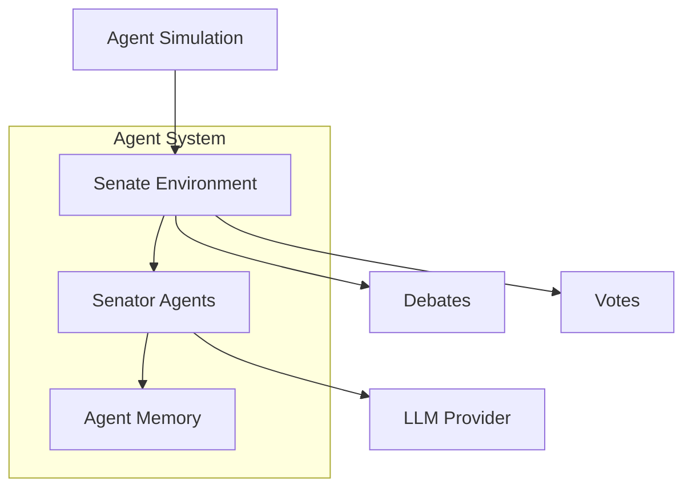

# Agent Architecture Assessment: Roman Senate Simulation

## Executive Summary

This document provides a comprehensive architectural assessment of the agent-driven architecture implemented in the Roman Senate simulation. The assessment covers the design, implementation, and effectiveness of the agent-based approach, focusing on how well it supports autonomous decision-making, realistic senate proceedings, and emergent behaviors.

The assessment finds that the current architecture establishes a solid foundation for agent-based simulation, with clear separation of concerns and a thoughtful memory system. However, there are opportunities to enhance agent autonomy, improve architectural patterns, and better prepare for future scaling needs.

## 1. Current Architecture Overview

The agent architecture consists of four main components:

### Key Components

1. **SenatorAgent Class (`senator_agent.py`)**
   - Encapsulates senator behavior and decision-making
   - Manages stance determination, speech generation, and voting
   - Integrates with LLM for generating responses
   - Maintains individual memory instance

2. **AgentMemory System (`agent_memory.py`)**
   - Stores observations, interactions, and voting history
   - Tracks relationships between senators
   - Records debate contributions
   - Simple data structures (lists and dictionaries)

3. **SenateEnvironment (`environment.py`)**
   - Coordinates interactions between senator agents
   - Orchestrates debate and voting procedures
   - Updates relationships based on voting patterns
   - Manages simulation flow

4. **AgentDrivenSenateSession (`agent_simulation.py`)**
   - High-level orchestration of the simulation
   - Initializes senators, topics, and environment
   - Manages simulation workflow
   - Handles LLM provider integration

## 2. Assessment by Dimension

### 2.1 Alignment with Goals

**Strengths:**
- The architecture successfully models senators as autonomous agents with individual decision-making
- The debate and voting process align well with historical senate procedures
- Agent memory enables senators to maintain consistent positions and relationships
- Environment orchestration supports realistic session flow

**Limitations:**
- Limited complexity in decision-making processes; relies heavily on LLM for reasoning
- Relationship modeling is relatively simplistic (numeric scores only)
- Little evidence of more advanced political dynamics (coalitions, strategic behavior)
- No explicit goal representation for senators beyond stance on current topics

**Assessment Score: 7/10** - Good foundation but lacks complexity in political dynamics

### 2.2 Agent Autonomy

**Strengths:**
- Agents independently form stances based on faction and personality
- Memory system records past observations and interactions
- Agents generate speeches and votes with reasoning
- Decision-making incorporates memory of past positions

**Limitations:**
- Goal-directed behavior is limited to topic response
- No evident planning capabilities (strategic voting, coalition building)
- Decision-making relies heavily on LLM rather than formal reasoning models
- Limited use of memory in decision processes; more reactive than proactive

**Assessment Score: 6/10** - Adequate autonomy but lacks proactive goal pursuit

### 2.3 Architectural Patterns

**Strengths:**
- Clean separation of concerns between agent, memory, and environment
- Good abstraction of LLM interaction through dependency injection
- Modular design that encapsulates related functionality
- Observable state patterns in environment orchestration

**Limitations:**
- No clear architectural patterns for agent decision-making (BDI, utility-based, etc.)
- Limited use of interfaces for component contracts
- Memory implements simple data storage rather than using more sophisticated patterns
- Environment acts as both coordinator and observer, potentially limiting scalability

**Assessment Score: 6/10** - Solid foundation but lacks sophisticated agent patterns

### 2.4 Complexity Balance

**Strengths:**
- Implementation complexity is manageable and approachable
- Clear responsibilities for different components
- Simple but effective memory model
- Good compromise between simulating politics and technical complexity

**Limitations:**
- May be too simplified for deeply realistic political simulations
- Memory system could benefit from more structure
- Relationship dynamics limited to voting alignment
- Limited emergent behavior due to simplicity

**Assessment Score: 8/10** - Good balance for current requirements

### 2.5 Technical Implementation

**Strengths:**
- Asynchronous design supports concurrent agent operations
- Effective LLM integration with provider abstraction
- Clean error handling and logging in simulation flow
- Modular design supports testing and component replacement

**Limitations:**
- No evident optimization for large numbers of agents
- Memory structures might not scale effectively for complex histories
- Potential bottlenecks with sequential debate turns
- Limited caching or performance optimizations for LLM operations

**Assessment Score: 7/10** - Solid implementation with room for optimization

## 3. Component-Specific Assessment

### 3.1 SenatorAgent Class

**Strengths:**
- Well-encapsulated senator behavior
- Clean integration with memory system
- Effective use of LLM for generating responses
- Good separation of stance, speech, and voting behaviors

**Limitations:**
- Limited internal reasoning model; relies heavily on LLM
- No explicit goal representation
- Limited use of memory in decision-making
- Reactive rather than proactive behavior

**Recommendations:**
1. Implement a more formal reasoning model (e.g., BDI pattern)
2. Add explicit senator goals and motivations
3. Enhance memory utilization in decision processes
4. Add strategic planning capabilities

### 3.2 AgentMemory System

**Strengths:**
- Simple and effective data structure
- Tracks essential information types
- Easy to use API for record keeping
- Support for relationship scoring

**Limitations:**
- Limited structure for efficient retrieval of relevant memories
- No forgetting or memory prioritization mechanisms
- Simple value-based relationship model
- No temporal organization or context segmentation

**Recommendations:**
1. Implement a more structured memory architecture (e.g., episodic/semantic)
2. Add memory salience and relevance scoring
3. Enhance relationship modeling with context and reason tracking
4. Implement memory decay and consolidation mechanisms

### 3.3 SenateEnvironment

**Strengths:**
- Effective orchestration of debate and voting
- Clean management of agent interactions
- Good visualization of relationships
- Logical simulation flow

**Limitations:**
- Acts as both coordinator and environment state
- Limited support for agent-to-agent direct interaction
- Simplistic relationship update mechanism
- Environment state not fully separated from process orchestration

**Recommendations:**
1. Separate environment state from process orchestration
2. Implement a formal event system for interactions
3. Support direct agent-to-agent communication
4. Add more nuanced relationship dynamics

### 3.4 AgentDrivenSenateSession

**Strengths:**
- Clean orchestration of the simulation process
- Good error handling
- Clean integration with topic generation
- Effective LLM provider management

**Limitations:**
- Limited flexibility in session flow
- No support for out-of-session activities
- Limited parallelism in agent operations
- No persistence for between-session state

**Recommendations:**
1. Implement a more flexible workflow engine
2. Support parallel agent operations where possible
3. Add session persistence capabilities
4. Support for out-of-session activities and preparation

## 4. Architectural Strengths to Maintain

1. **Clear Component Separation**
   - The separation between agent, memory, and environment provides clear responsibilities and supports maintainability.

2. **Memory System Foundation**
   - The memory system establishes a fundamental capability for agents to record and recall information, essential for consistent behavior.

3. **LLM Integration Pattern**
   - The clean abstraction of LLM interaction through dependency injection supports flexibility and testability.

4. **Simulation Orchestration**
   - The logical flow of the simulation process, including debate and voting phases, provides a solid foundation.

## 5. Architectural Weaknesses to Address

1. **Limited Reasoning Model**
   - The lack of a formal reasoning model for agents limits the complexity and realism of decision-making.

2. **Simplistic Memory Structure**
   - The basic memory structure may limit the ability to model complex political memories and relationships.

3. **Environment-Centric Interaction**
   - The reliance on the environment for all agent interactions limits direct agent-to-agent communication.

4. **Reactive Agent Behavior**
   - Agents primarily react to topics rather than pursuing their own goals and strategies proactively.

## 6. Scalability and Maintenance Concerns

1. **LLM Dependency**
   - Heavy reliance on LLM calls could become a bottleneck for larger simulations.

2. **Sequential Processing**
   - The sequential nature of debate turns may limit performance with large senator counts.

3. **Memory Growth**
   - Memory structures could grow unbounded over long simulations.

4. **Limited Event System**
   - The lack of a formal event system might complicate future extensions.

## 7. Missing Architectural Components

1. **Formal Agent Reasoning Model**
   - A structured approach to agent reasoning (e.g., BDI: Beliefs, Desires, Intentions)

2. **Structured Memory Architecture**
   - More sophisticated memory organization for efficiency and relevance

3. **Goal Representation System**
   - Explicit representation of agent goals and motivations

4. **Event System**
   - Formal system for propagating events and enabling reactions

5. **Direct Agent Communication**
   - Mechanisms for agent-to-agent interaction without environment mediation

## 8. Recommendations for Architectural Improvement

### Tier 1: Core Architecture Enhancements

1. **Implement BDI Pattern for Agents**
   - Add formal representation of Beliefs, Desires, and Intentions
   - Separate knowledge representation from decision logic
   - Support goal-directed behavior

2. **Enhance Memory Architecture**
   - Implement structured memory categories (episodic, semantic, working)
   - Add memory retrieval mechanisms based on relevance
   - Implement memory decay and consolidation

3. **Create Formal Event System**
   - Implement an event bus for propagating simulation events
   - Enable direct agent-to-agent events
   - Support event listeners and reactions

4. **Separate Environment State from Orchestration**
   - Split environmental state from process management
   - Implement a dedicated workflow engine
   - Create a clean environment model

### Tier 2: Component Enhancements

1. **Goal-Directed Agent Behavior**
   - Implement explicit agent goals
   - Support multi-step planning
   - Enable strategic behavior based on goals

2. **Enhanced Relationship Model**
   - Expand relationship representation beyond scores
   - Track relationship contexts and reasons
   - Model complex relationship types (ally, rival, mentor, etc.)

3. **Richer Decision-Making Logic**
   - Implement utility-based decision making
   - Support weighing multiple factors in decisions
   - Reduce reliance on LLM for core decision logic

4. **Context-Aware Memory Integration**
   - Enhance memory retrieval based on context relevance
   - Implement memory priming for current topics
   - Use memory more effectively in decision processes

### Tier 3: Future Extensions

1. **Parallel Agent Processing**
   - Enable concurrent agent operations where logical
   - Optimize for larger senator counts
   - Implement batched LLM operations

2. **Persistent Simulation State**
   - Support saving and loading simulation state
   - Enable long-running simulations across sessions
   - Implement efficient serialization of agent state

3. **Political Strategy Modeling**
   - Add coalition formation mechanics
   - Implement long-term political strategies
   - Model complex political maneuvers

4. **Advanced Social Dynamics**
   - Implement social influence mechanics
   - Model persuasion and group dynamics
   - Support emergence of political factions

## 9. Conclusion

The current agent architecture provides a solid foundation for simulating the Roman Senate with autonomous agents capable of independent decision-making. The implementation demonstrates a good balance between complexity and functionality, with clear separation of concerns and effective orchestration.

However, to achieve more realistic and emergent political behaviors, the architecture would benefit from enhancements to the agent reasoning model, memory structure, and interaction patterns. Implementing a formal BDI pattern, enhancing the memory architecture, and creating a proper event system would significantly improve the architecture's ability to model complex political dynamics.

The recommendations provided in this assessment aim to preserve the strengths of the current architecture while addressing limitations and preparing for future scaling needs. By implementing these recommendations in a phased approach, the simulation can evolve to support increasingly realistic and complex political behaviors while maintaining manageable implementation complexity.