# Agentic Game Framework Architecture

**Author:** Documentation Team  
**Version:** 1.1.0  
**Date:** April 19, 2025

## Table of Contents

- [Introduction](#introduction)
- [Architectural Overview](#architectural-overview)
- [Core Systems Layer](#core-systems-layer)
  - [Event System](#event-system)
  - [Agent System](#agent-system)
  - [Memory System](#memory-system)
  - [Relationship System](#relationship-system)
  - [Decision Making System](#decision-making-system)
- [Domain Adaptation Layer](#domain-adaptation-layer)
  - [Domain Registry](#domain-registry)
  - [Extension Points](#extension-points)
  - [Event Converters](#event-converters)
- [Integration Layer](#integration-layer)
  - [Architecture Bridges](#architecture-bridges)
  - [Event Translation](#event-translation)
  - [Dual-Mode Operation](#dual-mode-operation)
- [Domain Implementations](#domain-implementations)
- [Cross-Domain Integration](#cross-domain-integration)
- [Performance and Scalability](#performance-and-scalability)
- [CLI and Interface](#cli-and-interface)
- [References](#references)

## Introduction

The Agentic Game Framework architecture is designed to support the development of agent-based game systems and simulations across multiple domains. It provides a flexible, scalable foundation that can be extended to create domain-specific implementations while reusing core components.

The architecture is derived from the Roman Senate AI simulation but abstracted to be applicable across multiple game domains. It supports 1000-2000 agents with efficient event processing, memory management, and relationship tracking.

## Architectural Overview

The architecture follows a layered approach that separates domain-agnostic core systems from domain-specific implementations:

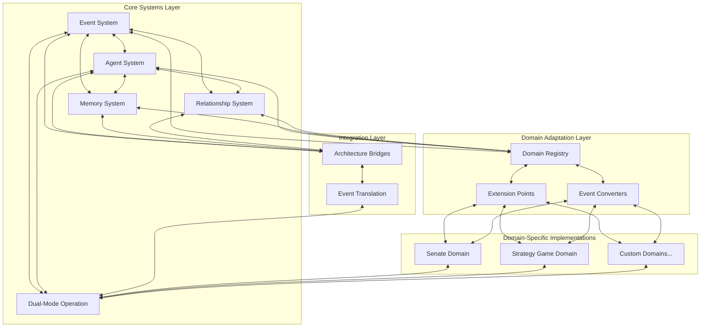

This architectural approach provides several benefits:

1. **Flexibility**: New domains can be added without modifying core systems
2. **Reusability**: Core systems can be reused across multiple games and simulations
3. **Maintainability**: Clear separation of concerns makes the system easier to maintain
4. **Scalability**: Core systems are designed with performance in mind for handling 1000-2000 agents
5. **Integration**: The Domain Adaptation Layer enables integration between different game domains
6. **Migration**: The Integration Layer allows gradual migration from legacy systems

## Core Systems Layer

The Core Systems Layer provides the fundamental components that are common across all agent-based systems, regardless of the specific domain.

### Event System

The Event System is the backbone of the architecture, enabling communication between agents and components. It builds upon the current EventBus implementation with enhancements for scalability.

#### Components

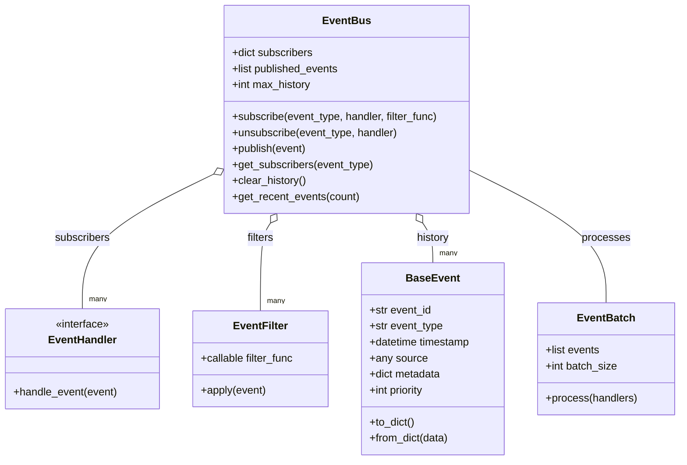

#### Key Features

1. **Event Filtering**: Handlers can specify filters to process only relevant events, reducing unnecessary processing
   ```python
   # Example filter that only processes events from a specific source
   def source_filter(event, source_id):
       return event.source == source_id
   
   # Subscribe with a filter
   event_bus.subscribe("speech", handler, 
                       filter_func=lambda event: source_filter(event, "senator_123"))
   ```

2. **Event Batching**: Process multiple events in batches for better performance
   ```python
   # Create and use an event batch
   batch = EventBatch(max_size=100)
   for event in events:
       batch.add_event(event)
   
   if batch.is_full():
       batch.process(handlers)
   ```

3. **Priority-based Processing**: Events are processed based on priority, ensuring critical events are handled first
   ```python
   # Create an event with high priority
   event = BaseEvent(event_type="emergency", priority=10)
   
   # Lower priority event
   normal_event = BaseEvent(event_type="routine", priority=5)
   ```

4. **Domain Partitioning**: Events can be partitioned by domain to prevent unnecessary cross-domain processing
   ```python
   # Create domain-specific event buses
   senate_bus = EventBus(domain="senate")
   market_bus = EventBus(domain="market")
   
   # Connect for cross-domain communication when needed
   parent_bus = EventBus(domain="global")
   senate_bus.set_parent(parent_bus)
   market_bus.set_parent(parent_bus)
   ```

### Agent System

The Agent System manages the creation, lifecycle, and processing of agents. It provides a framework for creating different types of agents while maintaining a consistent interface.

#### Components

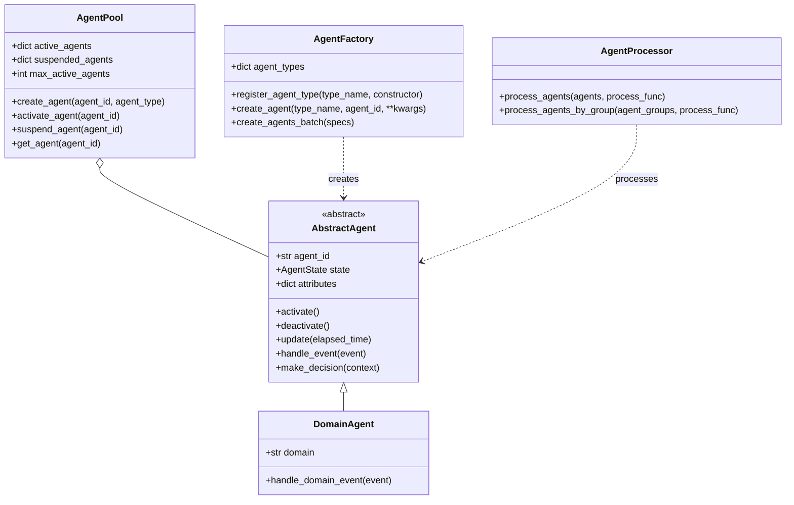

#### Key Features

1. **Agent Pooling**: Efficiently manage active vs. suspended agents for better resource usage
2. **Agent Factory**: Create agents of different types based on templates or configurations
3. **Agent Processor**: Process agents in batches or groups for better performance
4. **Agent Lifecycle Management**: Control agent activation, suspension, and deactivation
5. **Agent State Management**: Maintain and update agent state over time

### Memory System

The Memory System handles the storage and retrieval of agent memories and experiences. It provides a way for agents to remember past events, learn from experiences, and make decisions based on their knowledge.

#### Components

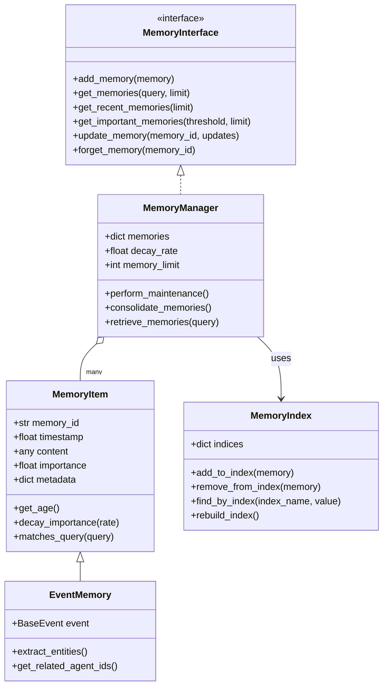

#### Key Features

1. **Memory Types**: Different types of memories for different kinds of information
2. **Memory Importance**: Memories have importance values that determine their longevity
3. **Memory Decay**: Memories decay over time, with less important ones fading faster
4. **Associative Retrieval**: Retrieve memories based on associations, not just direct matches
5. **Memory Consolidation**: Combine related memories to form more abstract knowledge

### Relationship System

The Relationship System tracks and manages relationships between agents. It allows agents to form relationships, update relationship attributes based on interactions, and make decisions based on these relationships.

#### Components

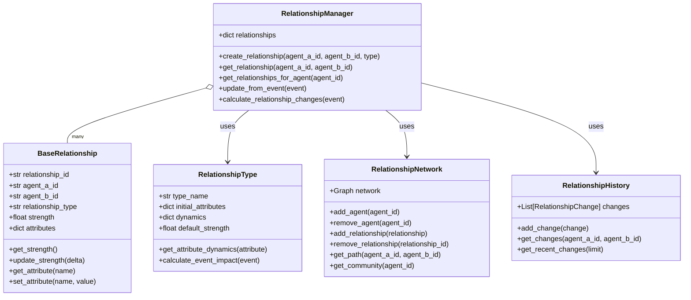

#### Key Features

1. **Relationship Types**: Different types of relationships with different dynamics
2. **Relationship Strength**: Measure of the overall connection between agents
3. **Relationship Attributes**: Specific aspects of relationships (trust, respect, etc.)
4. **Dynamic Relationships**: Relationships change based on interactions and events
5. **Relationship Networks**: Social network analysis for group dynamics
6. **Relationship Memory**: History of relationship changes for context

### Decision Making System

The Decision Making System helps agents make decisions based on their current state, memories, relationships, and environmental context. It integrates information from multiple sources to determine the best course of action.

#### Components

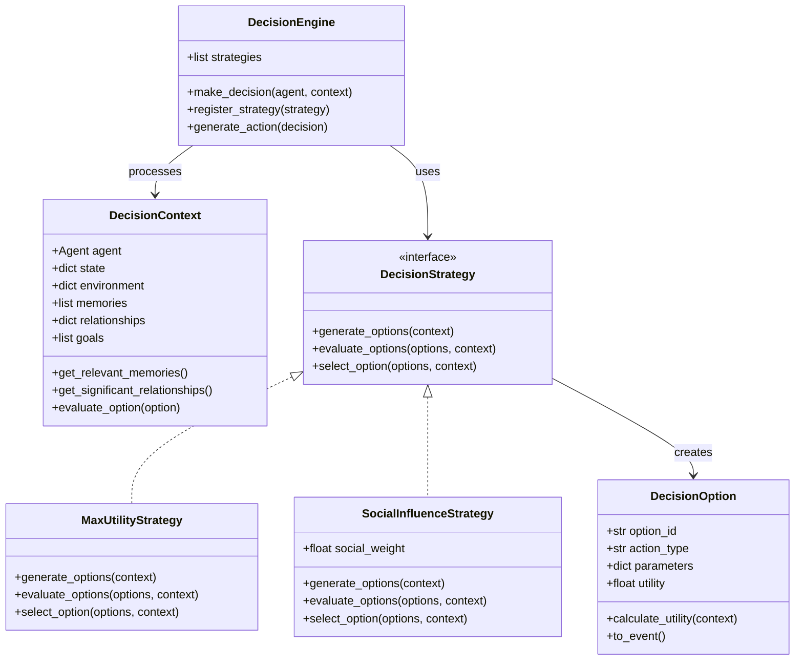

#### Key Features

1. **Context-Aware Decisions**: Decisions based on comprehensive context
2. **Multiple Decision Strategies**: Different approaches to decision making
3. **Utility-Based Evaluation**: Options evaluated based on expected utility
4. **Social Influence**: Decisions influenced by relationships and social dynamics
5. **Goal-Oriented Decisions**: Decisions driven by agent goals and priorities

## Domain Adaptation Layer

The Domain Adaptation Layer allows the core systems to be customized for specific domains, providing extension points that domain implementations can use to add domain-specific behavior.

### Domain Registry

The Domain Registry manages the registration and lookup of domains and their extension points. It allows components to find and use domain-specific functionality.

#### Components

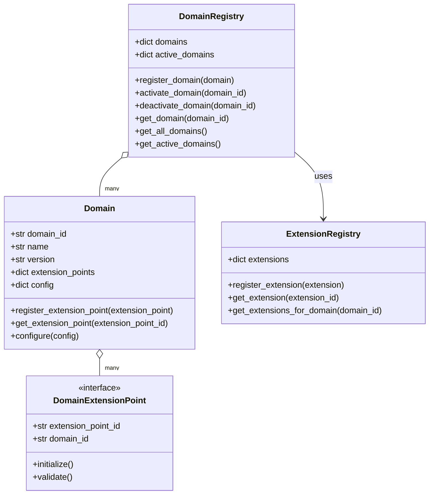

#### Key Features

1. **Domain Registration**: Register domains with the framework
2. **Domain Activation**: Activate and deactivate domains as needed
3. **Extension Point Lookup**: Find domain-specific extensions
4. **Domain Configuration**: Configure domains with domain-specific settings
5. **Version Management**: Track domain versions for compatibility

### Extension Points

Extension Points allow domain-specific behavior to be plugged into the core systems. They provide interfaces that domain implementations can implement to customize the system.

#### Components

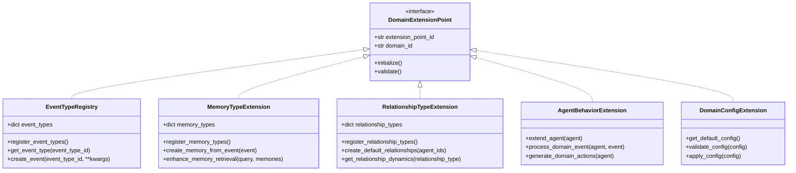

#### Key Features

1. **Event Type Registration**: Register domain-specific event types
2. **Memory Type Extension**: Add domain-specific memory types
3. **Relationship Type Extension**: Define domain-specific relationship types
4. **Agent Behavior Extension**: Extend agent behavior with domain-specific logic
5. **Domain Configuration**: Manage domain-specific configuration options

### Event Converters

Event Converters translate events between domains, allowing cross-domain communication. They map events from one domain to equivalent events in another domain.

#### Components

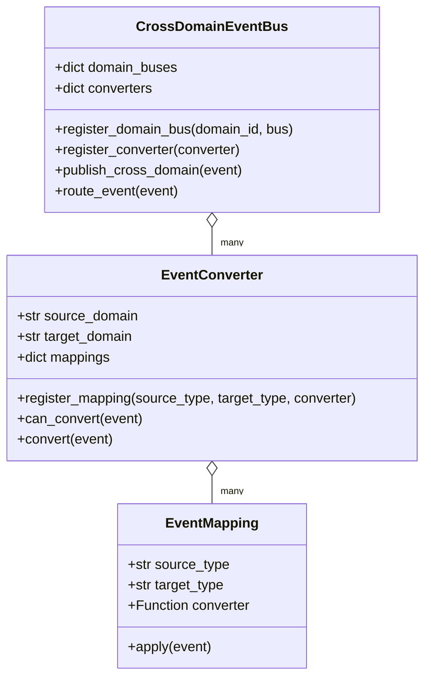

#### Key Features

1. **Event Type Mapping**: Map event types between domains
2. **Data Transformation**: Convert event data to the target domain's format
3. **Bidirectional Conversion**: Convert events in both directions
4. **Chained Conversion**: Convert events through multiple domains if needed
5. **Selective Conversion**: Only convert events that are relevant to the target domain

## Integration Layer

The Integration Layer provides mechanisms for integrating the new event-driven architecture with existing systems. It facilitates a gradual migration path from legacy architectures to the new framework.

### Architecture Bridges

Architecture Bridges connect the new event-driven architecture with legacy components. They translate between different architectural paradigms and communication patterns.

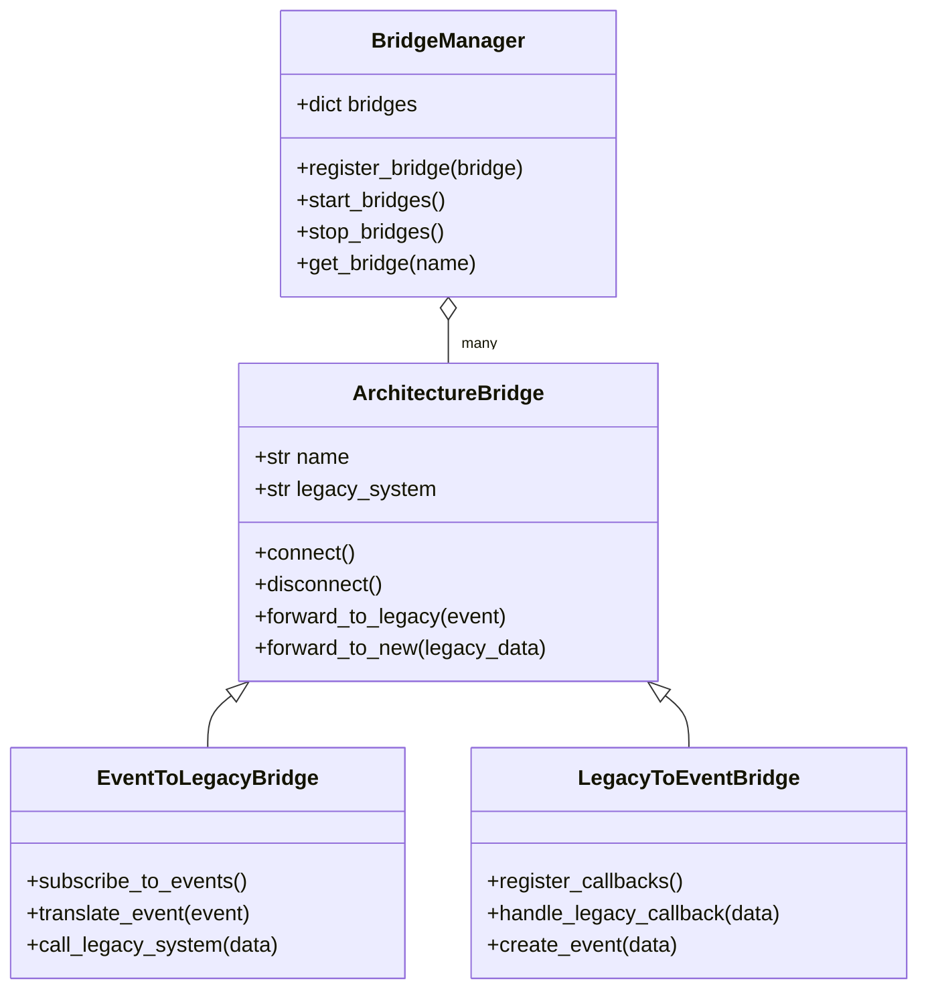

### Event Translation

Event Translation converts between legacy data formats and events in the new architecture. It ensures that data can flow seamlessly between the two systems.

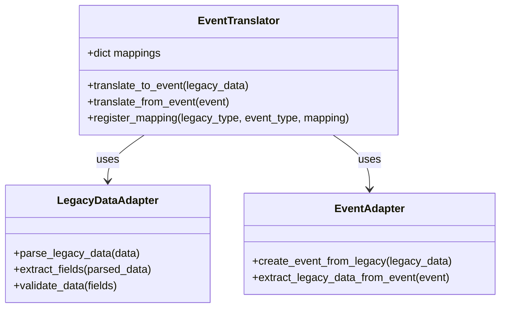

### Dual-Mode Operation

Dual-Mode Operation allows the system to run in both legacy and new architectures simultaneously. It provides a way to gradually migrate components while ensuring system functionality.

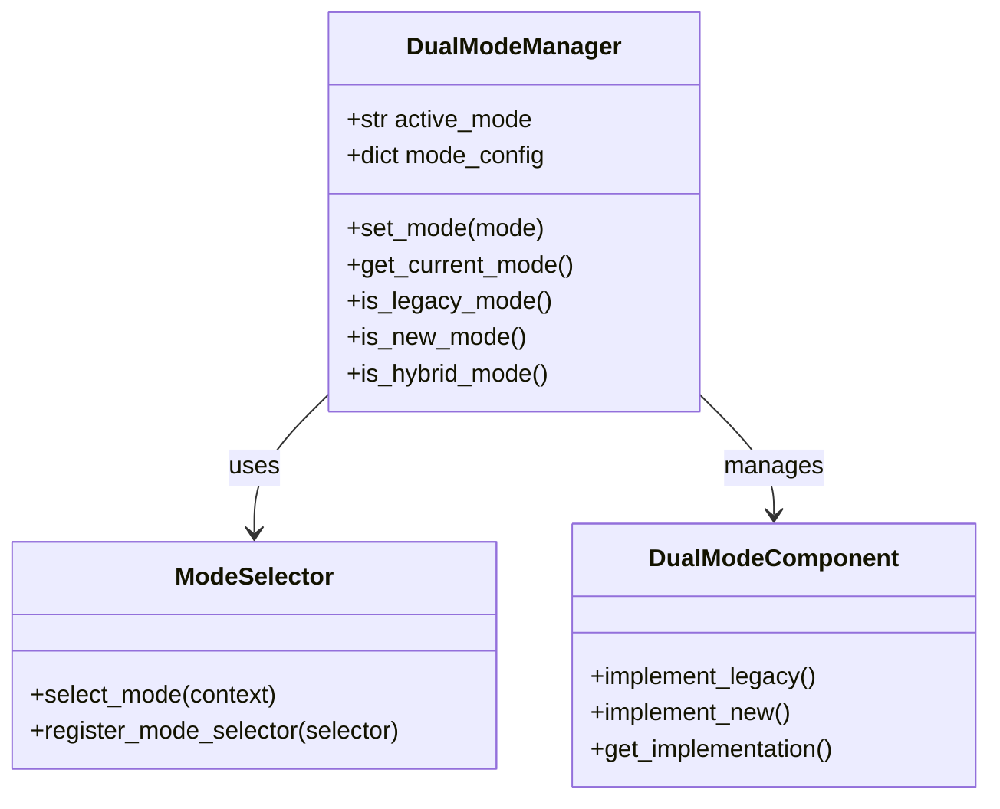

## Domain Implementations

The framework includes several pre-built domain implementations that can be used as-is or extended.

### Senate Domain Implementation

The Senate Domain implements a political simulation inspired by the Roman Senate. It provides specialized agents, events, and relationships for political simulations.

### Strategy Game Domain Implementation

The Strategy Game Domain implements a turn-based strategy game. It provides specialized agents, events, and relationships for strategy games.

### Custom Domain Implementations

Custom domains can be created by implementing the extension points provided by the framework. This allows the framework to be adapted to a wide range of agent-based simulations.

## Cross-Domain Integration

The framework supports integration between different domains, allowing agents and systems from one domain to interact with those from another.

### Integration Approaches

1. **Event-Based Integration**: Domains communicate through events
2. **Shared Agents**: Agents that exist in multiple domains
3. **Relationship Bridging**: Relationships that span domains
4. **Resource Sharing**: Domains that share resources

## Performance and Scalability

The framework is designed to handle large numbers of agents and events efficiently. It includes several optimizations for performance and scalability.

### Event Processing Optimizations

1. **Event Filtering**: Only process events that are relevant to the agent
2. **Event Batching**: Process events in batches for efficiency
3. **Priority-Based Processing**: Process high-priority events first
4. **Parallel Processing**: Process events in parallel where possible

### Agent Management Optimizations

1. **Agent Pooling**: Only activate agents when needed
2. **Agent Grouping**: Process agents in groups with similar properties
3. **Lazy Initialization**: Initialize agent components on demand
4. **State Caching**: Cache agent state for faster access

### Memory Optimizations

1. **Memory Pruning**: Remove unimportant memories to save space
2. **Memory Indexing**: Index memories for faster retrieval
3. **Memory Consolidation**: Combine related memories to save space
4. **Lazy Loading**: Only load memories when needed

### Relationship Optimizations

1. **Relationship Caching**: Cache commonly accessed relationships
2. **Sparse Representation**: Only store significant relationships
3. **Relationship Batching**: Update relationships in batches
4. **Relationship Indexing**: Index relationships for faster lookup

## CLI and Interface

The framework provides a command-line interface (CLI) for creating, running, and managing simulations. It supports flags for selecting architecture modes:

```bash
# Run in legacy mode
python run_simulation.py --mode legacy

# Run in new architecture mode
python run_simulation.py --mode new

# Run in hybrid mode (both architectures)
python run_simulation.py --mode hybrid
```

Configuration options for the CLI can be set in a config file or provided as command-line arguments.

## References

1. Event-Driven Architecture in Game AI Systems
2. Agent-Based Modeling and Simulation
3. Memory Systems for Intelligent Agents
4. Relationship Modeling in Multi-Agent Systems
5. Domain-Driven Design in Game Development