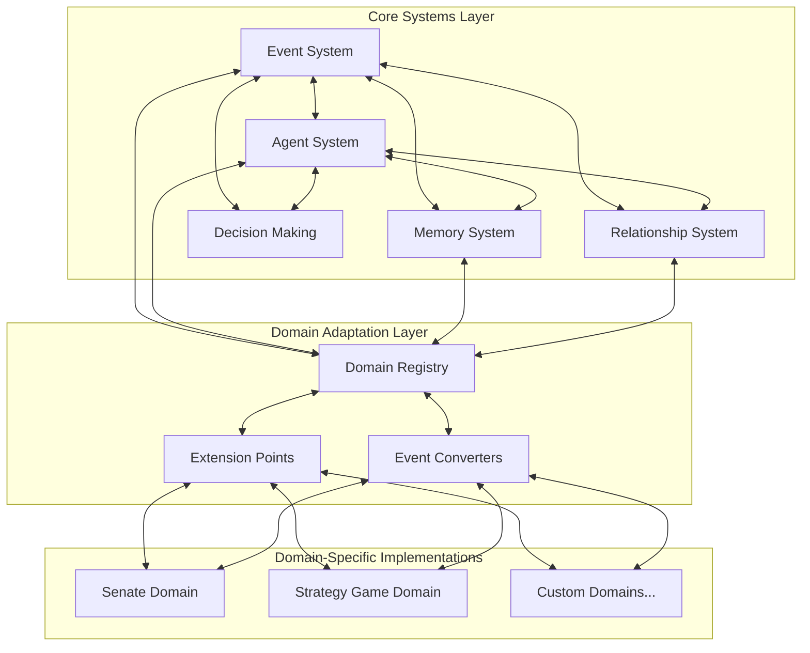
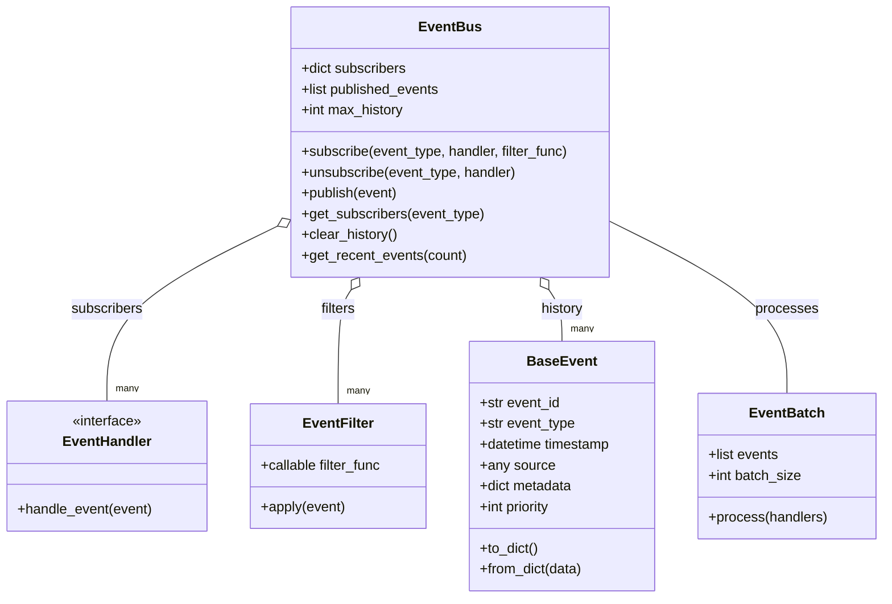
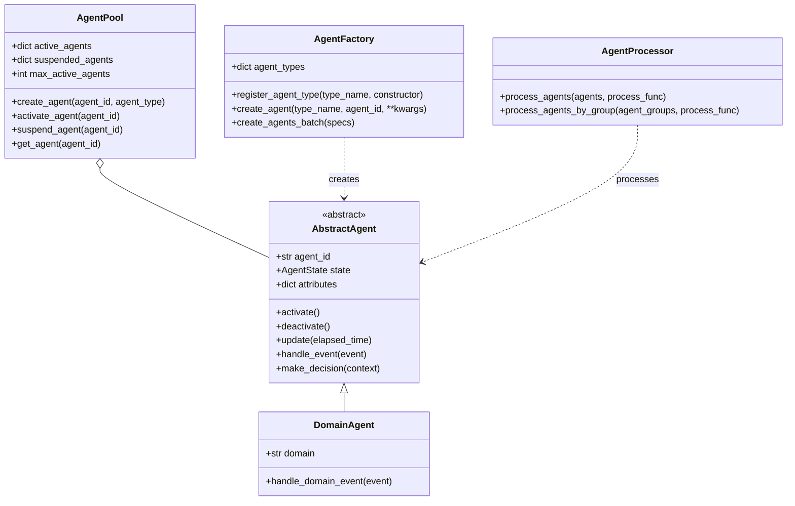
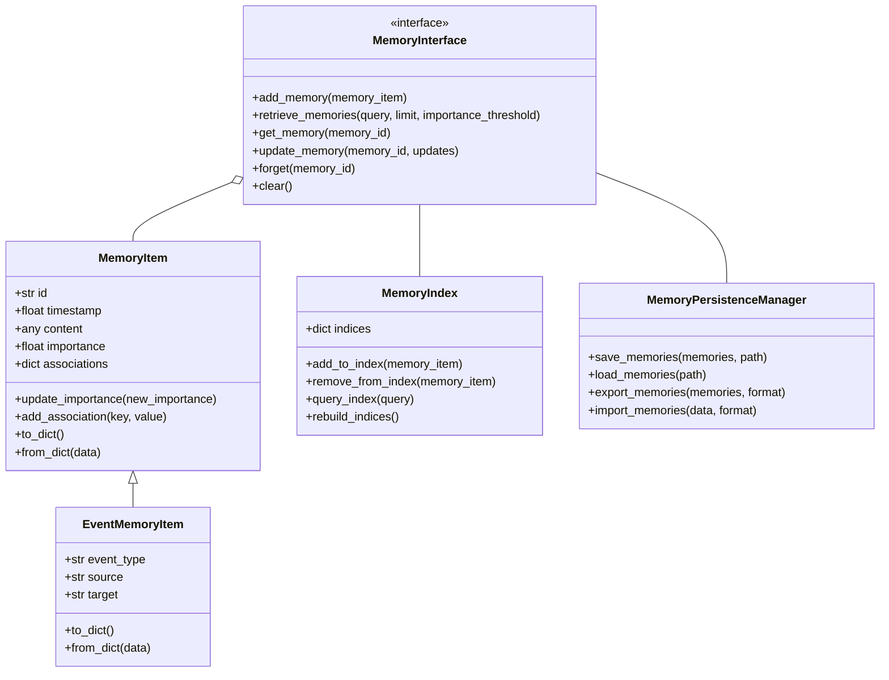
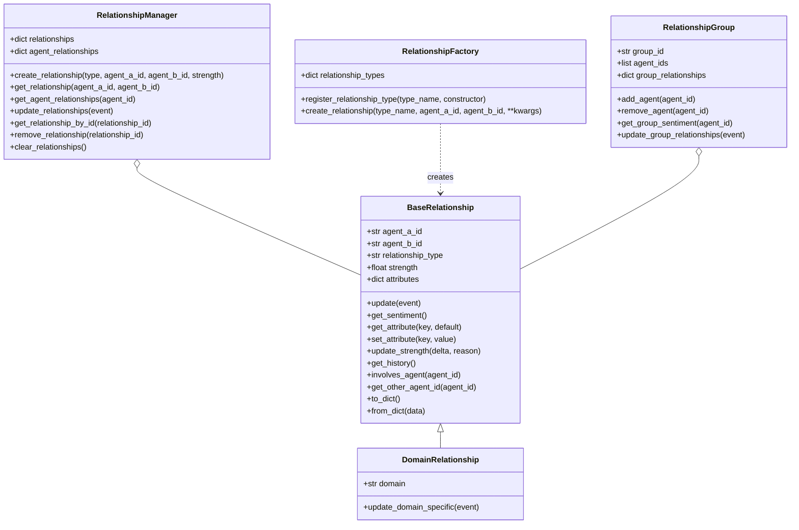
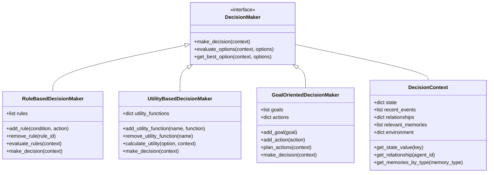
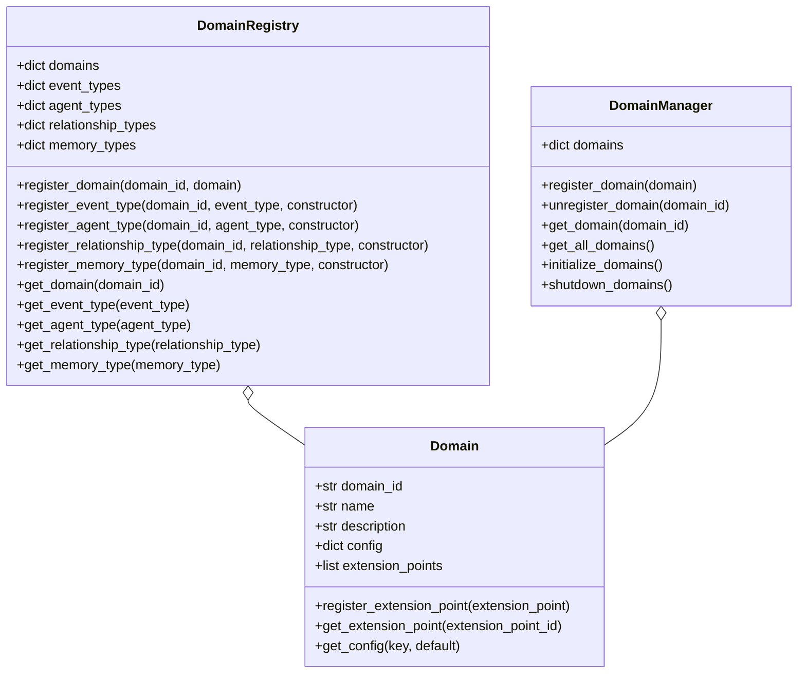
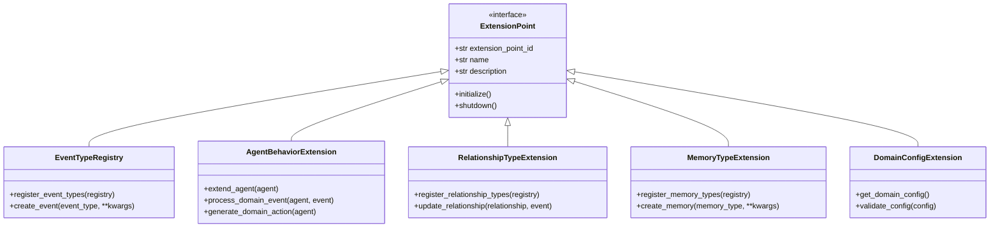
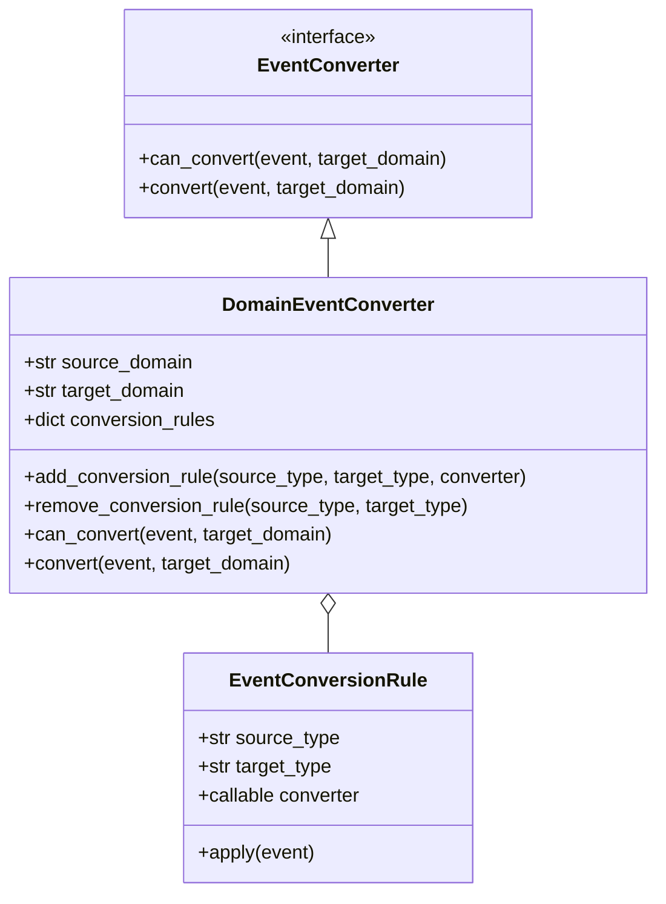

# Agentic Game Framework Architecture

**Author:** Documentation Team  
**Version:** 1.0.0  
**Date:** April 19, 2025

## Table of Contents

- [Introduction](#introduction)
- [Architectural Overview](#architectural-overview)
- [Core Systems Layer](#core-systems-layer)
  - [Event System](#event-system)
  - [Agent System](#agent-system)
  - [Memory System](#memory-system)
  - [Relationship System](#relationship-system)
  - [Decision Making System](#decision-making-system)
- [Domain Adaptation Layer](#domain-adaptation-layer)
  - [Domain Registry](#domain-registry)
  - [Extension Points](#extension-points)
  - [Event Converters](#event-converters)
- [Domain Implementations](#domain-implementations)
- [Cross-Domain Integration](#cross-domain-integration)
- [Performance and Scalability](#performance-and-scalability)
- [References](#references)

## Introduction

The Agentic Game Framework architecture is designed to support the development of agent-based game systems and simulations across multiple domains. It provides a flexible, scalable foundation that can be extended to create domain-specific implementations while reusing core components.

The architecture is derived from the Roman Senate AI simulation but abstracted to be applicable across multiple game domains. It supports 1000-2000 agents with efficient event processing, memory management, and relationship tracking.

## Architectural Overview

The architecture follows a layered approach that separates domain-agnostic core systems from domain-specific implementations:



This architectural approach provides several benefits:

1. **Flexibility**: New domains can be added without modifying core systems
2. **Reusability**: Core systems can be reused across multiple games and simulations
3. **Maintainability**: Clear separation of concerns makes the system easier to maintain
4. **Scalability**: Core systems are designed with performance in mind for handling 1000-2000 agents
5. **Integration**: The Domain Adaptation Layer enables integration between different game domains

## Core Systems Layer

The Core Systems Layer provides the fundamental components that are common across all agent-based systems, regardless of the specific domain.

### Event System

The Event System is the backbone of the architecture, enabling communication between agents and components. It builds upon the current EventBus implementation with enhancements for scalability.

#### Components



#### Key Features

1. **Event Filtering**: Handlers can specify filters to process only relevant events, reducing unnecessary processing
   ```python
   # Example filter that only processes events from a specific source
   def source_filter(event, source_id):
       return event.source == source_id
   
   # Subscribe with a filter
   event_bus.subscribe("speech", handler, 
                       filter_func=lambda event: source_filter(event, "senator_123"))
   ```

2. **Event Batching**: Process multiple events in batches for better performance
   ```python
   # Create and use an event batch
   batch = EventBatch(max_size=100)
   for event in events:
       batch.add_event(event)
   
   if batch.is_full():
       batch.process(handlers)
   ```

3. **Priority-based Processing**: Events are processed based on priority, ensuring critical events are handled first
   ```python
   # Create an event with high priority
   event = BaseEvent(event_type="emergency", priority=10)
   
   # Lower priority event
   normal_event = BaseEvent(event_type="routine", priority=5)
   ```

4. **Domain Partitioning**: Events can be partitioned by domain to prevent unnecessary cross-domain processing
   ```python
   # Create domain-specific event buses
   senate_bus = EventBus(domain="senate")
   market_bus = EventBus(domain="market")
   
   # Connect for cross-domain communication when needed
   parent_bus = EventBus(domain="global")
   senate_bus.set_parent(parent_bus)
   market_bus.set_parent(parent_bus)
   ```

### Agent System

The Agent System manages the creation, lifecycle, and processing of agents. It provides a framework for creating different types of agents while maintaining a consistent interface.

#### Components



#### Key Features

1. **Agent Pooling**: Efficiently manage active vs. suspended agents for better resource usage
2. **Agent Factory**: Create agents of different types based on templates or configurations
3. **Agent Processor**: Process agents in batches or groups for better performance
4. **Agent Lifecycle Management**: Control agent activation, suspension, and deactivation
5. **Agent State Management**: Maintain and update agent state over time

### Memory System

The Memory System handles the storage and retrieval of agent memories and experiences. It provides a way for agents to remember past events, learn from experiences, and make decisions based on their knowledge.

#### Components



#### Key Features

1. **Tiered Memory Architecture**: Different types of memory for different purposes (working, episodic, semantic)
2. **Memory Indexing**: Efficient retrieval of memories based on various criteria
3. **Memory Importance**: Memories have importance scores that affect retrieval and forgetting
4. **Memory Associations**: Memories can be associated with concepts, entities, or other memories
5. **Memory Persistence**: Memories can be saved and loaded for persistence between sessions

### Relationship System

The Relationship System manages the connections and interactions between agents. It provides a way for agents to form, maintain, and update relationships with other agents.

#### Components



#### Key Features

1. **Relationship Types**: Different types of relationships for different domains and contexts
2. **Relationship Strength**: Relationships have strength values that can change over time
3. **Relationship Attributes**: Relationships can have additional attributes for domain-specific data
4. **Relationship History**: Relationships maintain a history of changes and interactions
5. **Relationship Groups**: Agents can form groups with shared relationships
6. **Sparse Relationship Matrix**: Efficient storage and retrieval of relationships in large agent populations

### Decision Making System

The Decision Making System provides mechanisms for agents to make decisions based on their state, memories, relationships, and the current context. It supports different decision-making approaches, from simple rule-based systems to complex utility-based or goal-oriented systems.

#### Components



#### Key Features

1. **Multiple Decision-Making Approaches**: Support for rule-based, utility-based, and goal-oriented decision making
2. **Decision Context**: Rich context for decision making, including state, events, relationships, and memories
3. **Decision Evaluation**: Mechanisms for evaluating and comparing different options
4. **Decision Planning**: Support for planning sequences of actions to achieve goals
5. **Decision Explanation**: Ability to explain why a decision was made

## Domain Adaptation Layer

The Domain Adaptation Layer bridges the gap between the core systems and domain-specific implementations. It provides mechanisms for registering, discovering, and using domain-specific components.

### Domain Registry

The Domain Registry is a central repository for domain-specific components. It allows domains to register their components and for other components to discover and use them.

#### Components



#### Key Features

1. **Domain Registration**: Domains can register themselves and their components
2. **Component Discovery**: Components can discover and use domain-specific components
3. **Configuration Management**: Domains can provide configuration for their components
4. **Extension Point Registration**: Domains can register extension points for customization
5. **Domain Lifecycle Management**: Domains can be initialized, updated, and shut down

### Extension Points

Extension Points define interfaces that domain-specific implementations can implement to extend the core functionality of the framework. They provide a way for domains to customize the behavior of the framework without modifying the core code.

#### Components



#### Key Features

1. **Event Type Extensions**: Register and create domain-specific event types
2. **Agent Behavior Extensions**: Extend agents with domain-specific behaviors
3. **Relationship Type Extensions**: Register and update domain-specific relationship types
4. **Memory Type Extensions**: Register and create domain-specific memory types
5. **Domain Configuration Extensions**: Provide and validate domain-specific configuration

### Event Converters

Event Converters translate events between different domains, allowing for cross-domain communication and interaction. They provide a way for events from one domain to be understood and processed by components in another domain.

#### Components



#### Key Features

1. **Event Type Conversion**: Convert events from one type to another
2. **Domain-Specific Conversion**: Convert events between different domains
3. **Conversion Rules**: Define rules for how events should be converted
4. **Bidirectional Conversion**: Convert events in both directions between domains
5. **Conversion Validation**: Validate that events can be converted correctly

## Domain Implementations

Domain Implementations are specific applications of the framework to particular domains. They use the extension points provided by the Domain Adaptation Layer to customize the behavior of the framework for their specific needs.

### Senate Domain Implementation

The Senate Domain Implementation applies the framework to the Roman Senate simulation. It provides domain-specific events, agents, relationships, and memories for modeling the behavior of senators, officials, and other entities in the Roman Senate.

### Strategy Game Domain Implementation

The Strategy Game Domain Implementation applies the framework to a generic strategy game. It provides domain-specific components for modeling units, resources, territories, and other elements common in strategy games.

### Custom Domain Implementations

The framework is designed to be extended to any domain that involves agent-based simulation. Custom domains can be implemented by creating domain-specific components and registering them with the Domain Registry.

## Cross-Domain Integration

The framework supports integration between different domains, allowing for complex simulations that span multiple domains. For example, a simulation might include both the Senate domain and a Market domain, with events and agents that interact across domain boundaries.

### Integration Approaches

1. **Event Conversion**: Events from one domain can be converted to events in another domain
2. **Shared Agents**: Agents can participate in multiple domains
3. **Domain Bridges**: Special components that facilitate communication between domains
4. **Global Event Bus**: A central event bus that all domains can publish to and subscribe from
5. **Cross-Domain Relationships**: Relationships that span domain boundaries

## Performance and Scalability

The framework is designed to support 1000-2000 agents efficiently. It includes several optimizations to ensure good performance at scale:

### Event Processing Optimizations

1. **Event Filtering**: Only process events that are relevant to a component
2. **Event Batching**: Process multiple events in a batch for better performance
3. **Event Prioritization**: Process high-priority events first
4. **Domain Partitioning**: Partition events by domain to reduce unnecessary processing

### Agent Management Optimizations

1. **Agent Pooling**: Only keep active agents in memory
2. **Agent Grouping**: Process agents in groups for better locality
3. **Agent Scheduling**: Schedule agent updates to distribute processing load
4. **Lazy Initialization**: Initialize agent components only when needed

### Memory Optimizations

1. **Memory Indexing**: Efficient retrieval of memories based on various criteria
2. **Memory Importance**: Focus on important memories and forget less important ones
3. **Memory Compression**: Compress or summarize memories to save space
4. **Memory Caching**: Cache frequently accessed memories for better performance

### Relationship Optimizations

1. **Sparse Relationship Matrix**: Only store relationships that exist
2. **Relationship Grouping**: Group relationships for better locality
3. **Relationship Caching**: Cache frequently accessed relationships
4. **Relationship Pruning**: Remove or simplify relationships that are no longer relevant

## References

- [Roman Senate Architecture Analysis Plan](../../roman_senate_architecture_analysis_plan.md)
- [Game AI and Agentic Systems Best Practices](../../game_ai_agent_best_practices.md)
- [Abstracted Agentic Game Architecture](../../abstracted_agentic_game_architecture.md)
- [Roman Senate Migration Plan](../../roman_senate_migration_plan.md)