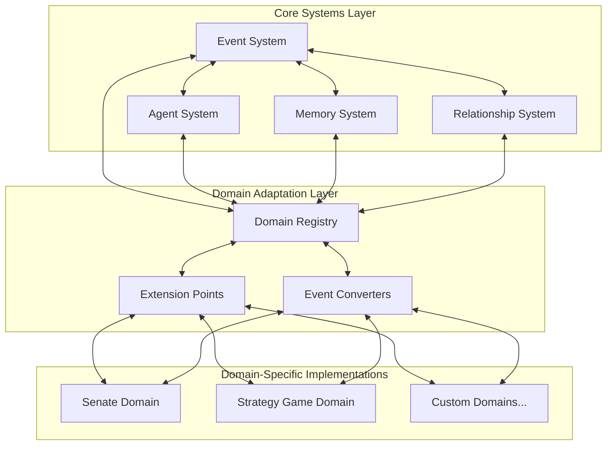

# Agentic Game Framework Developer Guide

**Author:** Documentation Team  
**Version:** 1.0.0  
**Date:** April 19, 2025

## Table of Contents

- [Introduction](#introduction)
- [Setting Up Your Development Environment](#setting-up-your-development-environment)
- [Framework Architecture Overview](#framework-architecture-overview)
- [Core Components](#core-components)
  - [Event System](#event-system)
  - [Agent System](#agent-system)
  - [Memory System](#memory-system)
  - [Relationship System](#relationship-system)
- [Extending the Framework](#extending-the-framework)
  - [Creating Custom Events](#creating-custom-events)
  - [Creating Custom Agents](#creating-custom-agents)
  - [Creating Custom Memory Types](#creating-custom-memory-types)
  - [Creating Custom Relationships](#creating-custom-relationships)
- [Domain-Specific Implementations](#domain-specific-implementations)
- [Best Practices](#best-practices)
- [References](#references)

## Introduction

This developer guide provides detailed information on how to use and extend the Agentic Game Framework. It covers the core components of the framework, how to extend them for your specific needs, and best practices for developing with the framework.

The Agentic Game Framework is designed to be flexible and extensible, allowing you to create domain-specific implementations while reusing core components. This guide will help you understand how to leverage the framework's capabilities to build your own agent-based systems.

## Setting Up Your Development Environment

To get started with the Agentic Game Framework, you'll need to set up your development environment:

1. **Clone the Repository**:
   ```bash
   git clone https://github.com/your-organization/agentic-game-framework.git
   cd agentic-game-framework
   ```

2. **Install Dependencies**:
   ```bash
   pip install -r requirements.txt
   ```

3. **Install Development Dependencies** (optional):
   ```bash
   pip install -r requirements-dev.txt
   ```

4. **Run Tests** to ensure everything is working:
   ```bash
   pytest
   ```

## Framework Architecture Overview

The Agentic Game Framework follows a layered architecture that separates domain-agnostic core systems from domain-specific implementations:



For a more detailed explanation of the architecture, see the [Architecture Guide](architecture.md).

## Core Components

### Event System

The Event System is the backbone of the framework, enabling communication between components. It consists of events and an event bus that distributes events to interested subscribers.

#### BaseEvent

The `BaseEvent` class is the base class for all events in the system:

```python
from agentic_game_framework.events.base import BaseEvent

class CustomEvent(BaseEvent):
    """Custom event for a specific domain."""
    
    def __init__(
        self,
        source: str,
        target: str = None,
        data: dict = None,
        **kwargs
    ):
        """Initialize a custom event."""
        super().__init__(
            event_type="custom_event",
            source=source,
            target=target,
            data=data or {},
            **kwargs
        )
```

#### EventBus

The `EventBus` class is responsible for distributing events to subscribers:

```python
from agentic_game_framework.events.event_bus import EventBus
from agentic_game_framework.events.base import BaseEvent, EventHandler

# Create an event bus
event_bus = EventBus()

# Create an event handler
class CustomHandler(EventHandler):
    def handle_event(self, event: BaseEvent) -> None:
        print(f"Handling event: {event}")

# Subscribe to events
handler = CustomHandler()
event_bus.subscribe("custom_event", handler)

# Publish an event
event = CustomEvent(source="system")
event_bus.publish(event)
```

### Agent System

The Agent System manages the creation, lifecycle, and processing of agents. It provides a framework for creating different types of agents while maintaining a consistent interface.

#### BaseAgent

The `BaseAgent` class is the base class for all agents in the system:

```python
from agentic_game_framework.agents.base_agent import BaseAgent
from agentic_game_framework.events.base import BaseEvent

class CustomAgent(BaseAgent):
    """Custom agent for a specific domain."""
    
    def __init__(
        self,
        name: str,
        attributes: dict = None,
        agent_id: str = None,
        initial_state: dict = None
    ):
        """Initialize a custom agent."""
        super().__init__(
            name=name,
            attributes=attributes,
            agent_id=agent_id,
            initial_state=initial_state or {}
        )
        
        # Subscribe to relevant event types
        self.subscribe_to_event("custom_event")
    
    def process_event(self, event: BaseEvent) -> None:
        """Process an incoming event."""
        if event.event_type == "custom_event":
            # Handle the event
            print(f"Agent {self.name} received event: {event}")
            
            # Update agent state based on the event
            self.update_state({"last_event": event.get_id()})
    
    def generate_action(self) -> BaseEvent:
        """Generate an action based on the agent's current state."""
        # Implement decision-making logic here
        if self._should_act():
            return CustomEvent(source=self.id, data={"action": "custom_action"})
        return None
    
    def _should_act(self) -> bool:
        """Determine if the agent should act."""
        # Implement decision logic here
        return True
```

#### AgentFactory and AgentManager

The framework provides `AgentFactory` for creating agents and `AgentManager` for managing collections of agents:

```python
from agentic_game_framework.agents.agent_factory import AgentFactory
from agentic_game_framework.agents.agent_manager import AgentManager

# Create an agent factory
agent_factory = AgentFactory()
agent_factory.register_agent_type("custom", CustomAgent)

# Create an agent
agent = agent_factory.create_agent(
    agent_type="custom",
    name="Custom Agent",
    attributes={"domain": "custom_domain"}
)

# Create an agent manager
agent_manager = AgentManager(event_bus)
agent_manager.register_agent(agent)

# Update all agents
actions = agent_manager.update_all()

# Process actions as events
for action in actions:
    event_bus.publish(action)
```

### Memory System

The Memory System handles the storage and retrieval of agent memories and experiences. It provides a way for agents to remember past events, learn from experiences, and make decisions based on their knowledge.

#### MemoryItem and EventMemoryItem

The framework provides `MemoryItem` for general memories and `EventMemoryItem` for event-specific memories:

```python
from agentic_game_framework.memory.memory_interface import MemoryItem, EventMemoryItem
import time

# Create a memory item
memory = MemoryItem(
    memory_id="memory1",
    timestamp=time.time(),
    content="This is a memory",
    importance=0.8,
    associations={"type": "observation", "location": "market"}
)

# Create an event memory item
event_memory = EventMemoryItem(
    memory_id="memory2",
    timestamp=time.time(),
    event=CustomEvent(source="agent1", target="agent2", data={"message": "Hello"}),
    importance=0.7,
    associations={"agent_id": "agent1"}
)
```

#### MemoryInterface

The `MemoryInterface` class defines the interface for memory implementations:

```python
from agentic_game_framework.memory.memory_interface import MemoryInterface, MemoryItem

class CustomMemory(MemoryInterface):
    """Custom memory implementation."""
    
    def __init__(self):
        """Initialize a custom memory."""
        self._memories = {}
        self._indices = {}
    
    def add_memory(self, memory_item: MemoryItem) -> str:
        """Add a memory item to the memory store."""
        self._memories[memory_item.id] = memory_item
        self._update_indices(memory_item)
        return memory_item.id
    
    def retrieve_memories(self, query: dict, limit=None, importance_threshold=None):
        """Retrieve memories that match the query."""
        # Implementation
        pass
    
    def get_memory(self, memory_id: str):
        """Get a specific memory by ID."""
        return self._memories.get(memory_id)
    
    def update_memory(self, memory_id: str, updates: dict) -> bool:
        """Update a memory item."""
        # Implementation
        pass
    
    def forget(self, memory_id: str) -> bool:
        """Remove a memory item."""
        # Implementation
        pass
    
    def clear(self) -> None:
        """Remove all memory items."""
        self._memories.clear()
        self._indices.clear()
```

### Relationship System

The Relationship System manages the connections and interactions between agents. It provides a way for agents to form, maintain, and update relationships with other agents.

#### BaseRelationship

The `BaseRelationship` class is the base class for all relationships in the system:

```python
from agentic_game_framework.relationships.base_relationship import BaseRelationship
from agentic_game_framework.events.base import BaseEvent

class CustomRelationship(BaseRelationship):
    """Custom relationship for a specific domain."""
    
    def __init__(
        self,
        agent_a_id: str,
        agent_b_id: str,
        strength: float = 0.0,
        attributes: dict = None,
        relationship_id: str = None
    ):
        """Initialize a custom relationship."""
        super().__init__(
            agent_a_id=agent_a_id,
            agent_b_id=agent_b_id,
            relationship_type="custom",
            strength=strength,
            attributes=attributes,
            relationship_id=relationship_id
        )
    
    def update(self, event: BaseEvent) -> bool:
        """Update the relationship based on an event."""
        if not self._event_involves_both_agents(event):
            return False
            
        # Implement update logic based on the event
        if event.event_type == "custom_event":
            # Update relationship strength
            delta = 0.1
            self.update_strength(delta, reason=f"Custom event: {event.get_id()}")
            return True
            
        return False
    
    def _event_involves_both_agents(self, event: BaseEvent) -> bool:
        """Check if an event involves both agents in the relationship."""
        return (
            (event.source == self.agent_a_id and event.target == self.agent_b_id) or
            (event.source == self.agent_b_id and event.target == self.agent_a_id)
        )
```

#### RelationshipManager

The `RelationshipManager` class manages collections of relationships:

```python
from agentic_game_framework.relationships.relationship_manager import RelationshipManager

# Create a relationship manager
relationship_manager = RelationshipManager(event_bus)

# Create a relationship
relationship = relationship_manager.create_relationship(
    relationship_type="custom",
    agent_a_id="agent1",
    agent_b_id="agent2",
    strength=0.5,
    attributes={"context": "business"}
)

# Get a relationship
relationship = relationship_manager.get_relationship("agent1", "agent2")

# Update relationships based on an event
relationship_manager.update_relationships(event)
```

## Extending the Framework

The Agentic Game Framework is designed to be extended to support different domains and use cases. This section covers how to extend the core components of the framework.

### Creating Custom Events

To create a custom event, extend the `BaseEvent` class and implement any domain-specific functionality:

```python
from agentic_game_framework.events.base import BaseEvent
from datetime import datetime

class TradeEvent(BaseEvent):
    """Event representing a trade between agents."""
    
    def __init__(
        self,
        source: str,
        target: str,
        items_given: dict,
        items_received: dict,
        timestamp: datetime = None,
        event_id: str = None
    ):
        """Initialize a trade event."""
        data = {
            "items_given": items_given,
            "items_received": items_received,
            "trade_value": sum(items_received.values()) - sum(items_given.values())
        }
        
        super().__init__(
            event_type="trade",
            source=source,
            target=target,
            data=data,
            timestamp=timestamp,
            event_id=event_id
        )
```

### Creating Custom Agents

To create a custom agent, extend the `BaseAgent` class and implement the required methods:

```python
from agentic_game_framework.agents.base_agent import BaseAgent
from agentic_game_framework.events.base import BaseEvent
from typing import Optional

class MerchantAgent(BaseAgent):
    """Agent representing a merchant in a marketplace."""
    
    def __init__(
        self,
        name: str,
        specialties: list,
        attributes: dict = None,
        agent_id: str = None,
        initial_state: dict = None
    ):
        """Initialize a merchant agent."""
        # Set up merchant-specific attributes
        merchant_attributes = attributes or {}
        merchant_attributes.update({
            "agent_type": "merchant",
            "specialties": specialties
        })
        
        # Set up initial state
        merchant_state = initial_state or {}
        merchant_state.update({
            "marketplace": {
                "inventory": {},
                "prices": {},
                "specialties": specialties,
                "gold": 100
            }
        })
        
        super().__init__(
            name=name,
            attributes=merchant_attributes,
            agent_id=agent_id,
            initial_state=merchant_state
        )
        
        # Subscribe to relevant event types
        self.subscribe_to_event("trade")
        self.subscribe_to_event("price_change")
        self.subscribe_to_event("item_listing")
    
    def process_event(self, event: BaseEvent) -> None:
        """Process an incoming event."""
        # Implementation
        pass
    
    def generate_action(self) -> Optional[BaseEvent]:
        """Generate an action based on the agent's current state."""
        # Implementation
        pass
```

### Creating Custom Memory Types

To create a custom memory type, extend the `MemoryItem` or `EventMemoryItem` class:

```python
from agentic_game_framework.memory.memory_interface import EventMemoryItem
from agentic_game_framework.events.base import BaseEvent
from typing import Dict, Any, Optional

class TransactionMemory(EventMemoryItem):
    """Memory item for storing transaction information."""
    
    def __init__(
        self,
        memory_id: str,
        timestamp: float,
        event: BaseEvent,
        importance: float = 0.7,
        associations: Optional[Dict[str, Any]] = None
    ):
        """Initialize a transaction memory."""
        super().__init__(
            memory_id=memory_id,
            timestamp=timestamp,
            event=event,
            importance=importance,
            associations=associations or {}
        )
        
        # Extract transaction-specific data
        self.transaction_data = self._extract_transaction_data(event)
        
        # Add transaction-specific associations
        self.add_association("transaction_type", "trade")
        self.add_association("partner_id", self.transaction_data["partner_id"])
    
    def _extract_transaction_data(self, event: BaseEvent) -> Dict[str, Any]:
        """Extract transaction data from a trade event."""
        # Implementation
        pass
    
    def get_summary(self) -> str:
        """Get a human-readable summary of the transaction."""
        # Implementation
        pass
```

### Creating Custom Relationships

To create a custom relationship, extend the `BaseRelationship` class:

```python
from agentic_game_framework.relationships.base_relationship import BaseRelationship
from agentic_game_framework.events.base import BaseEvent

class BusinessRelationship(BaseRelationship):
    """Relationship representing a business connection between agents."""
    
    def __init__(
        self,
        agent_a_id: str,
        agent_b_id: str,
        strength: float = 0.0,
        attributes: dict = None,
        relationship_id: str = None
    ):
        """Initialize a business relationship."""
        super().__init__(
            agent_a_id=agent_a_id,
            agent_b_id=agent_b_id,
            relationship_type="business",
            strength=strength,
            attributes=attributes or {},
            relationship_id=relationship_id
        )
        
        # Initialize business-specific attributes
        self.attributes.setdefault("transaction_count", 0)
        self.attributes.setdefault("total_value", 0.0)
        self.attributes.setdefault("last_transaction", None)
    
    def update(self, event: BaseEvent) -> bool:
        """Update the relationship based on an event."""
        # Implementation
        pass
```

## Domain-Specific Implementations

The Agentic Game Framework is designed to be extended to support different domains. To create a new domain implementation, you need to:

1. Create domain-specific events, agents, relationships, and memories
2. Implement domain extension points
3. Register the domain with the domain registry

For a complete example of a domain implementation, see the [Marketplace Example](examples.md#marketplace-domain).

## Best Practices

When extending the framework, follow these best practices:

1. **Event Design**:
   - Keep events simple and focused
   - Include all necessary data
   - Use appropriate event types
   - Consider event priority

2. **Agent Design**:
   - Single responsibility
   - Stateful design
   - Event-driven behavior
   - Memory utilization
   - Relationship awareness

3. **Memory Management**:
   - Importance scoring
   - Effective indexing
   - Memory pruning
   - Memory consolidation
   - Context-sensitive retrieval

4. **Relationship Management**:
   - Appropriate relationship types
   - Event-based updates
   - Relationship attributes
   - Relationship history
   - Relationship strength

5. **Performance Optimization**:
   - Event filtering
   - Event batching
   - Agent pooling
   - Memory indexing
   - Relationship caching

## References

- [Architecture Guide](architecture.md)
- [User Guide](user_guide.md)
- [API Reference](api_reference.md)
- [Examples and Tutorials](examples.md)
- [Migration Guide](migration_guide.md)
