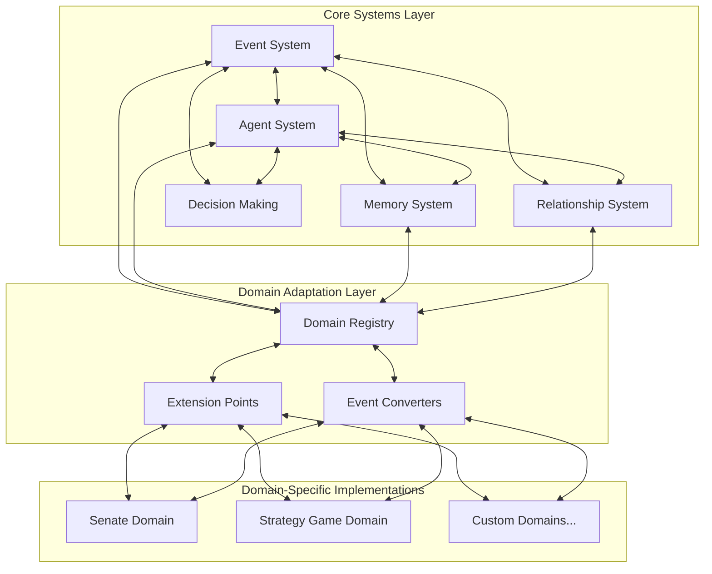

# Agentic Game Framework Documentation

**Author:** Documentation Team  
**Version:** 1.0.0  
**Date:** April 19, 2025

## Overview

The Agentic Game Framework is a domain-agnostic framework for building agent-based game systems and simulations. It provides a flexible foundation for creating complex, interactive agent systems across different domains, allowing developers to focus on domain-specific logic rather than infrastructure.

This framework was developed based on lessons learned from the Roman Senate simulation and designed to support thousands of diverse agents across multiple domains. It abstracts common patterns and components found in agent systems, making it easier to create, extend, and maintain agent-based simulations.

## Key Features

- **Event-Driven Architecture**: Decoupled components communicate through events
- **Flexible Agent System**: Customizable agent behaviors and decision-making
- **Memory System**: Efficient storage and retrieval of agent knowledge
- **Relationship System**: Dynamic modeling of connections between agents
- **Domain Adaptation Layer**: Extension points for domain-specific implementations
- **Scalability**: Designed to support 1000-2000 agents efficiently

## Core Components

### Event System

The event system serves as the backbone of the architecture, facilitating communication between components:

- `BaseEvent`: Abstract base class for all events
- `EventBus`: Central event dispatcher for publishing and subscribing to events

### Agent System

The agent system manages the creation, configuration, and lifecycle of agents:

- `BaseAgent`: Abstract base class for all agents
- `AgentFactory`: Creates agents based on templates or configurations
- `AgentManager`: Manages collections of agents

### Memory System

The memory system handles the storage and retrieval of agent memories and experiences:

- `MemoryInterface`: Abstract interface for memory implementations
- `MemoryItem`: Base class for memory entries
- `MemoryIndex`: Efficient memory retrieval system
- `MemoryPersistenceManager`: Handles saving and loading memories

### Relationship System

The relationship system manages the connections and interactions between agents:

- `BaseRelationship`: Abstract base class for agent relationships
- `RelationshipManager`: Manages collections of relationships

### Domain Adaptation Layer

The domain adaptation layer allows the core architecture to be extended for specific game domains:

- `DomainRegistry`: Registry of domain-specific components
- `DomainExtensionPoint`: Defined interfaces for domain-specific extensions

## Documentation Contents

- [Architecture Guide](architecture.md): Detailed explanation of the framework architecture
- [Developer Guide](developer_guide.md): How to use and extend the framework
- [User Guide](user_guide.md): Getting started with the framework
- [API Reference](api_reference.md): Detailed documentation of framework APIs
- [Examples and Tutorials](examples.md): Sample implementations and walkthroughs
- [Migration Guide](migration_guide.md): How to migrate existing systems to the framework

## Getting Started

To get started with the Agentic Game Framework, see the [User Guide](user_guide.md) for installation instructions and basic usage examples.

For developers looking to extend the framework, the [Developer Guide](developer_guide.md) provides detailed information on creating custom components and implementing domain-specific logic.

## License

This project is licensed under the MIT License - see the LICENSE file for details.