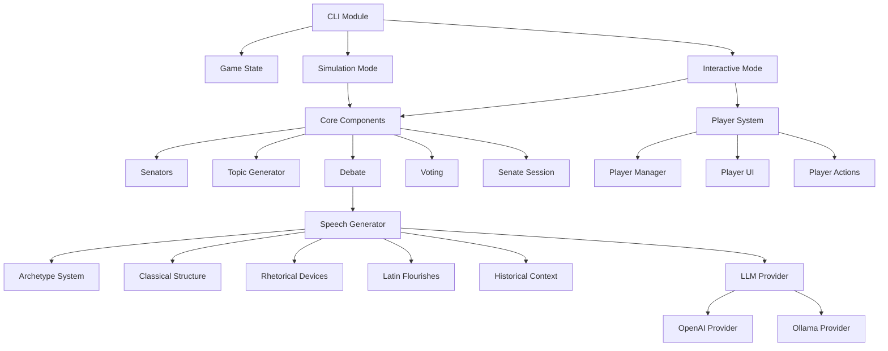
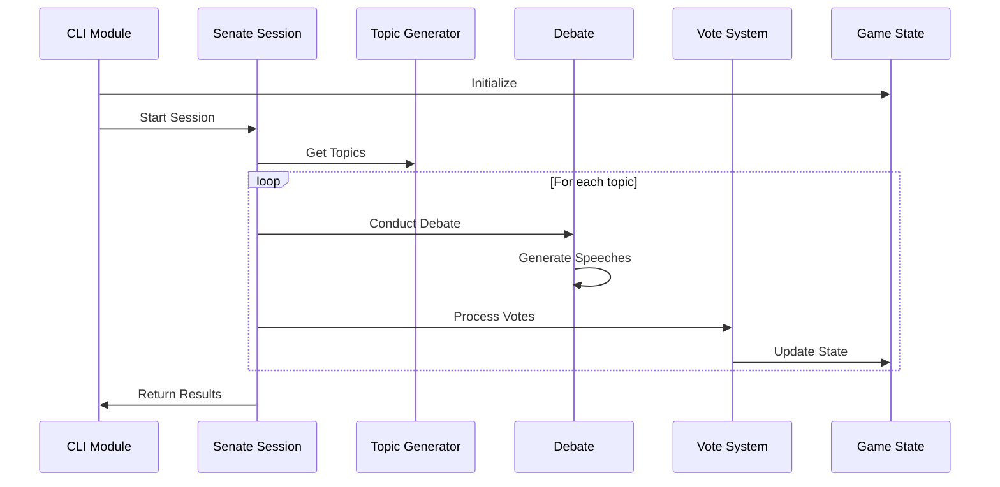
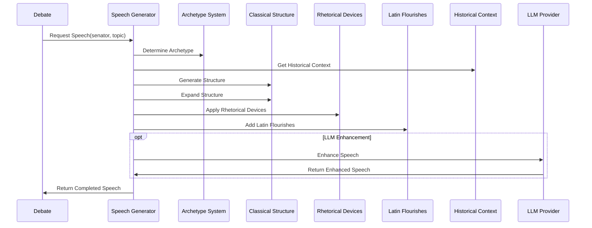
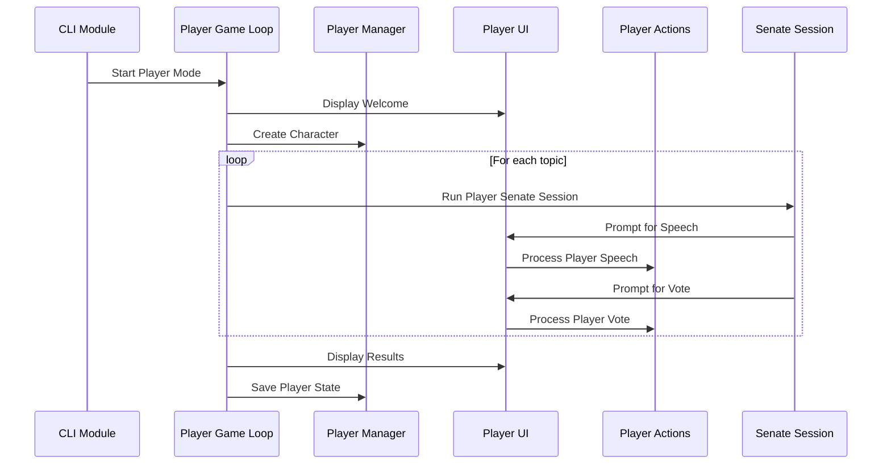

# Roman Senate Game: System Architecture

**Author:** Documentation Team  
**Version:** 1.0.0  
**Date:** April 14, 2025

## Table of Contents
- [Overview](#overview)
- [Core Components](#core-components)
- [Component Relationships](#component-relationships)
- [Data Flow](#data-flow)
- [Extension Points](#extension-points)
- [Technical Considerations](#technical-considerations)

## Overview

The Roman Senate Game is built with a modular architecture that separates core functionality from user interfaces and gameplay modes. This document provides a technical overview of the system architecture for developers who want to understand, modify, or extend the game.

### High-Level Architecture



## Core Components

### Game State (`src/roman_senate/core/game_state.py`)

The Game State module maintains the global state of the game session, including:
- Current year
- Active senators
- Session history
- Global settings

It uses a singleton pattern to ensure consistent state across components.

```python
# Example Game State Interface
game_state.reset()            # Reset all state
game_state.year = -50         # Set year to 50 BCE
senators = game_state.senators # Access current senators
```

### Senators (`src/roman_senate/core/senators.py`)

The Senators module handles:
- Senator generation and initialization
- Senator attributes and properties
- Faction assignments
- Senator behavior patterns

Senator data is structured as dictionaries with consistent keys across the application:

```python
senator = {
    "id": 1,                      # Unique identifier
    "name": "Marcus Tullius",     # Senator name
    "faction": "Optimates",       # Political faction
    "influence": 7,               # Influence level (1-10)
    "traits": {                   # Personality traits
        "eloquence": 0.8,         # Speaking ability (0.0-1.0)
        "corruption": 0.2,        # Moral flexibility (0.0-1.0)
        "loyalty": 0.7            # Faction loyalty (0.0-1.0)
    }
}
```

### Topic Generator (`src/roman_senate/core/topic_generator.py`)

Responsible for:
- Generating historically appropriate debate topics
- Categorizing topics (military, economic, etc.)
- Associating topics with appropriate context

The topic generator is year-aware, creating topics relevant to the configured historical period.

### Debate (`src/roman_senate/core/debate.py`)

Manages the debate process:
- Orchestrates speech turns
- Handles speech generation requests
- Tracks debate state
- Records and analyzes speeches

### Vote (`src/roman_senate/core/vote.py`)

Handles voting mechanics:
- Determines senator voting patterns
- Processes votes
- Calculates outcomes
- Records and displays results

### Senate Session (`src/roman_senate/core/senate_session.py`)

Coordinates a complete senate session:
- Manages attendance
- Presents topics
- Conducts debates
- Processes voting
- Tracks outcomes

## Component Relationships

### Core Component Interactions



### Speech Generation Flow



### Player Interaction Flow



## Data Flow

The Roman Senate Game employs a consistent data flow pattern:

1. **Configuration Data**:
   - Read from configuration files or command-line parameters
   - Flows into the Game State at initialization

2. **Senator Data**:
   - Generated by the Senators module
   - Stored in Game State
   - Accessed by multiple components for behavior determination

3. **Topic Data**:
   - Generated by Topic Generator
   - Passed to Senate Session
   - Flows to Debate and Vote components

4. **Speech Data**:
   - Flows through the Speech Generation pipeline
   - Returns to Debate module
   - Influences Vote behavior
   - Stored in Session history

5. **Vote Data**:
   - Generated by Vote module
   - Updates Game State
   - Displayed to user

6. **Player Data** (Interactive Mode):
   - Captured by Player UI
   - Processed by Player Actions
   - Influences Senate behavior
   - Persisted between sessions

### State Management

The game uses a combination of:
- Global state via singleton pattern (game_state)
- Parameter passing for function-specific data
- Event-based communication for some interactive elements

## Extension Points

The modular design offers several extension points for developers:

### Adding New Senator Archetypes

1. Add new archetype definitions in `archetype_system.py`
2. Define corresponding speech parameters and behaviors

### Creating New Debate Topics

1. Extend topic categories in `topic_generator.py`
2. Add historical context for the topics

### Enhancing the Speech Generation System

1. Add new rhetorical devices in `rhetorical_devices.py`
2. Extend Latin phrases in `latin_flourishes.py`
3. Add new speech structures in `classical_structure.py`

### Expanding Player Mechanics

1. Add new player actions in `player_actions.py`
2. Create new UI elements in `player_ui.py`
3. Extend player attributes in `player.py`

### Adding New Game Modes

1. Create a new command in `cli.py`
2. Implement the game loop similar to existing modes
3. Reuse core components as needed

## Technical Considerations

### LLM Integration

The game supports multiple LLM providers through an abstraction layer:

1. **Provider Interface**: `src/roman_senate/utils/llm/base.py`
2. **Provider Implementations**:
   - OpenAI: `src/roman_senate/utils/llm/openai_provider.py`
   - Ollama: `src/roman_senate/utils/llm/ollama_provider.py`
3. **Factory**: `src/roman_senate/utils/llm/factory.py`

To add a new provider:
- Implement the base interface
- Register in the factory
- Update configuration options

### Asynchronous Operations

The game uses Python's `asyncio` for handling asynchronous operations, particularly:
- LLM API calls
- Parallel speech generation
- UI interactions in player mode

Key considerations:
- Functions that interact with external services are async
- The main game loop manages the async execution context
- Care is needed when mixing sync and async code

### Configuration Management

The game uses a centralized configuration system:
- Core settings in `src/roman_senate/utils/config.py`
- Overridable via command line parameters
- Environment variables for sensitive values (API keys)

## Development Workflow

1. **Understanding Components**: Start by reviewing core components
2. **Testing Modifications**: Use the `senate info` command to verify configuration
3. **Incremental Development**: Make changes to one module at a time
4. **Simulation Testing**: Test changes in simulation mode first
5. **Interactive Testing**: Verify changes work in interactive mode

---

This architecture document provides a high-level overview of the Roman Senate Game's structure. For more detailed information about specific components, refer to the code documentation and component-specific guides.