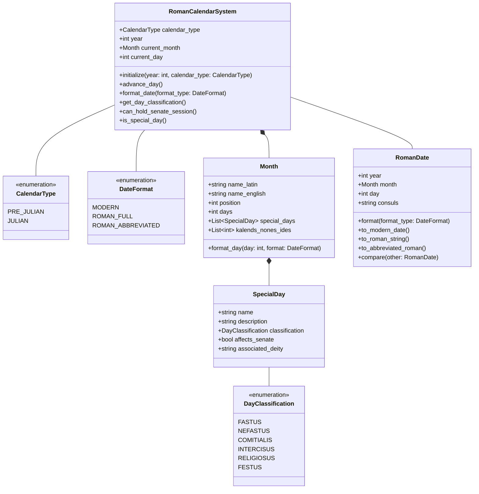
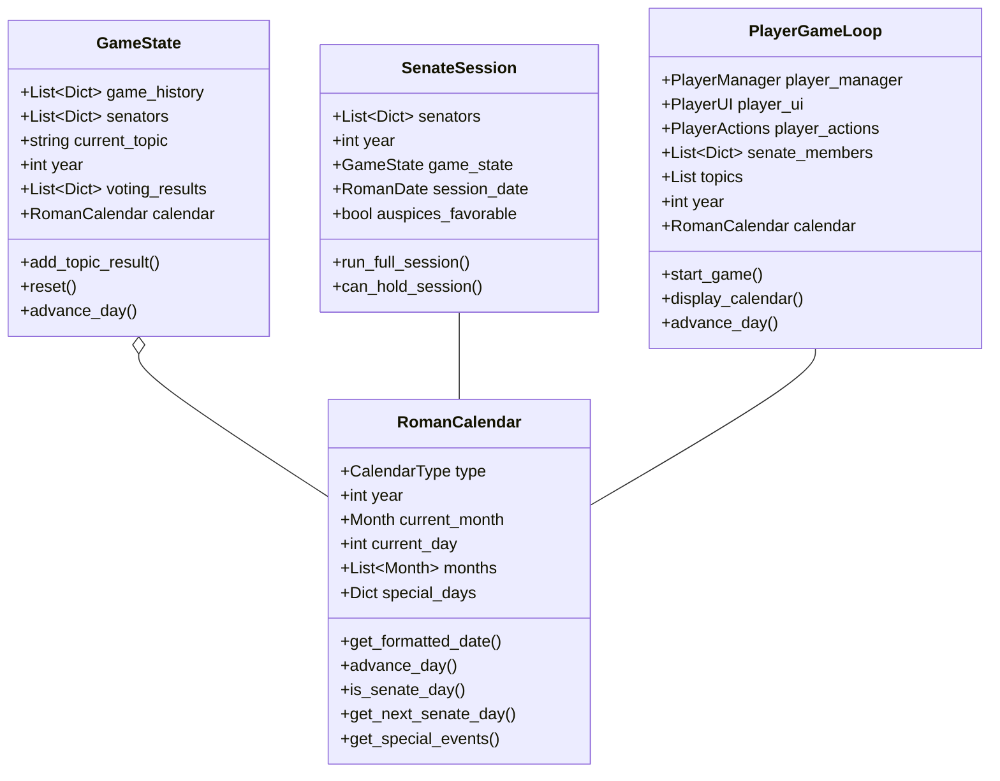

# Roman Calendar System Specification

## 1. Research Findings

The Roman calendar evolved significantly over time, with two major systems:

### Pre-Julian Calendar (Traditional)
- Originally 10 months, later expanded to 12
- Lunar-based with months of varying lengths
- Started with March (Martius) as the first month
- Used intercalary months to align with seasons (added irregularly)
- Years identified by consulships rather than consecutive numbering

### Julian Calendar (Reformed in 45 BCE)
- Solar-based with fixed month lengths
- January (Ianuarius) became the first month
- Standardized month lengths (31/30/28-29 days)
- Added leap year every 4 years

### Date Naming System
Both systems used a complex dating system with three reference points:
- **Kalendae (Kalends)**: First day of each month
- **Nonae (Nones)**: 5th or 7th day (7th in March, May, July, October)
- **Idus (Ides)**: 13th or 15th day (15th in March, May, July, October)

Dates were counted backwards from these reference points. For example, "ante diem III Kalendas Apriles" means "the 3rd day before the Kalends of April" (March 30th).

### Special Day Classifications
- **Dies Fasti (F)**: Days when legal business could be conducted
- **Dies Nefasti (N)**: Days when legal business was forbidden
- **Dies Comitiales (C)**: Days when public assemblies could be held
- **Dies Religiosi**: Unlucky days
- **Dies Festi**: Festival days (sacred to specific deities)

### Senate Meeting Restrictions
- Senate typically met on dies fasti
- Could not meet on dies nefasti or major religious festivals

## 2. Proposed System Architecture



## 3. Integration with Existing Game Architecture



## 4. Data Structures

### 4.1 Calendar Data

```python
# Calendar types enum
class CalendarType(Enum):
    PRE_JULIAN = "pre_julian"
    JULIAN = "julian"

# Date display format enum
class DateFormat(Enum):
    MODERN = "modern"         # e.g., "15 March 100 BCE"
    ROMAN_FULL = "roman_full" # e.g., "ante diem XVI Kalendas Apriles DCLIV AUC"
    ROMAN_ABBREVIATED = "roman_abbreviated" # e.g., "a.d. XVI Kal. Apr."
    CONSULAR = "consular"     # e.g., "In the consulship of Marcus and Gaius"

# Day classification enum
class DayClassification(Enum):
    FASTUS = "F"      # Legal business permitted
    NEFASTUS = "N"    # Legal business forbidden
    COMITIALIS = "C"  # Public assemblies permitted
    INTERCISUS = "IN" # Split day (morning/evening nefastus, midday fastus)
    RELIGIOSUS = "RE" # Unlucky days
    FESTUS = "FE"     # Festival days
```

```python
# Month definitions for pre-Julian calendar
ROMAN_MONTHS_PRE_JULIAN = [
    {
        "name": "Martius", 
        "english": "March", 
        "days": 31, 
        "position": 1,
        "kalends": 1,
        "nones": 7,   # 7th day of March
        "ides": 15    # 15th day of March
    },
    {
        "name": "Aprilis", 
        "english": "April", 
        "days": 29, 
        "position": 2,
        "kalends": 1,
        "nones": 5,   # 5th day
        "ides": 13    # 13th day
    },
    {
        "name": "Maius", 
        "english": "May", 
        "days": 31, 
        "position": 3,
        "kalends": 1,
        "nones": 7,
        "ides": 15
    },
    {
        "name": "Iunius", 
        "english": "June", 
        "days": 29, 
        "position": 4,
        "kalends": 1,
        "nones": 5,
        "ides": 13
    },
    {
        "name": "Quintilis", 
        "english": "July", 
        "days": 31, 
        "position": 5,
        "kalends": 1,
        "nones": 7,
        "ides": 15
    },
    {
        "name": "Sextilis", 
        "english": "August", 
        "days": 29, 
        "position": 6,
        "kalends": 1,
        "nones": 5,
        "ides": 13
    },
    {
        "name": "September", 
        "english": "September", 
        "days": 29, 
        "position": 7,
        "kalends": 1,
        "nones": 5,
        "ides": 13
    },
    {
        "name": "October", 
        "english": "October", 
        "days": 31, 
        "position": 8,
        "kalends": 1,
        "nones": 7,
        "ides": 15
    },
    {
        "name": "November", 
        "english": "November", 
        "days": 29, 
        "position": 9,
        "kalends": 1,
        "nones": 5,
        "ides": 13
    },
    {
        "name": "December", 
        "english": "December", 
        "days": 29, 
        "position": 10,
        "kalends": 1,
        "nones": 5,
        "ides": 13
    },
    {
        "name": "Ianuarius", 
        "english": "January", 
        "days": 29, 
        "position": 11,
        "kalends": 1,
        "nones": 5,
        "ides": 13
    },
    {
        "name": "Februarius", 
        "english": "February", 
        "days": 28, 
        "position": 12,
        "kalends": 1,
        "nones": 5,
        "ides": 13
    }
]

# Month definitions for Julian calendar
ROMAN_MONTHS_JULIAN = [
    {
        "name": "Ianuarius", 
        "english": "January", 
        "days": 31, 
        "position": 1,
        "kalends": 1,
        "nones": 5,
        "ides": 13
    },
    {
        "name": "Februarius", 
        "english": "February", 
        "days": 28,  # 29 in leap years
        "position": 2,
        "kalends": 1,
        "nones": 5,
        "ides": 13
    },
    {
        "name": "Martius", 
        "english": "March", 
        "days": 31, 
        "position": 3,
        "kalends": 1,
        "nones": 7,
        "ides": 15
    },
    # ... and so on
]
```

```python
# Example of special days for March (partial listing)
SPECIAL_DAYS = {
    "Martius": [
        {
            "day": 1, 
            "name": "Kalendae Martiae", 
            "classification": DayClassification.FESTUS,
            "description": "New Year's Day in the ancient calendar, sacred to Mars",
            "deity": "Mars",
            "affects_senate": True,
            "senate_can_meet": False,
            "gameplay_effects": ["increased_military_support", "special_ceremony"]
        },
        {
            "day": 9, 
            "name": "Anna Perenna", 
            "classification": DayClassification.FESTUS,
            "description": "Festival to the goddess Anna Perenna",
            "deity": "Anna Perenna",
            "affects_senate": True,
            "senate_can_meet": False,
            "gameplay_effects": ["public_celebrations", "increased_plebeian_support"]
        },
        {
            "day": 15, 
            "name": "Idus Martiae", 
            "classification": DayClassification.NEFASTUS,
            "description": "The Ides of March, sacred to Jupiter",
            "deity": "Jupiter",
            "affects_senate": False,
            "senate_can_meet": True,
            "gameplay_effects": ["political_tension", "assassination_risk"]
        },
        {
            "day": 17, 
            "name": "Liberalia", 
            "classification": DayClassification.FESTUS,
            "description": "Festival to Liber Pater",
            "deity": "Liber",
            "affects_senate": True,
            "senate_can_meet": False,
            "gameplay_effects": ["coming_of_age_ceremonies", "wine_consumption"]
        },
        # More days would be defined here
    ],
    # Other months would be defined similarly
}

# Define days when regular Senate meetings can occur
SENATE_MEETING_RULES = {
    "allowed_classifications": [
        DayClassification.FASTUS, 
        DayClassification.COMITIALIS
    ],
    "forbidden_days": [
        # List of specific day/month combinations when Senate cannot meet
        {"month": "Martius", "day": 1},  # Kalendae of March
        {"month": "Ianuarius", "day": 1}, # Kalendae of January
        # etc.
    ],
    "exceptions": [
        # List of exceptions when Senate can meet despite normal rules
        {"month": "Martius", "day": 15},  # Ides of March (historical precedent)
    ]
}
```

### 4.2 Core Calendar Classes

```python
class Month:
    """
    Represents a month in the Roman calendar.
    """
    def __init__(self, name, english, days, position, kalends, nones, ides):
        self.name = name                # Latin name (e.g., "Martius")
        self.english = english          # English name (e.g., "March")
        self.days = days                # Number of days in the month
        self.position = position        # Position in the year (1-12)
        self.kalends = kalends          # Day of Kalends (always 1)
        self.nones = nones              # Day of Nones (5th or 7th)
        self.ides = ides                # Day of Ides (13th or 15th)
        self.special_days = []          # List of SpecialDay objects
    
    def get_special_day(self, day):
        """Return special day for the given day number, or None if not special."""
        for special_day in self.special_days:
            if special_day.day == day:
                return special_day
        return None
    
    def day_classification(self, day):
        """Return the classification for the given day."""
        special_day = self.get_special_day(day)
        if special_day:
            return special_day.classification
        # Default classification if no special day is defined
        return DayClassification.FASTUS

class SpecialDay:
    """
    Represents a special day in the Roman calendar.
    """
    def __init__(self, day, name, classification, description, deity=None, 
                 affects_senate=False, senate_can_meet=True, gameplay_effects=None):
        self.day = day                    # Day of the month (1-31)
        self.name = name                  # Name of the special day
        self.classification = classification  # DayClassification enum
        self.description = description    # Description of the day
        self.deity = deity                # Associated deity (if any)
        self.affects_senate = affects_senate  # Whether it affects Senate meetings
        self.senate_can_meet = senate_can_meet  # Whether Senate can meet on this day
        self.gameplay_effects = gameplay_effects or []  # List of gameplay effects
```

```python
class RomanDate:
    """
    Represents a date in the Roman calendar.
    """
    def __init__(self, year, month, day, calendar_type=CalendarType.PRE_JULIAN, consuls=None):
        self.year = year              # Numeric year (negative for BCE)
        self.month = month            # Month object
        self.day = day                # Day of month (1-31)
        self.calendar_type = calendar_type  # CalendarType enum
        self.consuls = consuls or []  # List of consul names for the year
    
    def format(self, format_type=DateFormat.MODERN):
        """Format the date according to the specified format type."""
        if format_type == DateFormat.MODERN:
            return self._format_modern()
        elif format_type == DateFormat.ROMAN_FULL:
            return self._format_roman_full()
        elif format_type == DateFormat.ROMAN_ABBREVIATED:
            return self._format_roman_abbreviated()
        elif format_type == DateFormat.CONSULAR:
            return self._format_consular()
        else:
            raise ValueError(f"Unknown format type: {format_type}")
    
    def _format_modern(self):
        """Format date in modern style: '15 March 100 BCE'"""
        era = "BCE" if self.year < 0 else "CE"
        return f"{self.day} {self.month.english} {abs(self.year)} {era}"
    
    def _format_roman_full(self):
        """Format date in full Roman style."""
        # This is a complex method that needs to handle the count backward from Kalends/Nones/Ides
        if self.day == 1:
            return f"Kalendae {self.month.name}"
        elif self.day == self.month.nones:
            return f"Nonae {self.month.name}"
        elif self.day == self.month.ides:
            return f"Idus {self.month.name}"
        
        # For days before Nones
        if self.day < self.month.nones:
            count = self.month.nones - self.day + 1
            return f"ante diem {self._roman_numeral(count)} Nonas {self.month.name}"
        
        # For days before Ides
        if self.day < self.month.ides:
            count = self.month.ides - self.day + 1
            return f"ante diem {self._roman_numeral(count)} Idus {self.month.name}"
        
        # For days before Kalends of next month
        next_month_idx = (self.month.position % 12) + 1  # Wrap around to January after December
        next_month_name = self._get_month_by_position(next_month_idx).name
        days_in_month = self.month.days
        count = days_in_month - self.day + 2  # +2 because we count inclusively from Kalends
        return f"ante diem {self._roman_numeral(count)} Kalendas {next_month_name}"
    
    def _format_roman_abbreviated(self):
        """Format date in abbreviated Roman style."""
        # Similar to _format_roman_full but with abbreviations
        full = self._format_roman_full()
        
        # Replace keywords with abbreviations
        abbreviations = {
            "ante diem": "a.d.",
            "Kalendae": "Kal.",
            "Nonas": "Non.",
            "Idus": "Id.",
            "Kalendas": "Kal."
        }
        
        for full_text, abbr in abbreviations.items():
            full = full.replace(full_text, abbr)
        
        # Abbreviate month names (take first 3 letters)
        for month_data in (ROMAN_MONTHS_PRE_JULIAN + ROMAN_MONTHS_JULIAN):
            month_name = month_data["name"]
            if month_name in full:
                full = full.replace(month_name, month_name[:3] + ".")
        
        return full
    
    def _format_consular(self):
        """Format date using the consulship year."""
        if not self.consuls or len(self.consuls) == 0:
            return f"In an unknown consulship, {abs(self.year)} BCE" if self.year < 0 else f"In an unknown consulship, {self.year} CE"
        
        if len(self.consuls) == 1:
            return f"In the consulship of {self.consuls[0]}, {abs(self.year)} BCE" if self.year < 0 else f"In the consulship of {self.consuls[0]}, {self.year} CE"
        
        return f"In the consulship of {self.consuls[0]} and {self.consuls[1]}, {abs(self.year)} BCE" if self.year < 0 else f"In the consulship of {self.consuls[0]} and {self.consuls[1]}, {self.year} CE"
    
    def _roman_numeral(self, num):
        """Convert an integer to a Roman numeral string."""
        # Implementation of converting numbers to Roman numerals
        val = [
            1000, 900, 500, 400,
            100, 90, 50, 40,
            10, 9, 5, 4,
            1
        ]
        syms = [
            "M", "CM", "D", "CD",
            "C", "XC", "L", "XL",
            "X", "IX", "V", "IV",
            "I"
        ]
        roman_num = ''
        i = 0
        while num > 0:
            for _ in range(num // val[i]):
                roman_num += syms[i]
                num -= val[i]
            i += 1
        return roman_num
    
    def _get_month_by_position(self, position):
        """Helper method to get a Month object by its position."""
        months = ROMAN_MONTHS_PRE_JULIAN if self.calendar_type == CalendarType.PRE_JULIAN else ROMAN_MONTHS_JULIAN
        for month_data in months:
            if month_data["position"] == position:
                return Month(
                    month_data["name"], 
                    month_data["english"], 
                    month_data["days"], 
                    month_data["position"],
                    month_data["kalends"],
                    month_data["nones"],
                    month_data["ides"]
                )
        raise ValueError(f"No month found at position {position}")
```

```python
class RomanCalendar:
    """
    Main calendar system that manages dates and transitions.
    """
    def __init__(self, year, calendar_type=CalendarType.PRE_JULIAN):
        self.year = year
        self.calendar_type = calendar_type
        
        # Determine which calendar system to use based on year
        if year >= -45 and calendar_type == CalendarType.PRE_JULIAN:
            self.calendar_type = CalendarType.JULIAN
        
        # Initialize months based on calendar type
        if self.calendar_type == CalendarType.PRE_JULIAN:
            self.months = self._initialize_months(ROMAN_MONTHS_PRE_JULIAN)
            self.current_month_idx = 0  # Martius (March) is first month in pre-Julian
        else:
            self.months = self._initialize_months(ROMAN_MONTHS_JULIAN)
            self.current_month_idx = 0  # Ianuarius (January) is first month in Julian
        
        self.current_month = self.months[self.current_month_idx]
        self.current_day = 1  # Start on the first day
        
        # Generate consuls for the year (this would come from a database or config)
        self.consuls = self._generate_consuls()
    
    def _initialize_months(self, month_data_list):
        """Initialize Month objects with special days."""
        months = []
        for month_data in month_data_list:
            month = Month(
                month_data["name"],
                month_data["english"],
                month_data["days"],
                month_data["position"],
                month_data["kalends"],
                month_data["nones"],
                month_data["ides"]
            )
            
            # Add special days for this month
            if month.name in SPECIAL_DAYS:
                for special_day_data in SPECIAL_DAYS[month.name]:
                    special_day = SpecialDay(
                        day=special_day_data["day"],
                        name=special_day_data["name"],
                        classification=special_day_data["classification"],
                        description=special_day_data["description"],
                        deity=special_day_data.get("deity"),
                        affects_senate=special_day_data.get("affects_senate", False),
                        senate_can_meet=special_day_data.get("senate_can_meet", True),
                        gameplay_effects=special_day_data.get("gameplay_effects", [])
                    )
                    month.special_days.append(special_day)
            
            months.append(month)
        return months
    
    def _generate_consuls(self):
        """Generate consul names for the current year."""
        # This would ideally pull from a historical database
        # For now, use placeholder names based on the year
        consuls = []
        abs_year = abs(self.year)
        
        if self.year == -100:
            consuls = ["Gaius Marius", "Lucius Valerius Flaccus"]
        elif self.year == -99:
            consuls = ["Marcus Antonius", "Aulus Postumius Albinus"]
        elif self.year == -63:
            consuls = ["Marcus Tullius Cicero", "Gaius Antonius Hybrida"]
        elif self.year == -59:
            consuls = ["Gaius Julius Caesar", "Marcus Calpurnius Bibulus"]
        else:
            # Generate placeholders for years without specific historical data
            praenomina = ["Gaius", "Marcus", "Lucius", "Quintus", "Publius"]
            nomina = ["Julius", "Claudius", "Cornelius", "Valerius", "Fabius"]
            cognomina = ["Maximus", "Rufus", "Felix", "Bassus", "Severus"]
            
            # Seed the RNG with the year for consistency
            import random
            rng = random.Random(abs_year)
            
            for i in range(2):  # Two consuls
                praenomen = rng.choice(praenomina)
                nomen = rng.choice(nomina)
                cognomen = rng.choice(cognomina)
                consuls.append(f"{praenomen} {nomen} {cognomen}")
        
        return consuls
    
    def get_current_date(self):
        """Get the current date as a RomanDate object."""
        return RomanDate(
            year=self.year,
            month=self.current_month,
            day=self.current_day,
            calendar_type=self.calendar_type,
            consuls=self.consuls
        )
    
    def format_current_date(self, format_type=DateFormat.MODERN):
        """Format the current date using the specified format."""
        date = self.get_current_date()
        return date.format(format_type)
    
    def advance_day(self, days=1):
        """
        Advance the calendar by the specified number of days.
        Returns a list of special days encountered.
        """
        special_days_encountered = []
        
        for _ in range(days):
            # Check if current day is special before advancing
            special_day = self.current_month.get_special_day(self.current_day)
            if special_day:
                special_days_encountered.append(special_day)
            
            # Advance to next day
            self.current_day += 1
            
            # Check if we need to move to the next month
            if self.current_day > self.current_month.days:
                self.current_day = 1
                self.current_month_idx = (self.current_month_idx + 1) % len(self.months)
                self.current_month = self.months[self.current_month_idx]
                
                # If we've wrapped around to the first month, increment the year
                if self.current_month_idx == 0:
                    self.year += 1
                    # Check if we need to switch calendar systems
                    if self.year == -45 and self.calendar_type == CalendarType.PRE_JULIAN:
                        self.calendar_type = CalendarType.JULIAN
                        self.months = self._initialize_months(ROMAN_MONTHS_JULIAN)
                        self.current_month = self.months[0]  # Ianuarius
                    
                    # Update consuls for the new year
                    self.consuls = self._generate_consuls()
        
        return special_days_encountered
    
    def can_hold_senate_session(self):
        """
        Check if the Senate can meet on the current day.
        Returns (bool, reason) tuple.
        """
        # Check if it's a special day that affects the Senate
        special_day = self.current_month.get_special_day(self.current_day)
        if special_day and special_day.affects_senate:
            if not special_day.senate_can_meet:
                return False, f"The Senate cannot meet during {special_day.name} ({special_day.description})"
        
        # Check day classification
        day_class = self.current_month.day_classification(self.current_day)
        if day_class not in SENATE_MEETING_RULES["allowed_classifications"]:
            return False, f"The Senate cannot meet on a dies {day_class.name.lower()} day"
        
        # Check specific forbidden days
        for forbidden in SENATE_MEETING_RULES["forbidden_days"]:
            if forbidden["month"] == self.current_month.name and forbidden["day"] == self.current_day:
                return False, f"The Senate traditionally does not meet on this day"
        
        # Check exceptions
        for exception in SENATE_MEETING_RULES["exceptions"]:
            if exception["month"] == self.current_month.name and exception["day"] == self.current_day:
                return True, "The Senate can meet due to exceptional circumstances"
        
        return True, "The Senate can meet on this day"
    
    def get_next_senate_day(self):
        """
        Find the next day when the Senate can meet.
        Returns a RomanDate object.
        """
        # Create a copy of the current calendar state
        temp_calendar = RomanCalendar(self.year, self.calendar_type)
        temp_calendar.current_month_idx = self.current_month_idx
        temp_calendar.current_month = self.months[self.current_month_idx]
        temp_calendar.current_day = self.current_day
        temp_calendar.consuls = self.consuls.copy()
        
        # Advance days until we find a valid Senate day
        max_days_to_check = 30  # Prevent infinite loop
        for i in range(1, max_days_to_check + 1):
            temp_calendar.advance_day()
            can_meet, _ = temp_calendar.can_hold_senate_session()
            if can_meet:
                return temp_calendar.get_current_date()
        
        # If we couldn't find a day within the limit, return None
        return None
    
    def get_special_events_for_current_day(self):
        """Get special events for the current day."""
        special_day = self.current_month.get_special_day(self.current_day)
        if not special_day:
            return []
        
        return [
            {
                "name": special_day.name,
                "description": special_day.description,
                "deity": special_day.deity,
                "effects": special_day.gameplay_effects
            }
        ]
```

## 5. Integration with Existing Code

### 5.1 GameState Updates

```python
# Add these to game_state.py
from .roman_calendar import RomanCalendar, CalendarType

class GameState:
    """
    Manages global game state for the Roman Senate simulation.
    Stores information about senators, topics, votes, and game history.
    """
    
    def __init__(self):
        """Initialize a new game state."""
        self.game_history = []
        self.senators = []
        self.current_topic = None
        self.year = None
        self.voting_results = []
        self.calendar = None  # New calendar attribute
        
    def initialize_calendar(self, year=None, calendar_type=None):
        """Initialize the Roman calendar with the current game year."""
        if year is None:
            year = self.year or -100  # Default to 100 BCE
        
        # Determine calendar type based on year if not specified
        if calendar_type is None:
            calendar_type = CalendarType.JULIAN if year >= -45 else CalendarType.PRE_JULIAN
        
        self.calendar = RomanCalendar(year, calendar_type)
        return self.calendar
    
    def advance_day(self, days=1):
        """
        Advance the calendar by the specified number of days.
        Returns a list of special days encountered.
        """
        if self.calendar is None:
            self.initialize_calendar()
        
        return self.calendar.advance_day(days)
    
    def get_formatted_date(self, format_type=DateFormat.MODERN):
        """Get the current date formatted according to the specified type."""
        if self.calendar is None:
            self.initialize_calendar()
        
        return self.calendar.format_current_date(format_type)
    
    def can_hold_senate_session(self):
        """Check if a senate session can be held on the current day."""
        if self.calendar is None:
            self.initialize_calendar()
        
        return self.calendar.can_hold_senate_session()
    
    # Updated reset method to initialize calendar
    def reset(self, year=None):
        """Reset the game state for a new session."""
        old_year = self.year
        self.__init__()
        self.year = year or old_year or -100
        self.initialize_calendar(self.year)
```

### 5.2 SenateSession Updates

```python
# Add to senate_session.py

def __init__(self, senators_list: List[Dict], year: int, game_state: Any, test_mode: bool = False):
    """
    Initialize a new Senate session.
    
    Args:
        senators_list: List of senator dictionaries with their attributes
        year: Current year in the game (negative for BCE)
        game_state: The global game state object
        test_mode: Whether to run in non-interactive test mode
    """
    # Existing code...
    self.year = year
    self.game_state = game_state
    self.year_display = f"{abs(year)} BCE"
    self.presiding_magistrate = self._select_presiding_magistrate()
    
    # New code for calendar integration
    if not hasattr(game_state, 'calendar') or game_state.calendar is None:
        game_state.initialize_calendar(year)
    
    self.session_date = game_state.calendar.get_current_date()
    
    # Check if session can be held today
    can_meet, reason = game_state.calendar.can_hold_senate_session()
    if not can_meet and not test_mode:
        console.print(f"[bold red]WARNING:[/] {reason}")
        console.print(f"The next available senate day would be:")
        next_date = game_state.calendar.get_next_senate_day()
        console.print(f"[bold cyan]{next_date.format(DateFormat.ROMAN_FULL)}[/]")
        console.print(f"([italic]{next_date.format(DateFormat.MODERN)}[/])")
        
        # In a real implementation, you might want to prompt the user:
        # if not Confirm.ask("Proceed with session anyway?", default=False):
        #     raise ValueError("Cannot hold senate session on this day")
    
    # Check for special events
    special_events = game_state.calendar.get_special_events_for_current_day()
    for event in special_events:
        console.print(f"[bold yellow]Special Event:[/] {event['name']}")
        console.print(f"[italic]{event['description']}[/]")
        
        # Apply gameplay effects based on the event
        if "increased_military_support" in event.get("effects", []):
            # Example: Modify the attendance of military-supporting senators
            self.auspices_favorable = random.random() > 0.2  # 80% favorable on military days
```

### 5.3 Update run_session Function

```python
# Update in senate_session.py

async def run_session(senators_count: int = 10, debate_rounds: int = 3, topics_count: int = 3, year: int = None, test_mode: bool = False) -> List[Dict]:
    """
    Run a complete senate session with the specified parameters.
    
    Args:
        senators_count: Number of senators to create
        debate_rounds: Number of debate rounds per topic
        topics_count: Number of topics to debate
        year: Year to set for the session (negative for BCE)
        test_mode: Whether to run in non-interactive test mode
        
    Returns:
        List of results for all topics
    """
    # Reset game state
    game_state.reset()
    
    # Set default year if not provided (100 BCE)
    if year is None:
        year = -100
    
    game_state.year = year
    
    # Initialize calendar
    game_state.initialize_calendar(year)
    
    # Display current date
    roman_date = game_state.calendar.format_current_date(DateFormat.ROMAN_FULL)
    modern_date = game_state.calendar.format_current_date(DateFormat.MODERN)
    console.print(f"\n[bold cyan]Current Date: {roman_date}[/]")
    console.print(f"[italic]({modern_date})[/]")
    
    # For special days, display information
    special_events = game_state.calendar.get_special_events_for_current_day()
    if special_events:
        for event in special_events:
            console.print(f"[bold yellow]Today is {event['name']}[/]")
            console.print(f"[italic]{event['description']}[/]")
    
    # Initialize senators
    senate_members = senators.initialize_senate(senators_count)
    game_state.senators = senate_members
    
    # Continue with existing code...
    
    # After session concludes
    # Advance the day
    game_state.advance_day()
    console.print(f"\n[bold cyan]A new day begins: {game_state.get_formatted_date(DateFormat.ROMAN_FULL)}[/]")
    console.print(f"[italic]({game_state.get_formatted_date(DateFormat.MODERN)})[/]")
```

### 5.4 Update PlayerGameLoop

```python
# Update in player_game_loop.py

async def start_game(self, senators_count: int = 10, topics_count: int = 3, year: int = -100):
    """
    Start a new player game session.
    
    Args:
        senators_count: Number of NPC senators to create
        topics_count: Number of topics to debate
        year: Year to set for the session (negative for BCE)
    """
    # Display welcome screen
    self.player_ui.display_welcome()
    
    # Initialize game state
    game_state.reset()
    game_state.year = year
    self.year = year
    
    # Initialize calendar
    game_state.initialize_calendar(year)
    
    # Display calendar information
    self.display_calendar_info()
    
    # Character creation
    player = self.create_character()
    self.player_ui.set_player(player)
    self.player_actions = PlayerActions(player, self.player_ui)
    
    # Continue with the rest of the code...

def display_calendar_info(self):
    """Display information about the current date and special events."""
    calendar = game_state.calendar
    
    # Show the date in different formats
    console.print("\n[bold cyan]Current Date:[/]")
    console.print(f"Roman Full: [bold]{calendar.format_current_date(DateFormat.ROMAN_FULL)}[/]")
    console.print(f"Roman Abbreviated: [italic]{calendar.format_current_date(DateFormat.ROMAN_ABBREVIATED)}[/]")
    console.print(f"Modern: {calendar.format_current_date(DateFormat.MODERN)}")
    console.print(f"Consular: {calendar.format_current_date(DateFormat.CONSULAR)}")
    
    # Check if Senate can meet today
    can_meet, reason = calendar.can_hold_senate_session()
    if can_meet:
        console.print(f"[bold green]Senate Status:[/] {reason}")
    else:
        console.print(f"[bold red]Senate Status:[/] {reason}")
    
    # Display special events
    special_events = calendar.get_special_events_for_current_day()
    if special_events:
        console.print("\n[bold yellow]Special Events Today:[/]")
        for event in special_events:
            console.print(f"[bold]{event['name']}[/]: {event['description']}")
            if event.get('deity'):
                console.print(f"Sacred to: {event['deity']}")
            if event.get('effects'):
                console.print(f"Effects: {', '.join(event['effects'])}")
```

### 5.5 Update in Persistence Module

```python
# Update in persistence.py

def serialize_game_state(game_state: GameState) -> Dict[str, Any]:
    """
    Serialize the game state object to a dictionary.
    
    Args:
        game_state: The GameState object to serialize
        
    Returns:
        Dictionary representation of the game state
    """
    state_dict = {
        "game_history": game_state.game_history,
        "current_topic": game_state.current_topic,
        "year": game_state.year,
        "voting_results": game_state.voting_results,
        "senators": [serialize_senator(senator) for senator in game_state.senators],
        # Add calendar serialization
        "calendar": serialize_calendar(game_state.calendar) if game_state.calendar else None
    }
    return state_dict

def deserialize_game_state(state_dict: Dict[str, Any]) -> None:
    """
    Deserialize a game state dictionary into the global game state.
    
    Args:
        state_dict: Dictionary containing the game state data
    """
    # Reset the game state
    game_state.reset()
    
    # Set basic properties
    game_state.game_history = state_dict.get("game_history", [])
    game_state.current_topic = state_dict.get("current_topic")
    game_state.year = state_dict.get("year")
    game_state.voting_results = state_dict.get("voting_results", [])
    
    # Deserialize senators
    senator_dicts = state_dict.get("senators", [])
    game_state.senators = [deserialize_senator(senator_dict) for senator_dict in senator_dicts]
    
    # Deserialize calendar
    calendar_dict = state_dict.get("calendar")
    if calendar_dict:
        deserialize_calendar(game_state, calendar_dict)

def serialize_calendar(calendar) -> Dict[str, Any]:
    """Serialize the calendar object to a dictionary."""
    if not calendar:
        return None
    
    return {
        "year": calendar.year,
        "calendar_type": calendar.calendar_type.value,
        "current_month_idx": calendar.current_month_idx,
        "current_day": calendar.current_day,
        "consuls": calendar.consuls
    }

def deserialize_calendar(game_state, calendar_dict: Dict[str, Any]) -> None:
    """Deserialize a calendar dictionary into the game state."""
    from .roman_calendar import CalendarType
    
    year = calendar_dict.get("year", game_state.year)
    calendar_type_str = calendar_dict.get("calendar_type", "pre_julian")
    calendar_type = CalendarType.PRE_JULIAN if calendar_type_str == "pre_julian" else CalendarType.JULIAN
    
    # Initialize the calendar
    game_state.initialize_calendar(year, calendar_type)
    
    # Set the current state
    game_state.calendar.current_month_idx = calendar_dict.get("current_month_idx", 0)
    game_state.calendar.current_month = game_state.calendar.months[game_state.calendar.current_month_idx]
    game_state.calendar.current_day = calendar_dict.get("current_day", 1)
    game_state.calendar.consuls = calendar_dict.get("consuls", [])
```

## 6. Implementation Notes

### 6.1 Special Day Effects

The calendar system includes `gameplay_effects` in special days that can influence various game mechanics:

1. **Attendance Effects**
   - Religious festivals might lower attendance
   - Military holidays might increase attendance of military-aligned senators

2. **Voting Patterns**
   - Certain days may favor particular factions
   - Religious days might align voting with deities' domains

3. **Auspices and Omens**
   - Special days can affect the auspices_favorable variable
   - Certain days might have higher chances of unfavorable omens

4. **Debate Modifications**
   - Speaking order might be affected by religious observances
   - Certain senators might gain bonuses on days sacred to their patron deities

### 6.2 Historical Accuracy

The calendar data should be populated with historically accurate information:

1. **Consuls**
   - The system can be expanded to include a database of historical consuls for known years
   - For unknown years, the system generates plausible names

2. **Special Days**
   - Major Roman festivals and religious observances
   - Historical events relevant to the game's timeframe

3. **Calendar Transitions**
   - The Julian calendar reform in 45 BCE should be handled correctly
   - Leap years in the Julian system (every 4 years)

### 6.3 Performance Considerations

- Calendar data structures are largely static and can be loaded once at initialization
- Special day effects are computed only when needed
- The system should avoid recalculating Roman date formats unnecessarily