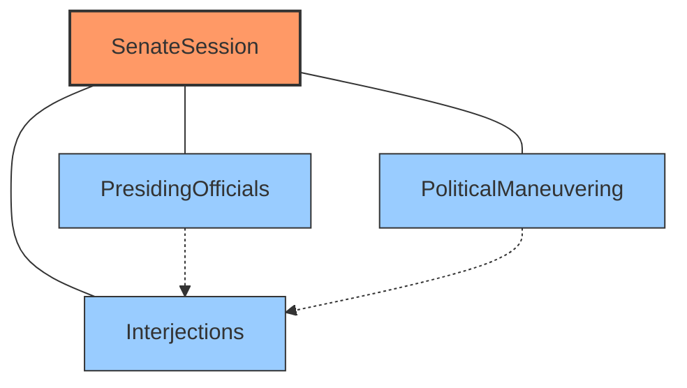

# Roman Senate Game Components

**Author:** Documentation Team  
**Date:** April 13, 2025  
**Version:** 1.0.0  

## Overview

The Roman Senate Game is built with four key components that work together to create a historically accurate and immersive simulation of the Roman Senate. Each component focuses on a specific aspect of Roman Senate proceedings, from formal procedures to behind-the-scenes politics.

## Component Documentation

| Component | Description | Documentation |
|-----------|-------------|---------------|
| **SenateSession** | The core orchestrator that manages the complete flow of a Senate session from opening ceremonies to adjournment | [SenateSession Documentation](senate_session.md) |
| **PresidingOfficials** | Manages the magistrates who presided over Senate sessions, including their selection, personalities, and rulings | [PresidingOfficials Documentation](presiding_officials.md) |
| **Interjections** | Adds dynamic interactions during Senate debates through various types of interruptions by other senators | [Interjections Documentation](interjections.md) |
| **PoliticalManeuvering** | Simulates the behind-the-scenes negotiations, faction politics, and favor trading central to Roman political life | [PoliticalManeuvering Documentation](political_maneuvering.md) |

## Component Integration

These components are designed to work together seamlessly, creating a comprehensive simulation of both the formal proceedings and informal aspects of Roman politics:

The SenateSession acts as the central coordinator, while the other components provide specialized functionality that enhances different aspects of the simulation.

## Key Interactions

- **SenateSession + PresidingOfficials**: Determines who presides over the session and how they manage the proceedings
- **SenateSession + Interjections**: Creates dynamic, interactive debates with realistic interruptions
- **SenateSession + PoliticalManeuvering**: Incorporates backroom dealings and amendments into the formal process
- **PresidingOfficials + Interjections**: Officials respond to procedural objections raised during debates
- **PoliticalManeuvering + Interjections**: Political relationships influence the likelihood and type of interjections

These interactions create a rich, historically accurate simulation that captures both the formal and informal aspects of Roman Senate proceedings.