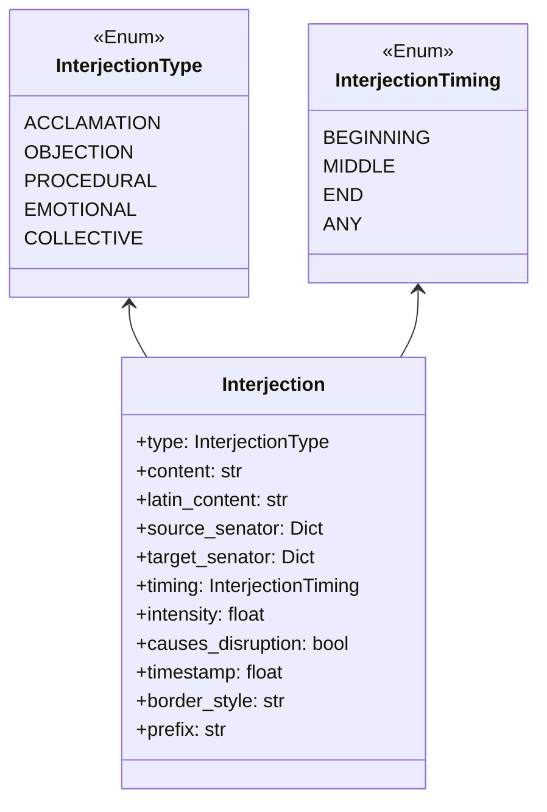

# Interjections Component

**Author:** Documentation Team  
**Date:** April 13, 2025  
**Version:** 1.0.0  

## Table of Contents

1. [Overview](#overview)
2. [Historical Context](#historical-context)
3. [Component Architecture](#component-architecture)
4. [Interjection Types](#interjection-types)
5. [Key Functions](#key-functions)
6. [Interjection Generation System](#interjection-generation-system)
7. [Integration Points](#integration-points)
8. [Historical Accuracy Features](#historical-accuracy-features)

## Overview

The `Interjections` component (implemented in `interjections.py`) adds dynamic interactions to Senate debates through various types of interruptions, objections, acclamations, and procedural challenges. It transforms what could be a static debate into a lively, historically accurate recreation of the often contentious atmosphere of the Roman Senate.

This component simulates how senators would react to speeches in real-time, incorporating both formal procedural aspects (like points of order) and emotional responses (like outbursts of support or opposition), all informed by senator relationships, faction alignments, and personality traits.

## Historical Context

The Roman Senate was not a quiet, formal body where senators spoke without interruption. Historical accounts indicate debates were often lively affairs with:

- Vocal acclamations of support (*acclamationes*) for popular speakers or ideas
- Heckling and objections during controversial proposals
- Formal procedural challenges and points of order
- Emotional outbursts based on personal and factional rivalries
- Collective responses from groups of senators

These dynamics reflect the intensely personal nature of Roman politics, where relationships, honor, and factional loyalties strongly influenced behavior. The Interjections component recreates these aspects, which are often missing from simplified portrayals of Roman political proceedings.

## Component Architecture

The Interjections module uses several key classes and functions to implement its system:



**Key Supporting Functions:**
- `generate_interjection()`: Creates individual senator interjections
- `process_crowd_reaction()`: Generates collective Senate reactions
- `handle_procedural_objection()`: Creates and resolves procedural challenges
- `display_interjection()`: Presents interjections visually
- `integrate_with_debate()`: Main integration point with debate system

## Interjection Types

The component implements five historically authentic types of Senate interruptions:

### 1. Acclamations (ACCLAMATION)

Vocal expressions of approval or support for a speaker or proposal.

**Historical Context:** Romans regularly used formulaic expressions of support during speeches, such as "*Bene!*" (Well said!) or "*Recte!*" (Correct!).

**Implementation:**
- More common from same-faction senators
- Displayed with green styling
- Often uses formal Latin phrases of approval
- Rarely disruptive to proceedings
- Generally strengthens relationships between senators

**Example:** "*Bene dictum, Gaius Marius! Sapienter loqueris.*" (Well said, Gaius Marius! You speak wisely.)

### 2. Objections (OBJECTION)

Expressions of disagreement, challenges, or heckling during speeches.

**Historical Context:** Opposition could be vocal and direct in the Senate, with senators sometimes loudly objecting to proposals they disliked.

**Implementation:**
- More common from opposing factions or personal rivals
- Displayed with red styling
- Can range from mild disagreement to forceful challenges
- May disrupt proceedings if particularly intense
- Often strains relationships between senators

**Example:** "*Verba tua veritatem torquent, Marcus!*" (Your words twist the truth, Marcus!)

### 3. Procedural Points (PROCEDURAL)

Formal challenges to the process or conduct of Senate business.

**Historical Context:** The Senate operated with complex procedural rules, and senators could raise points of order about proper conduct.

**Implementation:**
- Can come from any senator regardless of factional alignment
- Displayed with yellow styling
- Requires ruling from the presiding official
- Always causes some disruption to normal debate flow
- Impact on relationships depends on the ruling outcome

**Example:** "*Ad ordinem! Senator tempus concessum excedit.*" (Point of order! The senator exceeds the allotted time.)

### 4. Emotional Outbursts (EMOTIONAL)

Strong reactions based on personal relationships or deeply held views.

**Historical Context:** Roman politics was intensely personal, and emotional responses based on friendships, rivalries, or family ties were common.

**Implementation:**
- Heavily influenced by senator relationships and history
- Displayed with magenta styling
- More intense and less formal than other interjections
- Very disruptive if intense enough
- Significant impact on relationships

**Example:** "*Non possum silere dum Antonius falsa disseminat!*" (I cannot remain silent as Antonius spreads falsehoods!)

### 5. Collective Reactions (COLLECTIVE)

Group responses from multiple senators at once.

**Historical Context:** The Senate as a body would sometimes react collectively with murmurs, shouts, or gestures.

**Implementation:**
- Represents multiple senators reacting simultaneously
- Displayed with cyan styling
- Generated based on faction alignments and speech quality
- Can represent approval, disapproval, or mixed reactions
- Particularly disruptive at high intensity levels

**Example:** "*Murmura improbationis ex Optimatibus in curia audiuntur.*" (Disapproving murmurs from the Optimates can be heard in the chamber.)

## Key Functions

### Interjection Generation

#### `generate_interjection(senator, speech, context, previous_interjections)`

Creates an appropriate interjection based on a senator's reaction to a speech.

- Evaluates if a senator might interject based on personality traits and relationships
- Determines the type of interjection based on faction alignment and personal connections
- Selects appropriate timing within the speech
- Generates both Latin and English content for historical authenticity
- Sets interjection intensity based on relationship strength
- Determines if the interjection disrupts debate flow
- Potentially updates relationships if highly disruptive

```python
# Simplified example of how interjection generation is determined
base_probability = 0.15  # Base chance for any interjection
# Adjust for senator traits
if "traits" in senator:
    if "eloquence" in traits:
        base_probability += traits["eloquence"] * 0.1
    if "corruption" in traits:
        base_probability += traits["corruption"] * 0.05
    # ... more trait adjustments ...

# Adjust for relationships
relationship = senator_relationships[source_id][target_id]
relationship_factor = abs(relationship) * 0.2
base_probability += relationship_factor
```

#### `process_crowd_reaction(speech, senators, context)`

Generates collective reactions from the Senate body to a speech.

- Calculates chance of crowd reaction based on speech quality and controversy
- Determines general sentiment by counting senators by faction
- Identifies which factions likely support or oppose the speech
- Sets reaction type (acclamation or objection) based on overall support
- Generates appropriate Latin and English crowd reaction text
- Sets intensity based on how unified the reaction is

#### `handle_procedural_objection(senator, speech, officials)`

Creates and resolves a procedural objection or point of order.

- Generates a historically authentic procedural objection
- Creates the formal interjection with Latin text
- Requests a ruling from the presiding official
- Processes the ruling's impact on relationships
- Returns both the interjection and the official's ruling

### Display and Integration

#### `display_interjection(interjection, timing)`

Displays an interjection in a visually distinct way in the console.

- Formats the interjection based on type (color, border style)
- Creates title based on interjection type and intensity
- Shows both Latin and English text for authenticity
- Adds additional pause and notification for disruptive interjections

#### `integrate_with_debate(speech, speaking_senator, all_senators, officials, context)`

Main integration point with the debate module.

- Identifies non-speaking senators who might interject
- Calculates appropriate number of interjections based on speech quality and length
- Processes individual senator interjections
- Handles procedural objections and displays official rulings
- Potentially adds crowd reactions
- Returns complete interjection results with their impacts

## Interjection Generation System

The component uses a sophisticated system to generate realistic, contextually appropriate interjections:

### Probability Factors

Multiple factors influence whether a senator will interject:

- **Personality Traits**:
  - More eloquent senators are more likely to speak up
  - More corrupt senators are more likely to interrupt
  - Loyal senators are more likely to support same-faction speakers

- **Relationships**:
  - Strong feelings (positive or negative) increase chance of interjection
  - Senators are more likely to respond to those they have strong relationships with

- **Faction Alignment**:
  - Same-faction senators more likely to acclaim
  - Opposing faction senators more likely to object
  - Cross-faction agreements or disputes reflected in interjection types

### Content Generation

Interjection content is generated based on:

- **Type**: Different types have distinct language patterns
- **Relationship**: Positive or negative relationship affects tone
- **Historical Context**: Uses authentic Roman expressions and concerns
- **Latin Translation**: Each English interjection has a matching Latin equivalent

The system includes over 25 unique Latin phrases across different interjection types, such as:

- "*Bene dictum!*" (Well said!)
- "*Vehementer dissentio!*" (I strongly disagree!)
- "*Ad ordinem!*" (Point of order!)
- "*Senatores 'Recte!' et 'Bene!' clamant.*" (Senators cry 'Correct!' and 'Good!')

### Disruption Mechanics

Certain interjections can disrupt the normal flow of debate:

- Procedural points always cause some disruption
- High-intensity objections are disruptive
- Intense emotional outbursts disrupt proceedings
- Disruptions affect relationships between senators
- Disruptions may require rulings from presiding officials

This creates dynamic, unpredictable debate sessions that mirror the sometimes chaotic nature of real Senate proceedings.

## Integration Points

The Interjections component integrates with other components at several key points:

### Integration with SenateSession

- During the `_conduct_debate_with_interjections()` method in SenateSession
- As speeches are generated and displayed
- Affecting the flow and tone of debates
- Contributing to debate summaries

### Integration with PresidingOfficials

- When procedural objections require official rulings
- Officials' personality affects their responses to disruptions
- Rulings can validate or reject procedural challenges
- Official responses are displayed to provide resolution

### Integration with Debate System

- Accesses senator relationship data to determine interjection likelihood
- Updates relationships based on interjections and rulings
- Adds emotions to senators based on how they're treated
- Incorporates faction dynamics in determining reaction types

## Historical Accuracy Features

The Interjections component implements numerous historical details for authenticity:

### Authentic Latin Expressions

The component uses historically accurate Latin phrases for different types of interjections:

- Formal Senate acclamations (*"Ita vero!"* - Indeed so!)
- Traditional objection language (*"Absurdum!"* - Absurd!)
- Procedural terminology (*"Contestor pertinentiam"* - I challenge the relevance)
- Emotional expressions (*"Non possum silere"* - I cannot remain silent)

### Historical Procedural Challenges

The procedural objection system includes authentic Roman concerns:

- Speaking time violations
- Relevance to the topic
- Improper references to absent senators
- Violations of speaking order
- References to prohibited religious matters
- Improper invocation of foreign powers

### Senate Floor Dynamics

The collective reaction system reflects how the Senate body would respond as a group:

- Murmurs of approval or disapproval
- Verbal acclamations with traditional phrases
- Faction-based reactions
- Escalating intensity based on controversy

### Interpersonal Aspects

The component captures the intensely personal nature of Roman politics:

- Strong relationships prompt supportive interjections
- Rivalries lead to more frequent challenges
- Factional loyalties influence reaction patterns
- Patron-client relationships reflected in support patterns

These elements combine to recreate the dynamic, sometimes contentious atmosphere of the Roman Senate, moving beyond static speeches to capture the interactive reality of Roman political discourse.