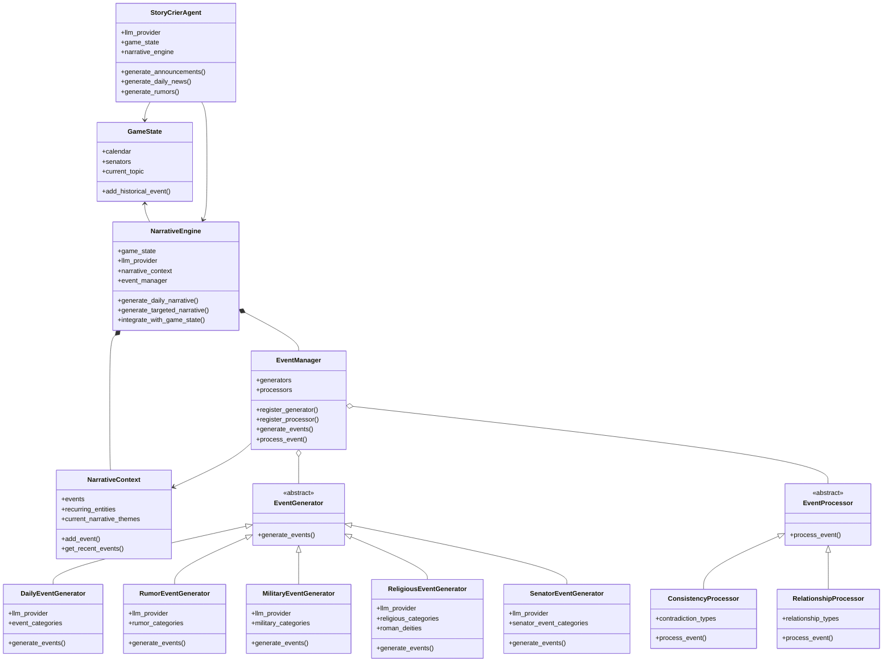

# Narrative System Component

**Author:** Documentation Team  
**Date:** April 18, 2025  
**Version:** 1.1.0  

## Table of Contents

- [Overview](#overview)
- [System Architecture](#system-architecture)
- [Key Components](#key-components)
  - [NarrativeEngine](#narrativeengine)
  - [EventManager](#eventmanager)
  - [NarrativeContext](#narrativecontext)
  - [Event Generators](#event-generators)
  - [Event Processors](#event-processors)
- [Event Generation Process](#event-generation-process)
- [Integration with Game State](#integration-with-game-state)
- [Extending the System](#extending-the-system)
  - [Creating New Event Generators](#creating-new-event-generators)
  - [Creating New Event Processors](#creating-new-event-processors)
- [Examples](#examples)
  - [Daily Event Generation](#daily-event-generation)
  - [Rumor Generation](#rumor-generation)
  - [Military Event Generation](#military-event-generation)
  - [Religious Event Generation](#religious-event-generation)
  - [Senator Event Generation](#senator-event-generation)

## Overview

The Narrative System is an AI-powered component that generates dynamic, contextually relevant narrative content for the Roman Senate simulation. It creates a living, evolving world around the Senate proceedings by generating daily events, rumors, and other narrative elements that provide background context and enhance immersion.

The system uses a modular architecture with specialized generators and processors to create diverse narrative content that maintains consistency with the game state and previous events. It leverages LLM (Large Language Model) capabilities to produce historically plausible content that enriches the simulation experience.

## System Architecture

The following diagram illustrates how the narrative components interact with each other and with the existing game systems:



## Key Components

The Narrative System consists of several interconnected components that work together to generate, process, and integrate narrative content.

### NarrativeEngine

The NarrativeEngine serves as the central controller for narrative generation in the simulation. It coordinates the generation of narrative events, manages the narrative context, and integrates with the game state.

Key responsibilities:
- Initializing and coordinating event generators and processors
- Generating daily narrative content
- Providing targeted narrative generation for specific event types
- Integrating narrative events with the game state
- Maintaining and persisting narrative context between sessions

```python
# Example: Generating daily narrative content
narrative_engine = NarrativeEngine(game_state, llm_provider)
daily_events = narrative_engine.generate_daily_narrative()
```

### EventManager

The EventManager handles the registration and coordination of event generators and processors. It ensures that events are properly generated and processed through the appropriate pipeline.

Key responsibilities:
- Registering event generators and processors
- Coordinating event generation from multiple sources
- Processing events through appropriate processors
- Adding processed events to the narrative context

```python
# Example: Registering an event generator
event_manager.register_generator(
    "daily_events", 
    DailyEventGenerator(llm_provider)
)
```

### NarrativeContext

The NarrativeContext maintains the narrative memory and history for the simulation. It stores all generated events and provides methods for retrieving relevant past events.

Key responsibilities:
- Storing narrative events
- Tracking recurring entities and narrative themes
- Providing context for event generation
- Persisting narrative history between sessions
- Retrieving relevant past events

```python
# Example: Adding an event to the context
narrative_context.add_event(event)

# Example: Getting recent events
recent_events = narrative_context.get_recent_events(5)
```

### Event Generators

Event Generators are specialized components that create specific types of narrative events. The system includes several generators, each focused on a particular aspect of the narrative:

#### DailyEventGenerator

Generates events about daily life in Rome, including:
- Market activities and trade
- Weather and natural phenomena
- Religious ceremonies and omens
- Public gatherings and entertainment
- Minor crimes and disturbances

```python
# Example: Generating daily events
daily_generator = DailyEventGenerator(llm_provider)
daily_events = daily_generator.generate_events(game_state, narrative_context)
```

#### RumorEventGenerator

Generates rumors and gossip circulating in Rome, including:
- Political alliances and rivalries
- Personal scandals and gossip
- Speculation about foreign affairs
- Whispers about financial dealings
- Rumors about religious omens

```python
# Example: Generating rumors
rumor_generator = RumorEventGenerator(llm_provider)
rumors = rumor_generator.generate_events(game_state, narrative_context)
```

#### MilitaryEventGenerator

Generates events about military affairs in the Roman Republic, including:
- Battles and skirmishes
- Troop movements and deployments
- Military campaigns and strategies
- Victories and defeats
- Military appointments and promotions
- Sieges and naval operations

```python
# Example: Generating military events
military_generator = MilitaryEventGenerator(llm_provider)
military_events = military_generator.generate_events(game_state, narrative_context)
```

#### ReligiousEventGenerator

Generates events about religious affairs in Rome, including:
- Religious ceremonies and festivals
- Omens and portents
- Temple dedications and repairs
- Priestly appointments
- Divine interventions and interpretations
- Sacrifices and religious observances

```python
# Example: Generating religious events
religious_generator = ReligiousEventGenerator(llm_provider)
religious_events = religious_generator.generate_events(game_state, narrative_context)
```

#### SenatorEventGenerator

Generates personal events involving specific senators, including:
- Personal achievements and milestones
- Family events (marriages, births, deaths)
- Property acquisitions or losses
- Personal scandals or triumphs
- Health issues or recoveries
- Political maneuvers outside the Senate

```python
# Example: Generating senator events
senator_generator = SenatorEventGenerator(llm_provider)
senator_events = senator_generator.generate_events(game_state, narrative_context)
```

### Event Processors

Event Processors ensure that generated events maintain consistency and integrate properly with the game state. They process events after generation to refine and enhance them.

#### ConsistencyProcessor

Ensures narrative consistency across generated events:
- Checks for contradictions with existing events
- Ensures historical accuracy based on the game state
- Maintains consistent entity references
- Adjusts event details to fit the narrative context

```python
# Example: Processing an event for consistency
consistency_processor = ConsistencyProcessor()
processed_event = consistency_processor.process_event(event, game_state, narrative_context)
```

#### RelationshipProcessor

Manages relationships between entities in the narrative:
- Tracks relationships between entities
- Updates relationship status based on events
- Ensures relationship consistency
- Connects events to Senate topics when appropriate

```python
# Example: Processing an event for relationships
relationship_processor = RelationshipProcessor()
processed_event = relationship_processor.process_event(event, game_state, narrative_context)
```

## Event Generation Process

The narrative event generation process follows these steps:

1. **Initialization**: The NarrativeEngine initializes with the current game state and LLM provider.

2. **Generation Request**: A request for narrative content is made, either for daily narrative or targeted event types.

3. **Event Generation**: The EventManager delegates to appropriate generators to create events based on:
   - Current game state (date, senators, topics)
   - Narrative context (recent events, recurring entities)
   - Historical context

4. **Event Processing**: Each generated event is processed through:
   - Consistency checks to ensure it doesn't contradict existing narrative
   - Relationship analysis to extract and track entity relationships
   - Integration with Senate topics when relevant

5. **Context Update**: Processed events are added to the NarrativeContext, updating:
   - The event history
   - Recurring entities tracking
   - Current narrative themes

6. **Game State Integration**: Relevant events are converted to historical events and added to the game state for use by other components.

For a detailed visualization of this process, see the [Narrative System Event Flow](../assets/narrative_system_flow.md) diagram.

## Integration with Game State

The Narrative System integrates with the game state in several ways:

1. **Event Generation**: Uses the current game state (date, senators, topics) to generate contextually relevant events.

2. **Historical Events**: Converts narrative events to historical events in the game state's database.

3. **Senate Topics**: Connects narrative events to current Senate topics when appropriate.

4. **StoryCrier Integration**: Provides narrative content to the StoryCrier for announcements.

```python
# Example: Integrating narrative events with game state
narrative_engine.integrate_with_game_state()
```

## Extending the System

The Narrative System is designed to be extensible, allowing for the addition of new event generators and processors.

### Creating New Event Generators

To create a new event generator:

1. Create a new class that inherits from `EventGenerator`
2. Implement the `generate_events` method
3. Register the generator with the EventManager

```python
class InteractionEventGenerator(EventGenerator):
    def __init__(self, llm_provider):
        self.llm_provider = llm_provider
        
    def generate_events(self, game_state, narrative_context):
        # Implementation here
        return events
        
# Register the generator
event_manager.register_generator("interactions", InteractionEventGenerator(llm_provider))
```

### Creating New Event Processors

To create a new event processor:

1. Create a new class that inherits from `EventProcessor`
2. Implement the `process_event` method
3. Register the processor with the EventManager

```python
class TopicProcessor(EventProcessor):
    def process_event(self, event, game_state, narrative_context):
        # Implementation here
        return processed_event
        
# Register the processor
event_manager.register_processor("topics", TopicProcessor(), ["daily_event", "rumor"])
```

## Examples

### Daily Event Generation

Here's an example of a daily event generated by the system:

```
Market Price Fluctuations

The grain markets in Rome are abuzz today as prices have risen slightly following reports of delayed shipments from Sicily. Merchants at the Forum Boarium are charging an extra denarius per modius, causing minor grumbling among the plebeians. Marcus Licinius, a prominent grain merchant, assures customers that new shipments are expected within days and prices should stabilize soon.
```

### Rumor Generation

Here's an example of a rumor generated by the system:

```
Whispers of a Secret Alliance

Rumors circulate through the Forum that Senators Gaius Cassius and Marcus Brutus have been meeting privately with several other senators after dark. Some speculate they are forming a political alliance to oppose Caesar's growing influence, while others suggest they are merely discussing upcoming legislation on provincial governance. The truth remains elusive, but many eyes now watch their movements carefully.
```

### Military Event Generation

Here's an example of a military event generated by the system:

```
Victory at the Danube Frontier

General Lucius Calpurnius Piso reports a decisive victory against Germanic tribes near the Danube River. The Tenth Legion, supported by auxiliary cavalry, routed a force twice their size after a daring flanking maneuver. Three enemy chieftains were captured, and the Senate will soon decide their fate. This victory secures the northeastern frontier and opens potential for new trade routes into the region.
```

### Religious Event Generation

Here's an example of a religious event generated by the system:

```
Ominous Signs at Jupiter's Temple

The high priest of Jupiter reports that lightning struck the Temple of Jupiter Optimus Maximus during last night's storm, scorching the marble steps but causing no structural damage. Augurs have been consulted and interpret this as a warning from Jupiter himself that the Senate must exercise caution in upcoming decisions. A special sacrifice of white bulls has been scheduled to appease the god and seek further guidance.
```

### Senator Event Generation

Here's an example of a senator event generated by the system:

```
Marriage Alliance for Senator Quintus Hortensius

Senator Quintus Hortensius has announced the betrothal of his eldest daughter to the son of Senator Marcus Tullius Cicero. The marriage, scheduled for the next Kalends, represents a significant political alliance between two influential senatorial families. The dowry is said to include valuable properties in Campania. Both families hosted a lavish engagement feast attended by numerous prominent senators and equites.