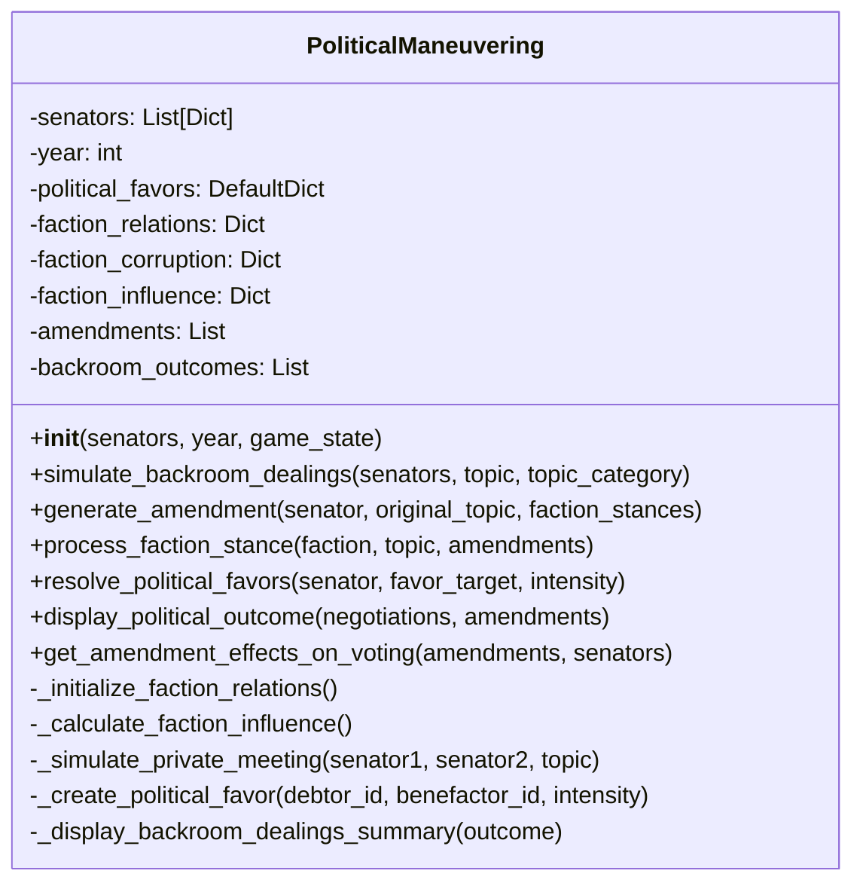

# Political Maneuvering Component

**Author:** Documentation Team  
**Date:** April 13, 2025  
**Version:** 1.0.0  

## Table of Contents

1. [Overview](#overview)
2. [Historical Context](#historical-context)
3. [Component Architecture](#component-architecture)
4. [Political Systems](#political-systems)
5. [Key Methods](#key-methods)
6. [Backroom Dealings System](#backroom-dealings-system)
7. [Amendment Mechanics](#amendment-mechanics)
8. [Integration Points](#integration-points)
9. [Historical Accuracy Features](#historical-accuracy-features)

## Overview

The `PoliticalManeuvering` component (implemented in `political_maneuvering.py`) simulates the crucial behind-the-scenes negotiations, faction politics, amendment processes, and favor trading that were central to Roman political life. It recognizes that formal Senate procedures were only part of Roman politics—much of the real work happened through relationships, favors, and private negotiations.

This component adds significant depth to the Senate simulation by modeling the informal but essential political activities that occurred alongside formal debate, creating a more realistic portrayal of how decisions were actually made in the Roman Republic.

## Historical Context

In the Roman Republic, much of the real political work happened outside the formal debate process:

- **Client-Patron Networks**: Roman society operated through extensive networks of patronage, where powerful senators (patrones) had numerous clients (clientes) who owed them loyalty and service.

- **Factional Politics**: Groups like the Optimates (conservative aristocrats) and Populares (reform-minded populists) coordinated their activities and formed tactical alliances.

- **Private Negotiations**: Senators would meet privately before formal sessions to coordinate strategies, make deals, and form coalitions.

- **Political Favors**: A complex system of political debts (*beneficia*) and obligations (*officia*) underpinned Roman political relationships, with senators constantly tracking who owed them favors.

- **Amendment Strategies**: Amending proposals was a key tactic to alter legislation in ways that benefited certain factions or created broader appeal.

- **Corruption**: Bribery and corruption were realities of Roman politics, with wealth used to influence votes and decisions.

The PoliticalManeuvering component recreates these historical realities, showing how the informal aspects of Roman politics operated alongside formal Senate procedures.

## Component Architecture

The PoliticalManeuvering class encapsulates the following key elements:

- **State Data**:
  - Faction relations (alliances and hostilities)
  - Political favor tracking system
  - Faction influence and corruption levels
  - Amendment history
  - Backroom dealing outcomes

- **Systems**:
  - Backroom negotiations
  - Political favor exchanges
  - Amendment generation and processing
  - Faction stance processing
  - Voting influence calculations



## Political Systems

The component implements several sophisticated political systems that work together to create realistic Roman political dynamics:

### Faction Relations System

Maps the complex relationships between the five main factions:

- **Optimates**: Traditional aristocratic conservatives
- **Populares**: Reform-oriented populists
- **Military**: Military leaders and supporters
- **Religious**: Religious conservatives and traditionalists 
- **Merchant**: Business and commercial interests

Relations range from -1.0 (hostile) to 1.0 (aligned) and include historically accurate initial values:
- Optimates and Populares are traditional rivals (-0.7)
- Military generally supported by Optimates (0.3)
- Religious faction aligned with Optimates (0.5)
- Merchant class had variable relationships with all factions

These relationships influence political dealings, alliance formation, and amendment support.

### Political Favor System

Models the complex network of political debts (*beneficia*) that characterized Roman politics:

- Tracks which senator owes favors to whom
- Quantifies favor intensity from 0.1 (small favor) to 1.0 (life debt)
- Allows favors to be called in during critical votes
- Creates new political debts through backroom dealings
- Models partial and full resolution of political obligations

```python
# Example of the political favor data structure
# self.political_favors = {
#    senator_id: {
#        benefactor_id: favor_intensity,  # Senator owes benefactor
#        benefactor_id2: favor_intensity2,
#    },
# }
```

### Corruption Model

Implements historically accurate corruption tendencies for different factions:

- **Optimates**: 0.2-0.6 (Traditional aristocrats, moderate corruption)
- **Populares**: 0.1-0.5 (Popular reformers, lower corruption)
- **Military**: 0.3-0.8 (Military leaders, higher corruption)
- **Religious**: 0.1-0.4 (Religious conservatives, lower corruption)
- **Merchant**: 0.4-0.9 (Business interests, highest corruption)

Corruption affects:
- Willingness to make political deals
- Types of amendments proposed
- Likelihood of bribery in negotiations
- Voting pattern modifications

### Faction Influence System

Calculates the political power of each faction based on:

- The combined influence of faction members
- Historical context adjustments (e.g., Optimates losing power in late Republic)
- Period-specific modifications (e.g., Military influence after Marius' reforms)

This influence determines faction impact on negotiations and likelihood of successful amendments.

## Key Methods

### Backroom Politics

#### `simulate_backroom_dealings(senators, topic, topic_category)`

Simulates the crucial pre-debate political negotiations:

- Identifies the most influential senators (top 25%)
- Determines key stakeholders based on topic category
- Simulates private meetings between key political actors
- Generates deals, alliances, and favor exchanges
- Produces a comprehensive outcome record
- Displays a summary of significant political activities

```python
# Example usage
politics = PoliticalManeuvering(senators, year, game_state)
backroom_results = politics.simulate_backroom_dealings(
    attending_senators, 
    "Funding for the legions in Hispania", 
    "Military Affairs"
)
```

#### `_simulate_private_meeting(senator1, senator2, topic)`

The core function that simulates one-on-one private political meetings:

- Determines each senator's stance on the topic
- Calculates deal probability based on agreement/disagreement and corruption
- Generates different types of deals (vote exchange, amendment support, etc.)
- Creates political alliances when appropriate
- Exchanges or calls in political favors
- Returns detailed meeting outcomes

### Amendment System

#### `generate_amendment(senator, original_topic, faction_stances)`

Creates realistic amendments to proposals based on political interests:

- Determines amendment intent based on stance and traits
- Generates amendment text with appropriate legal phrasing
- Calculates probable support from different factions
- Incorporates corruption influences
- Adds the amendment to the historical record

Example amendment types include:
- Strengthening with benefits for certain groups
- Weakening the scope or implementation
- Clarifying implementatation details
- Redirecting benefits to different recipients
- Inserting unrelated benefits (pork barrel)
- Creating compromise positions

#### `process_faction_stance(faction, topic, amendments)`

Determines how a faction reacts to a set of amendments:

- Starts with faction's initial stance on the topic
- Adjusts based on faction-specific issue biases
- Processes the influence of each amendment
- Considers factional relationships with amendment proposers
- Accounts for corruption effects
- Returns comprehensive stance with reasoning

### Political Favor System

#### `resolve_political_favors(senator, favor_target, intensity)`

Handles the calling in of political debts:

- Checks current favor balance between senators
- Calculates compliance probability based on relationship and loyalty
- Determines outcome (favor honored or refused)
- Updates the political favor tracking system
- Potentially creates counter-favors or relationship impacts
- Returns detailed result with explanation

#### `_create_political_favor(debtor_id, benefactor_id, intensity)`

Creates or increases a political favor debt:

- Caps the favor intensity at 1.0
- Adds to any existing favor debt
- Updates the political favors data structure
- Logs the favor creation for record-keeping

### Voting Influence

#### `get_amendment_effects_on_voting(amendments, senators)`

Calculates how amendments affect individual senator voting probabilities:

- Evaluates each amendment's effect on each senator
- Incorporates senator's stance on their own amendments
- Adjusts based on faction support for amendments
- Accounts for political favor effects
- Returns voting probability modifiers for each senator

## Backroom Dealings System

The backroom dealings system simulates pre-debate political negotiations with the following key elements:

### Actor Selection

The system identifies key political actors through multiple methods:

1. **Influential Power Players**: Selects the top 25% most influential senators
2. **Topic Stakeholders**: Identifies senators from factions with direct interest in the topic
3. **Combined Actor Pool**: Creates a combined list of key political players

### Meeting Mechanics

For each initiator, the system:

1. Determines meeting count based on influence (more influential senators initiate more meetings)
2. Selects meeting targets based on weighted factors:
   - Same faction senators get higher weight
   - Good faction relations increase meeting probability
   - Senators who owe favors are prioritized
3. Records meetings to prevent duplicate interactions

### Deal Generation

The system can generate five types of political deals:

1. **Vote Exchange**: Senators agree to support each other on different matters
2. **Amendment Support**: Cooperation on amending the current proposal
3. **Speaking Opportunity**: Prime speaking slots in exchange for position adjustments
4. **Favor Exchange**: Calling in existing favors or creating new ones
5. **Resource Allocation**: Negotiating benefits from the proposal (potentially involving corruption)

### Alliance Formation

Some deals can evolve into formal political alliances:

- **Short-term Cooperation**: Temporary alliances for the current vote
- **Amendment Coalitions**: Groups coordinating on amendment strategies
- **Faction Alliances**: Cross-faction cooperation on shared interests

### Deal Probability Factors

Multiple factors influence deal likelihood:

- **Agreement Level**: Easier to make deals when in agreement (0.3 boost)
- **Corruption**: More corrupt senators more likely to deal (up to 0.5 boost)
- **Faction Relationships**: Better relations increase deal probability
- **Political Debts**: Owing favors increases likelihood of deals
- **Senator Traits**: Loyalty and eloquence affect negotiation outcomes

## Amendment Mechanics

The amendment system models how senators would propose changes to legislation to serve their interests:

### Amendment Intent Types

Amendments are categorized by their intent:

- **strengthen_with_benefits**: Enhance the proposal while adding benefits for specific groups
- **strengthen_broadly**: Expand scope to include additional priorities
- **clarify_supportively**: Add specificity while maintaining the core proposal
- **redirect_benefits**: Change who receives benefits from the proposal
- **weaken_substantially**: Reduce the proposal's scope or impact
- **limit_scope**: Constrain application to specific circumstances
- **insert_unrelated_benefits**: Add unrelated provisions (pork barrel)
- **moderate_compromise**: Create a balanced approach accommodating multiple views

### Amendment Generation Factors

Amendments are influenced by multiple factors:

- **Senator's Faction**: Different factions have typical amendment patterns
- **Stance on Topic**: Support, opposition, or neutrality shapes amendment type
- **Corruption Level**: Affects likelihood of self-serving amendments
- **Loyalty**: Determines how factionally-aligned amendments will be

### Amendment Support Calculation

For each faction, support for an amendment is calculated based on:

- **Base Support**: Starts neutral (0.5)
- **Relationship Effect**: Adjustment based on relationship with proposer's faction
- **Original Stance**: Alignment with the faction's initial position
- **Amendment Intent**: Whether the intent aligns with faction interests
- **Corruption Factor**: Corrupt factions more likely to support corrupt amendments

### Amendment Effects on Voting

Amendments modify voting probabilities through several mechanisms:

- **Proposer Bonus**: Senators strongly support their own amendments (+0.3)
- **Faction Support**: Converted to voting effect (-0.2 to +0.2)
- **Political Favor Effect**: Owing favors to proposers increases support
- **Final Modifier**: Capped between -0.5 and +0.5 to prevent deterministic outcomes

## Integration Points

The PoliticalManeuvering component integrates with other components at several key points:

### Integration with SenateSession

- During `run_full_session()`, SenateSession creates a PoliticalManeuvering instance
- Before each topic's debate, calls `simulate_backroom_dealings()`
- After debate, before voting, uses `generate_amendment()` to create amendments
- Displays political outcomes via `display_political_outcome()`
- Applies voting modifiers from `get_amendment_effects_on_voting()`

### Integration with Debate System

- The backroom dealings outcomes affect debate positions
- Senator relationships from debate affect political favor exchanges
- Faction stances determined during political maneuvering influence debate positions

### Integration with Voting System

- Amendment effects directly modify voting probabilities
- Political favor obligations influence voting decisions
- Faction positions shaped by amendments guide voting patterns

## Historical Accuracy Features

The PoliticalManeuvering component implements numerous historical details for authenticity:

### Historically Accurate Factional Dynamics

The component accurately models the evolving faction dynamics of the late Republic:

- **Optimates vs. Populares Tension**: The fundamental political divide of the late Republic
- **Rising Military Influence**: Increased power of military leaders after Marius' reforms
- **Conservative Religious Faction**: Aligned with traditional Optimates interests
- **Emerging Merchant Power**: Growing commercial interests in political decisions
- **Period-Specific Issues**: Land reform, military reform, and Italian citizenship

### Roman Political Customs

The component recreates authentic Roman political practices:

- **Patronage Networks** (*clientela*): The client-patron relationship system
- **Political Debt System** (*beneficia* and *officia*): Favor exchanges and obligations
- **Amendment Process**: The Roman practice of modifying proposals
- **Private Political Negotiations**: The crucial role of informal meetings and deals

### Corruption Mechanics

The simulation acknowledges the reality of corruption in Roman politics:

- **Faction-Specific Corruption**: Different corruption tendencies for different groups
- **Bribery Dynamics**: The role of wealth in securing political support
- **Self-Serving Amendments**: The practice of inserting personal benefits into legislation
- **Resource Allocation**: Competition for control of resources from proposals

### Time Period Adjustments

The component adjusts political dynamics based on the year:

- **Pre-Gracchi (before 133 BCE)**: Traditional aristocratic dominance
- **Post-Gracchi (133-107 BCE)**: Rising tension over land reform
- **Post-Marius (after 107 BCE)**: Increased military influence
- **Social War Period (after 88 BCE)**: Italian citizenship concerns

These historical elements create a nuanced and dynamic model of Roman political maneuvering as it actually operated in the late Republic, adding significant depth and authenticity to the Senate simulation.