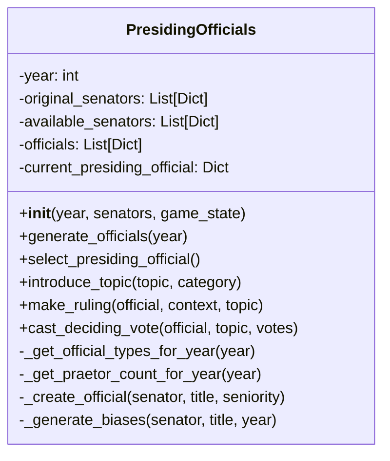

# PresidingOfficials Component

**Author:** Documentation Team  
**Date:** April 13, 2025  
**Version:** 1.0.0  

## Table of Contents

1. [Overview](#overview)
2. [Historical Context](#historical-context)
3. [Component Architecture](#component-architecture)
4. [Official Types and Hierarchy](#official-types-and-hierarchy)
5. [Key Methods](#key-methods)
6. [Personality and Bias System](#personality-and-bias-system)
7. [Integration Points](#integration-points)
8. [Historical Accuracy Features](#historical-accuracy-features)

## Overview

The `PresidingOfficials` component (implemented in `officials.py`) manages the magistrates who presided over Roman Senate sessions. It creates historically accurate officials with distinct personalities, handles their selection according to Roman precedence rules, and simulates their unique approaches to introducing topics, making procedural rulings, and controlling debate.

This component adds significant depth to the Senate simulation by recreating the crucial role that individual presiding magistrates played in shaping Senate proceedings through their authority, biases, and personal styles.

## Historical Context

In the Roman Republic, Senate sessions were presided over by magistrates following a strict hierarchy of authority:

1. **Dictator** (rare emergency position)
2. **Consuls** (highest regular magistrates, two per year)
3. **Praetors** (lower-ranking magistrates)
4. **Tribune of the Plebs** (could convene the Senate after 287 BCE)
5. **Interrex** (temporary during electoral gaps)

The presiding magistrate wielded significant power over proceedings by:
- Controlling who could speak and when
- Enforcing order and decorum
- Making procedural rulings on points of order
- Interpreting and applying Senate traditions
- Framing topics for debate
- Calling for votes and sometimes casting deciding votes

A session presided over by a strict, traditionalist Consul would feel very different from one led by a reform-minded Tribune of the Plebs—the simulation captures these important distinctions.

## Component Architecture

The PresidingOfficials class encapsulates the following key elements:

- **State Data**:
  - Available officials by type
  - Current presiding official
  - Officials' personality traits and biases
  - Rulings made during the session
  - Historical year context

- **Functional Areas**:
  - Official generation based on historical period
  - Selection according to Roman precedence
  - Personality trait system
  - Topic introduction formatting
  - Procedural rulings
  - Tie-breaking votes



## Official Types and Hierarchy

The component implements the following types of officials based on historical Roman magistracies:

### Consul
- The highest regular magistrate (two per year)
- Selected from the most influential senators
- Distinguished between Senior and Junior Consuls
- Primary presiders over Senate sessions
- Available throughout the Republic

### Praetor
- Second-ranking magistrates
- Number varied over time (historically accurate):
  - 366-227 BCE: 1 praetor
  - 227-197 BCE: 2 praetors
  - 197-81 BCE: 4 praetors
  - 81-27 BCE: 8 praetors (after Sulla's reforms)
- Introduced in 366 BCE

### Tribune of the Plebs
- Could convene the Senate after Lex Hortensia (287 BCE)
- Often selected from the Populares faction
- Represented plebeian interests
- Had veto power over Senate proceedings

### Interrex
- Temporary official during vacancies or electoral disputes
- Served for five-day terms until elections could be held
- Rare but available throughout the Republic

### Dictator
- Emergency position with extraordinary powers
- Very rare (5% chance in simulation)
- Only exists in specific historical contexts

The selection system implements the correct historical precedence with Dictator > Consuls > Praetors > Interrex > Tribune of the Plebs.

## Key Methods

### Initialization and Official Generation

#### `__init__(year, senators, game_state)`

Initializes the presiding officials manager with the current year, available senators, and game state. Key initialization tasks include:

- Setting the year and creating a year display string
- Keeping a copy of original and available senators
- Initializing the officials list
- Calling `generate_officials()` to create historically accurate officials

#### `generate_officials(year)`

Creates a historically accurate set of officials based on the given year:

- Determines which official types existed in that year
- Calculates the appropriate number of praetors for the period
- Selects senators for each position based on influence and faction
- Creates officials with personality traits and biases
- Ensures no senator holds multiple offices

```python
# Example usage
officials = PresidingOfficials(year=-100, senators=senator_list, game_state=game_state)
```

### Official Selection and Management

#### `select_presiding_official()`

Selects the appropriate official to lead the session based on Roman protocol:

- Follows the historical hierarchy (Dictator > Consul > Praetor, etc.)
- For Consuls, prefers the Senior Consul if specified
- Returns the selected official and sets it as the current presiding official
- Creates a fallback official if necessary

### Senate Session Functions

#### `introduce_topic(topic, category=None)`

Formulates how the official introduces a topic to the Senate, with text varying based on the official's personality:

- Checks for official biases related to the topic category
- Adjusts formality based on the official's traditionalism
- Generates appropriate opening phrases
- Potentially adds biased statements if the official has strong opinions
- Includes procedural information and traditional closing

```python
# Example result
"""
Patres conscripti, I bring before you a matter of state that requires our deliberation.

The matter concerns Military Affairs: Funding for the legions in Hispania.

I believe this proposal has merit and deserves your favorable consideration.

I expect orderly debate and will recognize senators to speak in turn. Disruptions will not be tolerated.

The floor is now open for debate.
"""
```

#### `make_ruling(official, context, topic)`

Makes a ruling on a procedural matter or debate issue:

- Determines the type of ruling needed (order violation, time limit, relevance, etc.)
- Considers the official's personality traits (authoritarianism, impartiality, decisiveness)
- Generates ruling text based on the type and personality
- Records the ruling in the official's history
- Returns the ruling type and text

#### `cast_deciding_vote(official, topic, votes)`

Casts a deciding vote in case of a tie in the Senate:

- Considers the official's biases related to the topic
- Uses personality traits like traditionalism to influence the decision
- Generates an explanation for the vote based on the decision process
- Returns the vote decision ("for" or "against") and explanation

## Personality and Bias System

The component implements a sophisticated personality and bias system to create realistic variation in how officials behave:

### Personality Traits

Each official has five personality dimensions that affect their behavior:

1. **Authoritarianism** (0.3-1.0): How strictly they enforce rules and control debate
2. **Impartiality** (0.2-0.9): How fair they are when making rulings
3. **Traditionalism** (0.4-1.0): How strongly they adhere to Senate traditions
4. **Decisiveness** (0.4-1.0): How quickly and firmly they make decisions
5. **Eloquence** (0.5-1.0): How well they articulate their thoughts and rulings

These traits directly influence:
- The language used in topic introductions
- The strictness of procedural rulings
- The handling of disruptions
- The formality of their speaking style

### Bias System

Officials also have biases that affect their decisions:

#### Policy Biases
- Foreign policy (-1.0 to 1.0)
- Domestic policy (-1.0 to 1.0)
- Economic policy (-1.0 to 1.0)

#### Faction Biases
Each official has relationship values with the five main factions:
- Optimates
- Populares
- Military
- Religious
- Merchant

#### Historical Period Biases
Specific biases are added based on the year:
- Land reform (after the Gracchi reforms, 133 BCE)
- Military reform (after Marius's reforms, 107 BCE)
- Italian citizenship (during/after Social War, 88 BCE)

These biases affect how officials introduce topics, rule on procedural matters, and cast deciding votes, creating a historically nuanced simulation of Roman political dynamics.

## Integration Points

The PresidingOfficials component integrates with other components at several key points:

### Integration with SenateSession

- The SenateSession creates a PresidingOfficials instance during `run_full_session()`
- SenateSession calls `select_presiding_official()` to determine who will preside
- During agenda introduction, SenateSession uses `introduce_topic()` for each topic
- The resulting official is referenced throughout the session

### Integration with Interjections

- When procedural objections occur during debate, interjections call `make_ruling()`
- The ruling is then displayed and affects debate flow
- Officials' personality traits influence how strictly they respond to disruptions

## Historical Accuracy Features

The PresidingOfficials component implements numerous historical details for authenticity:

### Historically Accurate Magistracies

The component accurately models the evolution of Roman magistracies over time:

- The gradual increase in the number of Praetors
- The introduction of Tribune of the Plebs Senate powers after 287 BCE
- The rare appointment of Dictators in times of crisis
- The use of Interrex during electoral gaps

### Official Selection Protocols

The selection follows authentic Roman protocols:

- The proper hierarchical precedence of officials
- The distinction between Senior and Junior Consuls
- The preference for certain factions in certain roles (e.g., Populares for Tribune)

### Ruling and Speaking Styles

The component recreates authentic aspects of Roman political communication:

- Formal Latin-derived phrases like "Patres conscripti" (Conscript fathers)
- References to proper Roman concepts like "mos maiorum" (ancestral customs)
- Appropriate procedural terminology
- Distinct communication styles based on factional background

These historical elements combine to create a nuanced and authentic recreation of how Roman magistrates would have presided over the Senate, with all the personal, factional, and procedural complexities that entailed.