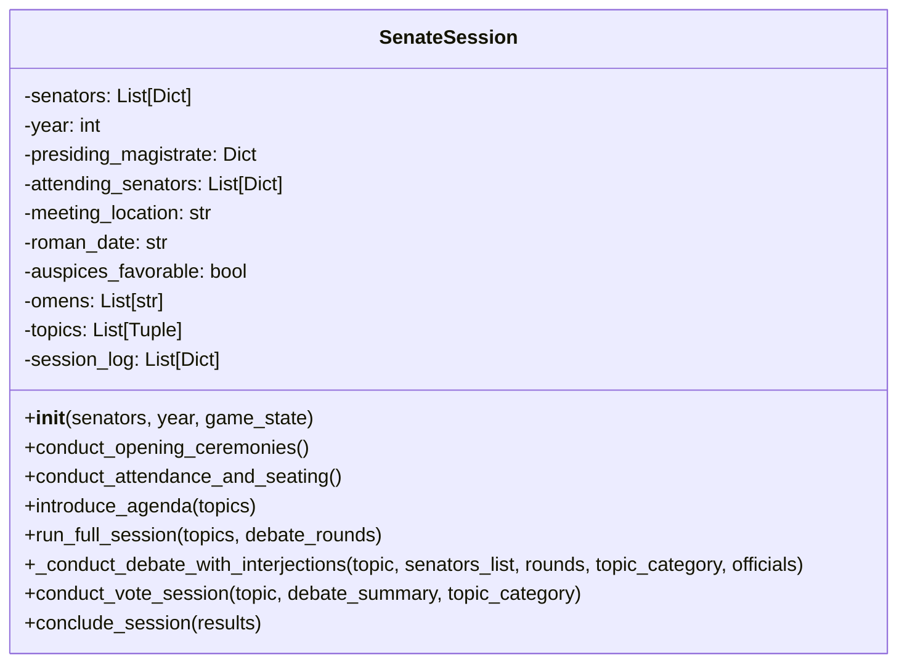
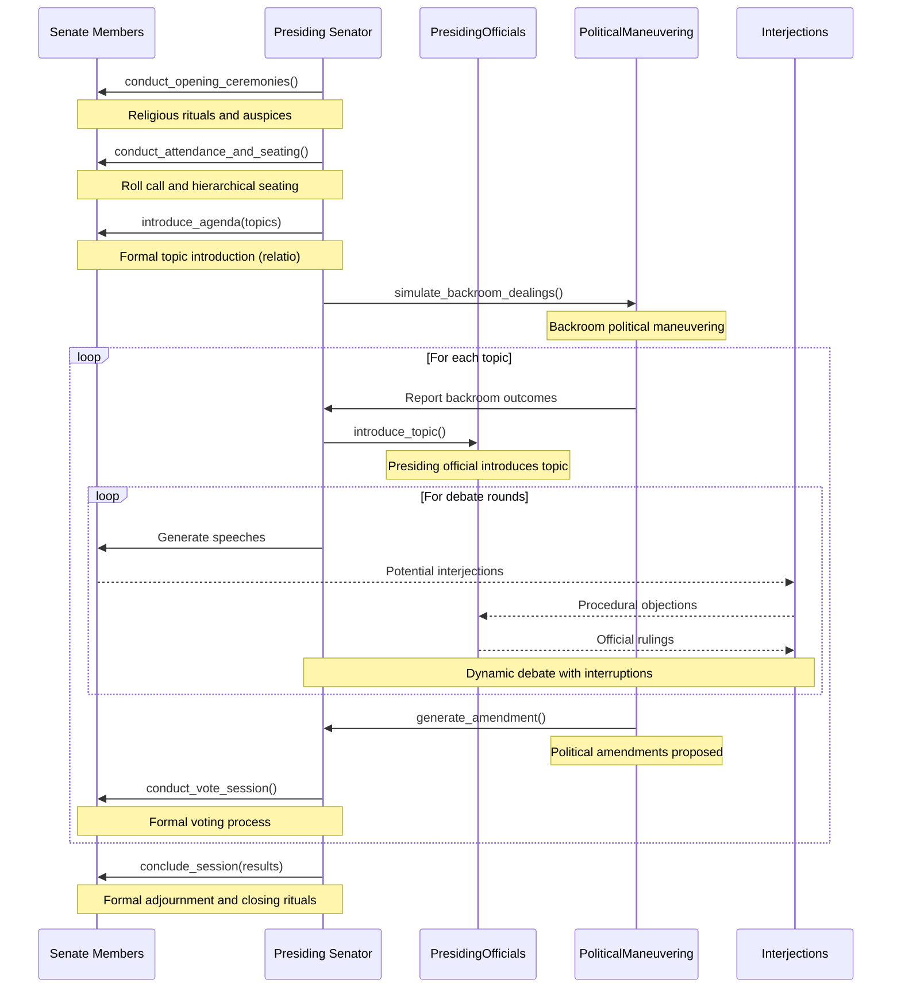

# SenateSession Component

**Author:** Documentation Team  
**Date:** April 13, 2025  
**Version:** 1.0.0  

## Table of Contents

1. [Overview](#overview)
2. [Historical Context](#historical-context)
3. [Component Architecture](#component-architecture)
4. [Key Methods](#key-methods)
5. [Session Flow](#session-flow)
6. [Integration Points](#integration-points)
7. [Historical Accuracy Features](#historical-accuracy-features)

## Overview

The `SenateSession` component (implemented in `senate_session.py`) is the core orchestration module of the Roman Senate Game, responsible for managing a complete Senate session from opening ceremonies to adjournment. It implements a historically accurate flow based on Roman Republic practices circa 100 BCE, integrating religious observances, procedural protocols, debate dynamics, and voting mechanisms.

This component serves as the main coordinator between other specialized components (PresidingOfficials, Interjections, and PoliticalManeuvering), bringing together formal and informal aspects of Roman Senate proceedings.

## Historical Context

The Roman Senate session followed a structured and ceremonial process that combined religious observances with political procedure. Sessions typically occurred in specialized buildings (the Curia) and were managed by high-ranking magistrates, most commonly Consuls and Praetors. 

Senate proceedings were heavily influenced by:
- Religious requirements (auspices and omens)
- Strict social hierarchy (seating by rank)
- Formal procedural rules
- Speaking protocols based on seniority

The SenateSession component recreates these elements to provide an authentic Roman political experience.

## Component Architecture

The SenateSession class encapsulates the following key elements:

- **State Data**:
  - Senators list and attending senators
  - Presiding magistrate
  - Meeting location
  - Roman calendar date
  - Session topics and log
  - Religious elements (auspices, omens)

- **Procedural Flow**:
  - Opening ceremonies and religious rituals
  - Attendance and seating arrangements
  - Agenda introduction (relatio)
  - Debate management with interjections
  - Voting processes
  - Session adjournment



## Key Methods

### Initialization and Setup

#### `__init__(senators, year, game_state)`

Initializes a new Senate session with the provided senators, year, and game state. Key initialization tasks include:

- Setting the year and creating a year display string (e.g., "100 BCE")
- Selecting a presiding magistrate from among the senators
- Determining the appropriate meeting location based on historical period
- Generating a historically accurate Roman calendar date
- Determining if the auspices are favorable
- Potentially generating divine omens

```python
# Example initialization
session = SenateSession(senators=senator_list, year=-100, game_state=game_state)
```

### Phase Management Methods

#### `conduct_opening_ceremonies()`

Manages the crucial religious observances that began every Senate session:

- Taking the auspices to determine divine favor
- Performing ritual sacrifices
- Reciting the formal Latin invocation
- Reporting any omens or signs
- Completing the ritual opening

This method creates an immersive experience by incorporating both Latin and English text for authenticity.

#### `conduct_attendance_and_seating()`

Handles the formal attendance process and seating arrangements:

- Determines which senators are present (based on influence and other factors)
- Creates a seating arrangement according to proper Roman hierarchy:
  - Consul/Presiding Officer at the highest position
  - Former Consuls in the front rows
  - Praetors, Aediles, Tribunes, and Quaestors in order of rank
  - Regular senators at the back
- Displays attendance information and seating chart
- Potentially includes late arrivals for realism

#### `introduce_agenda(topics)`

Presents the day's agenda (relatio) to the Senate:

- Formats topics into a formal agenda table
- Has the presiding magistrate introduce the topics with appropriate formality
- Potentially includes procedural objections from senators
- Sets up the topics for subsequent debate

#### `run_full_session(topics, debate_rounds=3)`

The main orchestration method that runs a complete Senate session through all phases:

1. Creates required specialized components (PoliticalManeuvering, PresidingOfficials)
2. Conducts opening ceremonies
3. Takes attendance and arranges seating
4. Introduces the agenda
5. For each topic:
   - Simulates backroom political dealings
   - Announces the current topic
   - Conducts debate with interjections
   - Generates amendments based on political maneuvering
   - Conducts voting
   - Stores and logs results
6. Concludes the session formally
7. Returns the results of all deliberations

#### `_conduct_debate_with_interjections(topic, senators_list, rounds, topic_category, officials)`

Manages the debate process with dynamic interjections:

- Resets debate state for a new debate
- Tracks faction stances for consistency
- For each debate round:
  - Selects senators to speak
  - Generates speeches considering prior speeches and relationships
  - Incorporates interjections from other senators
  - Scores arguments
  - Records speech information and interjections
- Returns a comprehensive debate summary

#### `conduct_vote_session(topic, debate_summary, topic_category)`

Handles the formal voting process after debate:

- Introduces the vote with appropriate formality
- Processes senator votes asynchronously
- Incorporates debate stances into voting tendencies
- Displays vote results and detailed breakdowns
- Shows voting patterns by faction
- Returns vote outcomes and statistics

#### `conclude_session(results)`

Conducts the formal adjournment of the Senate session:

- Creates a summary table of all decisions
- Has the presiding magistrate deliver a formal adjournment speech
- Performs closing rituals
- Calculates and displays session duration
- Logs the conclusion of the session

## Session Flow

The complete Senate session flow follows this sequence:



## Integration Points

The SenateSession component integrates with other components at several key points:

### Integration with PresidingOfficials

- During initialization of `run_full_session()`, creates a PresidingOfficials instance
- Uses PresidingOfficials to select the presiding official for the session
- Has the presiding official introduce topics
- Forwards procedural challenges during debate to officials for rulings

### Integration with PoliticalManeuvering

- During `run_full_session()`, creates a PoliticalManeuvering instance
- Before each topic's debate, calls `simulate_backroom_dealings()`
- After debate, uses PoliticalManeuvering to generate amendments
- Applies political influences to voting through amendment effects

### Integration with Interjections

- During debate, uses the `_conduct_debate_with_interjections()` method
- Calls `integrate_with_debate()` to add dynamic interactions
- Processes interjection results and their effects on the debate
- Handles procedural objections raised through interjections

## Historical Accuracy Features

The SenateSession component implements numerous historical details for authenticity:

### Roman Calendar System

Instead of using modern dates, the component generates authentic Roman calendar references:

- **Kalendae**: The 1st day of the month
- **Nonae**: The 5th or 7th day depending on the month
- **Idus**: The 13th or 15th day depending on the month

For example: "Kalendae Ianuarius" or "3 Nonae Martius"

### Meeting Locations

The component chooses historically accurate meeting locations based on the year:

- **Curia Hostilia**: The original Senate house (used before 100 BCE)
- **Curia Cornelia**: The Senate house built by Sulla (used after 100 BCE)

### Religious Elements

The simulation incorporates the crucial religious aspects of Roman politics:

- **Auspices**: Divine approval for the meeting was sought before business could begin
- **Omens**: Unusual signs that could impact proceedings
- **Ritual Sacrifices**: Described in detail during opening ceremonies
- **Latin Invocations**: Authentic Latin prayers to the Roman gods

### Procedural Details

The component implements historically accurate procedural elements:

- **Seating by Rank**: Senators were seated strictly according to their cursus honorum (career path)
- **Speaking Order**: Senior senators spoke before junior ones
- **Faction Dynamics**: The tensions between Optimates, Populares, and other factions
- **Amendments**: The Roman practice of modifying proposals during debate

These historical elements combine to create an authentic recreation of Roman Senate procedures circa 100 BCE.