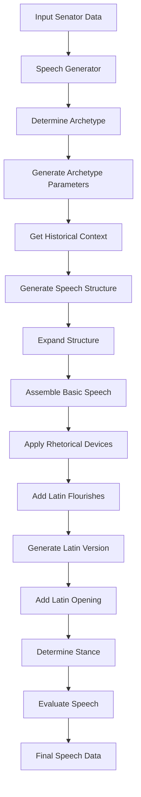
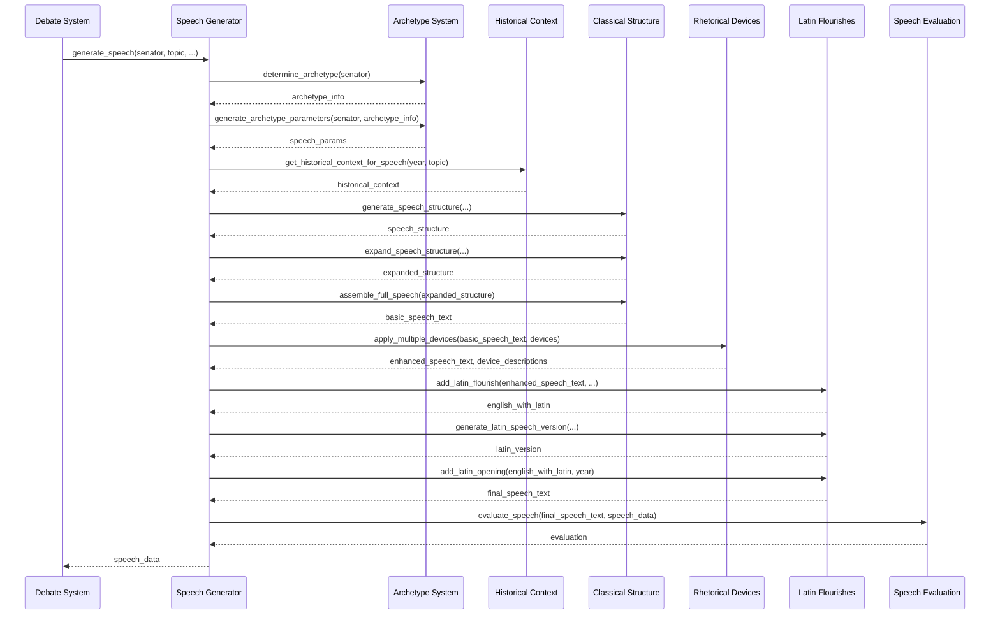

# Roman Senate Speech Generation Framework

**Author:** Documentation Team  
**Date:** April 14, 2025  
**Version:** 1.0.0  

## Table of Contents

1. [Overview](#overview)
2. [Key Components](#key-components)
   1. [Speech Generator](#speech-generator)
   2. [Archetype System](#archetype-system)
   3. [Rhetorical Devices](#rhetorical-devices)
   4. [Historical Context](#historical-context)
   5. [Classical Structure](#classical-structure)
   6. [Latin Flourishes](#latin-flourishes)
   7. [Speech Evaluation](#speech-evaluation)
3. [Architecture & Flow](#architecture--flow)
4. [API Documentation](#api-documentation)
   1. [Core Functions](#core-functions)
   2. [Parameter Types](#parameter-types)
   3. [Return Types](#return-types)
5. [Usage Examples](#usage-examples)
   1. [Basic Speech Generation](#basic-speech-generation)
   2. [Responding to Another Senator](#responding-to-another-senator)
   3. [Custom Archetype Parameters](#custom-archetype-parameters)
   4. [Speech Evaluation](#speech-evaluation-usage)
6. [Integration with Debate System](#integration-with-debate-system)
7. [Extending the Framework](#extending-the-framework)

## Overview

The Roman Senate Speech Generation Framework provides a sophisticated system for generating historically authentic and rhetorically rich speeches for virtual Roman senators. The framework creates speeches that reflect a senator's personality (archetype), incorporate appropriate historical references, follow classical rhetorical structures, and utilize Latin flourishes.

This framework is designed to enhance the immersive experience in the Roman Senate simulation by generating diverse, contextually appropriate speeches that showcase the rhetorical styles of the Roman Republic. It integrates with the broader debate system to create dynamic senate sessions where virtual senators deliver compelling arguments.

```
    +-------------------+       +--------------------+
    |                   |       |                    |
    |    Game Engine    |------>|   Debate System    |
    |                   |       |                    |
    +-------------------+       +---------+----------+
                                          |
                                          v
                               +----------+------------+
                               |                       |
                               | Speech Generation     |
                               | Framework             |
                               |                       |
                               +----------+------------+
                                          |
                                          v
               +-----------------------------------------------------+
               |                                                     |
               |                                                     |
+--------------|-------------+      +------------+      +------------|-----------+
|              v             |      |            |      |            v           |
| +------------+-----------+ |      |            |      | +----------+---------+ |
| |                        | |      |            |      | |                    | |
| |   Archetype System     | |      |  Classical |      | |  Latin Flourishes  | |
| |                        | |      |  Structure |      | |                    | |
| +------------------------+ |      |            |      | +--------------------+ |
|                            |      |            |      |                        |
| +------------------------+ |      |            |      | +--------------------+ |
| |                        | |      |            |      | |                    | |
| |  Rhetorical Devices    | |      |            |      | |  Speech Evaluation | |
| |                        | |      |            |      | |                    | |
| +------------------------+ |      +------------+      | +--------------------+ |
|                            |                          |                        |
| +------------------------+ |                          |                        |
| |                        | |                          |                        |
| |  Historical Context    | |                          |                        |
| |                        | |                          |                        |
| +------------------------+ |                          |                        |
|                            |                          |                        |
+----------------------------+                          +------------------------+
```

## Key Components

The framework consists of seven specialized modules that work together to produce authentic speeches. Each component plays a specific role in the speech generation process.

### Speech Generator

**Purpose:** Orchestrates the entire speech generation process by coordinating the other components.

**Key Functionality:**
- Determines the senator's archetype
- Collects historical context for the speech
- Generates a classical speech structure
- Applies rhetorical devices
- Adds Latin flourishes
- Evaluates the final speech quality

The `speech_generator.py` module serves as the main entry point for the framework. It coordinates the generation process by calling the other specialized modules in the correct sequence, assembling their outputs into a cohesive speech.

### Archetype System

**Purpose:** Defines personality archetypes for senators and determines how they influence speech styles.

**Key Functionality:**
- Determines a senator's primary and secondary archetypes based on traits and faction
- Generates speech parameters based on these archetypes
- Selects appropriate rhetorical devices matching the archetype

The archetype system categorizes senators into five distinct archetypes:

1. **Traditionalist:** Conservative, focused on ancestral customs and precedent
2. **Pragmatist:** Practical, solutions-oriented, focused on results
3. **Philosopher:** Abstract, principle-focused, employs logical reasoning
4. **Populist:** Emotional, appeals to common people, dramatic style
5. **Militarist:** Direct, security-focused, employs commanding rhetoric

Each archetype influences speech parameters including:
- Preferred rhetorical devices
- Formality level
- Sentence complexity
- Historical reference frequency
- Emotional vs. logical appeals
- Latin usage patterns

### Rhetorical Devices

**Purpose:** Implements classical Roman rhetorical techniques to enhance speech persuasiveness.

**Key Functionality:**
- Defines a catalog of rhetorical devices with examples and descriptions
- Applies rhetorical devices to text
- Provides functions to suggest appropriate devices for specific content

The module includes implementation of classical devices such as:
- **Anaphora:** Repetition at the beginning of successive clauses
- **Tricolon:** Series of three parallel elements
- **Antithesis:** Juxtaposition of contrasting ideas
- **Exemplum:** Historical examples supporting arguments
- **Rhetorical questions:** Questions asked for effect without expected answers

### Historical Context

**Purpose:** Provides historically accurate references, figures, and events appropriate to the speech's time period.

**Key Functionality:**
- Retrieves historical context for specific years in Roman history
- Provides appropriate historical figures and events for references
- Offers historically accurate values, political terms, and Latin phrases
- Generates formal address forms appropriate to the historical period

The module contains databases of:
- Historical figures by time period (Early/Middle/Late Republic)
- Important historical events
- Roman values and virtues
- Political terms and concepts
- Appropriate Latin phrases for different periods

### Classical Structure

**Purpose:** Implements the traditional structure of Roman oratory following classical principles.

**Key Functionality:**
- Generates speech structures following the classical parts of Roman oratory
- Creates templates for different speech parts based on senator archetype
- Expands structure templates into full content
- Assembles the parts into a complete speech

The classical speech structure includes these parts:
1. **Exordium:** Introduction capturing attention and establishing credibility
2. **Narratio:** Statement of facts providing context
3. **Partitio:** Outline of the speech structure (optional)
4. **Confirmatio:** Positive arguments supporting the position
5. **Refutatio:** Refutation of opposing arguments (optional)
6. **Peroratio:** Conclusion summarizing points and making final appeal

### Latin Flourishes

**Purpose:** Enhances speeches with authentic Latin phrases and terminology.

**Key Functionality:**
- Adds Latin phrases and terms to English text
- Generates Latin speech versions
- Adds formal Latin openings to speeches
- Scores Latin usage for evaluation

The module includes collections of:
- Latin phrases categorized by usage (opening, transitional, rhetorical, etc.)
- Roman political terms related to institutions, officials, and concepts
- Roman virtues relevant to political discourse

### Speech Evaluation

**Purpose:** Evaluates speech quality and effectiveness based on multiple criteria.

**Key Functionality:**
- Assesses rhetorical device usage
- Evaluates classical structure adherence
- Scores Latin usage authenticity
- Measures historical accuracy
- Gauges audience appeal and topic relevance
- Generates detailed feedback and rankings

The evaluation system produces scores in six categories:
1. Rhetorical devices (25%)
2. Structure (20%)
3. Latin usage (15%)
4. Historical authenticity (15%)
5. Audience appeal (15%)
6. Topic relevance (10%)

These scores combine to produce an overall rating and qualitative ranking from "Ciceronian Excellence" to "Barbarian Rambling."

## Architecture & Flow

The speech generation process follows a sequential flow through various components:



1. The process begins with **senator data** (personality traits, faction) and topic information
2. The **archetype system** determines the senator's personality type
3. **Speech parameters** are generated based on the archetype
4. **Historical context** appropriate to the year is retrieved
5. A **classical structure** is generated according to rhetorical principles
6. The structure is **expanded** into full content
7. **Rhetorical devices** are applied to enhance persuasiveness
8. **Latin flourishes** are added for authenticity
9. The speech is **evaluated** for quality and effectiveness
10. The final result is a complete speech with metadata

## API Documentation

### Core Functions

#### Generate Speech

```python
def generate_speech(
    senator: Dict,
    topic: str,
    faction_stance: Dict = None,
    year: int = None,
    responding_to: Optional[Dict] = None,
    previous_speeches: Optional[List[Dict]] = None,
) -> Dict:
```

Generates a complete speech for a Roman senator.

**Parameters:**
- `senator`: Dictionary containing senator information
- `topic`: The debate topic
- `faction_stance`: Optional dictionary mapping factions to stances
- `year`: The year in Roman history (negative for BCE)
- `responding_to`: Optional senator/speech being responded to
- `previous_speeches`: Optional list of previous speeches in the debate

**Returns:**
- Dictionary containing the generated speech and metadata

#### Determine Archetype

```python
def determine_archetype(senator: Dict[str, Any]) -> Dict[str, Any]:
```

Determines a senator's primary and secondary archetypes based on traits and faction.

**Parameters:**
- `senator`: Dictionary containing senator information

**Returns:**
- Dictionary with primary and secondary archetypes and their scores

#### Apply Rhetorical Device

```python
def apply_rhetorical_device(text: str, device_name: str) -> Tuple[str, str]:
```

Applies a rhetorical device to text.

**Parameters:**
- `text`: The text to modify
- `device_name`: Name of the rhetorical device to apply

**Returns:**
- Tuple of (modified_text, description_of_change)

#### Get Historical Context

```python
def get_historical_context_for_speech(year: int, topic: str = None) -> Dict[str, Any]:
```

Gets historical context appropriate for a specific year.

**Parameters:**
- `year`: The year in Roman history (negative for BCE)
- `topic`: Optional topic to guide reference selection

**Returns:**
- Dictionary containing historical figures, events, values, terms, and phrases

#### Generate Speech Structure

```python
def generate_speech_structure(
    senator: Dict, 
    topic: str, 
    archetype_params: Dict,
    historical_context: Dict, 
    responding_to: Optional[Dict] = None
) -> Dict:
```

Generates a structured speech according to classical rhetoric principles.

**Parameters:**
- `senator`: Senator information
- `topic`: The debate topic
- `archetype_params`: Parameters from the archetype system
- `historical_context`: Historical context data
- `responding_to`: Optional senator/speech being responded to

**Returns:**
- Dictionary containing the structured speech with each classical part

#### Add Latin Flourish

```python
def add_latin_flourish(
    text: str, 
    flourish_level: float = 0.5, 
    archetype: str = None, 
    format_style: str = "parentheses"
) -> str:
```

Adds Latin phrases and terms to text.

**Parameters:**
- `text`: The English text to enhance
- `flourish_level`: How much Latin to include (0.0-1.0)
- `archetype`: Optional senator archetype to tailor Latin usage
- `format_style`: How to format Latin phrases

**Returns:**
- Text with added Latin flourishes

#### Evaluate Speech

```python
def evaluate_speech(speech_text: str, speech_data: Dict[str, Any]) -> Dict[str, Any]:
```

Evaluates a speech and returns a detailed assessment.

**Parameters:**
- `speech_text`: The text of the speech
- `speech_data`: Dictionary with speech metadata

**Returns:**
- Dictionary with evaluation scores and feedback

### Parameter Types

#### Senator Dictionary

```python
{
    "name": str,            # Senator's name
    "id": int,              # Unique identifier
    "faction": str,         # Political faction (e.g., "Optimates", "Populares")
    "traits": {             # Personality traits
        "eloquence": float, # Speaking ability (0.0-1.0)
        "corruption": float,# Moral flexibility (0.0-1.0)
        "loyalty": float    # Loyalty to faction (0.0-1.0)
    }
}
```

#### Faction Stance Dictionary

```python
{
    "Optimates": str,  # Stance of Optimates faction (e.g., "support", "oppose", "neutral")
    "Populares": str,  # Stance of Populares faction
    "Military": str,   # Stance of Military faction
    "Religious": str,  # Stance of Religious faction
    "Merchant": str    # Stance of Merchant faction
}
```

#### Speech Dictionary

```python
{
    "senator_name": str,    # Speaker's name
    "senator_id": int,      # Speaker's ID
    "faction": str,         # Speaker's faction
    "topic": str,           # Speech topic
    "stance": str,          # Speaker's stance on topic
    "text": str             # Speech content
}
```

### Return Types

#### Speech Data Dictionary

```python
{
    "text": str,                # Full speech text
    "senator_name": str,        # Senator's name
    "senator_id": int,          # Senator's ID
    "faction": str,             # Senator's faction
    "topic": str,               # Debate topic
    "stance": str,              # Stance on topic (support/oppose/neutral)
    "year": int,                # Year of speech
    "archetype": dict,          # Archetype information
    "selected_devices": list,   # Rhetorical devices used
    "device_descriptions": list,# Descriptions of rhetorical devices
    "speech_structure": dict,   # Contents by speech part
    "latin_version": str,       # Latin version of speech
    "points": list,             # Key points extracted from speech
    "mentioned_senators": list, # IDs of senators mentioned
    "responding_to": int,       # ID of senator being responded to (if any)
    "evaluation": dict          # Speech quality evaluation
}
```

#### Speech Evaluation Dictionary

```python
{
    "overall_score": int,       # Overall score (0-100)
    "scores": {                 # Category scores (0.0-1.0)
        "rhetorical_devices": float,
        "structure": float,
        "latin_usage": float,
        "historical_authenticity": float,
        "audience_appeal": float,
        "topic_relevance": float
    },
    "detailed_feedback": list,  # List of feedback strings
    "ranking": str              # Qualitative ranking
}
```

## Usage Examples

### Basic Speech Generation

```python
from roman_senate_game.speech_generation.speech_generator import generate_speech

# Define senator
senator = {
    "name": "Marcus Tullius",
    "id": 42,
    "faction": "Optimates",
    "traits": {
        "eloquence": 0.8,
        "corruption": 0.2,
        "loyalty": 0.7
    }
}

# Generate speech
speech = generate_speech(
    senator=senator,
    topic="Increasing the size of the Roman army",
    year=-55  # 55 BCE
)

# Print the speech
print(f"{speech['senator_name']} ({speech['faction']}) speaks on {speech['topic']}:")
print(speech['text'])
print(f"\nStance: {speech['stance']}")
print(f"Primary archetype: {speech['archetype']['primary']}")
print(f"Rhetorical devices used: {', '.join(speech['selected_devices'])}")
```

### Responding to Another Senator

```python
# Previous speech by another senator
previous_speech = {
    "senator_name": "Gaius Cassius",
    "senator_id": 37,
    "faction": "Populares",
    "topic": "Grain distribution to the plebs",
    "stance": "support",
    "text": "We must increase the grain distribution to ensure the well-being of our citizens..."
}

# Generate a response
response_speech = generate_speech(
    senator=senator,
    topic="Grain distribution to the plebs",
    responding_to=previous_speech,
    year=-55
)

print(f"{response_speech['senator_name']} responds to {previous_speech['senator_name']}:")
print(response_speech['text'])
```

### Custom Archetype Parameters

```python
from roman_senate_game.speech_generation.archetype_system import determine_archetype, generate_archetype_parameters
from roman_senate_game.speech_generation.historical_context import get_historical_context_for_speech
from roman_senate_game.speech_generation.classical_structure import generate_speech_structure, expand_speech_structure, assemble_full_speech

# Determine archetype
archetype_info = determine_archetype(senator)

# Generate custom parameters with increased moral appeals
custom_params = generate_archetype_parameters(senator, archetype_info)
custom_params["moral_appeals"] = 0.9  # Increase moral appeals

# Generate speech with custom parameters
historical_context = get_historical_context_for_speech(year=-55, topic="Land reform")
speech_structure = generate_speech_structure(
    senator, 
    "Land reform", 
    custom_params, 
    historical_context
)
expanded_structure = expand_speech_structure(
    speech_structure, 
    "Land reform", 
    custom_params, 
    historical_context
)
speech_text = assemble_full_speech(expanded_structure)

print(speech_text)
```

### Speech Evaluation Usage

```python
from roman_senate_game.speech_generation.speech_evaluation import evaluate_speech, calculate_audience_reaction

# Evaluate a speech
evaluation = evaluate_speech(speech['text'], speech)

print(f"Overall score: {evaluation['overall_score']}")
print(f"Ranking: {evaluation['ranking']}")
print("Feedback:")
for feedback in evaluation['detailed_feedback']:
    print(f"- {feedback}")

# Calculate audience reaction
audience_composition = {
    "Optimates": 0.4,
    "Populares": 0.3,
    "Military": 0.2,
    "Other": 0.1
}

reaction = calculate_audience_reaction(evaluation, audience_composition)
print(f"\nAudience reaction: {reaction['description']}")
```

## Integration with Debate System

The Speech Generation Framework integrates with the existing debate system through the main `generate_speech()` function in `speech_generator.py`. The debate system calls this function to generate speeches during senate sessions.

### Integration Flow



### Compatibility with Existing System

The framework maintains backward compatibility with the original speech generation system through:

1. Fallback mechanisms if submodules fail
2. Occasional use of the original generation function for variety (30% chance)
3. Format standardization to ensure output is compatible with existing code
4. The `format_speech_output()` function that converts speech data to match the expected format

## Extending the Framework

The framework is designed to be extensible in several ways:

### Adding New Archetypes

To add a new senator archetype:

1. Add the archetype name to the `ARCHETYPES` list in `archetype_system.py`
2. Create parameter definitions in `ARCHETYPE_PARAMETERS`
3. Add rhetoric weights in `ARCHETYPE_RHETORIC_WEIGHTS`
4. Define Latin patterns in `ARCHETYPE_LATIN_PATTERNS`
5. Add structure weights in `ARCHETYPE_STRUCTURE_WEIGHTS`
6. Create templates in `SPEECH_TEMPLATES` in `classical_structure.py`

### Expanding Rhetorical Devices

To implement new rhetorical devices:

1. Add the device definition to `RHETORICAL_DEVICES` in `rhetorical_devices.py`
2. Create an implementation function (e.g., `apply_device_name()`)
3. Add the device to the `apply_rhetorical_device()` function's logic

### Adding Historical Content

To expand historical references:

1. Add new figures to `HISTORICAL_FIGURES` in `historical_context.py`
2. Add events to `HISTORICAL_EVENTS`
3. Expand values, terms, or phrases in their respective collections

### Enhancing Evaluation Criteria

To add new evaluation criteria:

1. Add the criterion and weight to `category_weights` in `SpeechEvaluator.__init__()`
2. Create an evaluation method (e.g., `_evaluate_new_criterion()`)
3. Update `evaluate_speech()` to include the new criterion
4. Add feedback generation for the new criterion