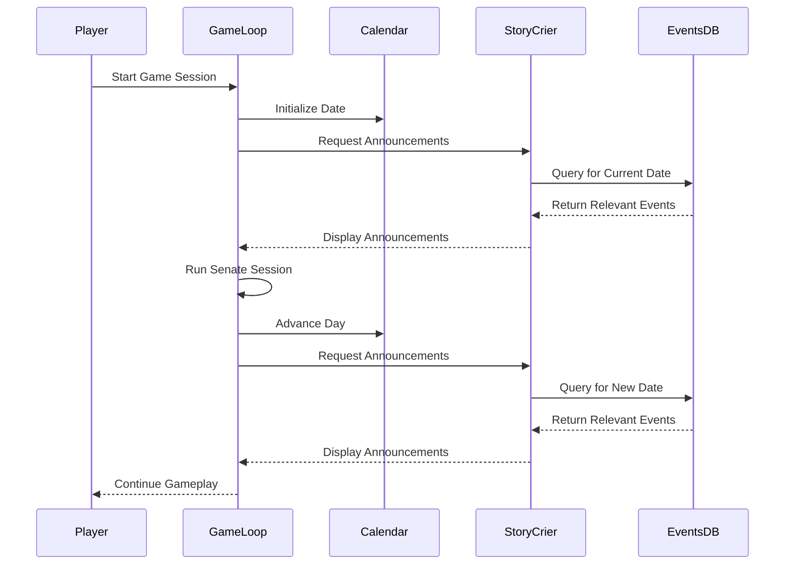

# Story Crier Component

**Author:** Documentation Team  
**Date:** April 15, 2025  
**Version:** 1.0.0  

## Table of Contents

- [Overview](#overview)
- [Components](#components)
  - [StoryCrierAgent](#storycrier-agent)
  - [Historical Events Database](#historical-events-database)
- [Integration in Game Flow](#integration-in-game-flow)
- [User Experience Enhancement](#user-experience-enhancement)
- [Technical Implementation](#technical-implementation)
  - [Event Selection Algorithm](#event-selection-algorithm)
  - [Display Formatting](#display-formatting)
- [Extending the Feature](#extending-the-feature)
  - [Adding New Historical Events](#adding-new-historical-events)
  - [Customizing Announcements](#customizing-announcements)

## Overview

The Story Crier feature brings the Roman world to life by announcing relevant historical events at the start of each day in the simulation. Functioning like a Roman town crier, this feature provides players with historical context, commemorates anniversaries of significant events, and creates a more immersive gameplay experience that connects the Senate proceedings to the broader historical timeline.

## Components

The Story Crier feature consists of two main components that work together to generate contextually appropriate historical announcements.

### StoryCrier Agent

The `StoryCrierAgent` class acts as a Roman town crier who announces historical events to the Senate. Key features include:

- Retrieves relevant historical events based on the current simulation date
- Formats announcements with distinctive styling
- Caches announcements for performance optimization
- Supports optional LLM integration for enhanced announcement generation

The agent displays announcements in stylized panels with a distinctive Roman-inspired font for the header, creating an immersive historical atmosphere at the start of each gameplay day.

### Historical Events Database

The `HistoricalEventsDatabase` provides the content for the Story Crier's announcements. This comprehensive database includes:

- Categorized historical events spanning Roman history
- Multiple event categories (political, military, religious, cultural, etc.)
- Varying levels of event importance (major, moderate, minor, background)
- Date-specific information when available
- Rich metadata including locations, people involved, and narrative hooks

The database contains both major historical turning points (like Caesar's assassination) and minor background events that add flavor to the simulation.

## Integration in Game Flow

The Story Crier feature is integrated into the game flow at two key points:

1. **Start of Game Session**: When a new game session begins, any relevant historical events for the starting date are announced.

2. **Between Senate Sessions**: After a Senate session concludes and the game advances to the next day, the Story Crier makes announcements for the new day.



This integration ensures players receive contextual historical information as they progress through the game, creating a more coherent narrative experience.

## User Experience Enhancement

The Story Crier feature enhances the user experience in several ways:

1. **Historical Immersion**: Connecting Senate gameplay to the broader Roman historical context

2. **Educational Value**: Teaching players about significant events in Roman history organically during gameplay

3. **Narrative Context**: Providing background that helps players understand the political climate of their current gameplay session

4. **Temporal Awareness**: Giving players a sense of time passing and historical progression as they advance through game days

### Example Announcements

```
𝕿𝖍𝖊 𝕿𝖔𝖜𝖓 𝕮𝖗𝖎𝖊𝖗 𝕬𝖓𝖓𝖔𝖚𝖓𝖈𝖊𝖒𝖊𝖓𝖙𝖘
━━━━━━━━━━━━━━━━━━━━━━━━━━━━━━━━━━━━━━━━━━━━━━━━━━━━━━━━━━━━

┌─────────────────────────── Assassination of Julius Caesar ───────────────────────────┐
│                                                                                      │
│ On the 15th day of March, in the year 44 BCE, Julius Caesar was assassinated in the  │
│ Senate House by a group of senators led by Marcus Junius Brutus and Gaius Cassius    │
│ Longinus, who feared his growing power and monarchical tendencies.                   │
│                                                                                      │
└──────────────────────────────────────────────────────────────────────────────────────┘

┌────────────────────────── Famous Gladiatorial Games of Crassus ──────────────────────────┐
│                                                                                           │
│ In the year 70 BCE, Marcus Licinius Crassus sponsored elaborate gladiatorial games to     │
│ gain public favor, featuring over 100 pairs of fighters.                                  │
│                                                                                           │
└───────────────────────────────────────────────────────────────────────────────────────────┘
```

## Technical Implementation

The Story Crier feature uses several technical approaches to ensure relevant, varied, and interesting announcements throughout gameplay.

### Event Selection Algorithm

The events selected for announcement are determined through an algorithm that considers:

1. **Date Relevance**: Events that occurred on the same calendar day (month and day)
2. **Recent Events**: Events that occurred within the last few years of the current game date
3. **Anniversaries**: Events whose anniversaries (5, 10, 25, 50, 100 years) align with the current date
4. **Importance Weighting**: Prioritizing more significant historical events
5. **Variety**: Ensuring a mix of event categories over time

This approach ensures players experience a blend of time-specific commemorations and generally relevant historical context throughout their gameplay.

### Display Formatting

Announcements are displayed with:

- Distinctive styling with yellow borders and decorative font for the header
- Clear title and formatted text structure
- Visual separation between individual announcements
- Consistent placement at key transition moments in gameplay

## Extending the Feature

Developers can extend the Story Crier feature in several ways:

### Adding New Historical Events

To add new historical events to the database:

1. Open `src/roman_senate/core/historical_events.py`
2. Locate the `_initialize_events` method in the `HistoricalEventsDatabase` class
3. Add new `HistoricalEvent` instances to the `self.events` list using the following pattern:

```python
HistoricalEvent(
    id=next_available_id,
    title="Event Title",
    description="Detailed description of the historical event.",
    year=-75,  # Use negative for BCE, positive for CE
    month=3,   # Optional: Month of event if known
    day=15,    # Optional: Day of event if known
    categories=[EventCategory.POLITICAL],  # List of relevant categories
    importance=EventImportance.MODERATE,   # MAJOR, MODERATE, MINOR, or BACKGROUND
    location="Rome",  # Optional: Location where event occurred
    people_involved=["Person A", "Person B"],  # Optional: Key figures
    source="Historical source reference",      # Optional: Source citation
    narrative_hooks=["Theme 1", "Theme 2"]     # Optional: Thematic elements
)
```

### Customizing Announcements

To modify how announcements are displayed:

1. Customize the `display_announcements` method in the `StoryCrierAgent` class
2. Adjust panel styling, formatting, or decorative elements
3. Consider adding animation effects or sound cues for enhanced immersion

For more complex customizations involving new LLM providers:

1. Initialize the `StoryCrierAgent` with a custom LLM provider
2. Implement extended announcement generation logic that utilizes the LLM
3. Add new event metadata to support richer LLM-based text generation