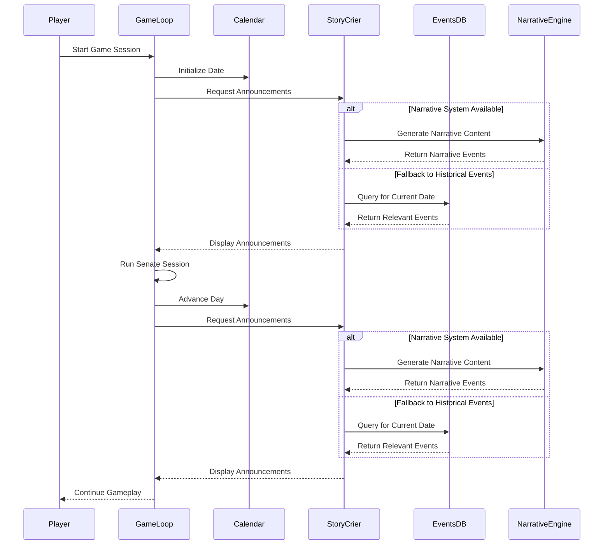

# Story Crier Component

**Author:** Documentation Team  
**Date:** April 17, 2025  
**Version:** 1.1.0  

## Table of Contents

- [Overview](#overview)
- [Components](#components)
  - [StoryCrierAgent](#storycrier-agent)
  - [Historical Events Database](#historical-events-database)
  - [Narrative System Integration](#narrative-system-integration)
- [Integration in Game Flow](#integration-in-game-flow)
- [User Experience Enhancement](#user-experience-enhancement)
- [Technical Implementation](#technical-implementation)
  - [Event Selection Algorithm](#event-selection-algorithm)
  - [Display Formatting](#display-formatting)
  - [Narrative Content Generation](#narrative-content-generation)
- [Extending the Feature](#extending-the-feature)
  - [Adding New Historical Events](#adding-new-historical-events)
  - [Customizing Announcements](#customizing-announcements)
  - [Enhancing Narrative Integration](#enhancing-narrative-integration)

## Overview

The Story Crier feature brings the Roman world to life by announcing relevant historical events and AI-generated narrative content at the start of each day in the simulation. Functioning like a Roman town crier, this feature provides players with historical context, commemorates anniversaries of significant events, and creates a more immersive gameplay experience that connects the Senate proceedings to the broader historical timeline and daily life in Rome.

## Components

The Story Crier feature consists of several components that work together to generate contextually appropriate historical and narrative announcements.

### StoryCrier Agent

The `StoryCrierAgent` class acts as a Roman town crier who announces historical events and narrative content to the Senate. Key features include:

- Retrieves relevant historical events based on the current simulation date
- Generates dynamic narrative content using the NarrativeEngine
- Formats announcements with distinctive styling
- Caches announcements for performance optimization
- Supports LLM integration for enhanced announcement generation

The agent displays announcements in stylized panels with a distinctive Roman-inspired font for the header, creating an immersive historical atmosphere at the start of each gameplay day.

### Historical Events Database

The `HistoricalEventsDatabase` provides historical content for the Story Crier's announcements. This comprehensive database includes:

- Categorized historical events spanning Roman history
- Multiple event categories (political, military, religious, cultural, etc.)
- Varying levels of event importance (major, moderate, minor, background)
- Date-specific information when available
- Rich metadata including locations, people involved, and narrative hooks

The database contains both major historical turning points (like Caesar's assassination) and minor background events that add flavor to the simulation.

### Narrative System Integration

The Story Crier now integrates with the Narrative System to generate dynamic, contextually relevant content:

- Uses the NarrativeEngine to generate daily events and rumors
- Provides narrative content that responds to the current game state
- Creates a more dynamic and responsive world that evolves with gameplay
- Ensures narrative consistency with previous events and game state

This integration allows the Story Crier to supplement historical events with AI-generated narrative content that reflects the current state of the simulation.

```python
# Example: Generating narrative content
narrative_events = story_crier.generate_narrative_content(count=3)
```

## Integration in Game Flow

The Story Crier feature is integrated into the game flow at two key points:

1. **Start of Game Session**: When a new game session begins, any relevant historical events and narrative content for the starting date are announced.

2. **Between Senate Sessions**: After a Senate session concludes and the game advances to the next day, the Story Crier makes announcements for the new day.



This integration ensures players receive contextual historical information and dynamic narrative content as they progress through the game, creating a more coherent and immersive narrative experience.

## User Experience Enhancement

The Story Crier feature enhances the user experience in several ways:

1. **Historical Immersion**: Connecting Senate gameplay to the broader Roman historical context

2. **Educational Value**: Teaching players about significant events in Roman history organically during gameplay

3. **Narrative Context**: Providing background that helps players understand the political climate of their current gameplay session

4. **Temporal Awareness**: Giving players a sense of time passing and historical progression as they advance through game days

5. **Dynamic World**: Creating a sense of a living, evolving world through AI-generated narrative content

### Example Announcements

```
𝕿𝖍𝖊 𝕿𝖔𝖜𝖓 𝕮𝖗𝖎𝖊𝖗 𝕬𝖓𝖓𝖔𝖚𝖓𝖈𝖊𝖒𝖊𝖓𝖙𝖘
━━━━━━━━━━━━━━━━━━━━━━━━━━━━━━━━━━━━━━━━━━━━━━━━━━━━━━━━━━━━

┌─────────────────────────── Assassination of Julius Caesar ───────────────────────────┐
│                                                                                      │
│ On the 15th day of March, in the year 44 BCE, Julius Caesar was assassinated in the  │
│ Senate House by a group of senators led by Marcus Junius Brutus and Gaius Cassius    │
│ Longinus, who feared his growing power and monarchical tendencies.                   │
│                                                                                      │
└──────────────────────────────────────────────────────────────────────────────────────┘

┌────────────────────────── Market Price Fluctuations ──────────────────────────┐
│                                                                                │
│ The grain markets in Rome are abuzz today as prices have risen slightly        │
│ following reports of delayed shipments from Sicily. Merchants at the Forum     │
│ Boarium are charging an extra denarius per modius, causing minor grumbling     │
│ among the plebeians. Marcus Licinius, a prominent grain merchant, assures      │
│ customers that new shipments are expected within days and prices should        │
│ stabilize soon.                                                                │
│                                                                                │
└────────────────────────────────────────────────────────────────────────────────┘
```

## Technical Implementation

The Story Crier feature uses several technical approaches to ensure relevant, varied, and interesting announcements throughout gameplay.

### Event Selection Algorithm

The events selected for announcement are determined through an algorithm that considers:

1. **Date Relevance**: Events that occurred on the same calendar day (month and day)
2. **Recent Events**: Events that occurred within the last few years of the current game date
3. **Anniversaries**: Events whose anniversaries (5, 10, 25, 50, 100 years) align with the current date
4. **Importance Weighting**: Prioritizing more significant historical events
5. **Variety**: Ensuring a mix of event categories over time

This approach ensures players experience a blend of time-specific commemorations and generally relevant historical context throughout their gameplay.

### Display Formatting

Announcements are displayed with:

- Distinctive styling with yellow borders and decorative font for the header
- Clear title and formatted text structure
- Visual separation between individual announcements
- Consistent placement at key transition moments in gameplay

### Narrative Content Generation

The Story Crier now leverages the Narrative System to generate dynamic content:

1. **Daily News Generation**: Creates daily events about life in Rome using the NarrativeEngine
   ```python
   daily_news = story_crier.generate_daily_news()
   ```

2. **Rumor Generation**: Produces rumors and gossip circulating in Rome
   ```python
   rumors = story_crier.generate_rumors()
   ```

3. **Narrative Integration**: Combines historical events with AI-generated narrative content
   ```python
   narrative_events = story_crier.generate_narrative_content()
   ```

4. **Fallback Mechanism**: Uses historical events when narrative generation is unavailable
   ```python
   if not narrative_events:
       announcements = get_announcements_for_current_date(...)
   ```

## Extending the Feature

Developers can extend the Story Crier feature in several ways:

### Adding New Historical Events

To add new historical events to the database:

1. Open `src/roman_senate/core/historical_events.py`
2. Locate the `_initialize_events` method in the `HistoricalEventsDatabase` class
3. Add new `HistoricalEvent` instances to the `self.events` list using the following pattern:

```python
HistoricalEvent(
    id=next_available_id,
    title="Event Title",
    description="Detailed description of the historical event.",
    year=-75,  # Use negative for BCE, positive for CE
    month=3,   # Optional: Month of event if known
    day=15,    # Optional: Day of event if known
    categories=[EventCategory.POLITICAL],  # List of relevant categories
    importance=EventImportance.MODERATE,   # MAJOR, MODERATE, MINOR, or BACKGROUND
    location="Rome",  # Optional: Location where event occurred
    people_involved=["Person A", "Person B"],  # Optional: Key figures
    source="Historical source reference",      # Optional: Source citation
    narrative_hooks=["Theme 1", "Theme 2"]     # Optional: Thematic elements
)
```

### Customizing Announcements

To modify how announcements are displayed:

1. Customize the `display_announcements` method in the `StoryCrierAgent` class
2. Adjust panel styling, formatting, or decorative elements
3. Consider adding animation effects or sound cues for enhanced immersion

For more complex customizations involving new LLM providers:

1. Initialize the `StoryCrierAgent` with a custom LLM provider
2. Implement extended announcement generation logic that utilizes the LLM
3. Add new event metadata to support richer LLM-based text generation

### Enhancing Narrative Integration

To enhance the integration with the Narrative System:

1. Modify the `generate_narrative_content` method to use different event types
   ```python
   def generate_narrative_content(self, event_types=None, count=3):
       if event_types is None:
           event_types = ["daily_event", "rumor"]
       return self.narrative_engine.generate_targeted_narrative(event_types, count)
   ```

2. Add custom event generators to the NarrativeEngine
   ```python
   from custom_generators import CustomEventGenerator
   narrative_engine.event_manager.register_generator(
       "custom_events", 
       CustomEventGenerator(llm_provider)
   )
   ```

3. Create specialized announcement formats for different event types
   ```python
   def display_announcements(self, announcements):
       for announcement in announcements:
           if announcement.get("type") == "rumor":
               # Use special styling for rumors
               self._display_rumor(announcement)
           else:
               # Use standard styling
               self._display_standard(announcement)