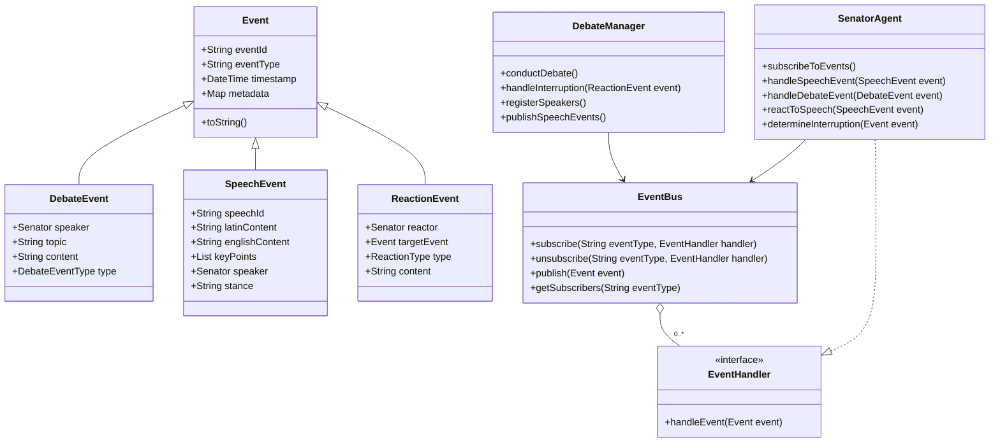
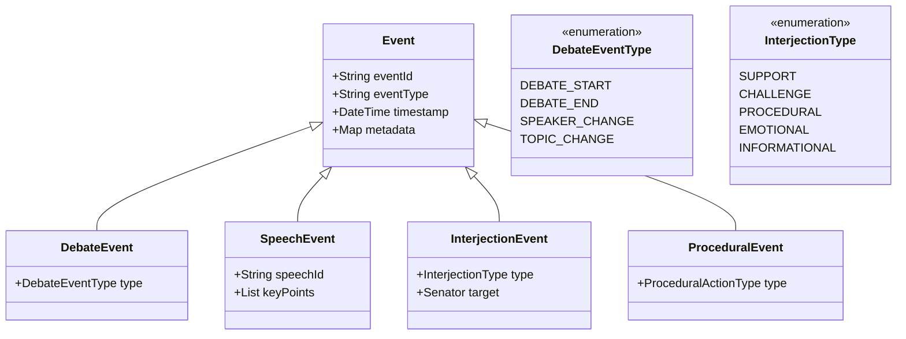
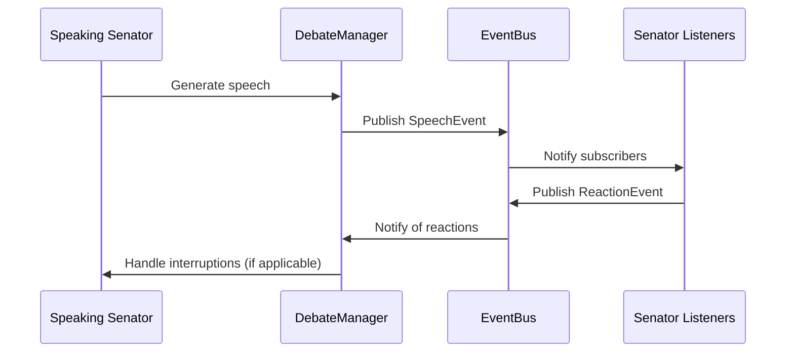

# Event-Driven Architecture for Roman Senate Simulation

## Overview

This document outlines an event-driven architecture to enhance the Roman Senate simulation by enabling senators to behave as true agents that observe, listen to, and react to events in their environment - particularly during debates.

Currently, the Roman Senate simulation has a relatively static debate system where senators take turns speaking but don't truly "listen" and react to each other dynamically. This architecture aims to create a more realistic and dynamic simulation experience.

## Architecture Diagram

### Core Components



### Event Class Hierarchy



### Event Flow Diagram



## 1. Core Event Infrastructure

### 1.1 Event Class Hierarchy

The event system will be built on a hierarchy of event classes:

- **Base Event Class**: Contains common properties for all events:
  - Unique identifier
  - Event type
  - Timestamp
  - Source entity (e.g., senator who generated the event)
  - Metadata relevant to the specific event type
  - Priority level (for interruption handling)

- **Specific Event Types**:
  - `SpeechEvent`: Represents a complete speech by a senator
  - `DebateEvent`: Represents debate-level events (start, end, topic change)
  - `ReactionEvent`: Represents a senator's reaction to another's speech
  - `InterjectionEvent`: Represents an interruption during a speech
  - `ProceduralEvent`: Represents procedural actions in the senate

### 1.2 Event Bus / Manager

The `EventBus` will be the central component responsible for:

- Event distribution using the publisher-subscriber pattern
- Managing event subscriptions
- Prioritizing events based on senator rank where applicable

The implementation will support:

- Subscribing to specific event types
- Unsubscribing from event types
- Publishing events to all relevant subscribers
- Prioritizing event handling based on senator rank for interruptions

### 1.3 Standard Event Data Structure

Every event will include standard fields to ensure consistency:

- `eventId`: Unique identifier (UUID)
- `eventType`: String identifier for the event type
- `timestamp`: When the event occurred
- `source`: The entity that generated the event
- `metadata`: Event-specific data
- `priority`: Optional priority level for handling order

## 2. Senator Agent Listening Capabilities

### 2.1 Event Subscription Mechanism

Senator agents will subscribe to relevant event types:

- Senators will register for events during initialization
- Each senator will primarily listen for debate and speech events
- Senators can subscribe to both broad event types and specific event instances
- Subscription will be handled by the central EventBus

### 2.2 Event Processing Patterns

Senator agents will implement the `EventHandler` interface to process events:

- Each senator will have specific handler methods for different event types
- Handlers will process event content and determine appropriate reactions
- Reaction logic will consider the senator's faction, relationships, and personality
- Event handling will respect the priority based on senator rank

### 2.3 Agent Memory Integration

The `AgentMemory` class will be extended to store:

- Events the senator has observed
- The senator's reactions to events
- Contextual information for future decision-making

This integration will allow senators to:

- Reference past speeches and reactions
- Consider accumulated evidence when changing positions
- Build relationships based on interaction history
- Develop consistent behavior patterns over time

## 3. Dynamic Debate Enhancements

### 3.1 Real-time Reactions

The event system will enable senators to react in real-time to speeches:

- Senators will listen to speeches as they occur
- Based on speech content, faction alignment, and relationships, senators will generate appropriate reactions
- Reactions can range from subtle acknowledgments to vocalized interruptions
- The reaction mechanism will respect the existing interjection system but enhance it with greater contextual awareness

### 3.2 Interruption Handling

Interruptions will be based primarily on senator rank/seniority:

- Higher-ranking senators will have greater ability to interrupt
- Interruption events will have priority based on senator rank
- The debate manager will determine whether to allow an interruption based on:
  - The rank of the interrupting senator
  - The rank of the speaking senator
  - The type of interruption (procedural interruptions may be given higher priority)

### 3.3 Position Changes

Senators can change positions based on debate progression:

- Convincing arguments may cause senators to reconsider their stance
- Position changes will be published as events
- Other senators can react to position changes
- The memory system will track changes in stance over time

## 4. Application Beyond Debates

While the initial focus is on enhancing debates, the event system is designed to be applicable to other aspects of the simulation:

- **Voting Behavior**: Events can influence how senators vote
- **Procedural Actions**: The event system can handle procedural motions and responses
- **Between-Session Activities**: Senators can react to events between formal senate sessions

The architecture provides extension points for these future enhancements.

## 5. Integration Points

### 5.1 Integration with Existing Debate System

The event system will integrate with the existing debate system:

- The `debate.py` module will be modified to publish events via the EventBus
- Speech generation will remain unchanged but will generate SpeechEvents
- The `conduct_debate` method will be enhanced to process interruptions and reactions
- Visual display of speeches will be augmented to show reactions

### 5.2 Integration with Agent Memory and Decision-Making

Agent memory will be enhanced to:

- Store relevant events
- Use event history in decision-making
- Track relationships based on event interactions

### 5.3 Integration with Wider Simulation Components

The event system will connect to:

- Game state management
- Senate session flow
- Player interaction (where applicable)

## 6. Implementation Roadmap

### Phase 1: Core Event Infrastructure (2-3 weeks)

1. Create the base `Event` class and common event types
2. Implement the `EventBus` with subscription management
3. Add event prioritization based on senator rank
4. Develop unit tests for the event system

### Phase 2: Senator Agent Enhancement (2 weeks)

1. Extend `SenatorAgent` to implement `EventHandler`
2. Add event subscription capabilities to senators
3. Implement event processing logic
4. Enhance `AgentMemory` to store event-related information
5. Test senator reactions to different event types

### Phase 3: Debate System Integration (2-3 weeks)

1. Modify `debate.py` to use the event system
2. Convert speech generation to publish events
3. Implement interruption handling based on seniority
4. Add visual indication of reactions in the UI
5. Test debate flows with the new event system

### Phase 4: Polishing and Optimization (1-2 weeks)

1. Refine event priorities and handling
2. Optimize performance for multiple senators
3. Add detailed logging of event flows
4. Create documentation for the event system
5. Implement mock tests for the entire debate flow

## 7. Code Examples

### 7.1 Event Base Class

```python
class Event:
    """Base class for all events in the system."""
    
    def __init__(self, event_type, source=None, metadata=None):
        """Initialize a new event."""
        self.event_id = str(uuid.uuid4())
        self.event_type = event_type
        self.timestamp = datetime.now().isoformat()
        self.source = source
        self.metadata = metadata or {}
        
    def to_dict(self):
        """Convert the event to a dictionary."""
        return {
            "event_id": self.event_id,
            "event_type": self.event_type,
            "timestamp": self.timestamp,
            "source": getattr(self.source, "name", str(self.source)) if self.source else None,
            "metadata": self.metadata
        }
```

### 7.2 Speech Event Class

```python
class SpeechEvent(Event):
    """Event representing a speech in the senate."""
    
    TYPE = "speech"
    
    def __init__(self, speaker, topic, latin_content, english_content, stance, key_points=None):
        """Initialize a new speech event."""
        super().__init__(
            event_type=self.TYPE,
            source=speaker,
            metadata={
                "topic": topic,
                "stance": stance
            }
        )
        self.speech_id = str(uuid.uuid4())
        self.latin_content = latin_content
        self.english_content = english_content
        self.key_points = key_points or []
        self.speaker = speaker
        self.stance = stance
```

### 7.3 Event Bus Implementation

```python
class EventBus:
    """Central event distribution system."""
    
    def __init__(self):
        """Initialize the event bus."""
        self.subscribers = defaultdict(list)
        self.logger = logging.getLogger(__name__)
        
    def subscribe(self, event_type, handler):
        """Subscribe to events of a specific type."""
        self.subscribers[event_type].append(handler)
        self.logger.debug(f"Subscribed handler to {event_type} events")
        
    def unsubscribe(self, event_type, handler):
        """Unsubscribe from events of a specific type."""
        if event_type in self.subscribers:
            self.subscribers[event_type] = [h for h in self.subscribers[event_type] if h != handler]
        
    async def publish(self, event):
        """Publish an event to all subscribers."""
        self.logger.debug(f"Publishing event: {event.event_type}")
        
        if event.event_type not in self.subscribers:
            return
            
        # Sort handlers by priority if the event type supports it
        handlers = self.subscribers[event.event_type]
        if hasattr(event, 'priority') and event.priority:
            # Sort handlers based on senator rank if handlers are senator agents
            handlers = sorted(handlers, 
                             key=lambda h: getattr(h, 'senator', {}).get('rank', 0) 
                             if hasattr(h, 'senator') else 0,
                             reverse=True)
            
        # Notify all subscribers
        for handler in handlers:
            try:
                await handler(event)
            except Exception as e:
                self.logger.error(f"Error in event handler: {e}")
```

### 7.4 SenatorAgent Integration

```python
class SenatorAgent:
    """
    Agent-based implementation of a Roman Senator with event handling capabilities.
    """
    
    def __init__(self, senator, llm_provider, event_bus):
        """Initialize a senator agent."""
        self.senator = senator
        self.memory = AgentMemory()
        self.llm_provider = llm_provider
        self.current_stance = None
        self.event_bus = event_bus
        
        # Subscribe to relevant event types
        self.event_bus.subscribe(SpeechEvent.TYPE, self.handle_speech_event)
        self.event_bus.subscribe(DebateEvent.TYPE, self.handle_debate_event)
        
    async def handle_speech_event(self, event):
        """Handle a speech event."""
        # Skip own speeches
        if event.speaker.get('id') == self.senator.get('id'):
            return
            
        # Record speech in memory
        self.memory.add_observation(f"Heard {event.speaker.get('name')} speak about {event.metadata.get('topic')} with stance {event.stance}")
        
        # Determine if senator should react
        if self._should_react_to_speech(event):
            reaction = await self._generate_reaction(event)
            
            # Publish reaction event
            reaction_event = ReactionEvent(
                reactor=self.senator,
                target_event=event,
                reaction_type=reaction.get('type'),
                content=reaction.get('content')
            )
            await self.event_bus.publish(reaction_event)
```

## Conclusion

This event-driven architecture will significantly enhance the realism and dynamism of the Roman Senate simulation. By enabling senators to truly listen and react to each other, the simulation will better capture the complex interpersonal dynamics of the historical Roman Senate.

The architecture has been designed with a focus on:
1. A robust core event infrastructure
2. Enhanced senator agent listening capabilities 
3. Dynamic debate improvements
4. Extensibility for future enhancements
5. Backward compatibility with existing code

With this architecture in place, the Roman Senate simulation will provide a more immersive and historically authentic experience.