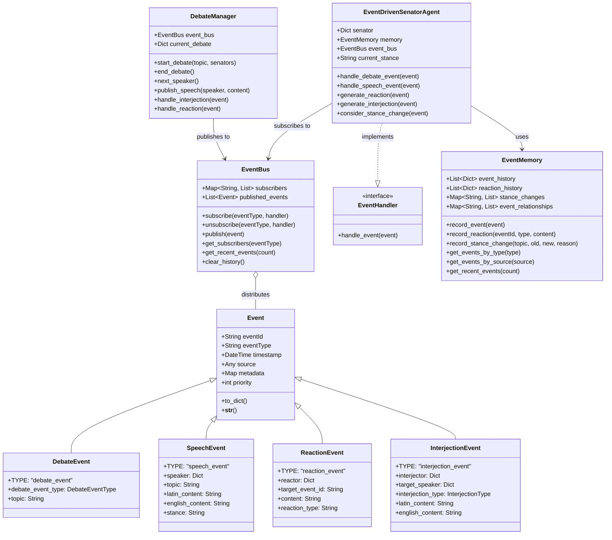
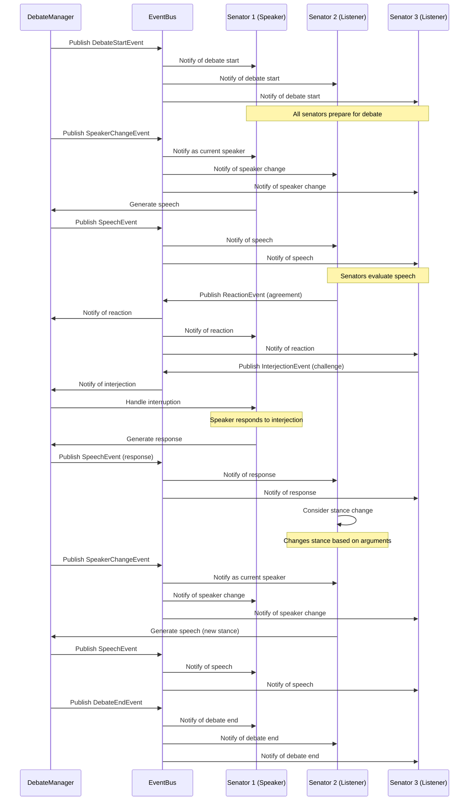
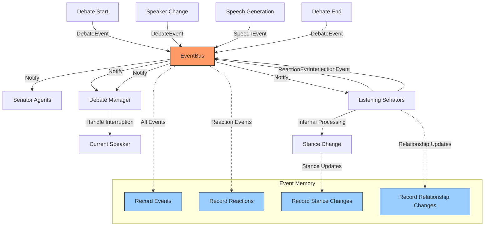

# Roman Senate Event System

**Author:** Documentation Team  
**Version:** 1.2.0  
**Date:** April 18, 2025

## Overview

The Roman Senate Event System is a comprehensive event-driven architecture that enhances the simulation's realism by enabling senators to observe, listen to, and react to events in their environment - particularly during debates. This system transforms the simulation from a static turn-based debate into a dynamic, interactive experience where senators can interrupt, react, and change their positions based on the flow of discussion.

## Table of Contents

- [System Overview](#system-overview)
- [Key Features](#key-features)
- [Architecture Highlights](#architecture-highlights)
- [Component Interaction](#component-interaction)
- [Event Flow Visualization](#event-flow-visualization)
- [Core Components](#core-components)
- [Documentation Structure](#documentation-structure)
- [Getting Started](#getting-started)
- [Recent Enhancements](#recent-enhancements)
- [Troubleshooting](#troubleshooting)

## System Overview

The Roman Senate simulation has been enhanced with a robust event-driven architecture that enables:

1. **Real-time Reactions**: Senators can react to speeches as they happen, showing agreement, disagreement, or other emotions.
2. **Dynamic Interruptions**: Higher-ranking senators can interrupt speakers, with the interruption system respecting the Roman social hierarchy.
3. **Position Changes**: Senators can be persuaded to change their stance on topics based on compelling arguments.
4. **Memory of Events**: Senators remember events, reactions, and interactions, building a history that influences future decisions.
5. **Comprehensive Logging**: Detailed logging of all events for debugging and analysis.
6. **Relationship Development**: Senators develop relationships based on interactions, affecting future debates.
7. **Faction Dynamics**: Faction alignments influence reactions and interruptions, creating realistic political dynamics.

This event system creates a more realistic and immersive simulation of the Roman Senate, where debates are not just sequential speeches but dynamic interactions between senators with different ranks, factions, and personalities.

## Key Features

### Event-Driven Architecture

The system is built on a publisher-subscriber (pub/sub) pattern:
- Events are published to a central `EventBus`
- Senators and other components subscribe to relevant event types
- When events occur, all subscribers are notified and can react
- Events are prioritized based on senator rank and event importance
- Event history is maintained for analysis and state reconstruction

### Senator Listening Capabilities

Senators are now active listeners who:
- Observe speeches and other events
- Process event content to determine appropriate reactions
- Generate reactions based on relationships, faction alignment, and personality
- May interrupt speeches based on rank and the importance of their point
- Can change their stance on topics based on persuasive arguments
- Remember past interactions and use them to inform future decisions

### Dynamic Debate Enhancements

Debates are now more dynamic with:
- Real-time reactions to speeches
- Interruptions based on senator rank
- Position changes influenced by persuasive arguments
- Relationship development based on interactions
- Memory of past events affecting future decisions
- Faction-based alliances and oppositions
- Realistic political maneuvering

### Comprehensive Logging System

The system includes robust logging that:
- Tracks all events and interactions
- Provides different verbosity levels for debugging
- Timestamps events for analysis
- Supports both console and file output
- Configurable through command-line options
- Color-coded console output for better readability
- Rotation of log files to prevent excessive size

## Architecture Highlights

The event system is built around these core components:



For more detailed architecture information, see the [Architecture Documentation](architecture.md).

## Component Interaction

The following sequence diagram illustrates how components interact during a debate:



## Event Flow Visualization

This diagram shows the flow of events through the system during a typical debate:



## Core Components

### Event Base Class

The `Event` class is the foundation of the event system:

```python
class Event:
    """
    Base class for all events in the system.
    
    All events have a unique identifier, type, timestamp, source, and optional metadata.
    """
    
    def __init__(self, event_type: str, source: Any = None, metadata: Optional[Dict[str, Any]] = None):
        self.event_id = str(uuid.uuid4())
        self.event_type = event_type
        self.timestamp = datetime.now().isoformat()
        self.source = source
        self.metadata = metadata or {}
        self.priority = 0  # Default priority (higher values = higher priority)
```

### EventBus

The `EventBus` is the central hub for event distribution:

```python
class EventBus:
    """
    Central event distribution system implementing the publisher-subscriber pattern.
    """
    
    def __init__(self):
        # Map of event_type -> list of handler functions/objects
        self.subscribers = defaultdict(list)
        # Set of all events that have been published (for debugging/history)
        self.published_events = []
        # Maximum events to keep in history
        self.max_history = 100
        
    def subscribe(self, event_type: str, handler: Union[EventHandler, Callable[[Event], Any]]) -> None:
        """Subscribe to events of a specific type."""
        if handler not in self.subscribers[event_type]:
            self.subscribers[event_type].append(handler)
            
    async def publish(self, event: Event) -> None:
        """Publish an event to all subscribers."""
        # Add to history
        self.published_events.append(event)
        
        # Notify subscribers
        for handler in self.subscribers.get(event.event_type, []):
            try:
                if hasattr(handler, 'handle_event'):
                    await handler.handle_event(event)
                else:
                    result = handler(event)
                    if asyncio.iscoroutine(result):
                        await result
            except Exception as e:
                logger.error(f"Error in event handler: {e}", exc_info=True)
```

### Event-Driven Senator Agent

The `EventDrivenSenatorAgent` is a senator that can react to events:

```python
class EventDrivenSenatorAgent(SenatorAgent):
    """
    Event-driven implementation of a Roman Senator agent.
    
    This agent can listen to events, react to speeches, and participate
    in debates through the event system.
    """
    
    def __init__(self, senator: Dict[str, Any], llm_provider: LLMProvider, event_bus: EventBus):
        super().__init__(senator, llm_provider)
        self.event_bus = event_bus
        self.memory = EventMemory()
        
        # Subscribe to relevant events
        self.event_bus.subscribe(SpeechEvent.TYPE, self.handle_speech_event)
        self.event_bus.subscribe(DebateEvent.TYPE, self.handle_debate_event)
        
    async def handle_speech_event(self, event: SpeechEvent) -> None:
        """Handle a speech event."""
        # Record the event
        self.memory.record_event(event)
        
        # Don't react to our own speeches
        if event.speaker.get("name") == self.name:
            return
            
        # Decide whether to react
        should_react = await self._should_react_to_speech(event)
        if should_react:
            await self._generate_and_publish_reaction(event)
            
        # Decide whether to interject
        should_interject = await self._should_interject(event)
        if should_interject:
            await self._generate_and_publish_interjection(event)
            
        # Consider changing stance based on the speech
        await self._consider_stance_change(event)
```

### Debate Manager

The `DebateManager` coordinates debates through events:

```python
class DebateManager:
    """
    Manages debates using the event system.
    
    This class coordinates the flow of a debate, including:
    - Starting and ending debates
    - Managing speakers
    - Publishing speeches
    - Handling interruptions
    """
    
    def __init__(self, event_bus: EventBus, config: Dict[str, Any] = None):
        self.event_bus = event_bus
        self.config = config or {}
        self.current_debate = None
        self.current_speaker = None
        self.speakers_queue = []
        
        # Subscribe to relevant events
        self.event_bus.subscribe(InterjectionEvent.TYPE, self.handle_interjection)
        self.event_bus.subscribe(ReactionEvent.TYPE, self.handle_reaction)
        
    async def start_debate(self, topic: str, senators: List[Dict[str, Any]]) -> None:
        """Start a new debate on the given topic."""
        self.current_debate = {
            "topic": topic,
            "participants": senators,
            "start_time": datetime.now().isoformat()
        }
        self.speakers_queue = senators.copy()
        
        # Publish debate start event
        await self.event_bus.publish(DebateEvent(
            debate_event_type=DebateEventType.DEBATE_START,
            topic=topic,
            metadata={"participants": [s.get("name") for s in senators]}
        ))
```

### Event Memory

The `EventMemory` stores and retrieves events:

```python
class EventMemory(AgentMemory):
    """
    Enhanced memory for event-driven senator agents.
    
    This class extends the base AgentMemory with capabilities for storing
    and retrieving events, reactions, and event-related context.
    """
    
    def __init__(self):
        super().__init__()
        # Store observed events
        self.event_history = []
        # Store reactions to events
        self.reaction_history = []
        # Store stance changes triggered by events
        self.stance_changes = {}
        # Track event-based relationships
        self.event_relationships = {}
        
    def record_event(self, event: Event) -> None:
        """Record an observed event in memory."""
        # Store basic event data
        event_data = {
            "event_id": event.event_id,
            "event_type": event.event_type,
            "timestamp": event.timestamp,
            "source": getattr(event.source, "name", str(event.source)) if event.source else "Unknown",
            "metadata": event.metadata.copy(),
            "recorded_at": datetime.now().isoformat()
        }
        
        # Add to event history
        self.event_history.append(event_data)
```

## Documentation Structure

This documentation package includes:

- **[User Guide](user_guide.md)**: How to run the simulation with the new features
- **[Developer Guide](developer_guide.md)**: How to extend and work with the event system
- **[Architecture Documentation](architecture.md)**: Detailed system design and component relationships
- **[Example Usage](examples.md)**: Code examples and usage patterns
- **[Quick Start Guide](quick_start.md)**: Essential information to get started quickly
- **[Integration Guide](integration_guide.md)**: How to integrate existing code with the event system
- **[Extending Events](extending_events.md)**: Guide to creating new event types and handlers
- **[Test Fixes](test_fixes.md)**: Guide to fixing common test issues

## Getting Started

To quickly see the event system in action:

```bash
# Run the event system demo
python -m src.roman_senate.examples.event_system_demo

# Run a full simulation with verbose logging
python -m src.roman_senate.cli simulate --verbose

# Run a debate with specific logging level
python -m src.roman_senate.cli play --log-level DEBUG

# Run a simulation with custom log file
python -m src.roman_senate.cli simulate --log-file my_simulation.log

# Run a simulation with specific event types enabled
python -m src.roman_senate.cli simulate --enable-reactions --enable-interruptions
```

For more detailed usage instructions, see the [User Guide](user_guide.md).

## Recent Enhancements

The event system has recently undergone several major enhancements:

1. **CLI Import Fix**: Resolved relative import issues in cli.py, ensuring the system works correctly when run from different contexts.

2. **Comprehensive Logging System**: Added robust file and console logging with configuration options:
   - Configurable log levels (DEBUG, INFO, WARNING, ERROR, CRITICAL)
   - Timestamped log files
   - Console output with color-coded messages
   - Command-line options for customization
   - Log rotation to prevent excessive file sizes
   - Context-aware logging with source identification

3. **Event-Driven Architecture**: Implemented a publisher-subscriber system enabling senators to react dynamically:
   - Central EventBus for event distribution
   - Event prioritization based on senator rank
   - Memory of events and reactions
   - Relationship tracking based on interactions
   - Stance changes influenced by persuasive arguments
   - Realistic interruption mechanics based on Roman social hierarchy

4. **Testing Framework**: Created comprehensive tests for the new event system:
   - Unit tests for individual components
   - Integration tests for component interactions
   - Scenario tests for realistic use cases
   - Mock LLM provider for testing without API calls
   - Performance tests for system scalability
   - Regression tests to prevent regressions

## Troubleshooting

Common issues and their solutions:

### Events Not Being Received

**Problem**: Components are publishing events but subscribers aren't receiving them.

**Solution**:
- Verify that subscribers are registered with the correct event type
- Check for typos in event type strings
- Ensure all async methods are properly awaited
- Add debug logging to track event flow

### Circular Event References

**Problem**: Infinite loops of events being published.

**Solution**:
- Implement event deduplication
- Add circuit breakers to prevent infinite loops
- Use event metadata to track event chains
- Implement rate limiting for event handlers

### Memory Leaks

**Problem**: Event history growing too large over time.

**Solution**:
- Set appropriate limits for event history
- Implement periodic cleanup of old events
- Use weak references for event sources
- Monitor memory usage during long simulations

For a quick introduction to the system, see the [Quick Start Guide](quick_start.md).