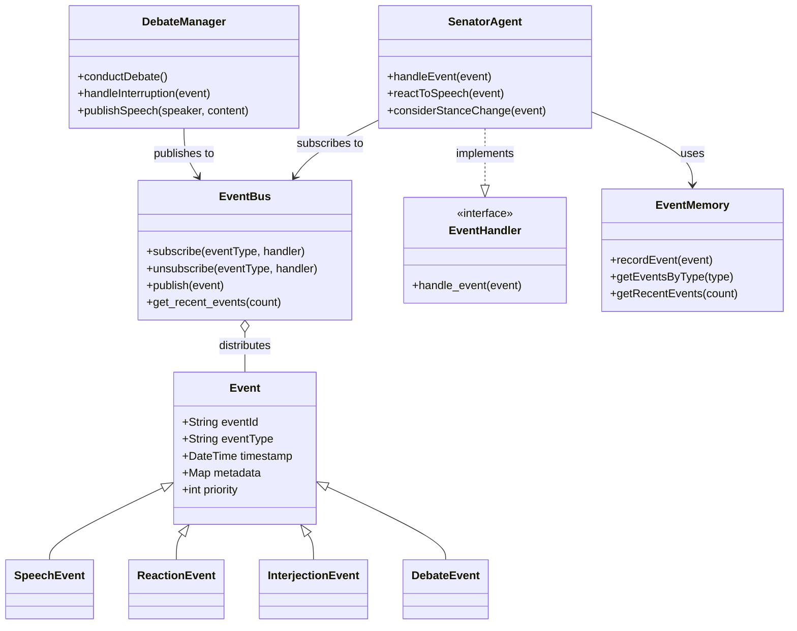
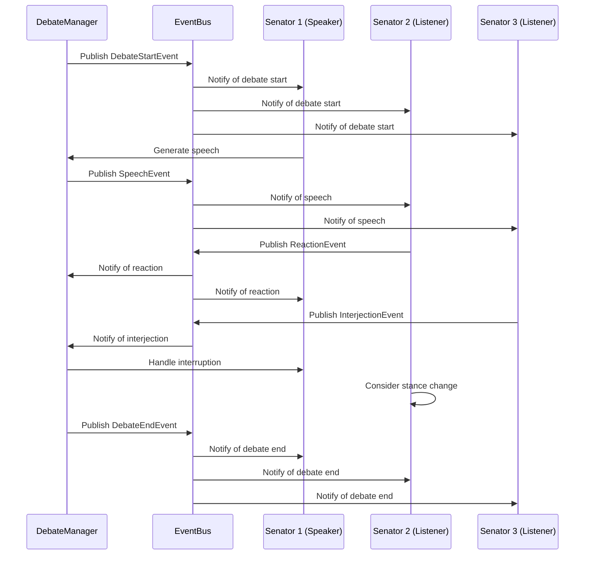

# Roman Senate Event System

**Author:** Documentation Team  
**Version:** 1.1.0  
**Date:** April 18, 2025

## Overview

The Roman Senate Event System is a comprehensive event-driven architecture that enhances the simulation's realism by enabling senators to observe, listen to, and react to events in their environment - particularly during debates. This system transforms the simulation from a static turn-based debate into a dynamic, interactive experience where senators can interrupt, react, and change their positions based on the flow of discussion.

## Table of Contents

- [System Overview](#system-overview)
- [Key Features](#key-features)
- [Architecture Highlights](#architecture-highlights)
- [Component Interaction](#component-interaction)
- [Documentation Structure](#documentation-structure)
- [Getting Started](#getting-started)
- [Recent Enhancements](#recent-enhancements)

## System Overview

The Roman Senate simulation has been enhanced with a robust event-driven architecture that enables:

1. **Real-time Reactions**: Senators can react to speeches as they happen, showing agreement, disagreement, or other emotions.
2. **Dynamic Interruptions**: Higher-ranking senators can interrupt speakers, with the interruption system respecting the Roman social hierarchy.
3. **Position Changes**: Senators can be persuaded to change their stance on topics based on compelling arguments.
4. **Memory of Events**: Senators remember events, reactions, and interactions, building a history that influences future decisions.
5. **Comprehensive Logging**: Detailed logging of all events for debugging and analysis.

This event system creates a more realistic and immersive simulation of the Roman Senate, where debates are not just sequential speeches but dynamic interactions between senators with different ranks, factions, and personalities.

## Key Features

### Event-Driven Architecture

The system is built on a publisher-subscriber (pub/sub) pattern:
- Events are published to a central `EventBus`
- Senators and other components subscribe to relevant event types
- When events occur, all subscribers are notified and can react
- Events are prioritized based on senator rank and event importance

### Senator Listening Capabilities

Senators are now active listeners who:
- Observe speeches and other events
- Process event content to determine appropriate reactions
- Generate reactions based on relationships, faction alignment, and personality
- May interrupt speeches based on rank and the importance of their point
- Can change their stance on topics based on persuasive arguments

### Dynamic Debate Enhancements

Debates are now more dynamic with:
- Real-time reactions to speeches
- Interruptions based on senator rank
- Position changes influenced by persuasive arguments
- Relationship development based on interactions
- Memory of past events affecting future decisions

### Comprehensive Logging

The system includes robust logging that:
- Tracks all events and interactions
- Provides different verbosity levels for debugging
- Timestamps events for analysis
- Supports both console and file output
- Configurable through command-line options

## Architecture Highlights

The event system is built around these core components:



For more detailed architecture information, see the [Architecture Documentation](architecture.md).

## Component Interaction

The following sequence diagram illustrates how components interact during a debate:



## Documentation Structure

This documentation package includes:

- **[User Guide](user_guide.md)**: How to run the simulation with the new features
- **[Developer Guide](developer_guide.md)**: How to extend and work with the event system
- **[Architecture Documentation](architecture.md)**: Detailed system design and component relationships
- **[Example Usage](examples.md)**: Code examples and usage patterns
- **[Quick Start Guide](quick_start.md)**: Essential information to get started quickly
- **[Integration Guide](integration_guide.md)**: How to integrate existing code with the event system
- **[Extending Events](extending_events.md)**: Guide to creating new event types and handlers

## Getting Started

To quickly see the event system in action:

```bash
# Run the event system demo
python -m src.roman_senate.examples.event_system_demo

# Run a full simulation with verbose logging
python -m src.roman_senate.cli simulate --verbose

# Run a debate with specific logging level
python -m src.roman_senate.cli play --log-level DEBUG

# Run a simulation with custom log file
python -m src.roman_senate.cli simulate --log-file my_simulation.log
```

For more detailed usage instructions, see the [User Guide](user_guide.md).

## Recent Enhancements

The event system has recently undergone several major enhancements:

1. **CLI Import Fix**: Resolved relative import issues in cli.py, ensuring the system works correctly when run from different contexts.

2. **Comprehensive Logging System**: Added robust file and console logging with configuration options:
   - Configurable log levels (DEBUG, INFO, WARNING, ERROR, CRITICAL)
   - Timestamped log files
   - Console output with color-coded messages
   - Command-line options for customization

3. **Event-Driven Architecture**: Implemented a publisher-subscriber system enabling senators to react dynamically:
   - Central EventBus for event distribution
   - Event prioritization based on senator rank
   - Memory of events and reactions
   - Relationship tracking based on interactions

4. **Testing Framework**: Created comprehensive tests for the new event system:
   - Unit tests for individual components
   - Integration tests for component interactions
   - Scenario tests for realistic use cases
   - Mock LLM provider for testing without API calls

For a quick introduction to the system, see the [Quick Start Guide](quick_start.md).