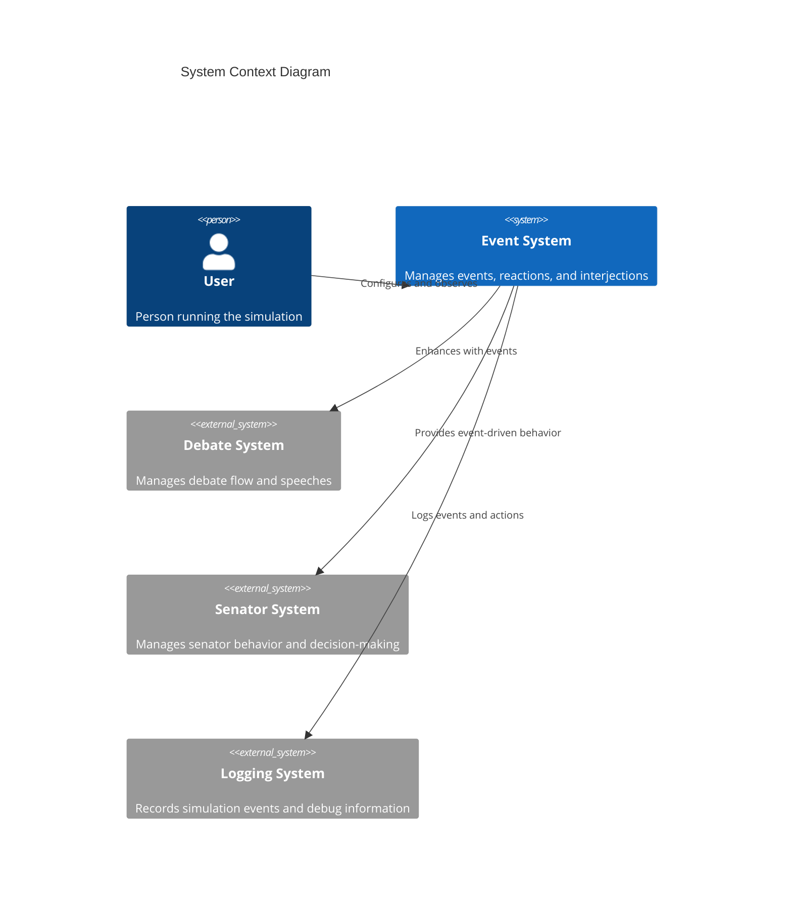
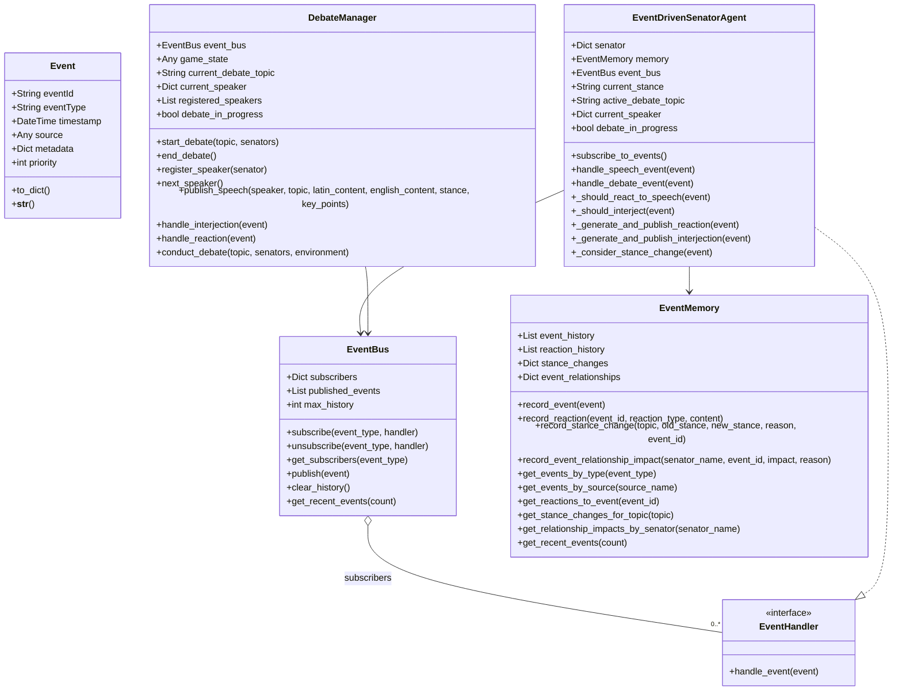
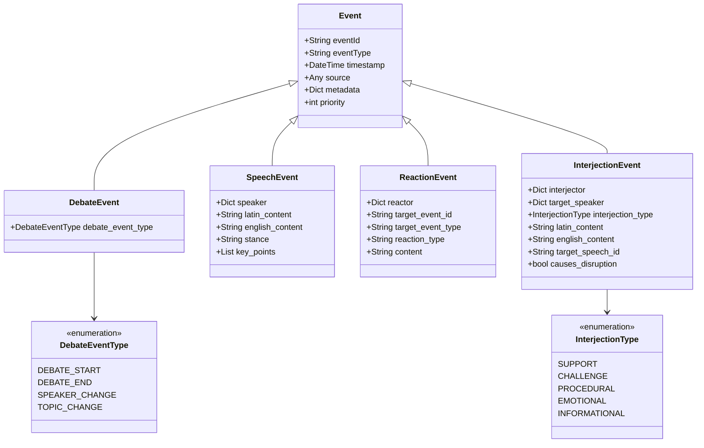
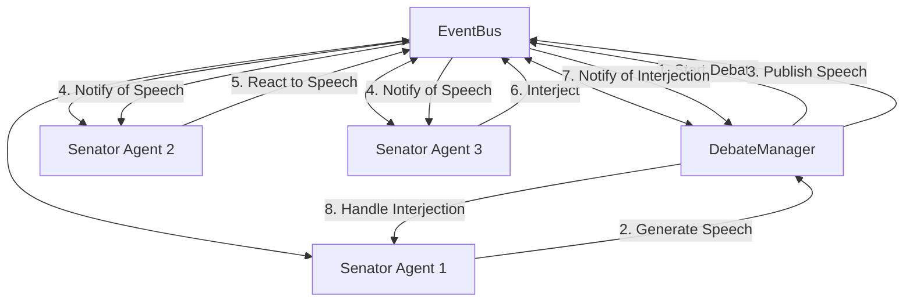
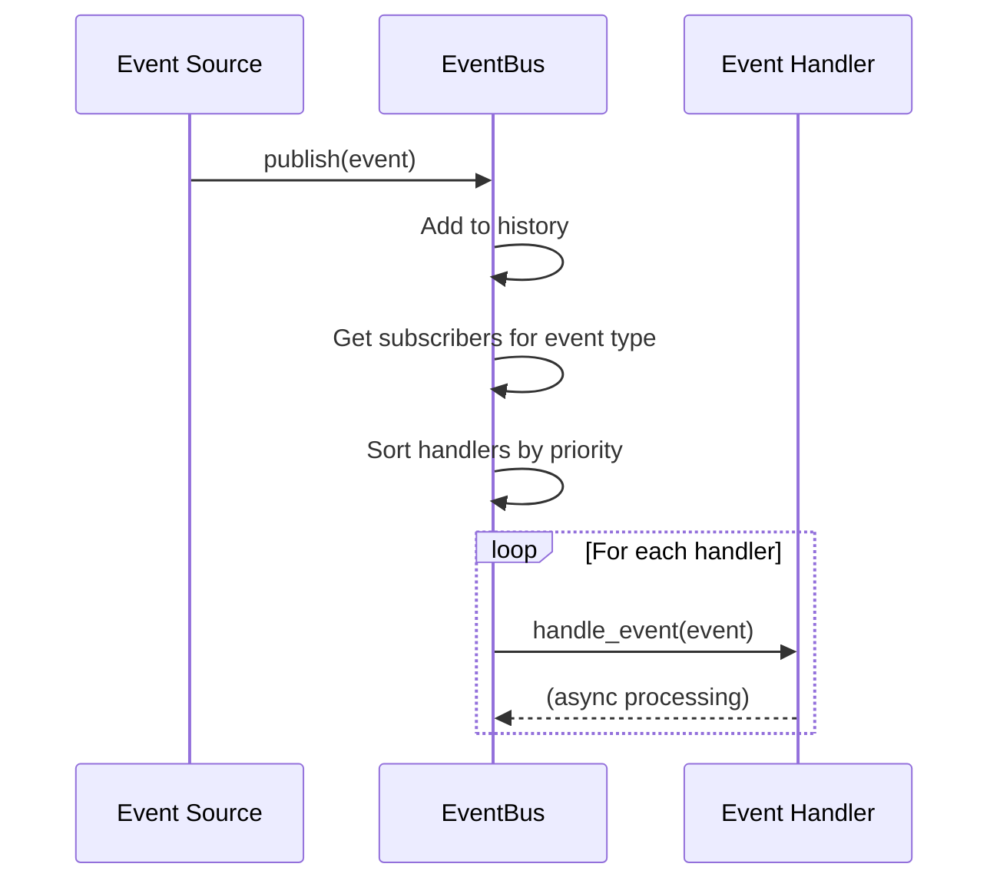
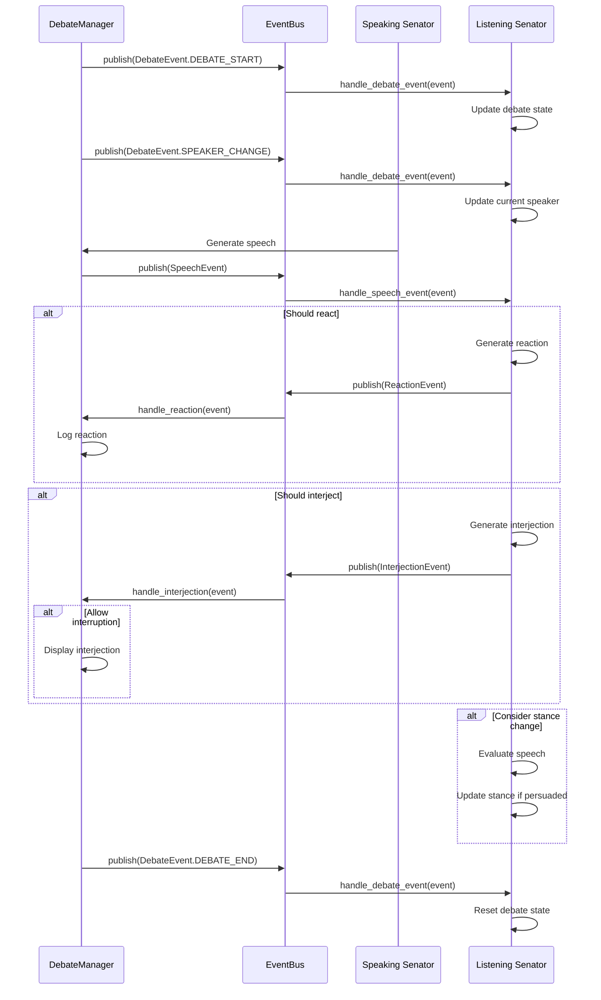
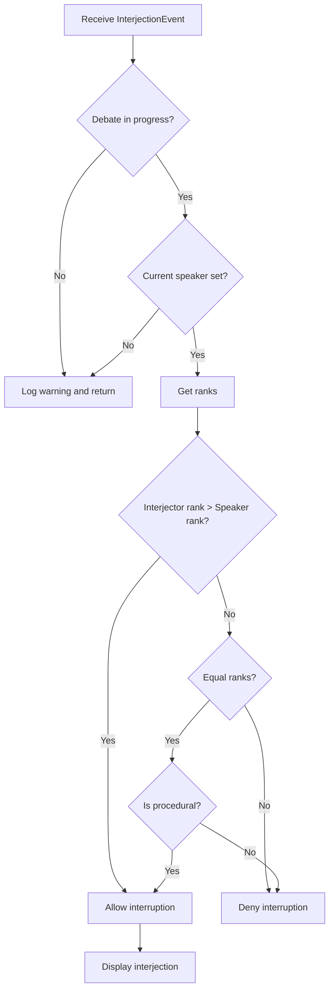
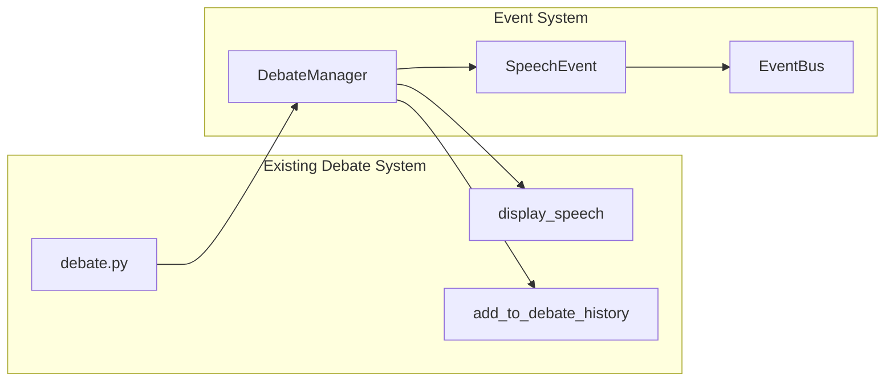
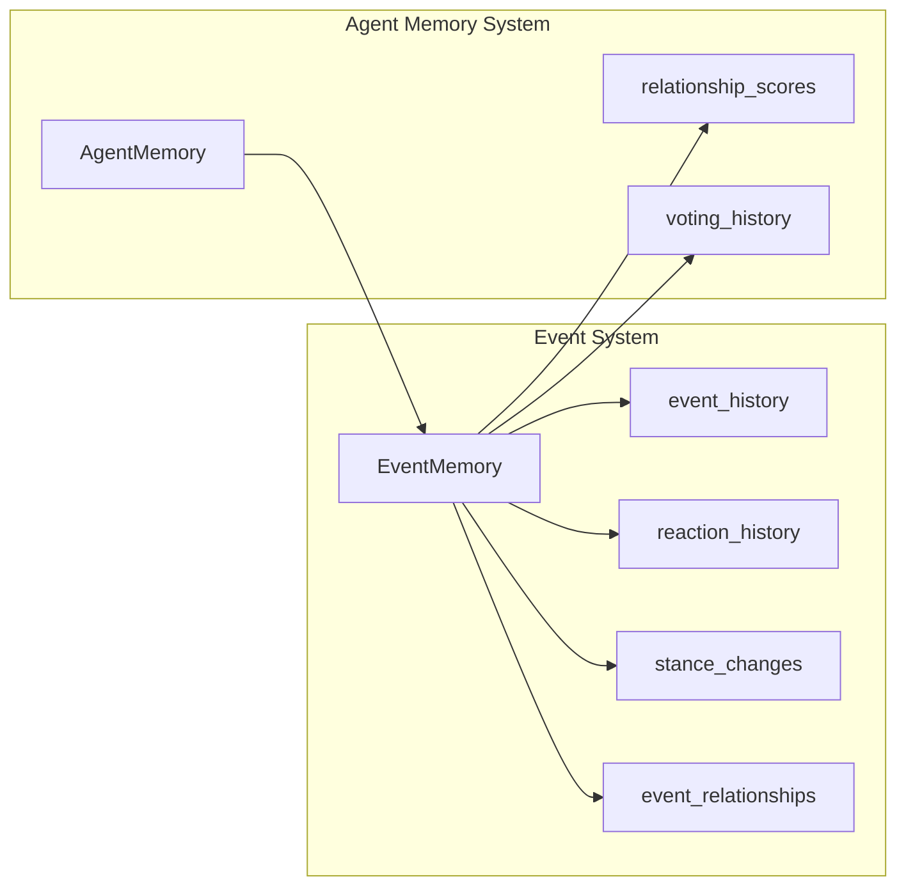
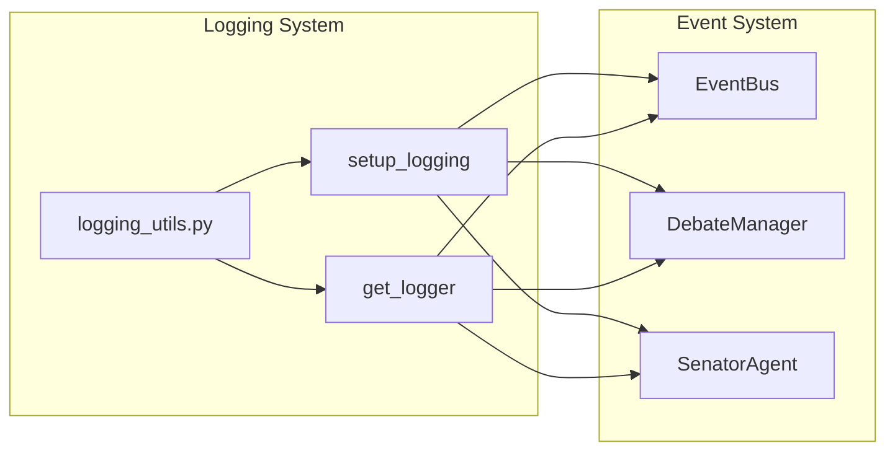

# Roman Senate Event System: Architecture Documentation

**Author:** Documentation Team  
**Version:** 1.0.0  
**Date:** April 18, 2025

## Table of Contents

- [Introduction](#introduction)
- [System Context](#system-context)
- [Component Architecture](#component-architecture)
  - [Core Components](#core-components)
  - [Event Types](#event-types)
  - [Component Relationships](#component-relationships)
- [Event Flow](#event-flow)
  - [Basic Event Flow](#basic-event-flow)
  - [Debate Flow](#debate-flow)
  - [Interruption Handling](#interruption-handling)
- [Data Model](#data-model)
  - [Event Structure](#event-structure)
  - [Memory Model](#memory-model)
- [Design Decisions](#design-decisions)
  - [Publisher-Subscriber Pattern](#publisher-subscriber-pattern)
  - [Asynchronous Event Handling](#asynchronous-event-handling)
  - [Event Prioritization](#event-prioritization)
- [Integration Points](#integration-points)
  - [Integration with Existing Debate System](#integration-with-existing-debate-system)
  - [Integration with Agent Memory](#integration-with-agent-memory)
  - [Integration with Logging System](#integration-with-logging-system)
- [Performance Considerations](#performance-considerations)
  - [Event Distribution Efficiency](#event-distribution-efficiency)
  - [Memory Usage](#memory-usage)
  - [Scaling Considerations](#scaling-considerations)
- [Future Extensions](#future-extensions)
  - [Potential Enhancements](#potential-enhancements)
  - [Extension Points](#extension-points)

## Introduction

The Roman Senate Event System is designed to create a dynamic, interactive simulation where senators can react to speeches, interject, and change their positions based on the flow of debate. This document provides a detailed architectural overview of the system, explaining how the components work together to achieve this goal.

## System Context

The event system operates within the broader Roman Senate simulation:



The event system integrates with:
- The debate system to enhance debates with dynamic interactions
- The senator system to provide event-driven behavior for senators
- The logging system to record events and debug information

## Component Architecture

### Core Components

The event system consists of several core components:



1. **Event**: Base class for all events in the system
2. **EventBus**: Central component that manages event distribution
3. **EventHandler**: Interface for components that handle events
4. **DebateManager**: Coordinates debates using the event system
5. **EventDrivenSenatorAgent**: Senator agent with event-driven capabilities
6. **EventMemory**: Enhanced memory for storing event-related information

### Event Types

The system defines several event types:



1. **DebateEvent**: Events related to the overall debate process
2. **SpeechEvent**: Represents a speech delivered by a senator
3. **ReactionEvent**: Represents a senator's reaction to a speech
4. **InterjectionEvent**: Represents an interruption during a speech

### Component Relationships

The following diagram shows how the components interact:



## Event Flow

### Basic Event Flow

The basic flow of events through the system:



### Debate Flow

The flow of events during a debate:



### Interruption Handling

The process for handling interruptions:



## Data Model

### Event Structure

All events share a common structure:

```
Event
├── event_id: UUID
├── event_type: String
├── timestamp: ISO datetime
├── source: Any (usually a senator)
├── metadata: Dictionary
└── priority: Integer
```

Specific event types add their own properties:

```
SpeechEvent
├── (inherits from Event)
├── speaker: Dictionary
├── latin_content: String
├── english_content: String
├── stance: String
└── key_points: List of strings

ReactionEvent
├── (inherits from Event)
├── reactor: Dictionary
├── target_event_id: String
├── target_event_type: String
├── reaction_type: String
└── content: String

InterjectionEvent
├── (inherits from Event)
├── interjector: Dictionary
├── target_speaker: Dictionary
├── interjection_type: InterjectionType
├── latin_content: String
├── english_content: String
├── target_speech_id: String (optional)
└── causes_disruption: Boolean
```

### Memory Model

The `EventMemory` class extends the base `AgentMemory` with event-specific storage:

```
EventMemory
├── (inherits from AgentMemory)
├── event_history: List of events
├── reaction_history: List of reactions
├── stance_changes: Dictionary mapping topics to lists of stance changes
└── event_relationships: Dictionary mapping senator names to lists of relationship impacts
```

## Design Decisions

### Publisher-Subscriber Pattern

The event system uses the publisher-subscriber pattern to decouple components:

**Benefits:**
- Components don't need direct references to each other
- New event types and handlers can be added without modifying existing code
- Events can be broadcast to multiple handlers

**Implementation:**
- The `EventBus` maintains a dictionary mapping event types to lists of handlers
- Handlers subscribe to specific event types
- When an event is published, all handlers for that event type are notified

### Asynchronous Event Handling

The event system uses asynchronous event handling:

**Benefits:**
- Non-blocking event processing
- Better performance for I/O-bound operations
- Support for concurrent event handling

**Implementation:**
- The `publish` method is async and awaits each handler
- Handlers are async methods that can perform I/O operations
- The system uses `asyncio` for asynchronous execution

### Event Prioritization

The event system prioritizes events based on senator rank:

**Benefits:**
- Higher-ranking senators have more influence
- Reflects the hierarchical nature of Roman society
- Creates more realistic debate dynamics

**Implementation:**
- Events have a priority property
- Interjection events set priority based on interjector's rank
- The `EventBus` sorts handlers by priority when applicable

## Integration Points

### Integration with Existing Debate System

The event system integrates with the existing debate system:



**Integration points:**
- The `DebateManager` calls `display_speech` to show speeches
- The `DebateManager` calls `add_to_debate_history` to maintain compatibility
- The `conduct_debate` method replaces or enhances the existing debate flow

### Integration with Agent Memory

The event system integrates with the agent memory system:



**Integration points:**
- `EventMemory` extends `AgentMemory` with event-specific storage
- `record_stance_change` updates voting history for backward compatibility
- `record_event_relationship_impact` updates relationship scores for backward compatibility

### Integration with Logging System

The event system integrates with the logging system:



**Integration points:**
- All components use the logging system to record events and debug information
- The `EventBus` logs event publication and subscription
- The `DebateManager` logs debate events and interruptions
- Senator agents log reactions, interjections, and stance changes

## Performance Considerations

### Event Distribution Efficiency

The event system is designed for efficient event distribution:

- Events are distributed only to subscribers of the specific event type
- Handlers are sorted by priority to ensure important handlers run first
- The event history is limited to prevent memory issues

### Memory Usage

The event system manages memory usage:

- The `EventBus` limits the number of events stored in history
- Events use a common base class to reduce code duplication
- The `EventMemory` class efficiently stores event-related information

### Scaling Considerations

For larger simulations:

- The event system can handle many senators, but performance may degrade with very large numbers
- The probability of reactions and interjections can be adjusted to reduce event volume
- The event history size can be reduced to save memory

## Future Extensions

### Potential Enhancements

The event system could be enhanced with:

1. **Event Filtering**: Allow subscribers to filter events based on properties
2. **Event Persistence**: Store events in a database for later analysis
3. **Network Distribution**: Distribute events across network boundaries
4. **Event Visualization**: Create a visual representation of event flow
5. **Custom Event Types**: Support for user-defined event types

### Extension Points

The system provides several extension points:

1. **New Event Types**: Create new event types by extending the `Event` class
2. **Custom Handlers**: Create custom event handlers by implementing the `EventHandler` interface
3. **Enhanced DebateManager**: Extend the `DebateManager` class with custom behavior
4. **Custom Senator Agents**: Create custom senator agents with specialized event handling
5. **Memory Extensions**: Extend the `EventMemory` class with additional storage and retrieval methods