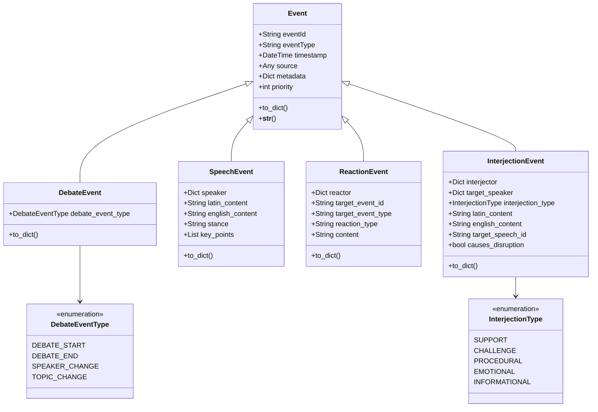
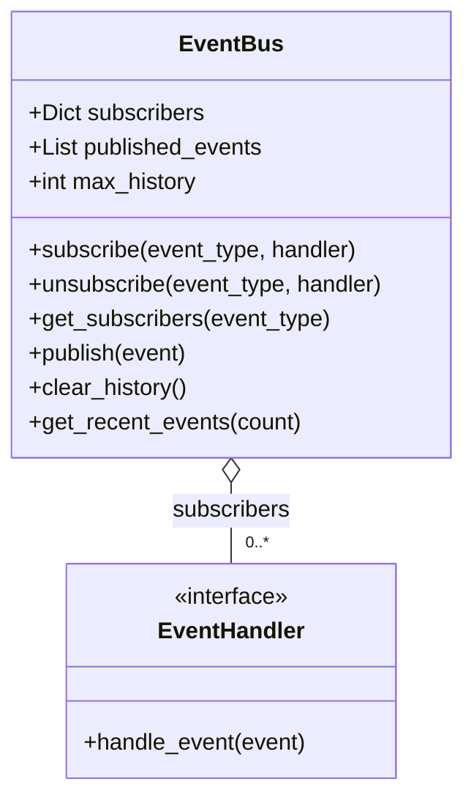
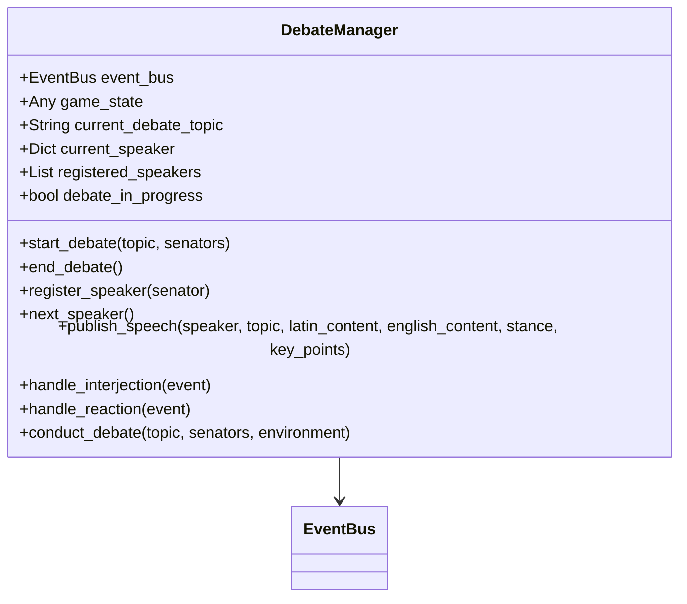
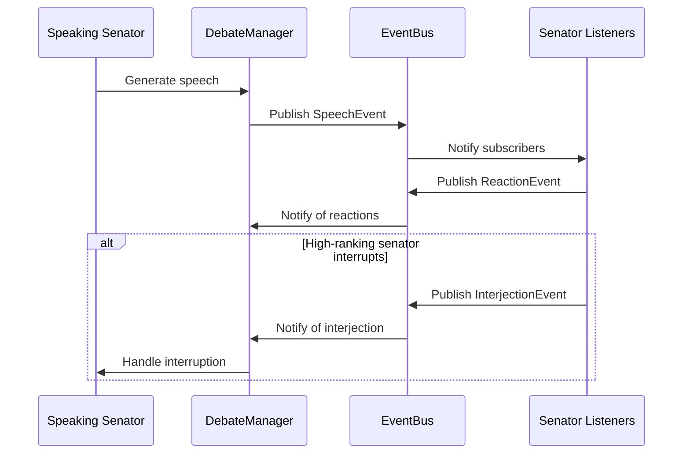

# Roman Senate Event System: Developer Guide

**Author:** Documentation Team  
**Version:** 1.1.0  
**Date:** April 18, 2025

## Table of Contents

- [Introduction](#introduction)
- [Architecture Overview](#architecture-overview)
  - [Core Components](#core-components)
  - [Event Flow](#event-flow)
  - [Design Patterns](#design-patterns)
- [Working with Events](#working-with-events)
  - [Creating Events](#creating-events)
  - [Publishing Events](#publishing-events)
  - [Subscribing to Events](#subscribing-to-events)
  - [Handling Events](#handling-events)
  - [Event Prioritization](#event-prioritization)
- [Senator Agent Integration](#senator-agent-integration)
  - [Event-Driven Senator Agent](#event-driven-senator-agent)
  - [Event Memory](#event-memory)
  - [Reaction Generation](#reaction-generation)
  - [Interjection Generation](#interjection-generation)
  - [Position Change Logic](#position-change-logic)
- [Debate Management](#debate-management)
  - [Debate Lifecycle](#debate-lifecycle)
  - [Speaker Management](#speaker-management)
  - [Interruption Handling](#interruption-handling)
  - [Debate Coordination](#debate-coordination)
- [Testing the Event System](#testing-the-event-system)
  - [Unit Testing](#unit-testing)
  - [Integration Testing](#integration-testing)
  - [Scenario Testing](#scenario-testing)
  - [Test Mocking](#test-mocking)
  - [Test Coverage](#test-coverage)
- [Extending the System](#extending-the-system)
  - [Adding New Event Types](#adding-new-event-types)
  - [Creating Custom Handlers](#creating-custom-handlers)
  - [Modifying Debate Behavior](#modifying-debate-behavior)
  - [Extending Senator Behavior](#extending-senator-behavior)
- [Best Practices](#best-practices)
  - [Event Design](#event-design)
  - [Performance Considerations](#performance-considerations)
  - [Error Handling](#error-handling)
  - [Debugging Tips](#debugging-tips)
  - [Code Organization](#code-organization)

## Introduction

This developer guide provides detailed information about the Roman Senate Event System architecture, implementation, and extension points. It's intended for developers who want to understand, modify, or extend the event-driven architecture.

## Architecture Overview

The event system is built on a publisher-subscriber (pub/sub) pattern, where events are published to a central event bus and subscribers receive notifications about events they're interested in.

### Core Components

#### Event Class Hierarchy



The `Event` class is the base class for all events in the system. It provides common properties and methods for all event types:

```python
class Event:
    def __init__(self, event_type: str, source: Any = None, metadata: Optional[Dict[str, Any]] = None):
        self.event_id = str(uuid.uuid4())
        self.event_type = event_type
        self.timestamp = datetime.now().isoformat()
        self.source = source
        self.metadata = metadata or {}
        self.priority = 0  # Default priority (higher values = higher priority)
```

Specific event types extend the base `Event` class to add type-specific properties and behavior:

- `DebateEvent`: Events related to the overall debate process (start, end, speaker change)
- `SpeechEvent`: Represents a speech delivered by a senator
- `ReactionEvent`: Represents a senator's reaction to a speech
- `InterjectionEvent`: Represents an interruption during a speech

#### EventBus

The `EventBus` is the central component that manages event distribution:



The `EventBus` maintains a mapping of event types to handler functions or objects. When an event is published, the bus notifies all subscribers for that event type.

```python
class EventBus:
    def __init__(self):
        self.subscribers = defaultdict(list)
        self.published_events = []
        self.max_history = 100
        
    def subscribe(self, event_type: str, handler: Union[EventHandler, Callable[[Event], Any]]) -> None:
        if handler not in self.subscribers[event_type]:
            self.subscribers[event_type].append(handler)
            
    async def publish(self, event: Event) -> None:
        self.published_events.append(event)
        
        # Get handlers for this event type
        handlers = self.subscribers.get(event.event_type, [])
        
        # Notify all subscribers
        for handler in handlers:
            try:
                if hasattr(handler, 'handle_event'):
                    await handler.handle_event(event)
                else:
                    result = handler(event)
                    if asyncio.iscoroutine(result):
                        await result
            except Exception as e:
                logger.error(f"Error in event handler: {e}", exc_info=True)
```

#### DebateManager

The `DebateManager` coordinates debates using the event system:



The `DebateManager` is responsible for:
- Starting and ending debates
- Managing the speaker queue
- Publishing speech events
- Handling interruptions and reactions
- Coordinating the overall debate flow

### Event Flow

The following sequence diagram illustrates the flow of events during a debate:



This flow shows how events propagate through the system:
1. A senator generates a speech
2. The debate manager publishes a speech event
3. Other senators receive the event and may react or interject
4. Reactions and interjections are published back to the event bus
5. The debate manager handles interjections, potentially interrupting the speaker

### Design Patterns

The event system implements several design patterns:

1. **Publisher-Subscriber Pattern**: The core of the event system, allowing loose coupling between components.
   ```python
   # Publisher
   await event_bus.publish(speech_event)
   
   # Subscriber
   event_bus.subscribe("speech", handle_speech_event)
   ```

2. **Observer Pattern**: Senators observe events and react to them.
   ```python
   # Senator observes speech events
   async def handle_speech_event(self, event: SpeechEvent) -> None:
       # Process the speech event
       self.memory.record_event(event)
   ```

3. **Command Pattern**: Events encapsulate actions to be performed.
   ```python
   # Create a command (event) to be executed
   debate_start_event = DebateEvent(
       debate_event_type=DebateEventType.DEBATE_START,
       topic="Expansion in Gaul"
   )
   ```

4. **Strategy Pattern**: Different event handling strategies for different event types.
   ```python
   # Different strategies for handling different event types
   event_bus.subscribe("speech", handle_speech_event)
   event_bus.subscribe("reaction", handle_reaction_event)
   event_bus.subscribe("interjection", handle_interjection_event)
   ```

5. **Factory Pattern**: Creation of different event types.
   ```python
   # Factory method for creating speech events
   async def publish_speech(self, speaker, topic, latin_content, english_content, stance, key_points=None):
       speech_event = SpeechEvent(
           speaker=speaker,
           topic=topic,
           latin_content=latin_content,
           english_content=english_content,
           stance=stance,
           key_points=key_points
       )
       await self.event_bus.publish(speech_event)
       return speech_event
   ```

## Working with Events

### Creating Events

Events are created by instantiating the appropriate event class:

```python
# Create a debate event
debate_start_event = DebateEvent(
    debate_event_type=DebateEventType.DEBATE_START,
    topic="Expansion in Gaul",
    metadata={
        "participant_count": len(senators),
        "participants": [s.get("name", "Unknown") for s in senators]
    }
)

# Create a speech event
speech_event = SpeechEvent(
    speaker=senator,
    topic="Expansion in Gaul",
    latin_content="Ceterum censeo Carthaginem esse delendam",
    english_content="Furthermore, I think Carthage must be destroyed",
    stance="support",
    key_points=["Carthage is a threat", "War is necessary"]
)

# Create a reaction event
reaction_event = ReactionEvent(
    reactor=senator,
    target_event=speech_event,
    reaction_type="agreement",
    content="Nods in agreement"
)

# Create an interjection event
interjection_event = InterjectionEvent(
    interjector=senator,
    target_speaker=speaker,
    interjection_type=InterjectionType.CHALLENGE,
    latin_content="Nego!",
    english_content="I disagree!",
    target_speech_id=speech_event.speech_id,
    causes_disruption=True
)
```

### Publishing Events

Events are published to the event bus:

```python
# Create event bus
event_bus = EventBus()

# Publish an event
await event_bus.publish(speech_event)

# Publish multiple events
for event in events:
    await event_bus.publish(event)
    
# Publish with priority
high_priority_event = Event("important_event")
high_priority_event.priority = 10  # Higher priority
await event_bus.publish(high_priority_event)
```

### Subscribing to Events

Components subscribe to event types they're interested in:

```python
# Subscribe to speech events
event_bus.subscribe(SpeechEvent.TYPE, self.handle_speech_event)

# Subscribe to debate events
event_bus.subscribe(DebateEvent.TYPE, self.handle_debate_event)

# Subscribe to multiple event types
for event_type in ["speech", "reaction", "interjection"]:
    event_bus.subscribe(event_type, self.handle_event)
    
# Unsubscribe when no longer needed
event_bus.unsubscribe("speech", self.handle_speech_event)
```

### Handling Events

Event handlers process events they receive:

```python
async def handle_speech_event(self, event: SpeechEvent) -> None:
    """Handle a speech event."""
    # Skip own speeches
    if event.speaker.get("id") == self.senator.get("id"):
        return
        
    # Record the event in memory
    self.memory.record_event(event)
    
    # Process the speech content
    topic = event.metadata.get("topic")
    stance = event.stance
    
    # Determine if senator should react to the speech
    if await self._should_react_to_speech(event):
        # Generate and publish reaction
        await self._generate_and_publish_reaction(event)
        
    # Check if stance should change based on speech
    await self._consider_stance_change(event)
```

For class-based handlers, implement the `EventHandler` protocol:

```python
@runtime_checkable
class EventHandler(Protocol):
    async def handle_event(self, event: Event) -> None:
        ...

class SpeechHandler(EventHandler):
    async def handle_event(self, event: Event) -> None:
        if event.event_type == "speech":
            # Process speech event
            print(f"Speech by {event.speaker.get('name')}: {event.english_content}")
```

### Event Prioritization

Events can be prioritized to ensure important events are handled first:

```python
# Set event priority
event.priority = 10  # Higher priority events are processed first

# Get handler priority (used for sorting handlers)
def _get_handler_priority(self, handler: Any) -> int:
    # If handler is a senator agent, use their rank
    if hasattr(handler, 'senator') and hasattr(handler.senator, 'get'):
        return handler.senator.get('rank', 0)
    
    # If handler has an explicit priority attribute, use that
    if hasattr(handler, 'priority'):
        return handler.priority
    
    # Default priority
    return 0
```

## Senator Agent Integration

### Event-Driven Senator Agent

The `EventDrivenSenatorAgent` extends the base `SenatorAgent` with event-driven capabilities:

```python
class EventDrivenSenatorAgent(SenatorAgent):
    def __init__(self, senator: Dict[str, Any], llm_provider: LLMProvider, event_bus: EventBus):
        # Initialize with base senator properties but replace memory with EventMemory
        self.senator = senator
        self.llm_provider = llm_provider
        self.current_stance = None
        
        # Use enhanced event memory instead of basic agent memory
        self.memory = EventMemory()
        
        self.event_bus = event_bus
        self.active_debate_topic = None
        self.current_speaker = None
        self.debate_in_progress = False
        
        # Subscribe to relevant event types
        self.subscribe_to_events()
        
    def subscribe_to_events(self) -> None:
        """Subscribe to relevant event types."""
        self.event_bus.subscribe(SpeechEvent.TYPE, self.handle_speech_event)
        self.event_bus.subscribe(DebateEvent.TYPE, self.handle_debate_event)
```

The agent subscribes to speech and debate events, and processes them accordingly:

```python
async def handle_speech_event(self, event: SpeechEvent) -> None:
    # Skip own speeches
    if event.speaker.get("id") == self.senator.get("id"):
        return
        
    # Record the event in memory
    self.memory.record_event(event)
    
    # Store current speaker for potential reactions
    self.current_speaker = event.speaker
    
    # Determine if senator should react to the speech
    if await self._should_react_to_speech(event):
        # Generate and publish reaction
        await self._generate_and_publish_reaction(event)
        
    # Determine if senator should interject
    if await self._should_interject(event):
        # Generate and publish interjection
        await self._generate_and_publish_interjection(event)
        
    # Check if stance should change based on speech
    await self._consider_stance_change(event)
```

### Event Memory

The `EventMemory` class extends the base `AgentMemory` with event-specific capabilities:

```python
class EventMemory(AgentMemory):
    def __init__(self):
        """Initialize an empty event memory."""
        super().__init__()
        # Store observed events
        self.event_history: List[Dict[str, Any]] = []
        # Store reactions to events
        self.reaction_history: List[Dict[str, Any]] = []
        # Store stance changes triggered by events
        self.stance_changes: Dict[str, List[Dict[str, Any]]] = {}
        # Track event-based relationships (how events affected relationships)
        self.event_relationships: Dict[str, List[Dict[str, Any]]] = {}
```

The memory system allows senators to:
- Record events they observe
- Track their reactions to events
- Remember stance changes and the events that triggered them
- Track how events affected their relationships with other senators

```python
def record_event(self, event: Event) -> None:
    """Record an observed event in memory."""
    # Store basic event data
    event_data = {
        "event_id": event.event_id,
        "event_type": event.event_type,
        "timestamp": event.timestamp,
        "source": getattr(event.source, "name", str(event.source)) if event.source else "Unknown",
        "metadata": event.metadata.copy(),
        "recorded_at": datetime.now().isoformat()
    }
    
    # Add to event history
    self.event_history.append(event_data)
    
    # Also add as a general observation for backward compatibility
    source_name = getattr(event.source, "name", str(event.source)) if event.source else "Unknown"
    self.add_observation(f"Observed {event.event_type} event from {source_name}")
```

### Reaction Generation

Senators generate reactions to speeches based on various factors:

```python
async def _should_react_to_speech(self, event: SpeechEvent) -> bool:
    """Determine if the senator should react to a speech."""
    # Base probability of reaction
    base_probability = 0.3  # 30% chance by default
    
    # Adjust based on relationship with speaker
    relationship = self.memory.relationship_scores.get(event.speaker.get("name", ""), 0)
    relationship_factor = abs(relationship) * 0.2  # Max +/- 0.2
    
    # Faction alignment affects reaction probability
    speaker_faction = event.speaker.get("faction", "")
    if speaker_faction == self.faction:
        # More likely to react positively to same faction
        if relationship >= 0:
            base_probability += 0.1
    else:
        # More likely to react negatively to different faction
        if relationship < 0:
            base_probability += 0.1
            
    # Topic interest affects reaction probability
    topic_interest = random.random() * 0.3  # Random interest level
    
    # Calculate final probability
    final_probability = min(0.8, base_probability + relationship_factor + topic_interest)
    
    # Decide whether to react
    return random.random() < final_probability
```

When a senator decides to react, they generate and publish a reaction event:

```python
async def _generate_and_publish_reaction(self, event: SpeechEvent) -> None:
    """Generate and publish a reaction to a speech."""
    # Determine reaction type based on relationship and stance
    relationship = self.memory.relationship_scores.get(event.speaker.get("name", ""), 0)
    stance_agreement = (self.current_stance == event.stance)
    
    reaction_types = ["neutral", "agreement", "disagreement", "interest", "boredom", "skepticism"]
    
    if relationship > 0.3 and stance_agreement:
        reaction_type = random.choice(["agreement", "interest"])
    elif relationship < -0.3 and not stance_agreement:
        reaction_type = random.choice(["disagreement", "skepticism"])
    else:
        reaction_type = random.choice(reaction_types)
        
    # Generate reaction content
    reaction_content = await self._generate_reaction_content(event, reaction_type)
    
    # Create and publish reaction event
    reaction_event = ReactionEvent(
        reactor=self.senator,
        target_event=event,
        reaction_type=reaction_type,
        content=reaction_content
    )
    
    await self.event_bus.publish(reaction_event)
    
    # Record in memory
    self.memory.record_reaction(event.event_id, reaction_type, reaction_content)
```

### Interjection Generation

Senators may interject during speeches based on various factors:

```python
async def _should_interject(self, event: SpeechEvent) -> bool:
    """Determine if the senator should interject during a speech."""
    # Base probability of interjection (lower than reaction)
    base_probability = 0.1  # 10% chance by default
    
    # Adjust based on relationship with speaker (stronger feelings = more likely to interject)
    relationship = self.memory.relationship_scores.get(event.speaker.get("name", ""), 0)
    relationship_factor = abs(relationship) * 0.15  # Max +/- 0.15
    
    # Rank affects interjection probability
    # Higher rank senators are more likely to interject
    rank = self.senator.get("rank", 0)
    rank_factor = min(0.2, rank * 0.05)  # Max +0.2 for rank 4+
    
    # Stance disagreement increases interjection probability
    stance_factor = 0
    if self.current_stance and self.current_stance != event.stance:
        stance_factor = 0.15
        
    # Calculate final probability
    final_probability = min(0.5, base_probability + relationship_factor + rank_factor + stance_factor)
    
    # Decide whether to interject
    return random.random() < final_probability
```

When a senator decides to interject, they generate and publish an interjection event:

```python
async def _generate_and_publish_interjection(self, event: SpeechEvent) -> None:
    """Generate and publish an interjection during a speech."""
    # Determine interjection type
    interjection_type = await self._determine_interjection_type(event)
    
    # Generate interjection content
    latin_content, english_content = await self._generate_interjection_content(
        event.speaker.get("name", "Unknown"),
        interjection_type
    )
    
    # Create and publish interjection event
    interjection_event = InterjectionEvent(
        interjector=self.senator,
        target_speaker=event.speaker,
        interjection_type=interjection_type,
        latin_content=latin_content,
        english_content=english_content,
        target_speech_id=event.speech_id,
        causes_disruption=(interjection_type.value in ["procedural", "emotional"])
    )
    
    await self.event_bus.publish(interjection_event)
    
    # Record in memory
    self.memory.record_event(interjection_event)
```

### Position Change Logic

Senators may change their position on a topic based on persuasive speeches:

```python
async def _consider_stance_change(self, event: SpeechEvent) -> None:
    """Consider changing stance based on a speech."""
    # Only consider stance change if we have a current stance and topic
    if not self.current_stance or not self.active_debate_topic:
        return
        
    # Skip if the speech is on a different topic
    speech_topic = event.metadata.get("topic")
    if speech_topic != self.active_debate_topic:
        return
        
    # Base probability of stance change (very low)
    base_probability = 0.05  # 5% chance by default
    
    # Adjust based on relationship with speaker
    relationship = self.memory.relationship_scores.get(event.speaker.get("name", ""), 0)
    relationship_factor = max(0, relationship * 0.1)  # Only positive relationships increase chance
    
    # Faction alignment affects stance change probability
    speaker_faction = event.speaker.get("faction", "")
    faction_factor = 0.05 if speaker_faction == self.faction else 0
    
    # Speaker rank affects persuasiveness
    rank_factor = min(0.1, event.speaker.get("rank", 0) * 0.025)  # Max +0.1 for rank 4+
    
    # Calculate final probability
    final_probability = min(0.3, base_probability + relationship_factor + faction_factor + rank_factor)
    
    # Decide whether to change stance
    if random.random() < final_probability:
        # Determine new stance (usually move toward speaker's stance)
        speaker_stance = event.stance
        old_stance = self.current_stance
        
        # If we're neutral, adopt speaker's stance
        if old_stance == "neutral":
            new_stance = speaker_stance
        # If we disagree with speaker, move to neutral
        elif old_stance != speaker_stance:
            new_stance = "neutral"
        # If we already agree, no change
        else:
            return
            
        # Record stance change
        self.current_stance = new_stance
        self.memory.record_stance_change(
            self.active_debate_topic,
            old_stance,
            new_stance,
            f"Persuaded by {event.speaker.get('name')}'s speech",
            event.event_id
        )
```

## Debate Management

### Debate Lifecycle

The debate lifecycle is managed by the `DebateManager`:

```python
async def start_debate(self, topic: str, senators: List[Dict[str, Any]]) -> None:
    """Start a new debate on the given topic."""
    if self.debate_in_progress:
        logger.warning("Attempt to start debate while another is in progress")
        return
        
    self.debate_in_progress = True
    self.current_debate_topic = topic
    self.registered_speakers = senators.copy()
    
    # Publish debate start event
    debate_start_event = DebateEvent(
        debate_event_type=DebateEventType.DEBATE_START,
        topic=topic,
        metadata={
            "participant_count": len(senators),
            "participants": [s.get("name", "Unknown") for s in senators]
        }
    )
    await self.event_bus.publish(debate_start_event)
    
    logger.info(f"Debate started on topic: {topic} with {len(senators)} participants")
```

```python
async def end_debate(self) -> None:
    """End the current debate."""
    if not self.debate_in_progress:
        logger.warning("Attempt to end debate when none is in progress")
        return
        
    # Publish debate end event
    debate_end_event = DebateEvent(
        debate_event_type=DebateEventType.DEBATE_END,
        topic=self.current_debate_topic,
        metadata={
            "duration": "unknown",  # Could track actual duration if needed
            "participant_count": len(self.registered_speakers)
        }
    )
    await self.event_bus.publish(debate_end_event)
    
    # Reset debate state
    self.debate_in_progress = False
    self.current_debate_topic = None
    self.current_speaker = None
    self.registered_speakers = []
    
    logger.info("Debate ended")
```

### Speaker Management

The `DebateManager` manages the speaker queue:

```python
async def register_speaker(self, senator: Dict[str, Any]) -> None:
    """Register a senator to speak in the debate."""
    if senator not in self.registered_speakers:
        self.registered_speakers.append(senator)
        logger.debug(f"Registered speaker: {senator.get('name', 'Unknown')}")
```

```python
async def next_speaker(self) -> Optional[Dict[str, Any]]:
    """Get the next speaker in the debate."""
    if not self.registered_speakers:
        return None
        
    # Get the next speaker
    next_speaker = self.registered_speakers.pop(0)
    self.current_speaker = next_speaker
    
    # Publish speaker change event
    speaker_change_event = DebateEvent(
        debate_event_type=DebateEventType.SPEAKER_CHANGE,
        topic=self.current_debate_topic,
        source=next_speaker,
        metadata={
            "speaker_name": next_speaker.get("name", "Unknown"),
            "speaker_faction": next_speaker.get("faction", "Unknown")
        }
    )
    await self.event_bus.publish(speaker_change_event)
    
    return next_speaker
```

### Interruption Handling

The `DebateManager` handles interruptions during speeches:

```python
async def handle_interjection(self, event: InterjectionEvent) -> None:
    """Handle an interjection event."""
    if not self.debate_in_progress or not self.current_speaker:
        logger.warning("Interjection received but no debate in progress")
        return
        
    # Check if the interjection should be allowed based on rank
    interjector_rank = event.interjector.get("rank", 0)
    speaker_rank = self.current_speaker.get("rank", 0)
    
    # Higher rank can always interrupt
    allow_interruption = interjector_rank > speaker_rank
    
    # Equal rank can interrupt for procedural matters
    if interjector_rank == speaker_rank and event.interjection_type == InterjectionType.PROCEDURAL:
        allow_interruption = True
        
    # Log the interjection
    logger.info(
        f"Interjection from {event.interjector.get('name')}: "
        f"{event.interjection_type.value} - Allowed: {allow_interruption}"
    )
    
    # If allowed, display the interjection
    if allow_interruption:
        # Display the interjection (this would integrate with the UI)
        # For now, we'll just log it
        logger.info(f"INTERJECTION: {event.english_content}")
```

### Debate Coordination

The `DebateManager` can conduct a full debate:

```python
async def conduct_debate(self, topic: str, senators: List[Dict[str, Any]], environment: Optional[Dict[str, Any]] = None) -> None:
    """
