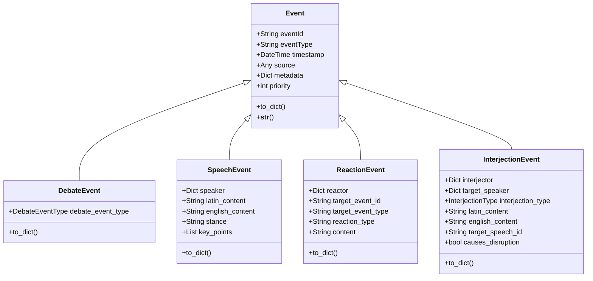
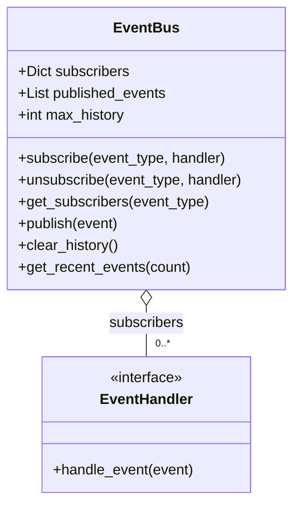
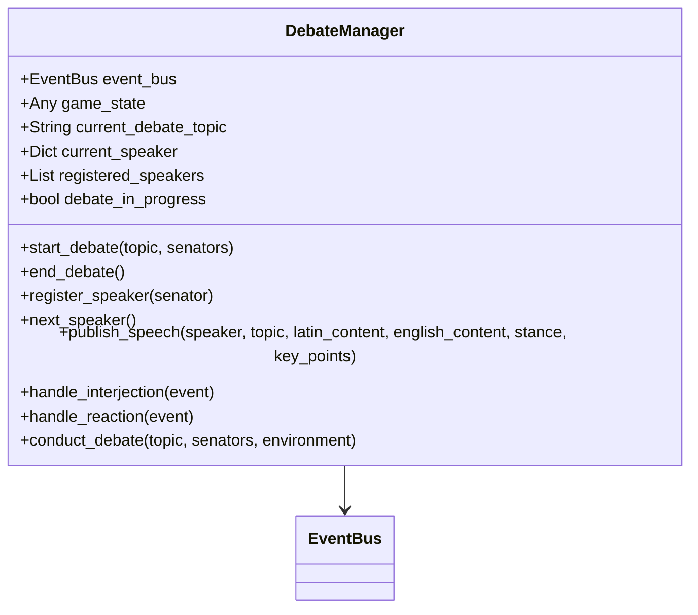
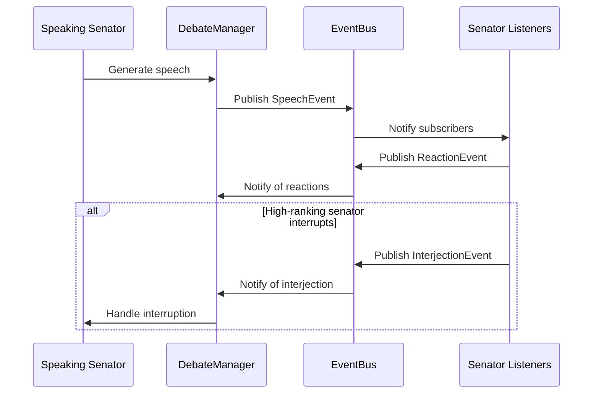

# Roman Senate Event System: Developer Guide

**Author:** Documentation Team  
**Version:** 1.0.0  
**Date:** April 18, 2025

## Table of Contents

- [Introduction](#introduction)
- [Architecture Overview](#architecture-overview)
  - [Core Components](#core-components)
  - [Event Flow](#event-flow)
  - [Design Patterns](#design-patterns)
- [Working with Events](#working-with-events)
  - [Creating Events](#creating-events)
  - [Publishing Events](#publishing-events)
  - [Subscribing to Events](#subscribing-to-events)
  - [Handling Events](#handling-events)
- [Senator Agent Integration](#senator-agent-integration)
  - [Event-Driven Senator Agent](#event-driven-senator-agent)
  - [Event Memory](#event-memory)
  - [Reaction Generation](#reaction-generation)
  - [Interjection Generation](#interjection-generation)
- [Debate Management](#debate-management)
  - [Debate Lifecycle](#debate-lifecycle)
  - [Speaker Management](#speaker-management)
  - [Interruption Handling](#interruption-handling)
- [Testing the Event System](#testing-the-event-system)
  - [Unit Testing](#unit-testing)
  - [Integration Testing](#integration-testing)
  - [Scenario Testing](#scenario-testing)
- [Extending the System](#extending-the-system)
  - [Adding New Event Types](#adding-new-event-types)
  - [Creating Custom Handlers](#creating-custom-handlers)
  - [Modifying Debate Behavior](#modifying-debate-behavior)
- [Best Practices](#best-practices)
  - [Event Design](#event-design)
  - [Performance Considerations](#performance-considerations)
  - [Debugging Tips](#debugging-tips)

## Introduction

This developer guide provides detailed information about the Roman Senate Event System architecture, implementation, and extension points. It's intended for developers who want to understand, modify, or extend the event-driven architecture.

## Architecture Overview

The event system is built on a publisher-subscriber (pub/sub) pattern, where events are published to a central event bus and subscribers receive notifications about events they're interested in.

### Core Components

#### Event Class Hierarchy



#### EventBus

The `EventBus` is the central component that manages event distribution:



#### DebateManager

The `DebateManager` coordinates debates using the event system:



### Event Flow

The following sequence diagram illustrates the flow of events during a debate:



### Design Patterns

The event system implements several design patterns:

1. **Publisher-Subscriber Pattern**: The core of the event system, allowing loose coupling between components.
2. **Observer Pattern**: Senators observe events and react to them.
3. **Command Pattern**: Events encapsulate actions to be performed.
4. **Strategy Pattern**: Different event handling strategies for different event types.
5. **Factory Pattern**: Creation of different event types.

## Working with Events

### Creating Events

Events are created by instantiating the appropriate event class:

```python
# Create a debate event
debate_start_event = DebateEvent(
    debate_event_type=DebateEventType.DEBATE_START,
    topic="Expansion in Gaul",
    metadata={
        "participant_count": len(senators),
        "participants": [s.get("name", "Unknown") for s in senators]
    }
)

# Create a speech event
speech_event = SpeechEvent(
    speaker=senator,
    topic="Expansion in Gaul",
    latin_content="Ceterum censeo Carthaginem esse delendam",
    english_content="Furthermore, I think Carthage must be destroyed",
    stance="support",
    key_points=["Carthage is a threat", "War is necessary"]
)
```

### Publishing Events

Events are published to the event bus:

```python
# Create event bus
event_bus = EventBus()

# Publish an event
await event_bus.publish(speech_event)
```

### Subscribing to Events

Components subscribe to event types they're interested in:

```python
# Subscribe to speech events
event_bus.subscribe(SpeechEvent.TYPE, self.handle_speech_event)

# Subscribe to debate events
event_bus.subscribe(DebateEvent.TYPE, self.handle_debate_event)
```

### Handling Events

Event handlers process events they receive:

```python
async def handle_speech_event(self, event: SpeechEvent) -> None:
    """Handle a speech event."""
    # Skip own speeches
    if event.speaker.get("id") == self.senator.get("id"):
        return
        
    # Record the event in memory
    self.memory.record_event(event)
    
    # Determine if senator should react to the speech
    if await self._should_react_to_speech(event):
        # Generate and publish reaction
        await self._generate_and_publish_reaction(event)
```

## Senator Agent Integration

### Event-Driven Senator Agent

The `EventDrivenSenatorAgent` extends the base `SenatorAgent` with event-driven capabilities:

```python
class EventDrivenSenatorAgent(SenatorAgent):
    """Event-driven implementation of a Roman Senator agent."""
    
    def __init__(self, senator, llm_provider, event_bus):
        """Initialize an event-driven senator agent."""
        self.senator = senator
        self.llm_provider = llm_provider
        self.current_stance = None
        
        # Use enhanced event memory
        self.memory = EventMemory()
        
        self.event_bus = event_bus
        self.active_debate_topic = None
        self.current_speaker = None
        self.debate_in_progress = False
        
        # Subscribe to relevant event types
        self.subscribe_to_events()
```

### Event Memory

The `EventMemory` class extends the base `AgentMemory` with event-specific storage:

```python
class EventMemory(AgentMemory):
    """Enhanced memory for event-driven senator agents."""
    
    def __init__(self):
        """Initialize an empty event memory."""
        super().__init__()
        # Store observed events
        self.event_history = []
        # Store reactions to events
        self.reaction_history = []
        # Store stance changes triggered by events
        self.stance_changes = {}
        # Track event-based relationships
        self.event_relationships = {}
```

### Reaction Generation

Senators generate reactions to speeches based on various factors:

```python
async def _generate_and_publish_reaction(self, event: SpeechEvent) -> None:
    """Generate and publish a reaction to a speech."""
    # Determine reaction type based on relationship and stance
    relationship = self.memory.relationship_scores.get(event.speaker.get("name", ""), 0)
    stance_agreement = (self.current_stance == event.stance)
    
    # Choose reaction type based on relationship and stance
    if relationship > 0.3 and stance_agreement:
        reaction_type = random.choice(["agreement", "interest"])
    elif relationship < -0.3 and not stance_agreement:
        reaction_type = random.choice(["disagreement", "skepticism"])
    else:
        reaction_type = random.choice(["neutral", "agreement", "disagreement", "interest", "boredom", "skepticism"])
        
    # Generate reaction content
    reaction_content = await self._generate_reaction_content(event, reaction_type)
    
    # Create and publish reaction event
    reaction_event = ReactionEvent(
        reactor=self.senator,
        target_event=event,
        reaction_type=reaction_type,
        content=reaction_content
    )
    
    await self.event_bus.publish(reaction_event)
```

### Interjection Generation

Higher-ranking senators may generate interjections during speeches:

```python
async def _generate_and_publish_interjection(self, event: SpeechEvent) -> None:
    """Generate and publish an interjection during a speech."""
    # Determine interjection type
    interjection_type = await self._determine_interjection_type(event)
    
    # Generate interjection content
    latin_content, english_content = await self._generate_interjection_content(
        event.speaker.get("name", "Unknown"),
        interjection_type
    )
    
    # Create and publish interjection event
    interjection_event = InterjectionEvent(
        interjector=self.senator,
        target_speaker=event.speaker,
        interjection_type=interjection_type,
        latin_content=latin_content,
        english_content=english_content,
        target_speech_id=event.speech_id,
        causes_disruption=(interjection_type.value in ["procedural", "emotional"])
    )
    
    await self.event_bus.publish(interjection_event)
```

## Debate Management

### Debate Lifecycle

The debate lifecycle is managed by the `DebateManager`:

```python
async def conduct_debate(self, topic, senators, environment=None):
    """Conduct a full debate on the given topic."""
    # Start the debate
    await self.start_debate(topic, senators)
    
    # Track all speeches for return value
    all_speeches = []
    
    # Let each senator speak
    for senator in senators:
        # Set as current speaker
        self.current_speaker = senator
        await self.next_speaker()
        
        # Generate the speech
        latin_content = f"Latin speech by {senator.get('name')} on {topic}"
        english_content = f"English speech by {senator.get('name')} on {topic}"
        stance = random.choice(["support", "oppose", "neutral"])
        
        # Publish the speech event
        speech_event = await self.publish_speech(
            speaker=senator,
            topic=topic,
            latin_content=latin_content,
            english_content=english_content,
            stance=stance
        )
        
        # Add to return value
        all_speeches.append(speech_data)
        
        # Pause to allow reactions and interjections
        await asyncio.sleep(1)
        
    # End the debate
    await self.end_debate()
    
    return all_speeches
```

### Speaker Management

The `DebateManager` manages the speaker queue:

```python
async def next_speaker(self):
    """Get the next speaker in the debate."""
    if not self.registered_speakers:
        return None
        
    # Get the next speaker
    next_speaker = self.registered_speakers.pop(0)
    self.current_speaker = next_speaker
    
    # Publish speaker change event
    speaker_change_event = DebateEvent(
        debate_event_type=DebateEventType.SPEAKER_CHANGE,
        topic=self.current_debate_topic,
        source=next_speaker,
        metadata={
            "speaker_name": next_speaker.get("name", "Unknown"),
            "speaker_faction": next_speaker.get("faction", "Unknown")
        }
    )
    await self.event_bus.publish(speaker_change_event)
    
    return next_speaker
```

### Interruption Handling

The `DebateManager` handles interruptions based on senator rank:

```python
async def handle_interjection(self, event: InterjectionEvent):
    """Handle an interjection event."""
    if not self.debate_in_progress or not self.current_speaker:
        logger.warning("Interjection received but no debate in progress")
        return
        
    # Check if the interjection should be allowed based on rank
    interjector_rank = event.interjector.get("rank", 0)
    speaker_rank = self.current_speaker.get("rank", 0)
    
    # Higher rank can always interrupt
    allow_interruption = interjector_rank > speaker_rank
    
    # Equal rank can interrupt for procedural matters
    if interjector_rank == speaker_rank and event.interjection_type == InterjectionType.PROCEDURAL:
        allow_interruption = True
        
    # If allowed, display the interjection
    if allow_interruption:
        logger.info(f"INTERJECTION: {event.english_content}")
```

## Testing the Event System

### Unit Testing

Unit tests focus on individual components:

```python
def test_event_bus_subscription():
    """Test that subscribers receive events they subscribe to."""
    event_bus = EventBus()
    mock_handler = MagicMock()
    
    # Subscribe to event type
    event_bus.subscribe("test_event", mock_handler)
    
    # Create and publish event
    event = Event(event_type="test_event")
    asyncio.run(event_bus.publish(event))
    
    # Check that handler was called
    mock_handler.assert_called_once_with(event)
```

### Integration Testing

Integration tests verify that components work together:

```python
@pytest.mark.asyncio
async def test_speech_event_reactions(debate_manager, senator_agents, event_bus):
    """Test that speech events trigger reactions from other senators."""
    # Patch methods to ensure deterministic behavior
    for agent in senator_agents:
        agent._should_react_to_speech = AsyncMock(return_value=True)
        
    # Start debate
    topic = "Whether Rome should go to war with Carthage"
    senators = [agent.senator for agent in senator_agents]
    await debate_manager.start_debate(topic, senators)
    
    # Reset the publish method to track new calls
    event_bus.publish = AsyncMock(wraps=event_bus.publish)
    
    # Get the first speaking senator and others
    speaker_agent = senator_agents[0]
    
    # Publish a speech
    speech_event = await debate_manager.publish_speech(
        speaker=speaker_agent.senator,
        topic=topic,
        latin_content="Test speech",
        english_content="Test speech",
        stance="support"
    )
    
    # Count reaction events published
    reaction_count = 0
    for call_args in event_bus.publish.call_args_list:
        if isinstance(call_args[0][0], ReactionEvent):
            reaction_count += 1
    
    # Should have reactions from listening agents
    assert reaction_count == len(senator_agents) - 1
```

### Scenario Testing

Scenario tests verify complete workflows:

```python
@pytest.mark.asyncio
async def test_full_debate_cycle(debate_manager, senator_agents, event_bus):
    """Test a full debate cycle from start to finish with all components."""
    # Setup agents with realistic behavior
    for agent in senator_agents:
        agent._should_react_to_speech = AsyncMock(side_effect=lambda event: random.random() < 0.5)
        agent._should_interject = AsyncMock(side_effect=lambda event: random.random() < 0.2)
        
    # Track published events
    debate_events = []
    speech_events = []
    reaction_events = []
    interjection_events = []
    
    # Replace publish with a version that tracks events
    original_publish = event_bus.publish
    
    async def tracking_publish(event):
        if isinstance(event, DebateEvent):
            debate_events.append(event)
        elif isinstance(event, SpeechEvent):
            speech_events.append(event)
        elif isinstance(event, ReactionEvent):
            reaction_events.append(event)
        elif isinstance(event, InterjectionEvent):
            interjection_events.append(event)
            
        return await original_publish(event)
        
    event_bus.publish = tracking_publish
    
    # Conduct the debate
    topic = "Whether Rome should go to war with Carthage"
    senators = [agent.senator for agent in senator_agents]
    await debate_manager.conduct_debate(topic, senators)
    
    # Verify expected events were published
    assert len(debate_events) >= 2  # Start and end events
    assert len(speech_events) == len(senators)  # One speech per senator
    assert len(reaction_events) > 0  # Some reactions occurred
```

## Extending the System

### Adding New Event Types

To add a new event type:

1. Create a new class that extends `Event`
2. Define a unique `TYPE` class variable
3. Implement `__init__` and `to_dict` methods
4. Add any type-specific properties and methods

Example:

```python
class VoteEvent(Event):
    """Event representing a vote cast by a senator."""
    
    TYPE = "vote"
    
    def __init__(self, senator, topic, vote_value, metadata=None):
        super().__init__(
            event_type=self.TYPE,
            source=senator,
            metadata=metadata or {}
        )
        self.senator = senator
        self.topic = topic
        self.vote_value = vote_value
        
        # Add vote-specific metadata
        self.metadata.update({
            "topic": topic,
            "vote_value": vote_value,
            "senator_name": senator.get("name", "Unknown"),
            "senator_faction": senator.get("faction", "Unknown")
        })
        
    def to_dict(self):
        """Convert to dictionary, including vote-specific fields."""
        data = super().to_dict()
        data.update({
            "senator": {
                "id": self.senator.get("id"),
                "name": self.senator.get("name"),
                "faction": self.senator.get("faction")
            },
            "topic": self.topic,
            "vote_value": self.vote_value
        })
        return data
```

### Creating Custom Handlers

To create a custom event handler:

1. Create a class that implements the `EventHandler` protocol
2. Implement the `handle_event` method
3. Subscribe the handler to relevant event types

Example:

```python
class VoteRecorder:
    """Records votes cast by senators."""
    
    def __init__(self, event_bus):
        self.event_bus = event_bus
        self.votes = {}
        
        # Subscribe to vote events
        self.event_bus.subscribe(VoteEvent.TYPE, self.handle_event)
        
    async def handle_event(self, event):
        """Handle a vote event."""
        if event.event_type != VoteEvent.TYPE:
            return
            
        # Record the vote
        topic = event.topic
        senator_name = event.senator.get("name", "Unknown")
        vote_value = event.vote_value
        
        if topic not in self.votes:
            self.votes[topic] = {}
            
        self.votes[topic][senator_name] = vote_value
        
        # Log the vote
        logger.info(f"Vote recorded: {senator_name} voted {vote_value} on {topic}")
```

### Modifying Debate Behavior

To modify debate behavior:

1. Extend the `DebateManager` class
2. Override methods to implement custom behavior
3. Use the custom manager in place of the standard one

Example:

```python
class EnhancedDebateManager(DebateManager):
    """Enhanced debate manager with additional features."""
    
    async def handle_interjection(self, event: InterjectionEvent):
        """Enhanced interjection handling with faction considerations."""
        if not self.debate_in_progress or not self.current_speaker:
            logger.warning("Interjection received but no debate in progress")
            return
            
        # Check if the interjection should be allowed based on rank
        interjector_rank = event.interjector.get("rank", 0)
        speaker_rank = self.current_speaker.get("rank", 0)
        
        # Higher rank can always interrupt
        allow_interruption = interjector_rank > speaker_rank
        
        # Equal rank can interrupt for procedural matters
        if interjector_rank == speaker_rank and event.interjection_type == InterjectionType.PROCEDURAL:
            allow_interruption = True
            
        # Same faction members are less likely to interrupt each other
        if event.interjector.get("faction") == self.current_speaker.get("faction"):
            # Only allow if it's a supportive or informational interjection
            if event.interjection_type not in [InterjectionType.SUPPORT, InterjectionType.INFORMATIONAL]:
                allow_interruption = False
                
        # If allowed, display the interjection
        if allow_interruption:
            logger.info(f"INTERJECTION: {event.english_content}")
```

## Best Practices

### Event Design

When designing events:

1. **Keep events focused**: Each event should represent a single, specific occurrence
2. **Include necessary context**: Events should contain all information needed by handlers
3. **Use meaningful metadata**: Metadata should provide additional context for handlers
4. **Consider serialization**: Events should be serializable for persistence or network transmission
5. **Use appropriate priorities**: Set event priorities based on importance and urgency

### Performance Considerations

To optimize performance:

1. **Limit event history**: Keep event history size reasonable to avoid memory issues
2. **Use efficient event filtering**: Handlers should quickly determine if they need to process an event
3. **Batch event processing**: Process multiple events in batches when possible
4. **Avoid blocking operations**: Use async/await for I/O-bound operations
5. **Profile event handling**: Identify and optimize slow event handlers

### Debugging Tips

When debugging the event system:

1. **Use verbose logging**: Enable DEBUG level logging to see all event activity
2. **Inspect event history**: Examine the event bus history to see recent events
3. **Add debug subscribers**: Create temporary subscribers that log all events of a specific type
4. **Use mock handlers**: Replace real handlers with mocks for testing
5. **Trace event flow**: Follow the path of events through the system to identify issues