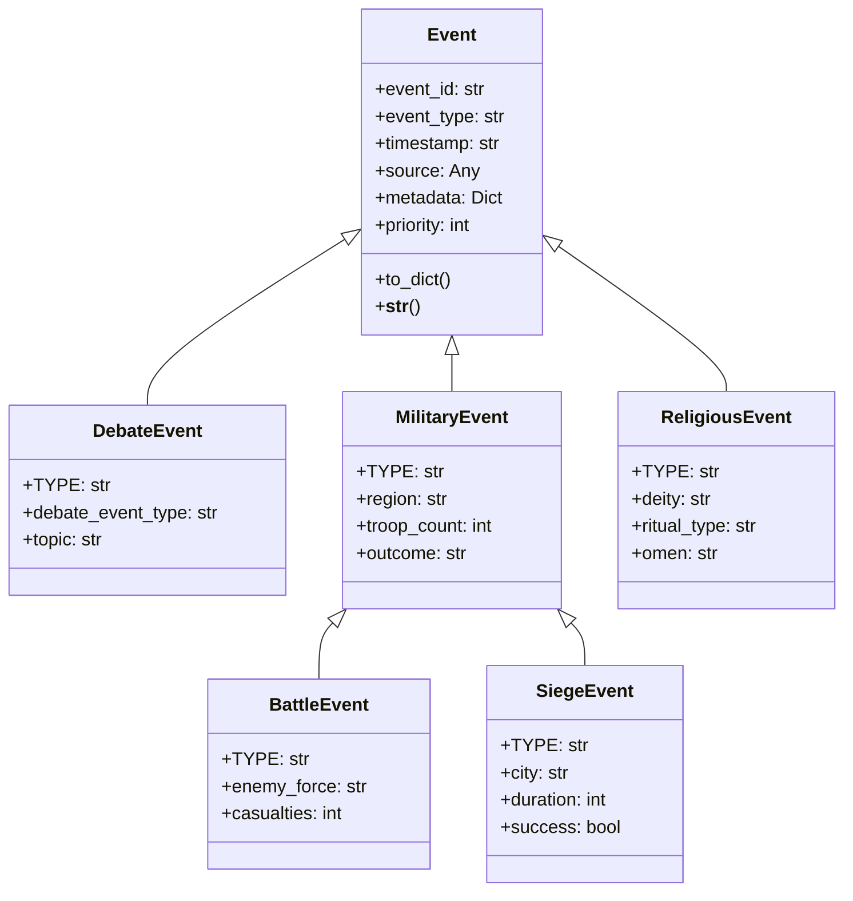

# Extending the Roman Senate Event System

**Author:** Documentation Team  
**Version:** 1.0.0  
**Date:** April 18, 2025

## Table of Contents

- [Introduction](#introduction)
- [Creating New Event Types](#creating-new-event-types)
  - [Basic Event Creation](#basic-event-creation)
  - [Specialized Event Types](#specialized-event-types)
  - [Event Hierarchies](#event-hierarchies)
- [Best Practices for Event Handling](#best-practices-for-event-handling)
  - [Handler Organization](#handler-organization)
  - [Error Handling](#error-handling)
  - [Asynchronous Processing](#asynchronous-processing)
  - [Prioritization](#prioritization)
- [Advanced Event Processing Techniques](#advanced-event-processing-techniques)
  - [Event Filtering](#event-filtering)
  - [Event Transformation](#event-transformation)
  - [Event Aggregation](#event-aggregation)
  - [Event Sourcing](#event-sourcing)
- [Performance Optimization](#performance-optimization)
  - [Efficient Event Design](#efficient-event-design)
  - [Handler Optimization](#handler-optimization)
  - [Scaling Considerations](#scaling-considerations)
- [Examples](#examples)
  - [Military Events Example](#military-events-example)
  - [Religious Events Example](#religious-events-example)
  - [Political Events Example](#political-events-example)

## Introduction

The Roman Senate Event System is designed to be extensible, allowing developers to create new event types and handlers to model various aspects of the simulation. This guide provides comprehensive information on extending the event system with new event types, implementing effective event handlers, and optimizing performance.

## Creating New Event Types

### Basic Event Creation

All events in the system inherit from the base `Event` class. To create a new event type, extend this class and define the specific properties and methods needed for your event.

```python
from roman_senate.core.events.base import Event

class MilitaryEvent(Event):
    """Event representing military activities or reports."""
    
    TYPE = "military_event"  # Unique type identifier for this event
    
    def __init__(self, source, region, troop_count, outcome=None, metadata=None):
        """
        Initialize a military event.
        
        Args:
            source: The entity that generated the event (e.g., a senator)
            region: The geographic region where the military activity occurred
            troop_count: Number of troops involved
            outcome: Result of the military activity (victory, defeat, etc.)
            metadata: Additional event-specific data
        """
        super().__init__(event_type=self.TYPE, source=source, metadata=metadata or {})
        self.region = region
        self.troop_count = troop_count
        self.outcome = outcome
        
        # Add these properties to metadata for serialization
        self.metadata.update({
            "region": region,
            "troop_count": troop_count,
            "outcome": outcome
        })
        
    def to_dict(self):
        """Convert the event to a dictionary for serialization."""
        result = super().to_dict()
        # Add any additional fields not already in metadata
        return result
```

### Specialized Event Types

For more complex event hierarchies, you can create specialized event types that inherit from a common parent:

```python
class MilitaryEventType:
    """Enumeration of military event types."""
    BATTLE = "battle"
    SIEGE = "siege"
    REINFORCEMENT = "reinforcement"
    RETREAT = "retreat"

class BattleEvent(MilitaryEvent):
    """Event representing a specific battle."""
    
    TYPE = "battle_event"
    
    def __init__(self, source, region, troop_count, enemy_force, casualties=0, metadata=None):
        """Initialize a battle event."""
        super().__init__(source, region, troop_count, metadata=metadata)
        self.enemy_force = enemy_force
        self.casualties = casualties
        
        # Update metadata
        self.metadata.update({
            "enemy_force": enemy_force,
            "casualties": casualties
        })
```

### Event Hierarchies

When designing event hierarchies, consider the following principles:

1. **Common Base Properties**: Place shared properties in the parent class
2. **Specialization**: Child classes should add specific properties relevant to their domain
3. **Type Identification**: Each event class should have a unique `TYPE` class variable
4. **Serialization**: Ensure all properties are properly serialized in `to_dict()`



## Best Practices for Event Handling

### Handler Organization

Organize event handlers based on their functionality and the components they belong to:

1. **Component-Based Handlers**: Each component should handle events relevant to its domain
2. **Handler Methods**: Use descriptive method names for handlers
3. **Single Responsibility**: Each handler should focus on a specific task

```python
class MilitarySenateCommittee:
    """Committee responsible for military affairs in the Senate."""
    
    def __init__(self, event_bus):
        self.event_bus = event_bus
        self.active_campaigns = {}
        
        # Subscribe to relevant events
        self.event_bus.subscribe(MilitaryEvent.TYPE, self.handle_military_event)
        self.event_bus.subscribe(BattleEvent.TYPE, self.handle_battle_event)
        
    async def handle_military_event(self, event: MilitaryEvent):
        """Handle general military events."""
        # Update campaign status
        if event.region in self.active_campaigns:
            self.active_campaigns[event.region]["troop_count"] = event.troop_count
            self.active_campaigns[event.region]["last_update"] = event.timestamp
            
        # Log the event
        logger.info(f"Military event in {event.region}: {event.metadata.get('description', 'No details')}")
        
    async def handle_battle_event(self, event: BattleEvent):
        """Handle specific battle events."""
        # Update campaign statistics
        if event.region in self.active_campaigns:
            campaign = self.active_campaigns[event.region]
            campaign["battles_fought"] = campaign.get("battles_fought", 0) + 1
            campaign["total_casualties"] = campaign.get("total_casualties", 0) + event.casualties
            
        # Generate a report for the Senate
        report = self._generate_battle_report(event)
        
        # Publish a report event
        await self.event_bus.publish(SenateReportEvent(
            source=self,
            report_type="battle_report",
            content=report,
            metadata={"region": event.region, "urgent": event.casualties > 1000}
        ))
```

### Error Handling

Implement robust error handling in event handlers to prevent failures from affecting the entire system:

```python
async def handle_event(self, event: Event) -> None:
    """Process an event with proper error handling."""
    try:
        # Process the event
        await self._process_event(event)
    except Exception as e:
        # Log the error
        logger.error(f"Error handling {event.event_type} event: {e}", exc_info=True)
        
        # Publish an error event
        await self.event_bus.publish(ErrorEvent(
            source=self,
            error_type="handler_error",
            original_event=event,
            error_message=str(e),
            metadata={"stack_trace": traceback.format_exc()}
        ))
        
        # Optionally implement recovery logic
        await self._recover_from_error(event, e)
```

### Asynchronous Processing

Use asynchronous processing to handle events efficiently:

1. **Async Handlers**: Implement handlers as async methods
2. **Non-Blocking Operations**: Use async I/O for database or network operations
3. **Concurrency Control**: Use semaphores or locks when needed

```python
import asyncio

class EventProcessor:
    """Processes events asynchronously."""
    
    def __init__(self, event_bus, max_concurrent=5):
        self.event_bus = event_bus
        self.semaphore = asyncio.Semaphore(max_concurrent)
        
        # Subscribe to events
        self.event_bus.subscribe("high_priority_event", self.handle_high_priority)
        self.event_bus.subscribe("normal_event", self.handle_normal_event)
        
    async def handle_high_priority(self, event):
        """Handle high priority events immediately."""
        await self._process_event(event)
        
    async def handle_normal_event(self, event):
        """Handle normal events with concurrency control."""
        async with self.semaphore:
            await self._process_event(event)
            
    async def _process_event(self, event):
        """Process an event with potential I/O operations."""
        # Simulate database operation
        await asyncio.sleep(0.1)
        
        # Process event data
        result = self._compute_result(event)
        
        # Simulate network operation
        await asyncio.sleep(0.2)
        
        # Publish result
        await self.event_bus.publish(ResultEvent(
            source=self,
            original_event_id=event.event_id,
            result=result
        ))
```

### Prioritization

Implement prioritization for event handling when order matters:

```python
class PrioritizedEventHandler:
    """Handles events based on priority."""
    
    def __init__(self, event_bus):
        self.event_bus = event_bus
        self.priority = 10  # Higher priority handlers are called first
        
    async def handle_event(self, event):
        """Handle an event with priority consideration."""
        # Process based on event priority
        if event.priority > 5:
            # Handle high priority events first
            await self._handle_high_priority(event)
        else:
            # Queue low priority events
            self._queue_for_later_processing(event)
```

## Advanced Event Processing Techniques

### Event Filtering

Filter events based on specific criteria before processing:

```python
class FilteredEventHandler:
    """Handles events after filtering."""
    
    def __init__(self, event_bus):
        self.event_bus = event_bus
        self.regions_of_interest = ["Gaul", "Hispania", "Italia"]
        
        # Subscribe to events
        self.event_bus.subscribe(MilitaryEvent.TYPE, self.handle_military_event)
        
    async def handle_military_event(self, event: MilitaryEvent):
        """Handle military events after filtering by region."""
        # Filter events by region
        if event.region not in self.regions_of_interest:
            return  # Ignore events from other regions
            
        # Process relevant events
        await self._process_military_event(event)
```

### Event Transformation

Transform events into different formats or types:

```python
class EventTransformer:
    """Transforms events into different formats."""
    
    def __init__(self, event_bus):
        self.event_bus = event_bus
        
        # Subscribe to events
        self.event_bus.subscribe(MilitaryEvent.TYPE, self.transform_to_report)
        
    async def transform_to_report(self, event: MilitaryEvent):
        """Transform military events into report events."""
        # Create a report from the military event
        report_content = self._generate_report_content(event)
        
        # Publish a new report event
        await self.event_bus.publish(ReportEvent(
            source=self,
            report_type="military_report",
            content=report_content,
            metadata={
                "original_event_id": event.event_id,
                "region": event.region,
                "importance": self._calculate_importance(event)
            }
        ))
```

### Event Aggregation

Aggregate multiple events to generate summary events:

```python
class EventAggregator:
    """Aggregates multiple events into summary events."""
    
    def __init__(self, event_bus):
        self.event_bus = event_bus
        self.military_events = {}  # Region -> list of events
        
        # Subscribe to events
        self.event_bus.subscribe(MilitaryEvent.TYPE, self.collect_military_event)
        
    async def collect_military_event(self, event: MilitaryEvent):
        """Collect military events for aggregation."""
        # Store the event by region
        if event.region not in self.military_events:
            self.military_events[event.region] = []
        self.military_events[event.region].append(event)
        
        # Check if we should generate a summary
        if len(self.military_events[event.region]) >= 5:
            await self._generate_regional_summary(event.region)
            
    async def _generate_regional_summary(self, region):
        """Generate a summary event for a region."""
        events = self.military_events[region]
        
        # Calculate summary statistics
        total_troops = sum(e.troop_count for e in events)
        victories = sum(1 for e in events if e.outcome == "victory")
        defeats = sum(1 for e in events if e.outcome == "defeat")
        
        # Create and publish summary event
        await self.event_bus.publish(MilitarySummaryEvent(
            source=self,
            region=region,
            event_count=len(events),
            total_troops=total_troops,
            victories=victories,
            defeats=defeats,
            metadata={"period": "last_5_events"}
        ))
        
        # Clear the collected events
        self.military_events[region] = []
```

### Event Sourcing

Implement event sourcing to reconstruct state from event history:

```python
class EventSourcedCampaign:
    """Military campaign that reconstructs state from events."""
    
    def __init__(self, event_bus, campaign_id, region):
        self.event_bus = event_bus
        self.campaign_id = campaign_id
        self.region = region
        
        # State variables
        self.troop_count = 0
        self.battles_fought = 0
        self.victories = 0
        self.defeats = 0
        self.active = False
        
        # Subscribe to relevant events
        self.event_bus.subscribe(MilitaryEvent.TYPE, self.apply_military_event)
        
    async def apply_military_event(self, event: MilitaryEvent):
        """Apply a military event to update the campaign state."""
        # Only process events for this campaign's region
        if event.region != self.region:
            return
            
        # Apply the event to the state
        if event.event_type == MilitaryEvent.TYPE:
            self.troop_count = event.troop_count
            
        elif event.event_type == BattleEvent.TYPE:
            self.battles_fought += 1
            if event.outcome == "victory":
                self.victories += 1
            elif event.outcome == "defeat":
                self.defeats += 1
                
        # Special event types
        elif event.event_type == "campaign_start":
            self.active = True
            self.troop_count = event.troop_count
            
        elif event.event_type == "campaign_end":
            self.active = False
            
    async def reconstruct_from_history(self, events):
        """Reconstruct campaign state from historical events."""
        # Reset state
        self.troop_count = 0
        self.battles_fought = 0
        self.victories = 0
        self.defeats = 0
        self.active = False
        
        # Apply each event in sequence
        for event in sorted(events, key=lambda e: e.timestamp):
            await self.apply_military_event(event)
```

## Performance Optimization

### Efficient Event Design

Design events to be efficient and performant:

1. **Minimal Payload**: Include only necessary data in events
2. **Lazy Loading**: Use references instead of embedding large objects
3. **Serialization Efficiency**: Ensure efficient serialization/deserialization

```python
class OptimizedEvent(Event):
    """Event designed for performance."""
    
    def __init__(self, event_type, source, metadata=None):
        super().__init__(event_type, source, metadata)
        
        # Use references instead of embedding large objects
        if hasattr(source, 'id'):
            self.source_id = source.id
            self._source = None  # Lazy-loaded
        else:
            self._source = source
            self.source_id = None
            
    @property
    def source(self):
        """Lazy-load the source object if needed."""
        if self._source is None and self.source_id is not None:
            # Load the source object on demand
            self._source = self._load_source(self.source_id)
        return self._source
        
    def _load_source(self, source_id):
        """Load a source object by ID."""
        # Implementation depends on your object storage mechanism
        return source_repository.get(source_id)
```

### Handler Optimization

Optimize event handlers for performance:

1. **Batch Processing**: Process multiple events in batches when possible
2. **Caching**: Cache frequently accessed data
3. **Selective Processing**: Only process what's needed

```python
class OptimizedHandler:
    """Event handler optimized for performance."""
    
    def __init__(self, event_bus):
        self.event_bus = event_bus
        self.event_queue = []
        self.processing = False
        self.cache = {}  # Simple cache
        
        # Subscribe to events
        self.event_bus.subscribe(FrequentEvent.TYPE, self.queue_event)
        
    async def queue_event(self, event):
        """Queue an event for batch processing."""
        self.event_queue.append(event)
        
        # Start processing if not already in progress
        if not self.processing:
            self.processing = True
            await self._process_queue()
            
    async def _process_queue(self):
        """Process queued events in batches."""
        while self.event_queue:
            # Take a batch of up to 10 events
            batch = self.event_queue[:10]
            self.event_queue = self.event_queue[10:]
            
            # Process the batch
            results = []
            for event in batch:
                # Use cached data if available
                cache_key = f"{event.event_type}:{event.source_id}"
                if cache_key in self.cache:
                    context = self.cache[cache_key]
                else:
                    context = await self._load_context(event)
                    self.cache[cache_key] = context
                    
                # Process with context
                result = self._process_with_context(event, context)
                results.append(result)
                
            # Publish batch results
            await self._publish_results(results)
            
            # Allow other tasks to run
            await asyncio.sleep(0)
            
        self.processing = False
```

### Scaling Considerations

Consider these factors when scaling the event system:

1. **Event Volume**: Design for the expected volume of events
2. **Handler Complexity**: Balance between simple and complex handlers
3. **Memory Usage**: Monitor and optimize memory usage
4. **Concurrency**: Control the level of concurrency

```python
class ScalableEventProcessor:
    """Event processor designed for scalability."""
    
    def __init__(self, event_bus, config):
        self.event_bus = event_bus
        
        # Configuration for scaling
        self.max_concurrent = config.get("max_concurrent", 10)
        self.batch_size = config.get("batch_size", 50)
        self.queue_limit = config.get("queue_limit", 1000)
        
        # Concurrency control
        self.semaphore = asyncio.Semaphore(self.max_concurrent)
        self.queue = asyncio.Queue(maxsize=self.queue_limit)
        
        # Start the worker
        self.worker_task = asyncio.create_task(self._worker())
        
        # Subscribe to events
        for event_type in config.get("event_types", []):
            self.event_bus.subscribe(event_type, self.handle_event)
            
    async def handle_event(self, event):
        """Queue an event for processing."""
        try:
            await self.queue.put(event)
        except asyncio.QueueFull:
            logger.warning(f"Event queue full, dropping event: {event}")
            
    async def _worker(self):
        """Worker that processes events from the queue."""
        while True:
            # Get a batch of events
            batch = []
            for _ in range(self.batch_size):
                try:
                    event = await asyncio.wait_for(self.queue.get(), timeout=0.1)
                    batch.append(event)
                except asyncio.TimeoutError:
                    break
                    
            if not batch:
                await asyncio.sleep(0.1)
                continue
                
            # Process the batch with concurrency control
            async with self.semaphore:
                await self._process_batch(batch)
                
            # Mark tasks as done
            for _ in range(len(batch)):
                self.queue.task_done()
                
    async def _process_batch(self, batch):
        """Process a batch of events."""
        # Implementation depends on your specific needs
        pass
```

## Examples

### Military Events Example

This example demonstrates creating and handling military events:

```python
# Define event types
class MilitaryEventType:
    BATTLE = "battle"
    SIEGE = "siege"
    REINFORCEMENT = "reinforcement"
    RETREAT = "retreat"

# Create the event class
class MilitaryEvent(Event):
    """Event representing military activities."""
    
    TYPE = "military_event"
    
    def __init__(self, source, military_type, region, troops, outcome=None, metadata=None):
        super().__init__(self.TYPE, source, metadata or {})
        self.military_type = military_type
        self.region = region
        self.troops = troops
        self.outcome = outcome
        
        # Add to metadata
        self.metadata.update({
            "military_type": military_type,
            "region": region,
            "troops": troops,
            "outcome": outcome
        })

# Create a handler
class MilitaryEventHandler:
    """Handles military events."""
    
    def __init__(self, event_bus):
        self.event_bus = event_bus
        self.event_bus.subscribe(MilitaryEvent.TYPE, self.handle_military_event)
        
    async def handle_military_event(self, event):
        """Handle a military event."""
        # Process based on military type
        if event.military_type == MilitaryEventType.BATTLE:
            await self._handle_battle(event)
        elif event.military_type == MilitaryEventType.SIEGE:
            await self._handle_siege(event)
        # ...
        
    async def _handle_battle(self, event):
        """Handle a battle event."""
        logger.info(f"Battle in {event.region} with {event.troops} troops. Outcome: {event.outcome}")
        
        # Update senate records
        # ...
        
        # Publish a report event
        await self.event_bus.publish(ReportEvent(
            source=self,
            report_type="battle_report",
            content=f"Battle report from {event.region}: {event.outcome}",
            metadata={"region": event.region, "urgent": event.outcome == "defeat"}
        ))
```

### Religious Events Example

This example shows how to create and handle religious events:

```python
# Define event types
class ReligiousEventType:
    OMEN = "omen"
    SACRIFICE = "sacrifice"
    FESTIVAL = "festival"
    PROPHECY = "prophecy"

# Create the event class
class ReligiousEvent(Event):
    """Event representing religious activities or omens."""
    
    TYPE = "religious_event"
    
    def __init__(self, source, religious_type, deity, description, interpretation=None, metadata=None):
        super().__init__(self.TYPE, source, metadata or {})
        self.religious_type = religious_type
        self.deity = deity
        self.description = description
        self.interpretation = interpretation
        
        # Add to metadata
        self.metadata.update({
            "religious_type": religious_type,
            "deity": deity,
            "description": description,
            "interpretation": interpretation
        })

# Create a handler
class ReligiousEventHandler:
    """Handles religious events."""
    
    def __init__(self, event_bus):
        self.event_bus = event_bus
        self.event_bus.subscribe(ReligiousEvent.TYPE, self.handle_religious_event)
        
    async def handle_religious_event(self, event):
        """Handle a religious event."""
        # Process based on religious type
        if event.religious_type == ReligiousEventType.OMEN:
            await self._handle_omen(event)
        elif event.religious_type == ReligiousEventType.SACRIFICE:
            await self._handle_sacrifice(event)
        # ...
        
    async def _handle_omen(self, event):
        """Handle an omen event."""
        logger.info(f"Omen related to {event.deity}: {event.description}")
        
        # Determine if this is a good or bad omen
        is_favorable = "favorable" in event.interpretation.lower()
        
        # Publish a senate announcement
        await self.event_bus.publish(AnnouncementEvent(
            source=self,
            announcement_type="religious_omen",
            content=f"The priests have interpreted an omen from {event.deity}: {event.interpretation}",
            metadata={"deity": event.deity, "favorable": is_favorable}
        ))
```

### Political Events Example

This example demonstrates creating and handling political events:

```python
# Define event types
class PoliticalEventType:
    ALLIANCE = "alliance"
    BETRAYAL = "betrayal"
    SCANDAL = "scandal"
    ELECTION = "election"

# Create the event class
class PoliticalEvent(Event):
    """Event representing political activities or developments."""
    
    TYPE = "political_event"
    
    def __init__(self, source, political_type, factions, description, impact=None, metadata=None):
        super().__init__(self.TYPE, source, metadata or {})
        self.political_type = political_type
        self.factions = factions
        self.description = description
        self.impact = impact
        
        # Add to metadata
        self.metadata.update({
            "political_type": political_type,
            "factions": factions,
            "description": description,
            "impact": impact
        })

# Create a handler
class PoliticalEventHandler:
    """Handles political events."""
    
    def __init__(self, event_bus):
        self.event_bus = event_bus
        self.event_bus.subscribe(PoliticalEvent.TYPE, self.handle_political_event)
        
    async def handle_political_event(self, event):
        """Handle a political event."""
        # Process based on political type
        if event.political_type == PoliticalEventType.ALLIANCE:
            await self._handle_alliance(event)
        elif event.political_type == PoliticalEventType.SCANDAL:
            await self._handle_scandal(event)
        # ...
        
    async def _handle_scandal(self, event):
        """Handle a political scandal event."""
        logger.info(f"Political scandal involving {event.factions}: {event.description}")
        
        # Determine the severity
        severity = event.metadata.get("severity", "moderate")
        
        # Update faction relationships
        for faction in event.factions:
            # Reduce reputation
            # ...
            
        # Publish a gossip event
        await self.event_bus.publish(GossipEvent(
            source=self,
            gossip_type="scandal",
            content=f"Scandal in the Senate: {event.description}",
            metadata={"factions": event.factions, "severity": severity}
        ))