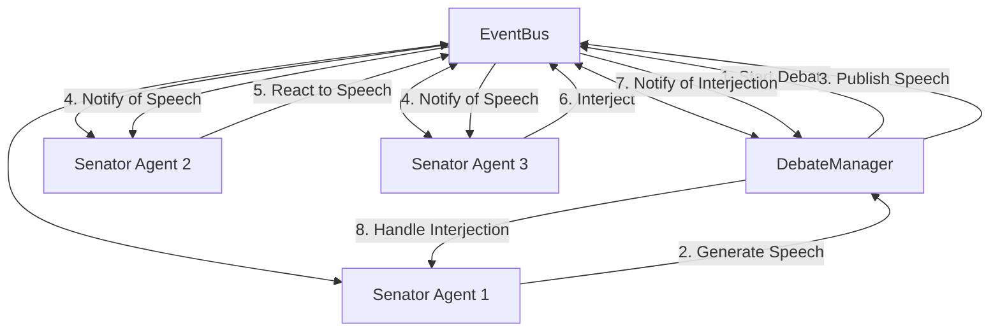

# Roman Senate Event System Documentation

**Author:** Documentation Team  
**Version:** 1.0.0  
**Date:** April 18, 2025

## Overview

This documentation package provides comprehensive information about the Roman Senate Event System, an event-driven architecture that enhances the simulation by enabling senators to observe, listen to, and react to events in their environment - particularly during debates.

## Documentation Structure

| Document | Description |
|----------|-------------|
| [README](README.md) | System overview and introduction |
| [Quick Start Guide](quick_start.md) | Essential information to get started quickly |
| [User Guide](user_guide.md) | How to run the simulation with the new features |
| [Developer Guide](developer_guide.md) | How to extend and work with the event system |
| [Architecture](architecture.md) | Detailed system design and component relationships |
| [Examples](examples.md) | Code examples and usage patterns |

## Quick Links

### For Users

- [Running the Simulation](user_guide.md#running-the-simulation)
- [Understanding Debate Behavior](user_guide.md#understanding-debate-behavior)
- [Debugging and Monitoring](user_guide.md#debugging-and-monitoring)
- [Troubleshooting](user_guide.md#troubleshooting)

### For Developers

- [Quick Start Guide](quick_start.md)
- [Architecture Overview](architecture.md#architecture-overview)
- [Event Flow](architecture.md#event-flow)
- [Working with Events](developer_guide.md#working-with-events)
- [Senator Agent Integration](developer_guide.md#senator-agent-integration)
- [Testing the Event System](developer_guide.md#testing-the-event-system)
- [Best Practices](developer_guide.md#best-practices)

### Code Examples

- [Basic Usage Examples](examples.md#basic-usage-examples)
- [Debate Examples](examples.md#debate-examples)
- [Senator Agent Examples](examples.md#senator-agent-examples)
- [Event Memory Examples](examples.md#event-memory-examples)
- [Advanced Examples](examples.md#advanced-examples)

## Key Features

The Roman Senate Event System provides:

1. **Real-time Reactions**: Senators can react to speeches as they happen
2. **Dynamic Interruptions**: Higher-ranking senators can interrupt speakers
3. **Position Changes**: Senators can be persuaded to change their stance on topics
4. **Memory of Events**: Senators remember events, reactions, and interactions
5. **Comprehensive Logging**: Detailed logging of all events for debugging and analysis

## System Architecture



## Getting Started

To quickly see the event system in action:

```bash
# Run the event system demo
python -m src.roman_senate.examples.event_system_demo

# Run a full simulation with verbose logging
python -m src.roman_senate.cli simulate --verbose

# Run a debate with specific logging level
python -m src.roman_senate.cli play --log-level DEBUG
```

For a quick introduction to the system, see the [Quick Start Guide](quick_start.md).

For more detailed instructions, see the [User Guide](user_guide.md).