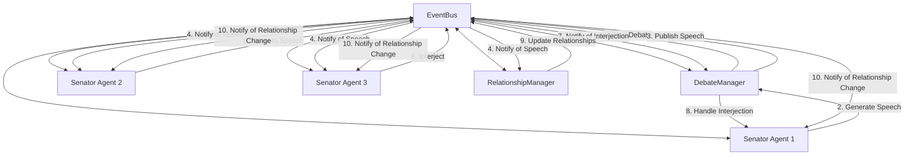
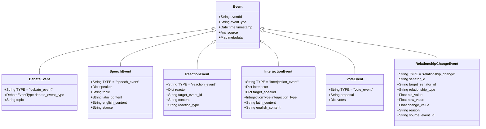

# Roman Senate Event System Documentation

**Author:** Documentation Team  
**Version:** 1.1.0  
**Date:** April 19, 2025

## Overview

This documentation package provides comprehensive information about the Roman Senate Event System, an event-driven architecture that enhances the simulation by enabling senators to observe, listen to, and react to events in their environment - particularly during debates.

## Documentation Structure

| Document | Description |
|----------|-------------|
| [README](README.md) | System overview and introduction |
| [Quick Start Guide](quick_start.md) | Essential information to get started quickly |
| [User Guide](user_guide.md) | How to run the simulation with the new features |
| [Developer Guide](developer_guide.md) | How to extend and work with the event system |
| [Architecture](architecture.md) | Detailed system design and component relationships |
| [Examples](examples.md) | Code examples and usage patterns |
| [Integration Guide](integration_guide.md) | How to integrate existing code with the event system |
| [Extending Events](extending_events.md) | Guide to creating new event types and handlers |
| [Test Fixes](test_fixes.md) | Guide to fixing common test issues |

## Quick Links

### For Users

- [Running the Simulation](user_guide.md#running-the-simulation)
- [Understanding Debate Behavior](user_guide.md#understanding-debate-behavior)
- [Configuring the Event System](user_guide.md#configuring-the-event-system)
- [Logging and Monitoring](user_guide.md#logging-and-monitoring)
- [Troubleshooting](user_guide.md#troubleshooting)
- [Command-Line Options](user_guide.md#command-line-options)

### For Developers

- [Quick Start Guide](quick_start.md)
- [Architecture Overview](architecture.md#architecture-overview)
- [Event Flow](architecture.md#event-flow)
- [Working with Events](developer_guide.md#working-with-events)
- [Senator Agent Integration](developer_guide.md#senator-agent-integration)
- [Testing the Event System](developer_guide.md#testing-the-event-system)
- [Best Practices](developer_guide.md#best-practices)
- [Integrating Existing Code](integration_guide.md#integration-overview)
- [Creating New Event Types](extending_events.md#creating-new-event-types)
- [Performance Optimization](extending_events.md#performance-optimization)

### Code Examples

- [Basic Usage Examples](examples.md#basic-usage-examples)
- [Debate Examples](examples.md#debate-examples)
- [Senator Agent Examples](examples.md#senator-agent-examples)
- [Event Memory Examples](examples.md#event-memory-examples)
- [Advanced Examples](examples.md#advanced-examples)
- [Integration Examples](integration_guide.md#case-studies)
- [Event Extension Examples](extending_events.md#examples)

### Related Systems

- [Relationship System](../relationship_system/index.md) - Documentation for the senator relationship system
- [Memory System](../memory_system.md) - Documentation for the memory persistence system

### Troubleshooting

- [Common Issues](test_fixes.md#test-failures-overview)
- [Fixing Source Representation](test_fixes.md#issue-2-source-representation-in-events)
- [Event Handler Calling Issues](test_fixes.md#issue-3-event-handler-calling)
- [Vote Mapping Problems](test_fixes.md#issue-4-vote-mapping)
- [Event Memory Issues](test_fixes.md#issue-5-event-memory-record-method)

## Key Features

The Roman Senate Event System provides:

1. **Real-time Reactions**: Senators can react to speeches as they happen
2. **Dynamic Interruptions**: Higher-ranking senators can interrupt speakers
3. **Position Changes**: Senators can be persuaded to change their stance on topics
4. **Memory of Events**: Senators remember events, reactions, and interactions
5. **Comprehensive Logging**: Detailed logging of all events for debugging and analysis
6. **Relationship Development**: Senators develop relationships based on interactions
7. **Faction Dynamics**: Faction alignments influence reactions and interruptions

## System Architecture

The event system is built around a central EventBus that connects all components:



## Event Types

The system includes several core event types:



## Recent Enhancements

The event system has recently undergone several major enhancements:

1. **CLI Import Fix**: Resolved relative import issues in cli.py
2. **Comprehensive Logging System**: Added robust file and console logging
3. **Event-Driven Architecture**: Implemented a publisher-subscriber system
4. **Testing Framework**: Created comprehensive tests for the new event system
5. **Relationship System Integration**: Added relationship events and handlers

## Getting Started

To quickly see the event system in action:

```bash
# Run the event system demo
python -m src.roman_senate.examples.event_system_demo

# Run the relationship system demo
python -m src.roman_senate.examples.enhanced_relationship_demo

# Run a full simulation with verbose logging
python -m src.roman_senate.cli simulate --verbose

# Run a debate with specific logging level
python -m src.roman_senate.cli play --log-level DEBUG

# Run a simulation with custom log file
python -m src.roman_senate.cli simulate --log-file my_simulation.log

# Run a simulation with specific event types enabled
python -m src.roman_senate.cli simulate --enable-reactions --enable-interruptions
```

For a quick introduction to the system, see the [Quick Start Guide](quick_start.md).

For more detailed instructions, see the [User Guide](user_guide.md).

## Frequently Asked Questions

### General Questions

**Q: What is the event system?**  
A: The event system is an event-driven architecture that enables senators to observe, listen to, and react to events in their environment, particularly during debates.

**Q: How does the event system improve the simulation?**  
A: It creates a more realistic and immersive simulation by enabling dynamic interactions between senators, including real-time reactions, interruptions, and position changes.

**Q: What are the main components of the event system?**  
A: The main components are the EventBus, Event classes, EventDrivenSenatorAgent, DebateManager, EventMemory, and RelationshipManager.

### Technical Questions

**Q: How do I create a new event type?**  
A: Extend the base Event class and define a unique TYPE class variable. See [Creating New Event Types](extending_events.md#creating-new-event-types).

**Q: How do I subscribe to events?**  
A: Use the EventBus.subscribe method, providing the event type and a handler function or object. See [Working with Events](developer_guide.md#working-with-events).

**Q: How do I optimize event handling for performance?**  
A: See the [Performance Optimization](extending_events.md#performance-optimization) section for techniques like batch processing, caching, and selective processing.

**Q: How do I integrate existing code with the event system?**  
A: See the [Integration Guide](integration_guide.md) for strategies like using compatibility layers, adapters, and feature flags.

**Q: How does the relationship system interact with the event system?**  
A: The relationship system subscribes to events like speeches, votes, and reactions, and updates relationships accordingly. It also publishes RelationshipChangeEvent when relationships change. See [Relationship System Integration](integration_guide.md#case-study-3-relationship-system-integration).