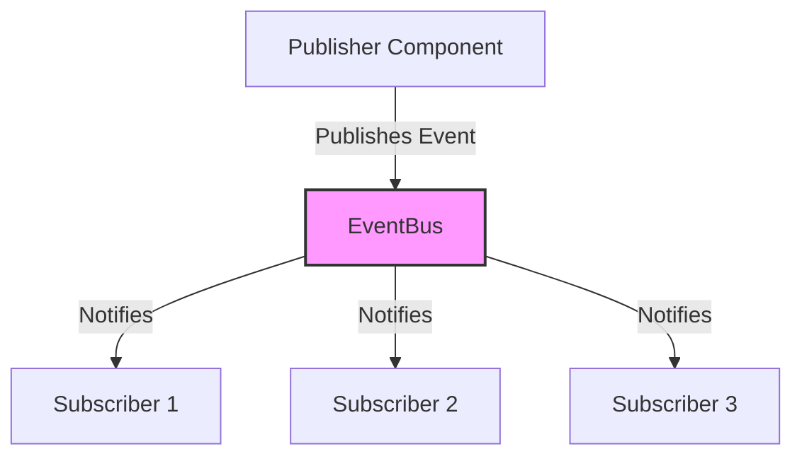

# Roman Senate Event System: Integration Guide

**Author:** Documentation Team  
**Version:** 1.0.0  
**Date:** April 18, 2025

## Table of Contents

- [Introduction](#introduction)
- [Integration Overview](#integration-overview)
- [Migrating from Traditional to Event-Driven Architecture](#migrating-from-traditional-to-event-driven-architecture)
- [Backwards Compatibility](#backwards-compatibility)
- [Case Studies](#case-studies)
- [Common Integration Patterns](#common-integration-patterns)
- [Testing Integration](#testing-integration)
- [Troubleshooting](#troubleshooting)

## Introduction

This guide provides detailed instructions for integrating existing code with the Roman Senate Event System. The event-driven architecture enables more dynamic and realistic simulations by allowing components to communicate through events rather than direct method calls.

## Integration Overview

The Roman Senate Event System is built on a publisher-subscriber (pub/sub) pattern, where:

1. **Publishers** emit events when something happens (e.g., a senator gives a speech)
2. **Subscribers** listen for events they're interested in and react accordingly
3. **EventBus** serves as the central hub that connects publishers and subscribers



## Migrating from Traditional to Event-Driven Architecture

### Step 1: Identify Event Types

Identify the types of events your component should publish or subscribe to:

```python
# Traditional approach - direct method calls
class DebateSystem:
    def conduct_debate(self, topic, senators):
        for senator in senators:
            speech = senator.generate_speech(topic)
            self.display_speech(senator, speech)
            # Other senators can't react to the speech in real-time

# Event-driven approach - identify events
# Events to publish:
# - DebateStartEvent (when debate begins)
# - SpeechEvent (when a senator speaks)
# - DebateEndEvent (when debate concludes)

# Events to subscribe to:
# - ReactionEvent (when senators react to speeches)
# - InterjectionEvent (when senators interject)
```

### Step 2: Create Event Handlers

Create handlers for the events your component needs to respond to:

```python
class DebateSystem:
    async def handle_reaction_event(self, event: ReactionEvent):
        """Handle a reaction to a speech."""
        # Display the reaction
        self.display_reaction(event.reactor, event.content)
        
    async def handle_interjection_event(self, event: InterjectionEvent):
        """Handle an interjection during a speech."""
        # Process the interjection
        self.handle_interruption(event.interjector, event.target_speaker, event.content)
```

### Step 3: Subscribe to Events

Subscribe your component to the events it needs to handle:

```python
def initialize(self, event_bus: EventBus):
    """Initialize the debate system with an event bus."""
    self.event_bus = event_bus
    
    # Subscribe to events
    self.event_bus.subscribe(ReactionEvent.TYPE, self.handle_reaction_event)
    self.event_bus.subscribe(InterjectionEvent.TYPE, self.handle_interjection_event)
```

### Step 4: Publish Events

Modify your component to publish events when relevant actions occur:

```python
async def conduct_debate(self, topic, senators):
    """Conduct a debate on the given topic."""
    # Publish debate start event
    await self.event_bus.publish(DebateEvent(
        debate_event_type=DebateEventType.DEBATE_START,
        topic=topic,
        metadata={"participants": [s.get("name") for s in senators]}
    ))
    
    # For each senator's turn
    for senator in senators:
        # Publish speaker change event
        await self.event_bus.publish(DebateEvent(
            debate_event_type=DebateEventType.SPEAKER_CHANGE,
            source=senator,
            topic=topic,
            metadata={"speaker_name": senator.get("name")}
        ))
        
        # Generate and publish speech
        speech_content = await senator.generate_speech(topic)
        await self.event_bus.publish(SpeechEvent(
            speaker=senator,
            topic=topic,
            latin_content=speech_content["latin"],
            english_content=speech_content["english"],
            stance=speech_content["stance"]
        ))
        
        # Allow time for reactions and interjections
        await asyncio.sleep(1)
    
    # Publish debate end event
    await self.event_bus.publish(DebateEvent(
        debate_event_type=DebateEventType.DEBATE_END,
        topic=topic
    ))
```

### Step 5: Update State Management

Update your component's state management to reflect the event-driven approach:

```python
class DebateSystem:
    def __init__(self):
        self.current_speaker = None
        self.current_topic = None
        self.debate_in_progress = False
        
    async def handle_debate_event(self, event: DebateEvent):
        """Handle debate events to update state."""
        if event.debate_event_type == DebateEventType.DEBATE_START:
            self.debate_in_progress = True
            self.current_topic = event.topic
        elif event.debate_event_type == DebateEventType.DEBATE_END:
            self.debate_in_progress = False
            self.current_topic = None
            self.current_speaker = None
        elif event.debate_event_type == DebateEventType.SPEAKER_CHANGE:
            self.current_speaker = event.source
```

## Backwards Compatibility

When integrating the event system with existing code, maintaining backwards compatibility is often important. Here are several strategies:

### Compatibility Layer

Create a compatibility layer that translates between the old and new approaches:

```python
class DebateSystemCompatibilityLayer:
    """Compatibility layer for the debate system."""
    
    def __init__(self, event_bus: EventBus, legacy_debate_system):
        self.event_bus = event_bus
        self.legacy_system = legacy_debate_system
        
        # Subscribe to events
        self.event_bus.subscribe(SpeechEvent.TYPE, self.handle_speech_event)
        
    async def handle_speech_event(self, event: SpeechEvent):
        """Translate speech events to legacy system calls."""
        # Call the legacy method
        self.legacy_system.display_speech(
            event.speaker,
            {
                "latin": event.latin_content,
                "english": event.english_content,
                "stance": event.stance
            }
        )
```

### Dual-Mode Operation

Implement both approaches and provide a way to switch between them:

```python
class DualModeDebateSystem:
    """Debate system that can operate in both traditional and event-driven modes."""
    
    def __init__(self, use_events=False):
        self.use_events = use_events
        self.event_bus = None
        
    async def conduct_debate(self, topic, senators):
        """Conduct a debate using either traditional or event-driven approach."""
        if self.use_events and self.event_bus:
            # Use event-driven approach
            await self._conduct_debate_with_events(topic, senators)
        else:
            # Use traditional approach
            await self._conduct_debate_traditional(topic, senators)
```

### Feature Flags

Use feature flags to gradually roll out event-driven functionality:

```python
class FeatureFlaggedDebateSystem:
    """Debate system with feature flags for event-driven capabilities."""
    
    def __init__(self, event_bus: EventBus, config: Dict[str, bool]):
        self.event_bus = event_bus
        self.config = config
        
        # Subscribe to events based on feature flags
        if self.config.get("use_reaction_events", False):
            self.event_bus.subscribe(ReactionEvent.TYPE, self.handle_reaction_event)
```

## Case Studies

### Case Study 1: Debate System Migration

**Challenge**: The original debate system used direct method calls and synchronous processing, making it difficult to implement realistic interactions between senators.

**Solution**: Migrated to an event-driven approach where:
1. Speeches are published as events
2. Senators subscribe to speech events
3. Reactions and interjections are published as separate events
4. The debate manager coordinates the flow based on events

**Results**:
- More realistic debates with dynamic interactions
- Senators can react and interject in real-time
- Better separation of concerns between debate management and senator behavior
- More extensible system that can easily add new event types

### Case Study 2: Senator Agent Enhancement

**Challenge**: The original `SenatorAgent` class was tightly coupled to the debate system and couldn't react to events in real-time.

**Solution**: Created an `EventDrivenSenatorAgent` that extends the base `SenatorAgent` with event-driven capabilities.

**Results**:
- Senators can now observe and react to speeches in real-time
- Memory system enhanced to track events and their impact on relationships
- More realistic behavior with senators changing positions based on persuasive arguments
- Better separation between agent behavior and debate mechanics

## Common Integration Patterns

### Adapter Pattern

Use the Adapter pattern to make existing components work with the event system without modifying them:

```python
class LegacySystemAdapter:
    """Adapter for legacy systems to work with the event system."""
    
    def __init__(self, legacy_system, event_bus: EventBus):
        self.legacy_system = legacy_system
        self.event_bus = event_bus
        
        # Subscribe to relevant events
        self.event_bus.subscribe(SpeechEvent.TYPE, self.handle_speech_event)
```

### Facade Pattern

Use the Facade pattern to provide a simplified interface to the event system:

```python
class EventSystemFacade:
    """Facade for the event system to simplify integration."""
    
    def __init__(self, event_bus: EventBus):
        self.event_bus = event_bus
        
    async def start_debate(self, topic: str, senators: List[Dict]):
        """Start a debate on the given topic."""
        await self.event_bus.publish(DebateEvent(
            debate_event_type=DebateEventType.DEBATE_START,
            topic=topic,
            metadata={"participants": [s.get("name") for s in senators]}
        ))
```

## Testing Integration

### Unit Testing

Test individual components in isolation using mocks for the event system:

```python
@pytest.mark.asyncio
async def test_senator_reaction_to_speech():
    """Test that a senator reacts appropriately to a speech event."""
    # Create mock event bus
    mock_event_bus = MagicMock()
    mock_event_bus.publish = AsyncMock()
    
    # Create senator agent
    senator = {"id": "test1", "name": "Test Senator", "faction": "Optimates"}
    agent = EventDrivenSenatorAgent(senator, MockLLMProvider(), mock_event_bus)
    
    # Create a speech event
    speech_event = SpeechEvent(
        speaker={"id": "test2", "name": "Other Senator"},
        topic="Test Topic",
        latin_content="Latin content",
        english_content="English content",
        stance="support"
    )
    
    # Force the agent to react
    agent._should_react_to_speech = AsyncMock(return_value=True)
    agent._generate_reaction_content = AsyncMock(return_value="Reaction content")
    
    # Process the speech event
    await agent.handle_speech_event(speech_event)
    
    # Verify that a reaction was published
    mock_event_bus.publish.assert_called_once()
```

### Integration Testing

Test how components work together with the event system:

```python
@pytest.mark.asyncio
async def test_debate_with_reactions():
    """Test a debate with reactions from senators."""
    # Create real event bus
    event_bus = EventBus()
    
    # Create debate manager
    debate_manager = DebateManager(event_bus, {})
    
    # Create senator agents
    senators = [
        {"id": "s1", "name": "Senator A", "faction": "Optimates"},
        {"id": "s2", "name": "Senator B", "faction": "Populares"}
    ]
    
    agents = [
        EventDrivenSenatorAgent(s, MockLLMProvider(), event_bus)
        for s in senators
    ]
```

## Troubleshooting

### Common Issues

#### Events Not Being Received

**Symptoms**:
- Components are publishing events but subscribers aren't receiving them
- No errors are being thrown

**Possible Causes**:
- Subscriber not properly registered with the event bus
- Event type mismatch between publisher and subscriber
- Asynchronous code not being awaited properly

**Solutions**:
- Verify that subscribers are registered with the correct event type
- Check for typos in event type strings
- Ensure all async methods are properly awaited
- Add debug logging to track event flow

#### Circular Event References

**Symptoms**:
- Infinite loops of events being published
- Stack overflow errors
- System becoming unresponsive

**Possible Causes**:
- Event handlers publishing events that trigger themselves
- Multiple components reacting to each other's events in a loop

**Solutions**:
- Implement event deduplication
- Add circuit breakers to prevent infinite loops
- Use event metadata to track event chains
- Implement rate limiting for event handlers
