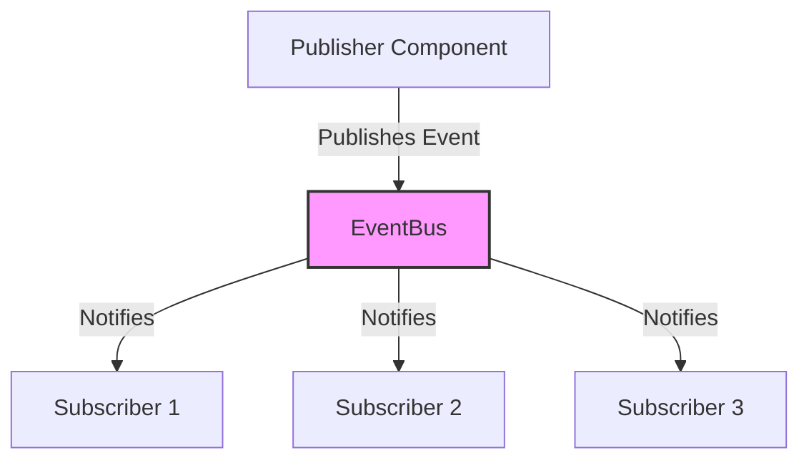

# Roman Senate Event System: Integration Guide

**Author:** Documentation Team  
**Version:** 1.1.0  
**Date:** April 19, 2025

## Table of Contents

- [Introduction](#introduction)
- [Integration Overview](#integration-overview)
- [Migrating from Traditional to Event-Driven Architecture](#migrating-from-traditional-to-event-driven-architecture)
- [Backwards Compatibility](#backwards-compatibility)
- [Case Studies](#case-studies)
  - [Case Study 1: Debate System Migration](#case-study-1-debate-system-migration)
  - [Case Study 2: Senator Agent Enhancement](#case-study-2-senator-agent-enhancement)
  - [Case Study 3: Relationship System Integration](#case-study-3-relationship-system-integration)
- [Common Integration Patterns](#common-integration-patterns)
- [Testing Integration](#testing-integration)
- [Troubleshooting](#troubleshooting)

## Introduction

This guide provides detailed instructions for integrating existing code with the Roman Senate Event System. The event-driven architecture enables more dynamic and realistic simulations by allowing components to communicate through events rather than direct method calls.

## Integration Overview

The Roman Senate Event System is built on a publisher-subscriber (pub/sub) pattern, where:

1. **Publishers** emit events when something happens (e.g., a senator gives a speech)
2. **Subscribers** listen for events they're interested in and react accordingly
3. **EventBus** serves as the central hub that connects publishers and subscribers



## Migrating from Traditional to Event-Driven Architecture

### Step 1: Identify Event Types

Identify the types of events your component should publish or subscribe to:

```python
# Traditional approach - direct method calls
class DebateSystem:
    def conduct_debate(self, topic, senators):
        for senator in senators:
            speech = senator.generate_speech(topic)
            self.display_speech(senator, speech)
            # Other senators can't react to the speech in real-time

# Event-driven approach - identify events
# Events to publish:
# - DebateStartEvent (when debate begins)
# - SpeechEvent (when a senator speaks)
# - DebateEndEvent (when debate concludes)

# Events to subscribe to:
# - ReactionEvent (when senators react to speeches)
# - InterjectionEvent (when senators interject)
```

### Step 2: Create Event Handlers

Create handlers for the events your component needs to respond to:

```python
class DebateSystem:
    async def handle_reaction_event(self, event: ReactionEvent):
        """Handle a reaction to a speech."""
        # Display the reaction
        self.display_reaction(event.reactor, event.content)
        
    async def handle_interjection_event(self, event: InterjectionEvent):
        """Handle an interjection during a speech."""
        # Process the interjection
        self.handle_interruption(event.interjector, event.target_speaker, event.content)
```

### Step 3: Subscribe to Events

Subscribe your component to the events it needs to handle:

```python
def initialize(self, event_bus: EventBus):
    """Initialize the debate system with an event bus."""
    self.event_bus = event_bus
    
    # Subscribe to events
    self.event_bus.subscribe(ReactionEvent.TYPE, self.handle_reaction_event)
    self.event_bus.subscribe(InterjectionEvent.TYPE, self.handle_interjection_event)
```

### Step 4: Publish Events

Modify your component to publish events when relevant actions occur:

```python
async def conduct_debate(self, topic, senators):
    """Conduct a debate on the given topic."""
    # Publish debate start event
    await self.event_bus.publish(DebateEvent(
        debate_event_type=DebateEventType.DEBATE_START,
        topic=topic,
        metadata={"participants": [s.get("name") for s in senators]}
    ))
    
    # For each senator's turn
    for senator in senators:
        # Publish speaker change event
        await self.event_bus.publish(DebateEvent(
            debate_event_type=DebateEventType.SPEAKER_CHANGE,
            source=senator,
            topic=topic,
            metadata={"speaker_name": senator.get("name")}
        ))
        
        # Generate and publish speech
        speech_content = await senator.generate_speech(topic)
        await self.event_bus.publish(SpeechEvent(
            speaker=senator,
            topic=topic,
            latin_content=speech_content["latin"],
            english_content=speech_content["english"],
            stance=speech_content["stance"]
        ))
        
        # Allow time for reactions and interjections
        await asyncio.sleep(1)
    
    # Publish debate end event
    await self.event_bus.publish(DebateEvent(
        debate_event_type=DebateEventType.DEBATE_END,
        topic=topic
    ))
```

### Step 5: Update State Management

Update your component's state management to reflect the event-driven approach:

```python
class DebateSystem:
    def __init__(self):
        self.current_speaker = None
        self.current_topic = None
        self.debate_in_progress = False
        
    async def handle_debate_event(self, event: DebateEvent):
        """Handle debate events to update state."""
        if event.debate_event_type == DebateEventType.DEBATE_START:
            self.debate_in_progress = True
            self.current_topic = event.topic
        elif event.debate_event_type == DebateEventType.DEBATE_END:
            self.debate_in_progress = False
            self.current_topic = None
            self.current_speaker = None
        elif event.debate_event_type == DebateEventType.SPEAKER_CHANGE:
            self.current_speaker = event.source
```

## Backwards Compatibility

When integrating the event system with existing code, maintaining backwards compatibility is often important. Here are several strategies:

### Compatibility Layer

Create a compatibility layer that translates between the old and new approaches:

```python
class DebateSystemCompatibilityLayer:
    """Compatibility layer for the debate system."""
    
    def __init__(self, event_bus: EventBus, legacy_debate_system):
        self.event_bus = event_bus
        self.legacy_system = legacy_debate_system
        
        # Subscribe to events
        self.event_bus.subscribe(SpeechEvent.TYPE, self.handle_speech_event)
        
    async def handle_speech_event(self, event: SpeechEvent):
        """Translate speech events to legacy system calls."""
        # Call the legacy method
        self.legacy_system.display_speech(
            event.speaker,
            {
                "latin": event.latin_content,
                "english": event.english_content,
                "stance": event.stance
            }
        )
```

### Dual-Mode Operation

Implement both approaches and provide a way to switch between them:

```python
class DualModeDebateSystem:
    """Debate system that can operate in both traditional and event-driven modes."""
    
    def __init__(self, use_events=False):
        self.use_events = use_events
        self.event_bus = None
        
    async def conduct_debate(self, topic, senators):
        """Conduct a debate using either traditional or event-driven approach."""
        if self.use_events and self.event_bus:
            # Use event-driven approach
            await self._conduct_debate_with_events(topic, senators)
        else:
            # Use traditional approach
            await self._conduct_debate_traditional(topic, senators)
```

### Feature Flags

Use feature flags to gradually roll out event-driven functionality:

```python
class FeatureFlaggedDebateSystem:
    """Debate system with feature flags for event-driven capabilities."""
    
    def __init__(self, event_bus: EventBus, config: Dict[str, bool]):
        self.event_bus = event_bus
        self.config = config
        
        # Subscribe to events based on feature flags
        if self.config.get("use_reaction_events", False):
            self.event_bus.subscribe(ReactionEvent.TYPE, self.handle_reaction_event)
```

## Case Studies

### Case Study 1: Debate System Migration

**Challenge**: The original debate system used direct method calls and synchronous processing, making it difficult to implement realistic interactions between senators.

**Solution**: Migrated to an event-driven approach where:
1. Speeches are published as events
2. Senators subscribe to speech events
3. Reactions and interjections are published as separate events
4. The debate manager coordinates the flow based on events

**Results**:
- More realistic debates with dynamic interactions
- Senators can react and interject in real-time
- Better separation of concerns between debate management and senator behavior
- More extensible system that can easily add new event types

### Case Study 2: Senator Agent Enhancement

**Challenge**: The original `SenatorAgent` class was tightly coupled to the debate system and couldn't react to events in real-time.

**Solution**: Created an `EventDrivenSenatorAgent` that:
1. Subscribes to relevant events (speeches, votes, etc.)
2. Maintains an event memory to track what has happened
3. Makes decisions based on event history
4. Publishes its own events (reactions, interjections, etc.)

**Results**:
- More autonomous senator behavior
- Richer interaction between senators
- Better memory of past events
- More realistic decision-making

### Case Study 3: Relationship System Integration

**Challenge**: The original relationship system used static relationship scores that didn't change dynamically based on senator interactions.

**Solution**: Integrated the relationship system with the event system:
1. Created `RelationshipChangeEvent` to notify when relationships change
2. Implemented event handlers in `RelationshipManager` for various event types:
   - `SpeechEvent`: Updates political relationships based on stance alignment
   - `ReactionEvent`: Updates personal relationships based on reaction type
   - `InterjectionEvent`: Updates relationships based on interjection type
   - `VoteEvent`: Updates political relationships based on vote alignment
3. Created `RelationshipAwareSenatorAgent` that uses relationships for decision-making

**Results**:
- Dynamic relationships that evolve based on interactions
- More realistic senator behavior influenced by relationships
- Rich historical context for relationship changes
- Improved simulation realism with relationship decay over time

```python
# Example of relationship system integration with events
class RelationshipManager:
    def __init__(self, senator_id, event_bus, memory):
        self.senator_id = senator_id
        self.event_bus = event_bus
        self.memory = memory
        
        # Register event handlers
        self.event_bus.subscribe(SpeechEvent.TYPE, self._handle_speech_event)
        self.event_bus.subscribe(VoteEvent.TYPE, self._handle_vote_event)
        self.event_bus.subscribe(ReactionEvent.TYPE, self._handle_reaction_event)
        self.event_bus.subscribe(InterjectionEvent.TYPE, self._handle_interjection_event)
    
    def _handle_speech_event(self, event: SpeechEvent):
        """Update relationships based on speech stance alignment."""
        # Skip own speeches
        if event.speaker.get("id") == self.senator_id:
            return
            
        # Update political relationship based on stance alignment
        if hasattr(self, 'current_stance') and self.current_stance == event.stance:
            self.update_relationship(
                event.speaker.get("id"),
                "political",
                0.05,
                f"Agreed with stance on {event.topic}",
                event.event_id
            )
```

## Common Integration Patterns

### Adapter Pattern

Use the adapter pattern to wrap existing components with event-driven interfaces:

```python
class SenatorAgentAdapter:
    """Adapter for traditional senator agents to work with the event system."""
    
    def __init__(self, traditional_agent, event_bus):
        self.agent = traditional_agent
        self.event_bus = event_bus
        
        # Subscribe to events
        self.event_bus.subscribe(SpeechEvent.TYPE, self.handle_speech_event)
        
    async def handle_speech_event(self, event: SpeechEvent):
        """Handle speech events by calling traditional methods."""
        # Skip own speeches
        if event.speaker.get("id") == self.agent.senator.get("id"):
            return
            
        # Call traditional method
        reaction = await self.agent.react_to_speech(
            event.speaker,
            event.topic,
            event.english_content,
            event.stance
        )
        
        # Publish reaction as an event
        await self.event_bus.publish(ReactionEvent(
            reactor=self.agent.senator,
            target_event_id=event.event_id,
            reaction_type=reaction["type"],
            content=reaction["content"]
        ))
```

### Facade Pattern

Use the facade pattern to provide a simplified interface to the event system:

```python
class DebateSystemFacade:
    """Facade for the debate system that hides event complexity."""
    
    def __init__(self, event_bus):
        self.event_bus = event_bus
        
    async def start_debate(self, topic, participants):
        """Start a debate on the given topic."""
        await self.event_bus.publish(DebateEvent(
            debate_event_type=DebateEventType.DEBATE_START,
            topic=topic,
            metadata={"participants": participants}
        ))
        
    async def end_debate(self, topic):
        """End the current debate."""
        await self.event_bus.publish(DebateEvent(
            debate_event_type=DebateEventType.DEBATE_END,
            topic=topic
        ))
        
    async def deliver_speech(self, speaker, topic, content, stance):
        """Deliver a speech in the debate."""
        await self.event_bus.publish(SpeechEvent(
            speaker=speaker,
            topic=topic,
            latin_content=content.get("latin", ""),
            english_content=content.get("english", ""),
            stance=stance
        ))
```

## Testing Integration

### Unit Testing

Test individual event handlers in isolation:

```python
import unittest
from unittest.mock import MagicMock, AsyncMock

class TestRelationshipManager(unittest.TestCase):
    def setUp(self):
        self.event_bus = MagicMock()
        self.memory = MagicMock()
        self.relationship_manager = RelationshipManager(
            senator_id="senator_test",
            event_bus=self.event_bus,
            memory=self.memory
        )
        
    async def test_handle_speech_event(self):
        """Test handling of speech events."""
        # Create a mock speech event
        speech_event = MagicMock()
        speech_event.speaker = {"id": "senator_other"}
        speech_event.stance = "support"
        speech_event.topic = "Test Topic"
        
        # Set current stance
        self.relationship_manager.current_stance = "support"
        
        # Mock the update_relationship method
        self.relationship_manager.update_relationship = AsyncMock()
        
        # Call the handler
        await self.relationship_manager._handle_speech_event(speech_event)
        
        # Assert that update_relationship was called with correct parameters
        self.relationship_manager.update_relationship.assert_called_once_with(
            "senator_other",
            "political",
            0.05,
            "Agreed with stance on Test Topic",
            speech_event.event_id
        )
```

### Integration Testing

Test how components interact through the event system:

```python
import unittest
import asyncio
from unittest.mock import MagicMock, AsyncMock

class TestRelationshipIntegration(unittest.TestCase):
    async def asyncSetUp(self):
        # Create event bus
        self.event_bus = EventBus()
        
        # Create memory manager
        self.memory_manager = MemoryPersistenceManager(base_path="test_memory")
        
        # Create mock LLM provider
        self.llm_provider = MagicMock()
        self.llm_provider.generate_text = AsyncMock(return_value="neutral")
        
        # Create senators
        self.cicero = RelationshipAwareSenatorAgent(
            senator={"name": "Cicero", "id": "senator_cicero", "faction": "Optimates"},
            llm_provider=self.llm_provider,
            event_bus=self.event_bus,
            memory_manager=self.memory_manager
        )
        
        self.caesar = RelationshipAwareSenatorAgent(
            senator={"name": "Caesar", "id": "senator_caesar", "faction": "Populares"},
            llm_provider=self.llm_provider,
            event_bus=self.event_bus,
            memory_manager=self.memory_manager
        )
    
    async def test_speech_event_affects_relationship(self):
        """Test that speech events affect relationships."""
        # Set initial relationship
        self.cicero.relationship_manager.update_relationship(
            "senator_caesar", "political", 0.0, "Initial neutral"
        )
        
        # Create and publish speech event
        speech_event = SpeechEvent(
            speaker=self.caesar.senator,
            topic="Test Topic",
            stance="support",
            content="Test speech"
        )
        
        # Set cicero's stance to oppose
        self.cicero.current_stance = "oppose"
        
        # Publish event
        await self.event_bus.publish(speech_event)
        
        # Allow time for event processing
        await asyncio.sleep(0.1)
        
        # Get updated relationship
        new_rel = self.cicero.relationship_manager.get_relationship(
            "senator_caesar", "political"
        )
        
        # Relationship should decrease due to opposed stances
        self.assertLess(new_rel, 0.0)
```

## Troubleshooting

### Common Issues

#### Events Not Being Received

**Symptoms**:
- Components don't react to events
- No errors are thrown
- Event handlers aren't being called

**Possible Causes**:
1. Event subscription is missing or incorrect
2. Event type mismatch
3. Asynchronous code not awaited properly

**Solutions**:
1. Verify that `event_bus.subscribe(EVENT_TYPE, handler)` is called
2. Check that the event type string matches exactly
3. Ensure all async event handlers are properly awaited

```python
# Correct subscription
self.event_bus.subscribe(SpeechEvent.TYPE, self.handle_speech_event)

# Correct async handler
async def handle_speech_event(self, event: SpeechEvent):
    # Process event
    pass
```

#### Circular Event References

**Symptoms**:
- Infinite loops of events
- System becomes unresponsive
- Memory usage grows rapidly

**Possible Causes**:
1. Event handlers publish events that trigger themselves
2. Multiple components react to each other's events in a loop

**Solutions**:
1. Add checks to prevent handling your own events
2. Use event metadata to track event chains
3. Implement rate limiting for event handling

```python
async def handle_speech_event(self, event: SpeechEvent):
    # Skip own events
    if event.speaker.get("id") == self.senator_id:
        return
        
    # Process the event
    # ...
```

For more information on integrating with the relationship system specifically, see the [Relationship System Integration Guide](../relationship_system/integration_guide.md).
