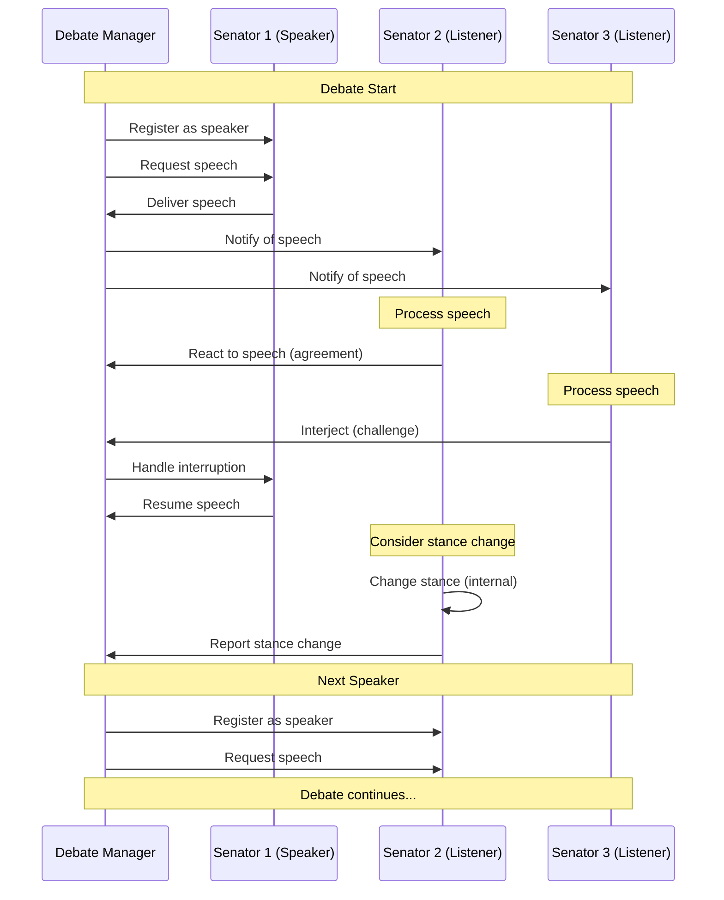

# Roman Senate Event System: User Guide

**Author:** Documentation Team  
**Version:** 1.1.0  
**Date:** April 18, 2025

## Table of Contents

- [Introduction](#introduction)
- [Running the Simulation](#running-the-simulation)
  - [Basic Commands](#basic-commands)
  - [Command-Line Options](#command-line-options)
  - [Logging Options](#logging-options)
  - [Configuration Examples](#configuration-examples)
- [Understanding Debate Behavior](#understanding-debate-behavior)
  - [Speech Events](#speech-events)
  - [Reactions](#reactions)
  - [Interjections](#interjections)
  - [Position Changes](#position-changes)
  - [Debate Flow Visualization](#debate-flow-visualization)
- [Debugging and Monitoring](#debugging-and-monitoring)
  - [Log Files](#log-files)
  - [Event History](#event-history)
  - [Performance Monitoring](#performance-monitoring)
- [Extending the System](#extending-the-system)
  - [Creating New Event Types](#creating-new-event-types)
  - [Adding Custom Reactions](#adding-custom-reactions)
  - [Modifying Behavior Parameters](#modifying-behavior-parameters)
- [Troubleshooting](#troubleshooting)
  - [Common Issues](#common-issues)
  - [Error Messages](#error-messages)
  - [Performance Considerations](#performance-considerations)
  - [Known Limitations](#known-limitations)

## Introduction

The Roman Senate Event System enhances the simulation with dynamic interactions between senators during debates. This guide will help you run the simulation, understand the new event-driven behaviors, and customize the system to your needs.

## Running the Simulation

### Basic Commands

The Roman Senate simulation can be run using the command-line interface (CLI). Here are the basic commands:

```bash
# Run a standard simulation
python -m src.roman_senate.cli simulate

# Run a simulation with player participation
python -m src.roman_senate.cli play

# Run the event system demo (simplified example)
python -m src.roman_senate.examples.event_system_demo

# Get information about the simulation
python -m src.roman_senate.cli info
```

### Command-Line Options

The CLI supports various options to customize the simulation:

```bash
# Run with a specific number of senators
python -m src.roman_senate.cli simulate --senators 15

# Run with a specific number of debate rounds
python -m src.roman_senate.cli simulate --debate-rounds 5

# Run with a specific number of topics
python -m src.roman_senate.cli simulate --topics 3

# Run in a specific year of Roman history
python -m src.roman_senate.cli simulate --year -50

# Run with a specific LLM provider and model
python -m src.roman_senate.cli simulate --provider openai --model gpt-4
```

### Logging Options

The event system includes comprehensive logging capabilities:

```bash
# Run with verbose logging (DEBUG level)
python -m src.roman_senate.cli simulate --verbose

# Run with a specific log level
python -m src.roman_senate.cli simulate --log-level INFO

# Run with a custom log file
python -m src.roman_senate.cli simulate --log-file my_simulation.log

# Combine options
python -m src.roman_senate.cli simulate --verbose --log-file detailed_debug.log
```

Log levels from least to most verbose:
- **CRITICAL**: Only critical errors that prevent the system from functioning
- **ERROR**: Errors that prevent normal operation of specific components
- **WARNING**: Unexpected situations that don't prevent operation but may indicate problems
- **INFO**: General information about operation (default)
- **DEBUG**: Detailed information for debugging, including event flow and decision-making

### Configuration Examples

Here are some common configuration examples for different use cases:

#### Quick Demo

```bash
# Run a small, fast demo with minimal output
python -m src.roman_senate.cli simulate --senators 5 --topics 1 --debate-rounds 2
```

#### Detailed Analysis

```bash
# Run with detailed logging for analysis
python -m src.roman_senate.cli simulate --senators 10 --log-level DEBUG --log-file analysis.log
```

#### Historical Scenario

```bash
# Run a simulation set during Caesar's time with many senators
python -m src.roman_senate.cli simulate --year -44 --senators 30 --topics 5
```

#### Interactive Mode

```bash
# Run in interactive mode where you play as a senator
python -m src.roman_senate.cli play-as-senator --name "Marcus Tullius" --faction "Optimates" --rank 3
```

## Understanding Debate Behavior

The event system creates dynamic debates where senators react to speeches, interject, and may change their positions based on persuasive arguments.

### Speech Events

When a senator gives a speech:

1. The speech is published as a `SpeechEvent` to the event bus
2. Other senators receive the event and process it
3. The speech is displayed to the user with the senator's name, faction, and stance
4. The speech is recorded in the debate history

Example output:
```
-----------------------------------------
Senator Cato (Optimates) is speaking
-----------------------------------------
[Latin]
Ceterum censeo Carthaginem esse delendam.

[English]
Furthermore, I think Carthage must be destroyed.

[Stance: support]
[Key Points: Carthage is a threat, War is necessary, Rome's security is paramount]
```

Speech events contain:
- The senator speaking (name, faction, rank)
- The topic being discussed
- Latin and English versions of the speech
- The speaker's stance on the topic (support, oppose, neutral)
- Key points made in the speech

### Reactions

Senators may react to speeches based on:
- Their relationship with the speaker
- Faction alignment
- Interest in the topic
- Stance agreement/disagreement
- Random chance (for variety)

Reactions are non-disruptive responses like:
- Nodding in agreement
- Frowning in disagreement
- Leaning forward with interest
- Looking bored or disinterested
- Exchanging glances with other senators

Example output:
```
Senator Cicero nods in agreement with Cato
Senator Brutus looks unconvinced by Cato's arguments
Senator Caesar leans forward with interest
Senator Clodius stifles a yawn
```

Reaction probability is influenced by:
- Base probability (30% by default)
- Relationship with speaker (±20%)
- Faction alignment (±10%)
- Topic interest (±30%)

The final probability is capped at 80% to ensure some variability.

### Interjections

Higher-ranking senators may interject during speeches. Interjections are more disruptive than reactions and may interrupt the flow of a speech.

Interjection types include:
- **Support**: Expressions of agreement ("Hear, hear!")
- **Challenge**: Questioning or challenging a point ("That claim is unfounded!")
- **Procedural**: Points of order or procedure ("Point of order!")
- **Emotional**: Emotional outbursts ("Outrageous!")
- **Informational**: Providing additional information ("If I may add a relevant fact...")

Example output:
```
INTERJECTION from Caesar: "I must challenge Cato's assertion!"
[Latin] "Nego!"

INTERJECTION from Cicero: "Point of order! The senator has exceeded his allotted time."
[Latin] "Ad ordinem! Tempus exhaustum est!"
```

The debate manager determines whether to allow an interjection based on:
- The rank of the interrupting senator
- The rank of the speaking senator
- The type of interjection (procedural interruptions may be given higher priority)

Interjection probability is influenced by:
- Base probability (10% by default)
- Relationship with speaker (±15%)
- Senator rank (±20%)
- Stance disagreement (±15%)

The final probability is capped at 50% to prevent excessive interruptions.

### Position Changes

Senators may change their position on a topic based on persuasive speeches. This is influenced by:
- Relationship with the speaker
- Faction alignment
- Speaker's rank
- Random chance (for variety)

Position changes are more likely when:
- The speaker is from the same faction
- The senator has a positive relationship with the speaker
- The speaker has a high rank

Example output:
```
Senator Brutus changed stance on "Expansion in Gaul" from oppose to neutral due to Caesar's speech
```

Position change probability is influenced by:
- Base probability (5% by default)
- Relationship with speaker (±10%)
- Faction alignment (±5%)
- Speaker rank (±10%)

The final probability is capped at 30% to ensure positions don't change too frequently.

### Debate Flow Visualization

The following diagram illustrates the flow of a typical debate with events, reactions, and interjections:



## Debugging and Monitoring

### Log Files

Log files are stored in the `logs` directory with timestamped filenames:
```
logs/run.2025-04-18_20-15-30.log
```

Each log entry has the format:
```
YYYY-MM-DD HH:MM:SS | LEVEL | module:line_number | message
```

Example log entries:
```
2025-04-18 20:15:30 | INFO | root:100 | Roman Senate AI Game starting
2025-04-18 20:15:31 | DEBUG | event_bus:83 | Publishing event: Event(speech, source=Cato, id=123e4567-e89b-12d3-a456-426614174000)
2025-04-18 20:15:31 | INFO | event_driven_senator_agent:574 | Senator Brutus changed stance on Expansion in Gaul from oppose to neutral due to Caesar's speech
2025-04-18 20:15:32 | WARNING | debate_manager:215 | Interjection received but no debate in progress
```

To analyze log files, you can use standard text processing tools:

```bash
# Count events by type
grep "Publishing event" logs/run.2025-04-18_20-15-30.log | grep -o "Event([^,]*" | sort | uniq -c

# Find all stance changes
grep "changed stance" logs/run.2025-04-18_20-15-30.log

# Find all errors
grep "ERROR" logs/run.2025-04-18_20-15-30.log
```

### Event History

The `EventBus` maintains a history of recent events that can be accessed programmatically:

```python
# Get the most recent events
recent_events = event_bus.get_recent_events(count=10)

# Print event summary
for event in recent_events:
    print(f"{event.event_type} from {event.source}: {event.timestamp}")
    
# Filter events by type
speech_events = [e for e in event_bus.published_events if e.event_type == "speech"]

# Count reactions by type
reaction_counts = {}
for event in event_bus.published_events:
    if event.event_type == "reaction":
        reaction_type = event.reaction_type
        reaction_counts[reaction_type] = reaction_counts.get(reaction_type, 0) + 1
```

You can also use the `EventMemory` of senator agents to access their personal event history:

```python
# Get a senator's memory of events
events_remembered = senator_agent.memory.event_history

# Get a senator's reactions to events
reactions = senator_agent.memory.reaction_history

# Get a senator's stance changes
stance_changes = senator_agent.memory.stance_changes
```

### Performance Monitoring

To monitor the performance of the event system:

1. Run with DEBUG logging to see timing information:
   ```bash
   python -m src.roman_senate.cli simulate --log-level DEBUG
   ```

2. Look for timing information in the logs:
   ```
   2025-04-18 20:15:31 | DEBUG | event_bus:85 | Event processing time: 0.023s
   ```

3. Monitor memory usage:
   ```bash
   # On Linux
   watch -n 1 "ps -o pid,user,%mem,command ax | grep python"
   
   # On macOS
   top -pid $(pgrep -f "python -m src.roman_senate.cli")
   ```

## Extending the System

### Creating New Event Types

You can create new event types by extending the base `Event` class:

```python
from roman_senate.core.events.base import Event

class VoteEvent(Event):
    """Event representing a vote cast by a senator."""
    
    TYPE = "vote"
    
    def __init__(self, senator, topic, vote_value, metadata=None):
        super().__init__(
            event_type=self.TYPE,
            source=senator,
            metadata=metadata or {}
        )
        self.senator = senator
        self.topic = topic
        self.vote_value = vote_value
        
        # Add vote-specific metadata
        self.metadata.update({
            "topic": topic,
            "vote_value": vote_value,
            "senator_name": senator.get("name", "Unknown"),
            "senator_faction": senator.get("faction", "Unknown")
        })
```

### Adding Custom Reactions

You can customize how senators react to events by modifying the reaction generation methods in `EventDrivenSenatorAgent`:

```python
# In a subclass of EventDrivenSenatorAgent
async def _generate_reaction_content(self, event, reaction_type):
    """Generate custom reaction content."""
    if reaction_type == "agreement":
        return f"Strongly agrees with {event.speaker.get('name')}'s position on {event.metadata.get('topic')}"
    elif reaction_type == "disagreement":
        return f"Vehemently disagrees with {event.speaker.get('name')}'s position"
    elif reaction_type == "interest":
        return f"Shows great interest in {event.speaker.get('name')}'s points about {event.metadata.get('topic')}"
    # Add more custom reactions...
    else:
        return await super()._generate_reaction_content(event, reaction_type)
```

### Modifying Behavior Parameters

You can adjust the probability of different behaviors by modifying the parameters in the senator agent:

```python
# Increase the probability of interjections for high-ranking senators
async def _should_interject(self, event: SpeechEvent) -> bool:
    # Base probability (increased from 0.1 to 0.2)
    base_probability = 0.2
    
    # Rank affects interjection probability (increased from 0.05 to 0.1 per rank)
    rank = self.senator.get("rank", 0)
    rank_factor = min(0.4, rank * 0.1)  # Max +0.4 for rank 4+
    
    # Calculate final probability
    final_probability = min(0.7, base_probability + rank_factor)
    
    # Decide whether to interject
    return random.random() < final_probability
```

## Troubleshooting

### Common Issues

#### Issue: No reactions or interjections during debates

**Possible causes:**
- Reaction/interjection probabilities are too low
- Senators have neutral relationships with each other
- Event handlers are not properly subscribed

**Solutions:**
- Check that senator agents are properly subscribed to events:
  ```python
  # In EventDrivenSenatorAgent.__init__
  self.subscribe_to_events()
  ```
- Increase the base probability of reactions/interjections:
  ```python
  # In _should_react_to_speech
  base_probability = 0.5  # Increased from 0.3
  ```
- Check relationship scores between senators:
  ```python
  # Print relationship scores
  for name, score in senator_agent.memory.relationship_scores.items():
      print(f"Relationship with {name}: {score}")
  ```

#### Issue: Memory usage grows over time

**Possible causes:**
- Too many events stored in history
- Memory leaks in event handling

**Solutions:**
- Limit the event history size:
  ```python
  # In EventBus.__init__
  self.max_history = 50  # Reduced from 100
  ```
- Clear event history periodically:
  ```python
  # After each debate
  event_bus.clear_history()
  ```

#### Issue: Simulation runs slowly

**Possible causes:**
- Too many senators/events
- Inefficient event handling
- Debug logging overhead

**Solutions:**
- Reduce the number of senators:
  ```bash
  python -m src.roman_senate.cli simulate --senators 10
  ```
- Use a higher log level:
  ```bash
  python -m src.roman_senate.cli simulate --log-level INFO
  ```
- Optimize event handling by reducing unnecessary processing

### Error Messages

#### "No subscribers for event type: X"

This warning indicates that an event was published but no components have subscribed to that event type.

**Solution:** Ensure that all relevant components subscribe to the event types they need to handle:

```python
# Subscribe to event types
event_bus.subscribe("speech", handle_speech_event)
event_bus.subscribe("reaction", handle_reaction_event)
```

#### "Error in event handler: X"

This error indicates that an exception occurred while processing an event.

**Solution:** Check the event handler implementation and fix any bugs:

```python
# Add error handling to event handlers
async def handle_event(self, event):
    try:
        # Process event
        ...
    except Exception as e:
        logger.error(f"Error handling {event.event_type} event: {e}")
```

#### "Interjection received but no debate in progress"

This warning indicates that an interjection event was received when no debate was in progress.

**Solution:** Ensure that interjections are only generated during active debates:

```python
# Check debate state before generating interjection
if not self.debate_in_progress:
    return False
```

### Performance Considerations

- **Event Volume**: The number of events generated increases quadratically with the number of senators. For large simulations, consider limiting the number of senators or the probability of reactions.

- **Memory Usage**: The event history can consume significant memory for long simulations. Consider clearing the history periodically or limiting its size.

- **Logging Overhead**: Debug-level logging can significantly slow down the simulation. Use INFO or WARNING level for production runs.

- **Asynchronous Processing**: The event system uses asyncio for asynchronous processing. Ensure that event handlers are properly implemented as async functions to avoid blocking the event loop.

### Known Limitations

- **Reaction Depth**: The current system only supports reactions to speeches, not reactions to other reactions.

- **Interjection Handling**: Interjections can interrupt speeches, but the current implementation doesn't support complex back-and-forth exchanges.

- **Memory Constraints**: The event history is stored in memory, which can be a limitation for very long simulations.

- **Determinism**: Due to the use of random probabilities, the simulation is not deterministic even with the same input parameters.