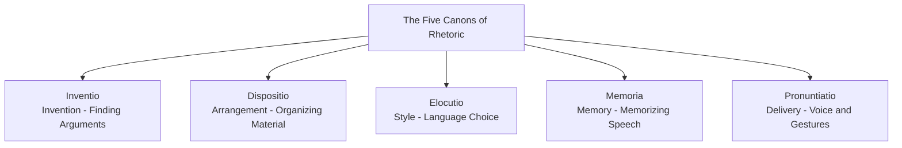

# Famous Roman Orators and Speeches

**Author:** Documentation Team  
**Version:** 1.0.0  
**Date:** April 14, 2025

> *"Non enim tam praeclarum est scire Latine quam turpe nescire"*  
> "It is not so impressive to know Latin as it is shameful not to know it" - Cicero

## Table of Contents
- [Introduction](#introduction)
- [Elements of Roman Oratory](#elements-of-roman-oratory)
- [Greatest Roman Orators](#greatest-roman-orators)
  - [Cicero](#cicero)
  - [Cato the Elder](#cato-the-elder)
  - [Gaius Gracchus](#gaius-gracchus)
  - [Hortensius](#hortensius)
  - [Julius Caesar](#julius-caesar)
  - [Mark Antony](#mark-antony)
  - [Cato the Younger](#cato-the-younger)
- [Landmark Speeches](#landmark-speeches)
- [Rhetorical Education](#rhetorical-education)
- [Delivery and Performance](#delivery-and-performance)
- [Adapting Roman Rhetoric in the Game](#adapting-roman-rhetoric-in-the-game)

## Introduction

Oratory was the supreme political art in ancient Rome. Success in politics depended on a senator's ability to persuade his peers through eloquent, authoritative speech. The Roman Senate was a theater for some of history's most influential orations – speeches that changed the course of the Republic, destroyed political careers, started or ended wars, and transformed Roman society.

This document explores the most renowned Roman orators and their speaking styles, offering historical context for the speech generation system in the Roman Senate Game. By understanding how Roman senators actually spoke, players can better appreciate the authentic rhetorical techniques employed by the game's AI senators.

## Elements of Roman Oratory

Roman oratory followed specific stylistic principles that distinguished great speakers:

### The Five Canons of Rhetoric



1. **Inventio** (Invention): Finding arguments and evidence
2. **Dispositio** (Arrangement): Organizing the material effectively
3. **Elocutio** (Style): Selecting appropriate language and figures of speech
4. **Memoria** (Memory): Memorizing the speech
5. **Pronuntiatio** (Delivery): Vocal inflection and physical gestures

### Three Styles of Oratory

Roman orators recognized three distinct stylistic modes:

| Style | Purpose | Characteristics | Typical Use |
|-------|---------|-----------------|-------------|
| **Attic** | To instruct | Plain, precise, logical | Legal arguments, factual presentations |
| **Rhodian** | To please | Elegant, balanced, moderate | Ceremonial speeches, introductions |
| **Asiatic** | To move | Emotional, ornate, passionate | Calls to action, accusations |

> **Historical Note:** Most accomplished orators could shift between these styles within a single speech, starting with Rhodian elegance to establish goodwill, moving to Attic precision for arguments, and concluding with Asiatic passion to stir emotions.

## Greatest Roman Orators

### Cicero

**Marcus Tullius Cicero (106-43 BCE)** - Considered Rome's greatest orator and the standard by which all Latin rhetoric is judged:

- **Background**: "New man" (first in family to enter Senate) from Arpinum
- **Style**: Mastered all three oratorical styles, known for perfect periodic sentences
- **Famous For**: 
  - The Catilinarian Orations (exposing a conspiracy)
  - The Philippics (fourteen speeches denouncing Mark Antony)
  - Pro Archia (defense of poetry and literature)
- **Signature Technique**: Building waves of balanced clauses to overwhelming climaxes
- **Legacy**: Over 50 speeches survive; his works became the foundation of rhetorical education

> **Famous Quote**: "*O tempora, o mores!*" ("Oh the times! Oh the customs!") - from his first speech against Catiline, lamenting Rome's moral decline.

### Cato the Elder

**Marcus Porcius Cato (234-149 BCE)** - Embodied traditional Roman values:

- **Background**: Rose from humble origins in Tusculum
- **Style**: Intentionally archaic, blunt, and morally severe
- **Famous For**: 
  - Always ending speeches with "*Carthago delenda est*" ("Carthage must be destroyed")
  - Opposition to Greek influences on Roman culture
- **Signature Technique**: Rapid-fire, short statements and maxims
- **Legacy**: Only fragments survive, but his plain style influenced later "Atticist" speakers

> **Historical Insight:** Cato would often speak until nightfall to prevent votes on legislation he opposed, effectively filibustering centuries before the term existed.

### Gaius Gracchus

**Gaius Sempronius Gracchus (154-121 BCE)** - Populist reformer known for emotional power:

- **Background**: Aristocrat who championed plebeian causes
- **Style**: Passionate, dramatic, physically expressive
- **Famous For**: 
  - Land reform speeches that nearly revolutionized the Republic
  - First to pace while speaking instead of remaining stationary
- **Signature Technique**: Emotional appeals with personal anecdotes
- **Legacy**: Pioneered populist political rhetoric in Rome

> **Innovation:** Gracchus stationed a musician behind him with a pitch pipe to help modulate his voice when he became too emotional - the first known "coach" for public speaking.

### Hortensius

**Quintus Hortensius Hortalus (114-50 BCE)** - Cicero's greatest rival:

- **Background**: Aristocrat and optimate (conservative) leader
- **Style**: Elaborate, ornate, and technical - exemplified the Asiatic style
- **Famous For**: 
  - Photographic memory that allowed perfect recall of speeches
  - Elegant hand gestures (called "Hortensian movements")
- **Signature Technique**: Division of arguments into precise categories
- **Legacy**: Dominated courts until eclipsed by Cicero; no speeches survive

> **Unusual Fact:** Hortensius was known for his extravagant lifestyle - he reportedly watered his garden plants with wine and was the first Roman to serve peacock at a banquet.

### Julius Caesar

**Gaius Julius Caesar (100-44 BCE)** - Military leader and dictator:

- **Background**: Patrician from ancient but impoverished family
- **Style**: Clear, concise, and elegant - purest example of the Attic style
- **Famous For**: 
  - Funeral oration for his aunt Julia
  - Speech pardoning his enemies after the Civil War
- **Signature Technique**: Simple language delivering profound ideas
- **Legacy**: His commentaries on the Gallic Wars exemplify his lucid style

> **Caesar's Rule:** "Avoid an unusual word as you would avoid a reef." Caesar believed in using common language clearly rather than obscure vocabulary.

### Mark Antony

**Marcus Antonius (83-30 BCE)** - Caesar's right-hand man:

- **Background**: From a prominent plebeian family
- **Style**: Emotional, unpredictable, sometimes unpolished but effective
- **Famous For**: 
  - Funeral oration for Caesar (dramatized by Shakespeare)
  - Speeches to troops that inspired remarkable loyalty
- **Signature Technique**: Appeals to emotion and shared experiences
- **Legacy**: Exemplified how charisma could sometimes overcome technical deficiencies

> **Shakespeare's Version:** While Shakespeare's "Friends, Romans, countrymen" speech is fictional, historical accounts confirm that Antony's actual funeral oration for Caesar was so effective it turned the crowd against the assassins and forced them to flee Rome.

### Cato the Younger

**Marcus Porcius Cato Uticensis (95-46 BCE)** - Stoic opponent of Caesar:

- **Background**: Great-grandson of Cato the Elder
- **Style**: Stern, uncompromising, focused on moral arguments
- **Famous For**: 
  - Opposition to the First Triumvirate
  - Speech against the Catilinarian conspirators (advocating execution)
- **Signature Technique**: Moral appeals based on ancestral tradition
- **Legacy**: Became a symbol of Republican liberty after his suicide

> **Filibuster Master:** Cato was known to speak until nightfall to prevent votes on bills he opposed. Once, when forcibly removed from the Senate for this tactic, he continued shouting his speech while being dragged out.

## Landmark Speeches

Some speeches changed the course of Roman history:

### 1. Cicero's First Catilinarian (63 BCE)

When exposing Catiline's conspiracy to overthrow the Republic, Cicero opened with the famous:

> "*Quo usque tandem abutere, Catilina, patientia nostra?*"  
> "How long, Catiline, will you abuse our patience?"

This speech exposed the conspiracy and forced Catiline to flee Rome. Its opening is one of the most famous in oratorical history.

### 2. Caesar's Clemency Speech (46 BCE)

After defeating Pompey's supporters, Caesar addressed the Senate:

> "*Nihil malo quam et eos salvos esse et me metuere desistere.*"  
> "I prefer nothing more than that they be safe and that I cease to be feared."

This unexpected clemency toward his enemies contrasted with Roman tradition and showcased Caesar's strategic magnanimity.

### 3. Cicero's Second Philippic Against Antony (44 BCE)

While never actually delivered (published as a written attack), this devastating criticism became Cicero's most famous work:

> "*Tu istis faucibus, istis lateribus, ista gladiatoria totius corporis firmitate.*"  
> "You, with that throat, those sides, that strength of body worthy of a gladiator."

This personal attack on Antony eventually cost Cicero his life when Antony gained power.

### 4. Tiberius Gracchus on Land Reform (133 BCE)

Advocating for redistribution of public lands to the poor:

> "*The wild beasts that roam over Italy have their dens, but the men who fight and die for Italy enjoy only the air and light; homeless and without a spot of ground to call their own, they wander with their wives and children.*"

This speech launched the revolutionary "Gracchi" period that challenged senatorial dominance.

## Rhetorical Education

### Training Process

Roman orators received extensive training:

```
┌─────────────────────────────────────────────────────────────┐
│                     RHETORICAL EDUCATION                     │
├─────────────┬─────────────┬────────────────┬───────────────┤
│ GRAMMATICUS │ PROGYMNASMATA │ DECLAMATIO    │ TIROCINIUM FORI │
│ (Age 9-12)  │ (Age 12-16)   │ (Age 16-18)   │ (Age 18+)      │
│ Basic       │ Preliminary   │ Practice      │ Forum          │
│ grammar and │ rhetorical    │ speeches on   │ apprenticeship │
│ literature  │ exercises     │ fictional cases│ with orator   │
└─────────────┴─────────────┴────────────────┴───────────────┘
```

1. **Grammaticus**: Basic literary education with emphasis on memorization
2. **Progymnasmata**: Progressive rhetorical exercises (narratives, comparisons, etc.)
3. **Declamatio**: Mock speeches on fictional or historical scenarios
4. **Tirocinium Fori**: Apprenticeship, observing great orators in the Forum

### Key Exercises

Roman rhetorical students mastered these techniques:

- **Suasoriae**: Persuasive speeches advising historical or mythological figures
- **Controversiae**: Legal speeches arguing both sides of fictional cases
- **Imitatio**: Careful study and imitation of great orators' techniques
- **Memorization**: Committing vast amounts of literature and exemplars to memory

> **Practice Makes Perfect:** Young Romans like Cicero would practice speeches at their country villas, often using a high vocal volume to strengthen their delivery. Some practiced speaking with pebbles in their mouths (like Demosthenes) to improve diction.

## Delivery and Performance

Roman oratory was highly performative:

### Physical Aspects

- **Toga Management**: Proper arrangement of the toga was essential - too formal if unmoved, too emotional if wildly flung
- **Hand Gestures**: Codified system of gestures (the Chironomia) with specific meanings
- **Movement**: Limited pacing in a defined area (unlike modern speakers who roam stages)
- **Vocal Projection**: Speaking without amplification to crowds of hundreds or thousands

### Common Physical Techniques

| Gesture/Action | Meaning | When Used |
|----------------|---------|-----------|
| Right arm extended | Emphatic statement | Key arguments |
| Slapping thigh | Indignation | Expressing outrage |
| Lowered head, hushed tone | Confidential mode | Implying secrets |
| Rising on toes | Building to climax | During key emotional appeals |
| Toga drawn over head | Religious solemnity | Invoking gods or tradition |

> **Cicero's Self-Description:** "When I begin to speak, I hardly move my hands; my voice is energetic, perhaps strained, but not heated or overfull. When the speech progresses... the gestures become more animated, the voice more varied and intense."

## Adapting Roman Rhetoric in the Game

The Roman Senate Game adapts historical oratory patterns through:

### Speech Structure

All AI-generated speeches in the game follow the classical arrangement:

1. **Exordium**: Introduction establishing speaker's credibility
2. **Narratio**: Background and context of the issue
3. **Partitio**: Division of arguments to be made
4. **Confirmatio**: Positive arguments for the position
5. **Refutatio**: Refutation of opposing positions
6. **Peroratio**: Emotional conclusion and call to action

### Character-Based Adaptation

Different senator archetypes in the game employ distinct rhetorical approaches:

| Archetype | Primary Style | Example Techniques |
|-----------|---------------|-------------------|
| Elder Statesman | Rhodian/Balanced | Historical precedents, appeals to tradition |
| Firebrand Reformer | Asiatic/Emotional | Vivid imagery, rhetorical questions |
| Military Leader | Attic/Plain | Direct language, concrete examples |
| Legal Expert | Attic/Technical | Precise definitions, detailed evidence |
| Political Operator | Mixed/Adaptable | Flattery, strategic concessions |

> **Game Insight:** When senators in the game quote historical figures or use Latin phrases, these are drawn from actual Roman sources whenever possible.

---

> *"Nihil est tam volucre quam maledictum, nihil facilius emittitur, nihil citius excipitur, nihil latius dissipatur."*  
> "Nothing flies more swiftly than slander, nothing is more easily uttered, nothing more readily received, nothing more widely spread." - Cicero

As you make your own speeches in the Roman Senate Game, remember that you're participating in a tradition that shaped Western rhetoric and politics for millennia. The techniques employed by these ancient orators remain effective today, demonstrating the timeless power of well-crafted persuasion.