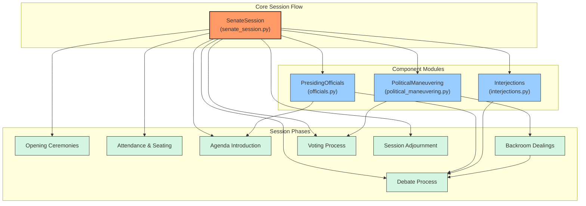

# Roman Senate Game Component Diagram

This diagram illustrates the relationships between the core SenateSession orchestrator and the specialized component modules, as well as how they interact with the various phases of a Roman Senate session.