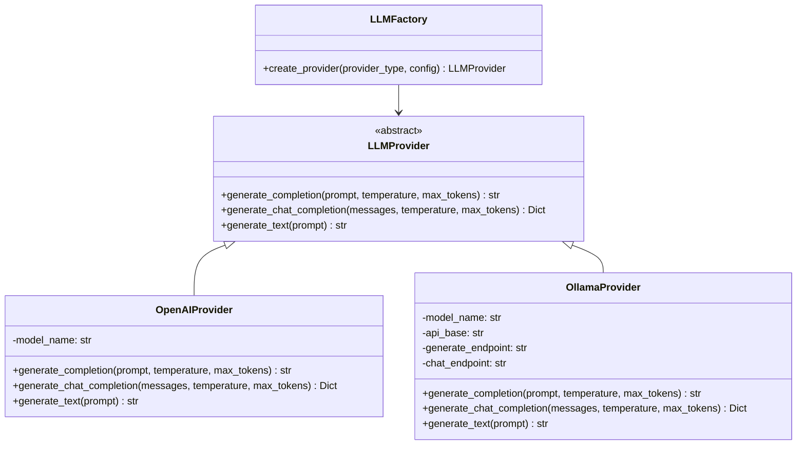

# LLM Provider Configuration Guide

**Author:** Documentation Team  
**Version:** 1.0.0  
**Date:** April 14, 2025

> *"Verba volant, scripta manent"* - "Spoken words fly away, written words remain"

## Table of Contents
- [Introduction](#introduction)
- [Provider Architecture](#provider-architecture)
- [OpenAI Configuration](#openai-configuration)
- [Ollama Configuration](#ollama-configuration)
- [Switching Providers](#switching-providers)
- [Advanced Configuration](#advanced-configuration)
- [Adding Custom Providers](#adding-custom-providers)
- [Troubleshooting](#troubleshooting)

## Introduction

The Roman Senate Game uses Large Language Models (LLMs) to generate sophisticated, historically authentic speeches and debates. The system supports multiple LLM providers through a flexible, pluggable architecture. This guide explains how to configure and use different LLM providers with the game.

## Provider Architecture

The game uses an abstraction layer to support different LLM providers, allowing you to choose between cloud-based services like OpenAI or local models via Ollama.



The provider system is located in `src/roman_senate/utils/llm/` and consists of:

- `base.py`: Abstract base class defining the provider interface
- `openai_provider.py`: Implementation for OpenAI API
- `ollama_provider.py`: Implementation for Ollama local models
- `factory.py`: Factory class for creating provider instances

## OpenAI Configuration

### Prerequisites

1. An OpenAI API key (get one at [platform.openai.com](https://platform.openai.com))
2. The `openai` Python package installed

### Setup

1. **Set your API key** using one of these methods:

   **Method 1:** Environment variable (recommended)
   ```bash
   export OPENAI_API_KEY=your_api_key_here
   ```

   **Method 2:** Configuration file
   Create a `.env` file in your project root:
   ```
   OPENAI_API_KEY=your_api_key_here
   ```

2. **Configure in code**

   The game automatically loads your API key from environment variables, but you can also specify it directly:

   ```python
   from roman_senate.utils.llm.factory import create_llm_provider
   
   provider = create_llm_provider(
       provider_type="openai",
       model_name="gpt-4",
       api_key="your_api_key_here"  # Optional if set via environment variable
   )
   ```

3. **Command-line configuration**

   ```bash
   python -m roman_senate.cli play --llm-provider openai --llm-model gpt-4
   ```

### Available Models

The OpenAI provider supports various models:

| Model | Description | Recommended Use |
|-------|-------------|-----------------|
| `gpt-4` | Most capable model, best reasoning | Default for highest quality speeches |
| `gpt-4-turbo` | Faster variant with slightly lower quality | Good balance of quality and speed |
| `gpt-3.5-turbo` | Fastest model, lower quality | Use for testing or when API costs are a concern |

> **Historical Wisdom:** Just as the Roman Senate had different ranks of speakers (consuls, praetors, aediles), our LLM models have different capabilities. Choose your model as carefully as Romans would choose who speaks first in debate!

## Ollama Configuration

[Ollama](https://ollama.ai/) enables running open-source LLMs locally on your computer, providing privacy and eliminating API costs.

### Prerequisites

1. Install Ollama from [ollama.ai](https://ollama.ai/)
2. Pull your preferred model:
   ```bash
   ollama pull mistral:7b-instruct-v0.2
   ```
3. The `requests` Python package installed

### Setup

1. **Start Ollama**
   
   Start the Ollama service in a terminal:
   ```bash
   ollama serve
   ```

2. **Configure in code**

   ```python
   from roman_senate.utils.llm.factory import create_llm_provider
   
   provider = create_llm_provider(
       provider_type="ollama",
       model_name="mistral:7b-instruct-v0.2",
       api_base="http://localhost:11434"  # Default Ollama endpoint
   )
   ```

3. **Command-line configuration**

   ```bash
   python -m roman_senate.cli play --llm-provider ollama --llm-model mistral:7b-instruct-v0.2
   ```

### Recommended Models

| Model | Description | Size |
|-------|-------------|------|
| `mistral:7b-instruct-v0.2` | Excellent balance of quality and performance | ~4GB |
| `llama2:7b-chat` | Good general-purpose model | ~4GB |
| `llama3:8b-instruct` | Newer model with better instruction following | ~5GB |
| `wizard-vicuna:7b` | Specialized for creative text generation | ~4GB |

> **Technical Note:** For the best experience with locally-run models, we recommend a computer with at least 16GB of RAM and a relatively modern CPU or GPU.

## Switching Providers

You can easily switch between providers using the command-line interface:

### OpenAI

```bash
python -m roman_senate.cli play --llm-provider openai --llm-model gpt-4
```

### Ollama

```bash
python -m roman_senate.cli play --llm-provider ollama --llm-model mistral:7b-instruct-v0.2
```

## Advanced Configuration

### Configuration File

For persistent configuration, create a `config.json` file in your user data directory:

```json
{
  "llm": {
    "provider": "openai",
    "model": "gpt-4",
    "temperature": 0.7,
    "max_tokens": 800
  }
}
```

### Environment Variables

You can set these environment variables to configure the LLM provider:

| Variable | Description | Default |
|----------|-------------|---------|
| `ROMAN_SENATE_LLM_PROVIDER` | Provider type (`openai` or `ollama`) | `openai` |
| `ROMAN_SENATE_LLM_MODEL` | Model name | Depends on provider |
| `OPENAI_API_KEY` | OpenAI API key | None |
| `OLLAMA_API_BASE` | Ollama API endpoint | `http://localhost:11434` |

### Generation Parameters

You can customize generation parameters for more varied speeches:

| Parameter | Description | Typical Values |
|-----------|-------------|----------------|
| `temperature` | Controls randomness (higher = more creative) | 0.0-1.0 (default: 0.7) |
| `max_tokens` | Maximum length of generated speech | 300-2000 (default: 800) |

```bash
python -m roman_senate.cli play --llm-temperature 0.9 --llm-max-tokens 1200
```

> **Speech Insight:** Just as Cicero would adjust his oratorical style based on his audience, you can adjust the temperature parameter to make speeches more conservative (lower values) or more creative and passionate (higher values).

## Adding Custom Providers

You can extend the system with your own LLM providers by:

1. Create a new provider class that inherits from `LLMProvider`
2. Implement the required methods
3. Register your provider in the factory

### Example Custom Provider

```python
from roman_senate.utils.llm.base import LLMProvider

class MyCustomProvider(LLMProvider):
    def __init__(self, **kwargs):
        # Initialize your provider
        pass
        
    def generate_completion(self, prompt, temperature=0.7, max_tokens=500, **kwargs):
        # Implement completion generation
        return "Generated text here"
        
    def generate_chat_completion(self, messages, temperature=0.7, max_tokens=500, **kwargs):
        # Implement chat completion
        return {"choices": [{"message": {"content": "Response here"}}]}
        
    async def generate_text(self, prompt, **kwargs):
        # Usually just calls generate_completion
        return self.generate_completion(prompt, **kwargs)
```

Then register your provider in `factory.py`:

```python
# In factory.py
def create_llm_provider(provider_type, **kwargs):
    if provider_type == "mycustom":
        return MyCustomProvider(**kwargs)
    # ... existing provider logic
```

## Troubleshooting

### OpenAI Issues

| Problem | Solution |
|---------|----------|
| API key errors | Verify your API key is correct and has sufficient credits |
| Rate limiting | Reduce request frequency or upgrade your API plan |
| Model not available | Check if you have access to the requested model |

### Ollama Issues

| Problem | Solution |
|---------|----------|
| Connection refused | Ensure Ollama service is running with `ollama serve` |
| Model not found | Pull the model with `ollama pull model_name` |
| Out of memory | Choose a smaller model or increase available RAM |
| Slow generation | Use a smaller model or enable GPU acceleration |

### Common Issues

- **Memory errors**: Speech generation requires significant memory. If you encounter out-of-memory errors, try:
  - Switching to a smaller model
  - Reducing the number of simulated senators
  - Lowering the max_tokens parameter

- **Long generation times**: If speech generation is taking too long:
  - Use a faster model (e.g., GPT-3.5-Turbo instead of GPT-4)
  - Run a local model via Ollama
  - Reduce the complexity of the debate topics

---

> "*Mutato nomine de te fabula narratur*"  
> "Change the name, and the story is told about you"  
> — Horace

Whether you're using cloud-based AI or running models on your own hardware, the Roman Senate Game adapts to provide an authentic Roman oratorical experience.