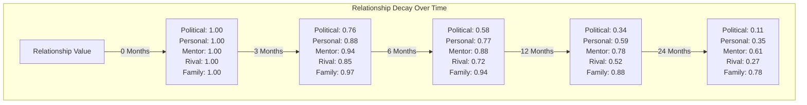

# Senator Relationship System

**Author:** Documentation Team  
**Version:** 2.0.0  
**Date:** April 19, 2025

## Table of Contents

- [Overview](#overview)
- [Key Features](#key-features)
- [Components](#components)
  - [RelationshipMemoryItem](#1-relationshipmemoryitem)
  - [RelationshipChangeEvent](#2-relationshipchangeevent)
  - [RelationshipManager](#3-relationshipmanager)
  - [RelationshipAwareSenatorAgent](#4-relationshipawaresenatoragent)
- [Relationship Types](#relationship-types)
- [Relationship Values](#relationship-values)
- [Event Integration](#event-integration)
  - [Speech Events](#speech-events)
  - [Reaction Events](#reaction-events)
  - [Interjection Events](#interjection-events)
  - [Vote Events](#vote-events)
- [Relationship Decay](#relationship-decay)
- [Usage Example](#usage-example)
- [Demo Scripts](#demo-scripts)
- [Testing](#testing)
- [Related Documentation](#related-documentation)

## Overview

The Senator Relationship System enhances the Roman Senate simulation by providing a more nuanced and dynamic representation of relationships between senators. This system leverages the existing memory persistence, event-driven architecture, and memory indexing capabilities to create a comprehensive relationship model that influences senator decision-making and evolves over time.

The system models the complex web of political and personal connections that existed in the Roman Senate, where alliances, rivalries, mentorships, and family ties all played crucial roles in political decision-making. These relationships change dynamically based on interactions and naturally decay over time when there are no interactions.

## Key Features

- **Multi-dimensional Relationships**: Senators maintain different types of relationships (political, personal, mentor/mentee, rivalry, family) with varying strengths and decay rates.
- **Persistent Storage**: Relationship data is stored in the memory system and persists between sessions.
- **Event-driven Updates**: Relationships change in response to events like speeches, votes, and interjections.
- **Relationship Decay**: Relationships naturally decay over time when there are no interactions.
- **Decision Influence**: Relationships influence senator decision-making, particularly stance decisions on debate topics.
- **Rich Context**: Each relationship change is stored with context explaining why it occurred.
- **Historical Tracking**: The system maintains a history of relationship changes for analysis and reference.

## Components

### 1. RelationshipMemoryItem

A specialized memory item that stores relationship data between two senators:

```python
rel_memory = RelationshipMemoryItem(
    senator_id="senator_cicero",
    target_senator_id="senator_caesar",
    relationship_type="political",
    relationship_value=0.5,
    context="Supported my proposal on military funding"
)
```

The `RelationshipMemoryItem` extends the base `MemoryBase` class, inheriting its persistence capabilities, importance scoring, and decay mechanisms. Each item represents a specific relationship at a point in time, with tags for efficient querying.

### 2. RelationshipChangeEvent

An event that is triggered when a relationship changes:

```python
event = RelationshipChangeEvent(
    senator_id="senator_cicero",
    target_senator_id="senator_caesar",
    relationship_type="political",
    old_value=0.3,
    new_value=0.5,
    change_value=0.2,
    reason="Supported my proposal",
    source_event_id="event_123"
)
```

This event allows other components to react to relationship changes and provides a record of why relationships changed. The `source_event_id` links back to the original event (like a speech or vote) that caused the relationship change.

### 3. RelationshipManager

The central component that manages relationships for a senator:

```python
relationship_manager = RelationshipManager(
    senator_id="senator_cicero",
    event_bus=event_bus,
    memory=memory
)

# Get a relationship value
political_rel = relationship_manager.get_relationship("senator_caesar", "political")

# Update a relationship
relationship_manager.update_relationship(
    "senator_caesar",
    "political",
    0.1,
    "Supported my proposal"
)

# Apply time decay
relationship_manager.apply_time_decay(days_elapsed=30)
```

The `RelationshipManager` handles:
- Storing and retrieving relationship data
- Updating relationships in response to events
- Applying time-based decay
- Calculating overall relationship scores
- Maintaining a relationship history

### 4. RelationshipAwareSenatorAgent

A senator agent that uses the relationship system to make decisions:

```python
senator = RelationshipAwareSenatorAgent(
    senator={"name": "Marcus Cicero", "faction": "Optimates"},
    llm_provider=llm_provider,
    event_bus=event_bus,
    memory_manager=memory_manager
)

# Decide stance with relationship influences
stance, reasoning = await senator.decide_stance("Land Reform", {})
```

The `RelationshipAwareSenatorAgent` extends the `EnhancedSenatorAgent` class, adding relationship-aware decision making. It considers relationships when:
- Deciding stances on topics
- Reacting to speeches
- Deciding whether to support or oppose other senators
- Interpreting events and actions

## Relationship Types

The system defines five relationship types, each with different characteristics:

1. **Political** (decay rate: 0.08/month)
   - Represents political alliances and oppositions
   - Changes rapidly based on political actions
   - Heavily influenced by stance alignment and voting patterns

2. **Personal** (decay rate: 0.04/month)
   - Represents personal friendship or animosity
   - Changes more slowly than political relationships
   - Influenced by personal interactions and support

3. **Mentor/Mentee** (decay rate: 0.02/month)
   - Represents teaching/learning relationships
   - Very stable, decays slowly
   - Typically forms between senior and junior senators

4. **Rival** (decay rate: 0.05/month)
   - Represents direct competition or rivalry
   - Moderately stable
   - Can exist alongside positive relationships in other dimensions

5. **Family** (decay rate: 0.01/month)
   - Represents family connections
   - Extremely stable, decays very slowly
   - Typically set at creation and rarely changes

## Relationship Values

Relationship values range from -1.0 (strongest negative) to 1.0 (strongest positive):

- **1.0 to 0.7**: Strong positive relationship (close ally, friend, family)
- **0.7 to 0.3**: Moderate positive relationship (ally, friendly)
- **0.3 to -0.3**: Neutral or weak relationship (acquaintance, colleague)
- **-0.3 to -0.7**: Moderate negative relationship (opponent, dislike)
- **-0.7 to -1.0**: Strong negative relationship (enemy, hatred)

## Event Integration

The relationship system integrates with the event system in several ways:

### Speech Events

When a senator delivers a speech:
- Senators with aligned stances may improve their political relationship
- Senators with opposed stances may worsen their political relationship
- The speaker's persuasiveness (based on rank and relationships) may influence stance changes

```python
# When a senator delivers a speech
speech_event = SpeechEvent(
    speaker={"id": "senator_cicero", "name": "Marcus Cicero", "faction": "Optimates"},
    content="I strongly oppose this land reform proposal...",
    stance="oppose",
    topic="Land Reform Act"
)

# The relationship manager processes this event through the _handle_speech_event method
```

### Reaction Events

When a senator reacts to a speech:
- Positive reactions (agreement, interest) improve personal relationships
- Negative reactions (disagreement, skepticism) worsen personal relationships

```python
# Reaction to a speech
reaction_event = ReactionEvent(
    reactor={"id": "senator_caesar", "name": "Julius Caesar"},
    target_event_id=speech_event.event_id,
    reaction_type="disagreement",
    content="Caesar disagrees with Cicero's position"
)
```

### Interjection Events

When a senator interjects during a speech:
- Support interjections improve both political and personal relationships
- Challenge interjections worsen political relationships
- Emotional interjections worsen personal relationships

```python
# Interjection during a speech
interjection_event = InterjectionEvent(
    interjector={"id": "senator_cato", "name": "Marcus Cato"},
    target_speaker={"id": "senator_caesar", "name": "Julius Caesar"},
    interjection_type=InterjectionType.CHALLENGE,
    content="That proposal would bankrupt the treasury!"
)
```

### Vote Events

When senators vote on proposals:
- Aligned votes strengthen political relationships
- Opposed votes weaken political relationships

```python
# Vote event
vote_event = VoteEvent(
    proposal="Land Reform Act",
    votes={
        "senator_cicero": "oppose",
        "senator_caesar": "support",
        "senator_cato": "oppose"
    }
)
```

## Relationship Decay

Relationships naturally decay over time when there are no interactions:

- Each relationship type has a different monthly decay rate
- Decay is applied daily based on the number of days elapsed
- Relationships decay toward neutral (0.0)
- Decay is proportional to the current relationship value (stronger relationships decay faster)

The following chart shows how different relationship types would decay over time starting from a value of 1.0:



## Usage Example

```python
# Create a relationship-aware senator
senator = RelationshipAwareSenatorAgent(
    senator={"name": "Marcus Cicero", "faction": "Optimates"},
    llm_provider=llm_provider,
    event_bus=event_bus,
    memory_manager=memory_manager
)

# Set up initial relationships
senator.relationship_manager.update_relationship(
    "senator_caesar", "political", -0.3, "Political rivalry"
)
senator.relationship_manager.update_relationship(
    "senator_caesar", "personal", 0.2, "Personal respect despite political differences"
)

# Decide stance on a topic (influenced by relationships)
stance, reasoning = await senator.decide_stance("Land Reform", {})

# Apply time decay (e.g., between senate sessions)
senator.apply_time_effects(days_elapsed=30)

# Get relationship history
history = senator.relationship_manager.get_relationship_history("senator_caesar", "political")
```

## Demo Scripts

Two demonstration scripts are provided:

1. **Basic Relationship Demo**: `src/roman_senate/examples/relationship_system_demo.py`
   - Shows basic relationship system functionality
   - Run with: `python -m src.roman_senate.examples.relationship_system_demo`

2. **Enhanced Relationship Demo**: `src/roman_senate/examples/enhanced_relationship_demo.py`
   - Demonstrates integration with event system, memory persistence, and enhanced senator agents
   - Shows relationship-influenced decision making
   - Illustrates relationship decay over time
   - Run with: `python -m src.roman_senate.examples.enhanced_relationship_demo`

The enhanced demo showcases:
1. Setting up a complete simulation environment with multiple senators
2. Creating initial relationships between senators with different dimensions
3. Simulating events that trigger relationship changes
4. Showing how senators' decisions change based on relationships
5. Demonstrating the persistence of relationships across simulated time periods
6. Illustrating relationship decay over time and how it affects decisions

## Testing

Unit tests for the relationship system are provided in `tests/agents/test_relationship_system.py`. These tests cover:

- Creating and updating relationships
- Relationship decay over time
- Relationship-influenced decision making
- Event handling and relationship changes
- Memory persistence of relationships

## Related Documentation

- [Senator Relationship System Design](senator_relationship_system_design.md) - Detailed design document
- [Event System Documentation](event_system/index.md) - Documentation for the event system
- [Memory System Documentation](memory_system.md) - Documentation for the memory system