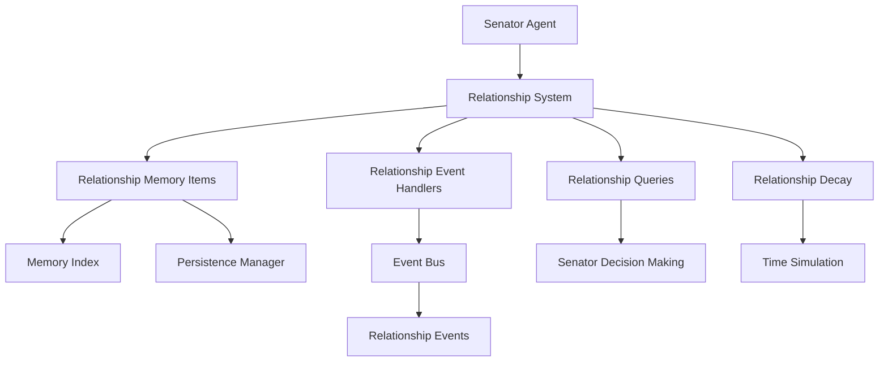

# Senator Relationship System: Developer Guide

**Author:** Documentation Team  
**Version:** 1.0.0  
**Date:** April 19, 2025

## Table of Contents

- [Introduction](#introduction)
- [System Architecture](#system-architecture)
- [Core Components](#core-components)
  - [RelationshipMemoryItem](#relationshipmemoryitem)
  - [RelationshipChangeEvent](#relationshipchangeevent)
  - [RelationshipManager](#relationshipmanager)
  - [RelationshipAwareSenatorAgent](#relationshipawaresenatoragent)
- [Extending the System](#extending-the-system)
  - [Adding New Relationship Types](#adding-new-relationship-types)
  - [Creating Custom Event Handlers](#creating-custom-event-handlers)
  - [Customizing Relationship Decay](#customizing-relationship-decay)
  - [Enhancing Decision Influence](#enhancing-decision-influence)
- [Working with Relationship Data](#working-with-relationship-data)
  - [Querying Relationships](#querying-relationships)
  - [Analyzing Relationship History](#analyzing-relationship-history)
  - [Visualizing Relationships](#visualizing-relationships)
- [Testing Relationship Components](#testing-relationship-components)
  - [Unit Testing](#unit-testing)
  - [Integration Testing](#integration-testing)
  - [Simulation Testing](#simulation-testing)
- [Best Practices](#best-practices)
- [Common Pitfalls](#common-pitfalls)
- [API Reference](#api-reference)
- [Related Documentation](#related-documentation)

## Introduction

This guide is intended for developers who want to extend, customize, or integrate with the Senator Relationship System. The relationship system provides a framework for modeling complex relationships between senators, influencing their decision-making, and evolving these relationships over time.

The system is designed to be extensible, allowing you to add new relationship types, customize how relationships influence decisions, and integrate with other components of the simulation.

## System Architecture

The relationship system is built on top of the event system and memory persistence framework:



Key architectural features:
- **Event-Driven**: Relationships change in response to events
- **Memory-Based**: Relationship data is stored in the memory system
- **Decoupled Components**: Clean separation between storage, events, and decision-making
- **Extensible Design**: Easy to add new relationship types and behaviors

## Core Components

### RelationshipMemoryItem

The `RelationshipMemoryItem` class extends `MemoryBase` to store relationship data:

```python
from ..agents.memory_base import MemoryBase
from typing import Dict, Any, List, Optional
import datetime

class RelationshipMemoryItem(MemoryBase):
    """Records a relationship between two senators of a specific type."""
    
    def __init__(
        self,
        senator_id: str,
        target_senator_id: str,
        relationship_type: str,  # "political", "personal", "mentor", "rival", "family"
        relationship_value: float,
        timestamp: Optional[datetime.datetime] = None,
        importance: float = 0.6,
        decay_rate: float = 0.05,
        tags: Optional[List[str]] = None,
        emotional_impact: float = 0.0,
        context: str = ""
    ):
        # Add relationship to tags
        tags = tags or []
        if "relationship" not in tags:
            tags.append("relationship")
        if relationship_type not in tags:
            tags.append(relationship_type)
        if target_senator_id not in tags:
            tags.append(target_senator_id)
            
        super().__init__(timestamp, importance, decay_rate, tags, emotional_impact)
        self.senator_id = senator_id
        self.target_senator_id = target_senator_id
        self.relationship_type = relationship_type
        self.relationship_value = relationship_value
        self.context = context
```

Key methods:
- `to_dict()`: Converts the memory item to a dictionary for serialization
- `from_dict()`: Creates a memory item from a dictionary (deserialization)

### RelationshipChangeEvent

The `RelationshipChangeEvent` class extends `Event` to notify the system of relationship changes:

```python
from ..core.events.base import Event
from typing import Optional, Dict, Any

class RelationshipChangeEvent(Event):
    """Event triggered when a relationship changes."""
    
    TYPE = "relationship_change"
    
    def __init__(
        self,
        senator_id: str,
        target_senator_id: str,
        relationship_type: str,
        old_value: float,
        new_value: float,
        change_value: float,
        reason: str,
        source_event_id: Optional[str] = None
    ):
        super().__init__()
        self.senator_id = senator_id
        self.target_senator_id = target_senator_id
        self.relationship_type = relationship_type
        self.old_value = old_value
        self.new_value = new_value
        self.change_value = change_value
        self.reason = reason
        self.source_event_id = source_event_id
        self.metadata = {
            "senator_id": senator_id,
            "target_senator_id": target_senator_id,
            "relationship_type": relationship_type,
            "old_value": old_value,
            "new_value": new_value,
            "change_value": change_value,
            "reason": reason,
            "source_event_id": source_event_id
        }
```

### RelationshipManager

The `RelationshipManager` class is the central component that manages relationships for a senator:

```python
from ..core.events import EventBus, SpeechEvent, VoteEvent, ReactionEvent, InterjectionEvent
from ..agents.enhanced_event_memory import EnhancedEventMemory
from typing import Dict, List, Any, Optional, Union, Tuple
import datetime

class RelationshipManager:
    """
    Central system for managing senator relationships.
    
    Handles:
    1. Storing/retrieving relationship data via memory system
    2. Registering/handling relationship events
    3. Applying relationship decay over time
    4. Providing relationship query capabilities
    """
    
    # Define relationship types
    RELATIONSHIP_TYPES = [
        "political",  # Political alliance/opposition
        "personal",   # Personal friendship/animosity
        "mentor",     # Mentor/mentee relationship
        "rival",      # Direct rivalry/competition
        "family"      # Family connection
    ]
    
    # Default decay rates per relationship type (monthly)
    DECAY_RATES = {
        "political": 0.08,  # Political relationships change moderately fast
        "personal": 0.04,   # Personal relationships change slowly
        "mentor": 0.02,     # Mentor relationships very stable
        "rival": 0.05,      # Rival relationships moderately stable
        "family": 0.01      # Family connections extremely stable
    }
```

Key methods:
- `get_relationship()`: Gets relationship value(s) with another senator
- `update_relationship()`: Updates a relationship and publishes an event
- `apply_time_decay()`: Applies time-based decay to relationships
- `get_relationship_history()`: Gets history of relationship changes
- `get_overall_relationship()`: Calculates an overall relationship score
- Event handlers for different event types

### RelationshipAwareSenatorAgent

The `RelationshipAwareSenatorAgent` class extends `EnhancedSenatorAgent` to use relationships in decision-making:

```python
from ..agents.enhanced_senator_agent import EnhancedSenatorAgent
from ..agents.relationship_manager import RelationshipManager
from typing import Dict, List, Any, Tuple
import logging

class RelationshipAwareSenatorAgent(EnhancedSenatorAgent):
    """Senator agent with enhanced relationship capabilities."""
    
    def __init__(self, *args, **kwargs):
        super().__init__(*args, **kwargs)
        
        # Initialize relationship manager
        self.relationship_manager = RelationshipManager(
            senator_id=self.senator["id"],
            event_bus=self.event_bus,
            memory=self.memory
        )
```

Key methods:
- `decide_stance()`: Enhanced stance decision considering relationships
- `apply_time_effects()`: Applies time-based effects including relationship decay
- `_find_key_senators_for_topic()`: Finds key senators with opinions on a topic

## Extending the System

### Adding New Relationship Types

To add a new relationship type:

1. Update the `RELATIONSHIP_TYPES` list in `RelationshipManager`:

```python
# Define relationship types
RELATIONSHIP_TYPES = [
    "political",
    "personal",
    "mentor",
    "rival",
    "family",
    "economic"  # New relationship type
]
```

2. Add a decay rate for the new type:

```python
# Default decay rates per relationship type (monthly)
DECAY_RATES = {
    "political": 0.08,
    "personal": 0.04,
    "mentor": 0.02,
    "rival": 0.05,
    "family": 0.01,
    "economic": 0.06  # Decay rate for new type
}
```

3. Update the overall relationship calculation to include the new type:

```python
def get_overall_relationship(self, target_senator_id: str) -> float:
    """Calculate an overall relationship score across all types."""
    scores = self.get_relationship(target_senator_id)
    
    # Weighted average based on importance of each type
    weights = {
        "political": 0.3,
        "personal": 0.3,
        "mentor": 0.15,
        "rival": 0.2,
        "family": 0.05,
        "economic": 0.2  # Weight for new type
    }
    
    weighted_sum = sum(scores[t] * weights[t] for t in self.RELATIONSHIP_TYPES)
    return weighted_sum
```

4. Create event handlers for events that affect the new relationship type:

```python
def _handle_economic_event(self, event: EconomicEvent):
    """Process economic events for relationship impacts."""
    # Implementation details
```

### Creating Custom Event Handlers

To create a custom event handler for a new event type:

1. Define the event handler method in `RelationshipManager`:

```python
def _handle_custom_event(self, event: CustomEvent):
    """Process custom events for relationship impacts."""
    # Extract relevant data from the event
    actor_id = event.actor.get("id")
    
    # Skip own events
    if actor_id == self.senator_id:
        return
        
    # Update relationships based on event data
    self.update_relationship(
        actor_id,
        "political",
        0.05,
        f"Custom reason based on {event.action}",
        event.event_id
    )
```

2. Register the handler in the `_register_event_handlers` method:

```python
def _register_event_handlers(self):
    """Register handlers for events that affect relationships."""
    self.event_bus.subscribe(SpeechEvent.TYPE, self._handle_speech_event)
    self.event_bus.subscribe(VoteEvent.TYPE, self._handle_vote_event)
    self.event_bus.subscribe(ReactionEvent.TYPE, self._handle_reaction_event)
    self.event_bus.subscribe(InterjectionEvent.TYPE, self._handle_interjection_event)
    self.event_bus.subscribe(CustomEvent.TYPE, self._handle_custom_event)  # New handler
```

### Customizing Relationship Decay

To customize how relationships decay over time:

1. Modify the decay rates in `RelationshipManager`:

```python
# Custom decay rates per relationship type (monthly)
DECAY_RATES = {
    "political": 0.10,  # Faster decay for political relationships
    "personal": 0.03,   # Slower decay for personal relationships
    # Other types...
}
```

2. Customize the decay calculation in `apply_time_decay`:

```python
def apply_time_decay(self, days_elapsed: int):
    """Apply time-based decay to relationships with custom logic."""
    # For each relationship type and target
    for rel_type in self.RELATIONSHIP_TYPES:
        decay_rate = self.DECAY_RATES[rel_type]
        
        for target_id, value in self.relationship_cache[rel_type].items():
            if abs(value) < 0.01:
                continue  # Skip near-zero relationships
                
            # Custom decay logic
            daily_decay = decay_rate / 30  # Monthly rate to daily
            
            # Example: Make decay proportional to the square of the value
            # This makes stronger relationships decay faster
            decay_amount = daily_decay * days_elapsed * (value ** 2) * 0.5
            
            # Calculate decay direction (relationships trend toward neutral)
            decay_direction = 1.0 if value > 0 else -1.0
            decay_amount = decay_amount * decay_direction
            
            # Calculate new value
            new_value = value - decay_amount
            
            # Rest of the method...
```

### Enhancing Decision Influence

To enhance how relationships influence senator decisions:

1. Modify the `decide_stance` method in `RelationshipAwareSenatorAgent`:

```python
async def decide_stance(self, topic: str, context: Dict) -> Tuple[str, str]:
    """Enhanced stance decision with custom relationship influence."""
    # Get base stance from principle alignment
    base_stance, base_reasoning = await super().decide_stance(topic, context)
    
    # Find key senators with opinions on this topic
    key_senators = self._find_key_senators_for_topic(topic)
    
    # Calculate relationship influence with custom logic
    relationship_influence = 0.0
    relationship_factors = []
    
    # Custom influence calculation
    for senator_id, stance in key_senators.items():
        # Get relationships by type
        political_rel = self.relationship_manager.get_relationship(senator_id, "political")
        personal_rel = self.relationship_manager.get_relationship(senator_id, "personal")
        
        # Custom weighting based on topic
        if "military" in topic.lower():
            # Military topics weight political relationships more
            rel_score = political_rel * 0.8 + personal_rel * 0.2
        elif "religious" in topic.lower():
            # Religious topics weight personal relationships more
            rel_score = political_rel * 0.3 + personal_rel * 0.7
        else:
            # Default weighting
            rel_score = political_rel * 0.5 + personal_rel * 0.5
        
        # Only strong relationships influence decisions
        if abs(rel_score) > 0.3:
            # Rest of the method...
```

2. Add new decision points influenced by relationships:

```python
def should_interrupt(self, speaker_id: str, topic: str) -> bool:
    """Decide whether to interrupt a speaker based on relationships."""
    # Get relationship with speaker
    political_rel = self.relationship_manager.get_relationship(speaker_id, "political")
    personal_rel = self.relationship_manager.get_relationship(speaker_id, "personal")
    
    # Calculate interruption probability
    if political_rel < -0.5:
        # High chance to interrupt political opponents
        return random.random() < 0.7
    elif personal_rel < -0.7:
        # Very high chance to interrupt personal enemies
        return random.random() < 0.9
    elif political_rel > 0.5 and personal_rel > 0.3:
        # Low chance to interrupt allies
        return random.random() < 0.1
    else:
        # Moderate chance for others
        return random.random() < 0.3
```

## Working with Relationship Data

### Querying Relationships

To query relationship data:

1. **Get a specific relationship**:

```python
# Get political relationship with Caesar
political_rel = senator.relationship_manager.get_relationship("senator_caesar", "political")
```

2. **Get all relationship types with a senator**:

```python
# Get all relationships with Caesar
all_rels = senator.relationship_manager.get_relationship("senator_caesar")
# Returns: {"political": -0.4, "personal": 0.2, "mentor": 0.0, ...}
```

3. **Get overall relationship**:

```python
# Get weighted average relationship with Caesar
overall_rel = senator.relationship_manager.get_overall_relationship("senator_caesar")
```

4. **Find senators with specific relationship values**:

```python
# Find all political allies (relationship > 0.5)
allies = []
for senator_id in all_senator_ids:
    if senator.relationship_manager.get_relationship(senator_id, "political") > 0.5:
        allies.append(senator_id)
```

### Analyzing Relationship History

To analyze relationship history:

1. **Get history of a specific relationship**:

```python
# Get history of political relationship with Caesar
history = senator.relationship_manager.get_relationship_history(
    "senator_caesar", "political", limit=10
)

# Print history
for item in history:
    print(f"{item.timestamp}: {item.relationship_value} ({item.context})")
```

2. **Track relationship changes over time**:

```python
# Get all relationship changes with Caesar
all_history = senator.relationship_manager.get_relationship_history("senator_caesar")

# Group by type
history_by_type = {}
for item in all_history:
    if item.relationship_type not in history_by_type:
        history_by_type[item.relationship_type] = []
    history_by_type[item.relationship_type].append(item)

# Analyze changes
for rel_type, items in history_by_type.items():
    if len(items) > 1:
        first = items[-1]  # Oldest first
        last = items[0]    # Newest first
        change = last.relationship_value - first.relationship_value
        print(f"{rel_type}: Changed by {change:.2f} over {(last.timestamp - first.timestamp).days} days")
```

### Visualizing Relationships

To visualize relationships:

1. **Create a network graph**:

```python
import networkx as nx
import matplotlib.pyplot as plt

def visualize_relationship_network(senators, relationship_type="political"):
    """Create a network graph of relationships."""
    G = nx.DiGraph()
    
    # Add nodes
    for senator in senators:
        G.add_node(senator.name)
    
    # Add edges
    for senator in senators:
        for other in senators:
            if senator.senator["id"] == other.senator["id"]:
                continue
            
            rel_value = senator.relationship_manager.get_relationship(
                other.senator["id"], relationship_type
            )
            
            if abs(rel_value) > 0.1:  # Only show non-trivial relationships
                G.add_edge(
                    senator.name, 
                    other.name, 
                    weight=abs(rel_value), 
                    color='green' if rel_value > 0 else 'red'
                )
    
    # Draw the graph
    pos = nx.spring_layout(G)
    edges = G.edges(data=True)
    
    edge_colors = [e[2]['color'] for e in edges]
    edge_widths = [e[2]['weight'] * 2 for e in edges]
    
    nx.draw(
        G, pos, with_labels=True, 
        node_color='skyblue', 
        edge_color=edge_colors, 
        width=edge_widths,
        font_size=10
    )
    
    plt.title(f"{relationship_type.title()} Relationships")
    plt.savefig(f"{relationship_type}_network.png")
    plt.close()
```

2. **Create a heatmap**:

```python
import numpy as np
import seaborn as sns

def visualize_relationship_heatmap(senators, relationship_type="political"):
    """Create a heatmap of relationships."""
    n = len(senators)
    matrix = np.zeros((n, n))
    names = [s.name for s in senators]
    
    # Fill the matrix
    for i, senator in enumerate(senators):
        for j, other in enumerate(senators):
            if i != j:
                rel_value = senator.relationship_manager.get_relationship(
                    other.senator["id"], relationship_type
                )
                matrix[i, j] = rel_value
    
    # Create heatmap
    plt.figure(figsize=(10, 8))
    sns.heatmap(
        matrix, 
        annot=True, 
        fmt=".2f", 
        cmap="RdBu_r",
        xticklabels=names,
        yticklabels=names,
        vmin=-1.0,
        vmax=1.0
    )
    
    plt.title(f"{relationship_type.title()} Relationships")
    plt.tight_layout()
    plt.savefig(f"{relationship_type}_heatmap.png")
    plt.close()
```

## Testing Relationship Components

### Unit Testing

Example unit tests for relationship components:

```python
import unittest
from unittest.mock import MagicMock, patch
import datetime

class TestRelationshipManager(unittest.TestCase):
    def setUp(self):
        self.event_bus = MagicMock()
        self.memory = MagicMock()
        self.manager = RelationshipManager(
            senator_id="senator_test",
            event_bus=self.event_bus,
            memory=self.memory
        )
    
    def test_update_relationship(self):
        """Test updating a relationship."""
        # Setup memory mock
        self.memory.memory_index = MagicMock()
        
        # Update relationship
        new_value = self.manager.update_relationship(
            "senator_target",
            "political",
            0.5,
            "Test reason"
        )
        
        # Assertions
        self.assertEqual(new_value, 0.5)
        self.assertEqual(
            self.manager.relationship_cache["political"]["senator_target"],
            0.5
        )
        self.memory.memory_index.add_memory.assert_called_once()
        self.event_bus.publish.assert_called_once()
    
    def test_apply_time_decay(self):
        """Test relationship decay over time."""
        # Setup initial relationship
        self.manager.update_relationship(
            "senator_target",
            "political",
            0.8,
            "Initial value",
            publish_event=False
        )
        
        # Apply decay
        self.manager.apply_time_decay(30)  # 1 month
        
        # Get new value
        new_value = self.manager.get_relationship("senator_target", "political")
        
        # Assertions
        self.assertLess(new_value, 0.8)  # Value should decrease
        self.assertGreater(new_value, 0.7)  # But not by too much
```

### Integration Testing

Example integration tests:

```python
import unittest
import asyncio
from unittest.mock import MagicMock, patch

class TestRelationshipIntegration(unittest.TestCase):
    async def asyncSetUp(self):
        # Create event bus
        self.event_bus = EventBus()
        
        # Create memory manager
        self.memory_manager = MemoryPersistenceManager(base_path="test_memory")
        
        # Create mock LLM provider
        self.llm_provider = MagicMock()
        self.llm_provider.generate_text = MagicMock(return_value="neutral")
        
        # Create senators
        self.cicero = RelationshipAwareSenatorAgent(
            senator={"name": "Cicero", "id": "senator_cicero", "faction": "Optimates"},
            llm_provider=self.llm_provider,
            event_bus=self.event_bus,
            memory_manager=self.memory_manager
        )
        
        self.caesar = RelationshipAwareSenatorAgent(
            senator={"name": "Caesar", "id": "senator_caesar", "faction": "Populares"},
            llm_provider=self.llm_provider,
            event_bus=self.event_bus,
            memory_manager=self.memory_manager
        )
    
    async def test_speech_event_affects_relationship(self):
        """Test that speech events affect relationships."""
        # Set initial relationship
        self.cicero.relationship_manager.update_relationship(
            "senator_caesar", "political", 0.0, "Initial neutral"
        )
        
        # Create and publish speech event
        speech_event = SpeechEvent(
            speaker=self.caesar.senator,
            topic="Test Topic",
            stance="support",
            content="Test speech"
        )
        
        # Set cicero's stance to oppose
        self.cicero.current_stance = "oppose"
        
        # Publish event
        await self.event_bus.publish(speech_event)
        
        # Allow time for event processing
        await asyncio.sleep(0.1)
        
        # Get updated relationship
        new_rel = self.cicero.relationship_manager.get_relationship(
            "senator_caesar", "political"
        )
        
        # Relationship should decrease due to opposed stances
        self.assertLess(new_rel, 0.0)
```

### Simulation Testing

Example simulation test:

```python
import unittest
import asyncio

class TestRelationshipSimulation(unittest.TestCase):
    async def test_relationship_simulation(self):
        """Test relationship changes in a simulated debate."""
        # Create simulation environment
        senators = await create_senators()
        
        # Set initial relationships
        await setup_initial_relationships(senators)
        
        # Record initial relationships
        initial_rels = {}
        for senator in senators:
            initial_rels[senator.senator["id"]] = {}
            for other in senators:
                if senator.senator["id"] != other.senator["id"]:
                    initial_rels[senator.senator["id"]][other.senator["id"]] = {
                        "political": senator.relationship_manager.get_relationship(
                            other.senator["id"], "political"
                        ),
                        "personal": senator.relationship_manager.get_relationship(
                            other.senator["id"], "personal"
                        )
                    }
        
        # Run simulation
        await simulate_debate(senators, "Test Topic")
        
        # Check for relationship changes
        changes_detected = False
        for senator in senators:
            for other in senators:
                if senator.senator["id"] != other.senator["id"]:
                    old_pol = initial_rels[senator.senator["id"]][other.senator["id"]]["political"]
                    new_pol = senator.relationship_manager.get_relationship(
                        other.senator["id"], "political"
                    )
                    
                    if abs(new_pol - old_pol) > 0.01:
                        changes_detected = True
                        break
        
        self.assertTrue(changes_detected, "No relationship changes detected in simulation")
```

## Best Practices

1. **Relationship Updates**:
   - Always provide a meaningful context string when updating relationships
   - Use small incremental changes rather than large jumps
   - Consider the relationship type when determining change magnitude

2. **Event Handling**:
   - Keep event handlers focused on specific relationship impacts
   - Skip self-events to avoid circular updates
   - Use source_event_id to track the origin of relationship changes

3. **Relationship Decay**:
   - Test decay rates to ensure they match desired simulation behavior
   - Consider the historical period when setting decay rates
   - Only create memory items for significant decay changes

4. **Decision Influence**:
   - Balance relationship influence with other factors
   - Provide clear explanations for relationship-influenced decisions
   - Consider faction alignment alongside relationships

5. **Performance Optimization**:
   - Use the relationship cache for frequent queries
   - Only update memory for significant changes
   - Batch relationship updates when possible

## Common Pitfalls

1. **Circular Relationship Updates**:
   - Problem: Events trigger relationship changes that trigger more events
   - Solution: Skip self-events and use flags to prevent circular updates

2. **Relationship Oscillation**:
   - Problem: Relationships swing back and forth between positive and negative
   - Solution: Use smaller update values and prevent decay from crossing zero

3. **Memory Overload**:
   - Problem: Too many relationship memory items created
   - Solution: Only create items for significant changes and use importance scoring

4. **Unrealistic Influence**:
   - Problem: Relationships have too much or too little influence on decisions
   - Solution: Carefully balance relationship influence with other factors

5. **Missing Event Handlers**:
   - Problem: Some events don't affect relationships when they should
   - Solution: Ensure all relevant event types have handlers registered

## API Reference

### RelationshipManager

```python
# Key methods
def get_relationship(target_senator_id: str, relationship_type: Optional[str] = None) -> Union[float, Dict[str, float]]
def update_relationship(target_senator_id: str, relationship_type: str, change_value: float, reason: str, source_event_id: Optional[str] = None, publish_event: bool = True) -> float
def apply_time_decay(days_elapsed: int) -> None
def get_relationship_history(target_senator_id: str, relationship_type: Optional[str] = None, limit: int = 10) -> List[RelationshipMemoryItem]
def get_overall_relationship(target_senator_id: str) -> float
```

### RelationshipAwareSenatorAgent

```python
# Key methods
async def decide_stance(topic: str, context: Dict) -> Tuple[str, str]
def apply_time_effects(days_elapsed: int) -> None
def _find_key_senators_for_topic(topic: str) -> Dict[str, str]
```

## Related Documentation

- [Relationship System Overview](../relationship_system.md) - General overview of the relationship system
- [Relationship System Design](../senator_relationship_system_design.md) - Detailed design document
- [User Guide](user_guide.md) - Guide for users of the relationship system
- [Integration Guide](integration_guide.md) - Guide for integrating with the relationship system
- [Event System Documentation](../event_system/index.md) - Documentation for the event system
- [Memory System Documentation](../memory_system.md) - Documentation for the memory system