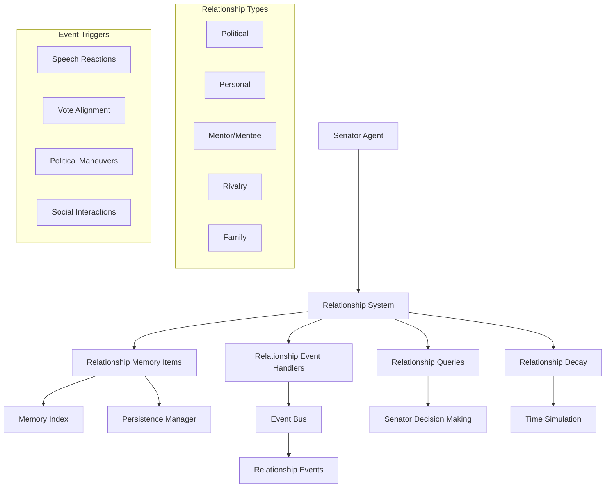

# Senator Relationship System Documentation

**Author:** Documentation Team  
**Version:** 2.0.0
**Date:** April 19, 2025

## Overview

The Senator Relationship System enhances the Roman Senate simulation by providing a more nuanced and dynamic representation of relationships between senators. This documentation package provides comprehensive information about the system's design, usage, and integration.

## Documentation Structure

| Document | Description |
|----------|-------------|
| [Relationship System Overview](../relationship_system.md) | General overview of the relationship system |
| [Relationship System Design](../senator_relationship_system_design.md) | Detailed design document |
| [User Guide](user_guide.md) | How to use the relationship system in simulations |
| [Developer Guide](developer_guide.md) | How to extend and customize the relationship system |
| [Integration Guide](integration_guide.md) | How to integrate with the relationship system |
| [Examples](examples.md) | Example usage scenarios and code samples |
| [Integration Fixes](integration_fixes.md) | Documentation of fixes for integration issues |

## Quick Links

### For Users

- [Understanding Relationships](user_guide.md#understanding-relationships)
- [Setting Initial Relationships](user_guide.md#setting-initial-relationships)
- [Observing Relationship Changes](user_guide.md#observing-relationship-changes)
- [Relationship-Influenced Decisions](user_guide.md#relationship-influenced-decisions)
- [Command Line Options](user_guide.md#command-line-options)
- [Visualizing Relationships](user_guide.md#visualizing-relationships)
- [Common Scenarios](user_guide.md#common-scenarios)
- [Troubleshooting](user_guide.md#troubleshooting)

### For Developers

- [Core Components](developer_guide.md#core-components)
- [Adding New Relationship Types](developer_guide.md#adding-new-relationship-types)
- [Creating Custom Event Handlers](developer_guide.md#creating-custom-event-handlers)
- [Customizing Relationship Decay](developer_guide.md#customizing-relationship-decay)
- [Enhancing Decision Influence](developer_guide.md#enhancing-decision-influence)
- [Working with Relationship Data](developer_guide.md#working-with-relationship-data)
- [Testing Relationship Components](developer_guide.md#testing-relationship-components)
- [Best Practices](developer_guide.md#best-practices)
- [API Reference](developer_guide.md#api-reference)

### For Integrators

- [Integration with Event System](integration_guide.md#integration-with-event-system)
- [Integration with Memory System](integration_guide.md#integration-with-memory-system)
- [Integration with Senator Agents](integration_guide.md#integration-with-senator-agents)
- [Integration with Simulation Components](integration_guide.md#integration-with-simulation-components)
- [Integration Examples](integration_guide.md#integration-examples)
- [Recent Integration Fixes](integration_guide.md#recent-integration-fixes)
- [Troubleshooting](integration_guide.md#troubleshooting)

## Key Features

The Senator Relationship System provides:

1. **Multi-dimensional Relationships**: Different types of relationships (political, personal, mentor/mentee, rivalry, family)
2. **Persistent Storage**: Relationship data stored in the memory system
3. **Event-driven Updates**: Relationships change in response to events
4. **Relationship Decay**: Natural erosion of relationships over time
5. **Decision Influence**: Relationships affect senator decision-making
6. **Rich Context**: Historical context for relationship values
7. **Visualization Tools**: Tools for visualizing relationship networks

## System Architecture

The relationship system is built around the `RelationshipManager` that connects all components:



## Getting Started

To quickly see the relationship system in action:

```bash
# Run the basic relationship system demo
python -m src.roman_senate.examples.relationship_system_demo

# Run the enhanced relationship demo
python -m src.roman_senate.examples.enhanced_relationship_demo

# Run a full simulation with relationship logging
python -m src.roman_senate.cli simulate --log-relationships
```

For a quick introduction to the system, see the [User Guide](user_guide.md).

For more detailed information on the design, see the [Relationship System Design](../senator_relationship_system_design.md).

## Frequently Asked Questions

### General Questions

**Q: What is the relationship system?**  
A: The relationship system is a framework for modeling complex relationships between senators, influencing their decision-making, and evolving these relationships over time.

**Q: How does the relationship system improve the simulation?**  
A: It creates a more realistic and immersive simulation by enabling dynamic interactions between senators, including relationship-influenced decisions, natural relationship decay, and persistent relationship data.

**Q: What are the main components of the relationship system?**  
A: The main components are the RelationshipMemoryItem, RelationshipChangeEvent, RelationshipManager, and RelationshipAwareSenatorAgent.

### Technical Questions

**Q: How do I add a new relationship type?**  
A: Extend the `RELATIONSHIP_TYPES` list in `RelationshipManager` and add a decay rate for the new type. See [Adding New Relationship Types](developer_guide.md#adding-new-relationship-types).

**Q: How do I customize how relationships influence decisions?**  
A: Override the `decide_stance` method in `RelationshipAwareSenatorAgent`. See [Enhancing Decision Influence](developer_guide.md#enhancing-decision-influence).

**Q: How do I integrate with the relationship system?**  
A: See the [Integration Guide](integration_guide.md) for strategies like using event handlers, memory queries, and relationship-aware components.

**Q: How do I visualize relationships?**  
A: Use the visualization tools provided in the relationship system, such as the network graph and relationship matrix. See [Visualizing Relationships](user_guide.md#visualizing-relationships).