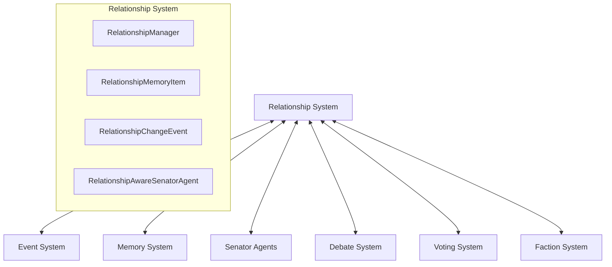
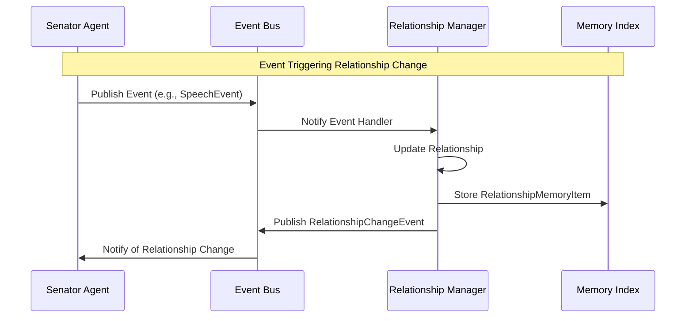

# Senator Relationship System: Integration Guide

**Author:** Documentation Team  
**Version:** 1.0.0  
**Date:** April 19, 2025

## Table of Contents

- [Introduction](#introduction)
- [System Overview](#system-overview)
- [Integration with Event System](#integration-with-event-system)
- [Integration with Memory System](#integration-with-memory-system)
- [Integration with Senator Agents](#integration-with-senator-agents)
- [Integration with Simulation Components](#integration-with-simulation-components)
- [Integration Examples](#integration-examples)
- [Troubleshooting](#troubleshooting)
- [Related Documentation](#related-documentation)

## Introduction

This guide explains how to integrate the Senator Relationship System with other components of the Roman Senate simulation. The relationship system is designed to work seamlessly with the event system, memory system, and senator agents, providing a comprehensive framework for modeling relationships between senators.

## System Overview

The Senator Relationship System consists of four main components:

1. **RelationshipMemoryItem**: Stores relationship data in the memory system
2. **RelationshipChangeEvent**: Notifies the system of relationship changes
3. **RelationshipManager**: Manages relationships for a senator
4. **RelationshipAwareSenatorAgent**: Uses relationships in decision-making

These components interact with other systems through well-defined interfaces:



## Integration with Event System

### Event Flow

The event flow for relationship changes follows this pattern:



### Event Handlers

To integrate a new event type with the relationship system:

1. Create a new event handler in `RelationshipManager`:

```python
def _handle_custom_event(self, event: CustomEvent):
    """Process custom events for relationship impacts."""
    # Extract relevant data from the event
    actor_id = event.actor.get("id")
    
    # Skip own events
    if actor_id == self.senator_id:
        return
        
    # Update relationships based on event data
    self.update_relationship(
        actor_id,
        "political",
        0.05,
        f"Custom reason based on {event.action}",
        event.event_id
    )
```

2. Register the handler in `_register_event_handlers`:

```python
def _register_event_handlers(self):
    # Existing handlers...
    self.event_bus.subscribe(CustomEvent.TYPE, self._handle_custom_event)
```

### Publishing Relationship Events

To listen for relationship changes in your component:

```python
def __init__(self, event_bus):
    self.event_bus = event_bus
    self.event_bus.subscribe(RelationshipChangeEvent.TYPE, self._handle_relationship_change)
    
def _handle_relationship_change(self, event: RelationshipChangeEvent):
    """Handle relationship change events."""
    # Process the relationship change
    senator_id = event.senator_id
    target_id = event.target_senator_id
    rel_type = event.relationship_type
    old_value = event.old_value
    new_value = event.new_value
    reason = event.reason
    
    # Take appropriate action
    self._update_visualization(senator_id, target_id, rel_type, new_value)
```

## Integration with Memory System

### Memory Storage

To integrate with the memory system in your component:

```python
def get_relationship_data(self, senator_id, target_id=None, rel_type=None):
    """Get relationship data from memory."""
    # Prepare query criteria
    criteria = {"tags": ["relationship"]}
    
    if target_id:
        criteria["tags"].append(target_id)
    
    if rel_type:
        criteria["tags"].append(rel_type)
    
    # Query memory index
    memories = self.memory_index.query(criteria)
    
    # Filter by senator_id
    memories = [m for m in memories if hasattr(m, "senator_id") and m.senator_id == senator_id]
    
    return memories
```

### Memory Persistence

To integrate with memory persistence:

```python
def save_simulation_state(self):
    """Save the simulation state including relationships."""
    # Save senator memories
    for senator in self.senators:
        self.memory_manager.save_memory(senator.senator["id"], senator.memory)
    
    # Log save operation
    logging.info(f"Saved simulation state with relationships for {len(self.senators)} senators")
    
def load_simulation_state(self):
    """Load the simulation state including relationships."""
    # Load senator memories
    for senator in self.senators:
        self.memory_manager.load_memory(senator.senator["id"], senator.memory)
        
        # Reload relationships from memory
        senator.relationship_manager._load_relationships_from_memory()
    
    # Log load operation
    logging.info(f"Loaded simulation state with relationships for {len(self.senators)} senators")
```

## Integration with Senator Agents

### Decision Making

To integrate with the relationship-based decision-making process:

```python
class CustomSenatorAgent(RelationshipAwareSenatorAgent):
    """Custom senator agent with enhanced decision making."""
    
    async def decide_stance(self, topic: str, context: Dict) -> Tuple[str, str]:
        """Enhanced stance decision with custom factors."""
        # Get relationship-influenced stance
        rel_stance, rel_reasoning = await super().decide_stance(topic, context)
        
        # Add custom factors
        if "emergency" in context and context["emergency"]:
            # In emergencies, faction loyalty increases
            faction_allies = self._get_faction_allies()
            faction_influence = self._calculate_faction_influence(faction_allies, topic)
            
            # Strong faction influence can override relationship influence
            if abs(faction_influence) > 0.4 and rel_stance != self._get_faction_stance(topic):
                final_stance = self._get_faction_stance(topic)
                final_reasoning = f"{rel_reasoning} However, in this emergency, I must stand with my faction."
                return final_stance, final_reasoning
        
        return rel_stance, rel_reasoning
```

### Time Effects

To integrate with time effects:

```python
def advance_simulation(self, days: int):
    """Advance the simulation by a number of days."""
    # Apply time effects to all senators
    for senator in self.senators:
        senator.apply_time_effects(days)
    
    # Log time advancement
    logging.info(f"Advanced simulation by {days} days, applied relationship decay")
    
    # Update simulation date
    self.current_date += datetime.timedelta(days=days)
```

## Integration with Simulation Components

### Debate System

To integrate the debate system with relationships:

```python
class EnhancedDebateManager:
    """Enhanced debate manager with relationship integration."""
    
    def __init__(self, event_bus):
        self.event_bus = event_bus
        self.event_bus.subscribe(RelationshipChangeEvent.TYPE, self._handle_relationship_change)
    
    async def manage_debate(self, topic, senators):
        """Manage a debate with relationship considerations."""
        # Start debate
        await self._start_debate(topic)
        
        # Determine speaking order based on relationships
        speaking_order = self._determine_speaking_order(senators, topic)
        
        # Conduct speeches
        for senator in speaking_order:
            await self._conduct_speech(senator, topic)
            
            # Allow for interjections based on relationships
            potential_interjectors = self._find_potential_interjectors(senator, senators)
            for interjector in potential_interjectors:
                await self._handle_interjection(interjector, senator, topic)
        
        # End debate
        await self._end_debate(topic)
```

### Voting System

To integrate the voting system with relationships:

```python
class RelationshipAwareVotingSystem:
    """Voting system that considers relationships."""
    
    async def conduct_vote(self, proposal, senators):
        """Conduct a vote with relationship influences."""
        votes = {}
        
        # Collect votes from each senator
        for senator in senators:
            # Get base stance
            base_stance, _ = await senator.get_base_stance(proposal, {})
            
            # Get relationship-influenced stance
            final_stance, reasoning = await senator.decide_stance(proposal, {})
            
            # Record vote
            votes[senator.senator["id"]] = final_stance
            
            # Log if relationship changed the vote
            if base_stance != final_stance:
                logging.info(f"{senator.name}'s vote changed from {base_stance} to {final_stance} due to relationships")
        
        # Create and publish vote event
        vote_event = VoteEvent(
            proposal=proposal,
            votes=votes,
            metadata={"proposal": proposal}
        )
        
        await self.event_bus.publish(vote_event)
        
        # Return results
        return self._tally_votes(votes)
```

## Integration Examples

### Basic Integration

Here's a basic example of integrating with the relationship system:

```python
import asyncio
from roman_senate.core.events import EventBus
from roman_senate.agents.relationship_aware_senator_agent import RelationshipAwareSenatorAgent
from roman_senate.agents.memory_persistence_manager import MemoryPersistenceManager

async def basic_integration_example():
    """Basic example of integrating with the relationship system."""
    # Create shared components
    event_bus = EventBus()
    memory_manager = MemoryPersistenceManager(base_path="saves/example")
    
    # Create senators
    cicero = RelationshipAwareSenatorAgent(
        senator={"name": "Cicero", "id": "senator_cicero", "faction": "Optimates"},
        llm_provider=llm_provider,
        event_bus=event_bus,
        memory_manager=memory_manager
    )
    
    caesar = RelationshipAwareSenatorAgent(
        senator={"name": "Caesar", "id": "senator_caesar", "faction": "Populares"},
        llm_provider=llm_provider,
        event_bus=event_bus,
        memory_manager=memory_manager
    )
    
    # Set up initial relationships
    cicero.relationship_manager.update_relationship(
        "senator_caesar", "political", -0.4, "Political rivalry"
    )
    
    # Get stances on a topic
    cicero_stance, cicero_reasoning = await cicero.decide_stance("Land Reform", {})
    
    print(f"Cicero's stance: {cicero_stance} - {cicero_reasoning}")
    
    # Apply time decay
    cicero.apply_time_effects(30)  # 30 days
    
    # Save state
    memory_manager.save_memory(cicero.senator["id"], cicero.memory)
```

## Troubleshooting

### Common Issues

1. **Relationships Not Changing**:
   - Check that the event system is properly configured
   - Ensure that senators are interacting (speeches, votes, etc.)
   - Verify that relationship event handlers are registered

2. **Unexpected Relationship Changes**:
   - Enable verbose logging to see all relationship changes
   - Check event handlers for the specific event types
   - Review the relationship update logic

3. **Relationships Not Persisting**:
   - Ensure the memory persistence system is properly configured
   - Check that relationship memory items are being saved
   - Verify that the memory is being loaded on restart

### Logging Relationships

To enable detailed relationship logging:

```bash
python -m src.roman_senate.cli simulate --log-level DEBUG --log-relationships
```

This will log all relationship changes to the console and log file.

## Related Documentation

- [Relationship System Overview](../relationship_system.md) - General overview of the relationship system
- [Relationship System Design](../senator_relationship_system_design.md) - Detailed design document
- [User Guide](user_guide.md) - Guide for users of the relationship system
- [Developer Guide](developer_guide.md) - Guide for developers extending the relationship system
- [Event System Documentation](../event_system/index.md) - Documentation for the event system
