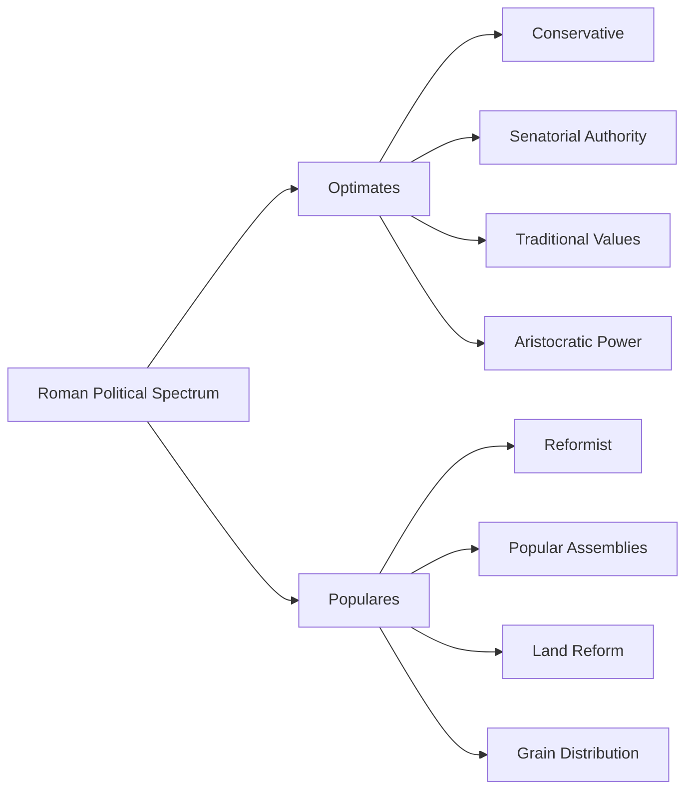

# Roman Political Factions

**Author:** Documentation Team  
**Version:** 1.0.0  
**Date:** April 14, 2025

> *"Senatus Populusque Romanus"* - "The Senate and People of Rome"

## Table of Contents
- [Introduction](#introduction)
- [Major Political Alignments](#major-political-alignments)
  - [Optimates vs. Populares](#optimates-vs-populares)
  - [Factional Organization](#factional-organization)
- [The Optimates](#the-optimates)
  - [Core Principles](#core-principles)
  - [Notable Optimates](#notable-optimates)
  - [Political Strategies](#political-strategies)
- [The Populares](#the-populares)
  - [Core Principles](#core-principles-1)
  - [Notable Populares](#notable-populares)
  - [Political Strategies](#political-strategies-1)
- [Clientela System](#clientela-system)
- [Famous Factional Conflicts](#famous-factional-conflicts)
- [Aristocratic Families](#aristocratic-families)
- [In-Game Faction Dynamics](#in-game-faction-dynamics)

## Introduction

The Roman Republic was never governed by formal political parties in the modern sense. Instead, Roman politics was shaped by fluid alliances, family connections, and ideological alignments that formed, dissolved, and reformed based on specific issues and personal ambitions. The most significant political division during the Late Republic (the setting of the Roman Senate Game) was between two broad philosophical approaches to governance: the *Optimates* and the *Populares*.

This document explores these political alignments, along with the patronage networks and factional dynamics that influenced senatorial debates, votes, and the ultimate fate of the Republic itself.

## Major Political Alignments

### Optimates vs. Populares



The terms *Optimates* and *Populares* represented **political strategies** rather than formal parties:

- **Optimates** (literally "the best men") sought to maintain the traditional power of the Senate and preserve aristocratic privileges, believing the "best men" should govern.

- **Populares** (literally "favoring the people") sought support directly from the people through popular assemblies, often bypassing senatorial authority to implement reforms.

> **Historical Insight:** A senator might generally align with Optimates on most issues but occasionally support Populares positions on specific matters. These were political approaches, not rigid party memberships.

### Factional Organization

Unlike modern political parties, Roman factions had:

- No formal membership lists
- No official platforms or manifestos
- No party headquarters or organizational structure
- Fluid boundaries with senators shifting positions
- Leadership based on personal influence rather than elections

## The Optimates

### Core Principles

The Optimates advocated for:

1. **Mos Maiorum** (ancestral custom) - Preserving traditional Roman practices and institutions
2. **Senatorial Supremacy** - Maintaining the Senate as the primary governing authority
3. **Limited Popular Power** - Restricting the influence of popular assemblies and tribunes
4. **Property Rights** - Protecting private land ownership and opposing agrarian reforms
5. **Aristocratic Privilege** - Defending the special status of patrician and wealthy families

### Notable Optimates

| Senator | Time Period | Notable Actions |
|---------|-------------|-----------------|
| **Marcus Porcius Cato** (the Younger) | 95-46 BCE | Staunch defender of traditional Republic; opposed both Caesar and Pompey |
| **Quintus Lutatius Catulus** | 120-61 BCE | Led opposition to Pompey's extraordinary commands |
| **Lucius Cornelius Sulla** | 138-78 BCE | Marched on Rome; established Optimate-friendly constitution |
| **Marcus Calpurnius Bibulus** | 102-48 BCE | Obstructed Caesar's consulship through religious objections |
| **Quintus Hortensius Hortalus** | 114-50 BCE | Leading orator who defended aristocratic interests in the courts |

> **Quote:** "*Novus homo, novae res*" ("New man, new things") - A derisive Optimate saying criticizing ambitious newcomers to politics who sought reform.

### Political Strategies

Optimates typically employed these tactics:

- Using **senatus consultum ultimum** ("final decree of the Senate") to suppress perceived threats
- Invoking religious objections (**obnuntiatio**) to block unfavorable legislation
- Mobilizing allied tribunes to **veto** proposals from Populares
- Emphasizing threats to **stability and tradition** in speeches
- Cultivating extensive **client networks** among Italian towns and provinces

## The Populares

### Core Principles

The Populares advocated for:

1. **Agrarian Reform** - Redistributing public land to landless citizens and veterans
2. **Grain Distribution** - Providing subsidized or free grain to Rome's urban poor
3. **Debt Relief** - Cancellation or reduction of debts for struggling citizens
4. **Popular Sovereignty** - Empowering the popular assemblies over the Senate
5. **Military Reforms** - Extending military service to landless citizens with state-provided equipment

### Notable Populares

| Senator | Time Period | Notable Actions |
|---------|-------------|-----------------|
| **Tiberius Gracchus** | 163-133 BCE | Pushed land reforms through Tribal Assembly; killed by senators |
| **Gaius Gracchus** | 154-121 BCE | Expanded brother's reforms; established grain subsidies |
| **Gaius Marius** | 157-86 BCE | Reformed army to include landless citizens; held consulship 7 times |
| **Publius Clodius Pulcher** | 93-52 BCE | Converted from patrician to plebeian to become tribune; established free grain |
| **Julius Caesar** | 100-44 BCE | Implemented debt relief and land distribution; reformed calendar |

> **Quote:** "*Rem publicam populo Romano restituta*" ("The republic restored to the Roman people") - A common Populares slogan emphasizing popular sovereignty.

### Political Strategies

Populares typically employed these tactics:

- Using the **tribunate** to propose legislation directly to popular assemblies
- Organizing **public demonstrations** to pressure the Senate
- Appealing to the interests of **equites** (business class) against senatorial privilege
- Emphasizing **economic grievances** in speeches to mobilize poor citizens
- Building personal loyalty among **military veterans** through promised land distributions

## Clientela System

Roman politics operated through an extensive system of patronage relationships:

```
┌────────────────────────────────────────┐
│              PATRONUS                  │
│       (Senator/Wealthy Patron)         │
└────────────────┬───────────────────────┘
                 │
        ┌────────┴───────┐
        ▼                ▼
┌───────────────┐  ┌─────────────┐
│ URBAN CLIENTS │  │RURAL CLIENTS│
│  (City poor)  │  │ (Farmers)   │
└───────────────┘  └─────────────┘
        │                │
        ▼                ▼
┌───────────────┐  ┌─────────────┐
│  POLITICAL    │  │  ECONOMIC   │
│   SUPPORT     │  │   SUPPORT   │
└───────────────┘  └─────────────┘
```

### Elements of the Client System:

- **Salutatio**: Morning greeting ritual where clients visited their patron
- **Deductio**: Clients escorting their patron to the Forum (show of support)
- **Suffragium**: Clients voting according to their patron's wishes
- **Testimonium**: Clients testifying in court cases involving their patron
- **Sportula**: Financial or food gifts from patron to clients

> **Everyday Reality:** Each morning, streets were filled with clients visiting their patrons' homes. The number and quality of a senator's morning visitors was a visible measure of his influence.

## Famous Factional Conflicts

### The Gracchi Crisis (133-121 BCE)

| Timeline | Events |
|----------|--------|
| 133 BCE | Tiberius Gracchus elected tribune; proposed land redistribution |
| 133 BCE | Senator Scipio Nasica led mob that killed Tiberius |
| 123 BCE | Gaius Gracchus (brother) elected tribune; expanded reforms |
| 121 BCE | Senate issued "final decree"; Gaius died in resulting violence |

This conflict established the dangerous precedent of political violence and showed how Populares could use the tribunate to bypass senatorial opposition.

### The Struggle of the Orders

This earlier conflict (494-287 BCE) established the plebeian institutions that later Populares would use:

- **Creation of Tribunes**: Officials with power to veto senatorial actions
- **Plebeian Council**: Assembly that could pass laws binding on all Romans
- **Twelve Tables**: First written Roman law code
- **Lex Hortensia**: Made plebiscites binding without senatorial approval

### Sulla's Dictatorship (82-79 BCE)

| Timeline | Events |
|----------|--------|
| 88 BCE | Sulla (Optimate) marched on Rome to reverse Populares legislation |
| 82 BCE | Sulla returned from war with Mithridates; defeated Populares forces |
| 82-79 BCE | Sulla ruled as dictator; reformed constitution to favor Optimates |
| 79 BCE | Sulla voluntarily resigned and retired |

Sulla's constitutional reforms:
- Weakened the tribunate
- Doubled Senate size
- Required career path for offices
- Strengthened senatorial control of courts

> **Historical Irony:** Sulla's actions to "save" the Republic from Populares actually normalized the use of military force in politics, setting the stage for Caesar's later rise.

## Aristocratic Families

Roman politics was dominated by a few powerful families who maintained generational influence:

### Notable Optimates Families

- **Caecilii Metelli**: Produced numerous consuls spanning several generations
- **Cornelii**: Multiple branches (Scipiones, Sullae, Lentuli) with immense influence
- **Claudii**: Ancient patrician family known for conservatism and pride
- **Aemilii**: Old aristocratic family with significant military achievements

### Notable Populares-Aligned Families

- **Sempronii Gracchi**: Family of the famous reforming brothers
- **Julii Caesares**: Rose to prominence with Julius Caesar
- **Licinii Crassi**: Wealthy family that often supported populist causes
- **Sulpicii**: Several members served as reformist tribunes

> **Family Politics:** Roman politicians carefully tracked bloodlines and marriages. A senator might invoke his ancestors' accomplishments dozens of times in a single speech to establish credibility.

## In-Game Faction Dynamics

The Roman Senate Game simulates the factional dynamics of the Late Republic:

### Faction Alignment Effects

In the game, a senator's faction alignment influences:

1. **Speech Content**: Optimates emphasize tradition, stability, and senatorial authority; Populares emphasize reform, the common good, and popular will
2. **Voting Patterns**: Senators tend to vote along factional lines but can be persuaded
3. **Relationships**: Easier to build relationships with same-faction senators
4. **Debate Reactions**: More positive reactions from same-faction speakers

### Political Maneuvering

As a player senator, you can:

- **Navigate Factional Politics**: Build coalitions across factional lines
- **Appeal to Tradition or Reform**: Tailor arguments based on audience 
- **Build Client Networks**: Develop relationships with other senators
- **Make Strategic Compromises**: Moderate positions to gain broader support

> **Game Insight:** When making speeches in the game, consider the factional balance in the Senate. A moderate approach may be more effective in a divided Senate, while strong factional appeals work best when your faction has a clear majority.

---

> *"Ubi concordia, ibi victoria"*  
> "Where there is unity, there is victory" - Publius Syrus

Understanding the factional dynamics of the Roman Senate provides essential context for gameplay. Unlike modern political parties, Roman factions were fluid, personal, and based on complex relationships. As you navigate Senate debates and votes, remember that faction alignment was just one factor in a political system that valued personal connections, ancestral prestige, and oratorical skill.