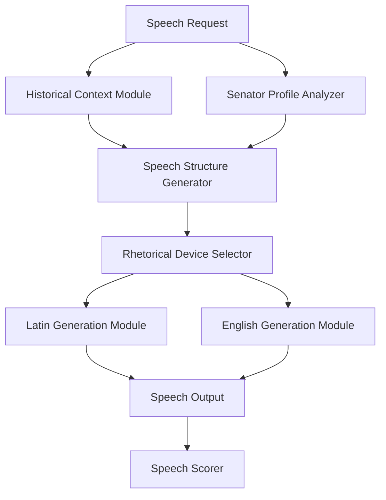

# Roman Senate Speech Generation Framework - Design Document

## 1. System Overview

The enhanced speech generation framework will replace the current `generate_speech()` function in debate.py with a sophisticated system creating historically authentic speeches with proper rhetorical devices, Latin integration, and personality-based variations.



## 2. Core Components

### 2.1 Historical Authenticity Module

- **Event References**: Select 2-3 relevant historical events for the time period
- **Historical Figures**: Identify 2-3 prominent figures from the period to reference
- **Roman Values**: Select period-appropriate values (e.g., *pietas*, *dignitas*, *gravitas*)
- **Customs & Practices**: Include references to time-appropriate customs

### 2.2 Senator Archetype System

**Personality Archetypes (cross-faction):**

1. **Traditionalist**
   - Values ancestral customs, precedent, established practices
   - Formal rhetoric, references to ancestors, appeals to tradition
   - Heavy use of traditional Latin phrases, references to *mos maiorum*

2. **Pragmatist**
   - Focuses on practical solutions and outcomes
   - Direct rhetoric, concrete examples, cost-benefit analysis
   - Moderate Latin usage, practical terminology

3. **Philosopher**
   - Intellectual approach with abstract principles and logical arguments
   - Sophisticated reasoning, Greek philosophical references
   - Complex sentence structures, Greek loanwords

4. **Populist**
   - Appeals to common people regardless of faction
   - Emotive language, relatable metaphors, moral framing
   - Simpler Latin constructions, commonly understood phrases

5. **Militarist**
   - Emphasizes strength, discipline, and security concerns
   - Direct assertions, military metaphors, appeals to security
   - Military terminology, command-like phrasing

### 2.3 Classical Rhetorical Devices Library

**Core Rhetorical Devices:**
- **Anaphora**: Repetition at beginning of successive clauses
- **Tricolon**: Series of three parallel elements
- **Antithesis**: Contrasting ideas in parallel structure
- **Chiasmus**: Reversed grammatical structure in successive phrases
- **Alliteration**: Repetition of consonant sounds
- **Asyndeton**: Omission of conjunctions
- **Polysyndeton**: Multiple conjunctions
- **Praeteritio**: Drawing attention by pretending to pass over
- **Rhetorical Question**: Question asked for effect without answer expected

### 2.4 Latin Integration Framework

**Latin Elements:**
- **Common Latin Phrases**: Age-appropriate political and legal phrases
- **Latin Terminology**: Political, legal, religious, and cultural terms
- **Latin Quotations**: From known works and sayings of the period
- **Latin Sentence Structure**: Authentic syntax patterns for Latin version

### 2.5 Classical Speech Structure Module

**Classical Structure Elements:**
1. **Exordium** (Introduction): Captures attention, establishes credibility
2. **Narratio** (Statement of Facts): Presents relevant background
3. **Partitio** (Division): Outlines the structure of arguments
4. **Confirmatio** (Positive Arguments): Main arguments supporting position
5. **Refutatio** (Refutation): Addresses counterarguments
6. **Peroratio** (Conclusion): Summarizes and makes final appeal

### 2.6 Speech Scoring System

**Scoring Categories:**
- **Historical Authenticity**: 0-10 points
- **Rhetorical Excellence**: 0-10 points
- **Persuasiveness**: 0-10 points
- **Latin Integration**: 0-10 points
- **Stylistic Coherence**: 0-10 points

## 3. Integration with Existing System

### 3.1 Function Interface

```python
def generate_speech(
    senator: Dict,
    topic: str,
    faction_stances: Dict = None,
    year: int = None,
    responding_to: Optional[Dict] = None,
    previous_speeches: Optional[List[Dict]] = None,
) -> Dict:
    """
    Generate an enhanced speech for a Roman senator.
    
    Returns:
        Dict: Speech data including Latin and English texts, key points,
              rhetorical devices used, historical references, and scoring.
    """
```

### 3.2 Output Compatibility

Ensure output structure contains all fields expected by display_speech():
- senator_id
- senator_name
- faction
- latin_text
- english_text
- full_text (for backward compatibility)
- stance
- key_points
- year
- year_display
- historical_context
- speech_length
- argument_quality
- quality_factor

## 4. Implementation Sequence

1. **Phase 1: Core Framework**
   - Create the Senator Archetype System
   - Implement the Classical Speech Structure Module
   - Build the basic Historical Authenticity Module

2. **Phase 2: Enhancement Modules**
   - Develop the Rhetorical Device Library
   - Implement the Latin Integration Framework
   - Create the Speech Scoring System

3. **Phase 3: Integration**
   - Connect all modules
   - Implement the new generate_speech() function
   - Create compatibility layer with existing code

4. **Phase 4: Testing and Refinement**
   - Test with various senator profiles
   - Compare with original speech generation
   - Tune parameters for optimal results

## 5. Code Structure

```
speech_generation/
├── __init__.py
├── archetype_system.py
├── classical_structure.py
├── historical_context.py
├── latin_integration.py
├── rhetorical_devices.py
├── speech_generator.py
└── speech_scorer.py
```

## 6. Core Module Implementations

### 6.1 Archetype System

```python
# archetype_system.py

ARCHETYPE_PARAMETERS = {
    "traditionalist": {...},
    "pragmatist": {...},
    "philosopher": {...},
    "populist": {...},
    "militarist": {...}
}

def determine_archetype(senator):
    # Implementation as described in the design document
    pass

def generate_archetype_parameters(senator, archetype_info):
    # Generate speech parameters based on archetype
    pass
```

### 6.2 Rhetorical Devices

```python
# rhetorical_devices.py

RHETORICAL_DEVICES = {
    "anaphora": {
        "template": "X... X... X...",
        "implementation": lambda seed: apply_anaphora(seed)
    },
    "tricolon": {
        "template": "X, Y, and Z",
        "implementation": lambda seed: apply_tricolon(seed)
    },
    # More devices...
}

def select_devices_for_archetype(archetype, eloquence):
    # Select appropriate devices based on archetype and eloquence
    pass

def apply_rhetorical_devices(text, devices):
    # Apply selected devices to text
    pass
```

### 6.3 Speech Generator

```python
# speech_generator.py

def generate_speech(senator, topic, faction_stances=None, year=None, 
                    responding_to=None, previous_speeches=None):
    # 1. Analyze senator to determine archetype
    archetype_info = determine_archetype(senator)
    
    # 2. Get historical context
    historical_context = get_historical_context(year, topic)
    
    # 3. Generate speech parameters
    params = generate_speech_parameters(
        senator, archetype_info, historical_context, 
        faction_stances, responding_to
    )
    
    # 4. Create speech structure
    speech_structure = generate_speech_structure(params)
    
    # 5. Apply rhetorical devices
    enhanced_structure = apply_rhetorical_devices(
        speech_structure, 
        select_devices_for_archetype(archetype_info["primary"], senator["traits"]["eloquence"])
    )
    
    # 6. Generate Latin and English versions
    latin_speech = generate_latin_version(enhanced_structure, params)
    english_speech = generate_english_version(enhanced_structure, params)
    
    # 7. Score the speech
    speech_score = score_speech(
        latin_speech, english_speech, 
        archetype_info, historical_context
    )
    
    # 8. Prepare output compatible with existing system
    return format_speech_output(
        senator, latin_speech, english_speech, 
        params, archetype_info, speech_score
    )
```

## 7. Key Differences from Current Implementation

1. **Structured Approach**: More modular, domain-specific components vs. monolithic function
2. **Personality-driven**: Speech style varies by archetype, not just faction
3. **Historically Richer**: More authentic references and context
4. **Rhetorically Advanced**: Deliberate use of classical devices
5. **Latin Integration**: More authentic Latin usage with period-appropriate terminology

## 8. Expected Outcomes

1. More diverse speeches even within the same faction
2. Historically authentic references and terminology
3. Better distinction between speakers based on personality
4. More engaging speeches with classical rhetorical elements
5. Higher quality Latin versions with appropriate phrasing