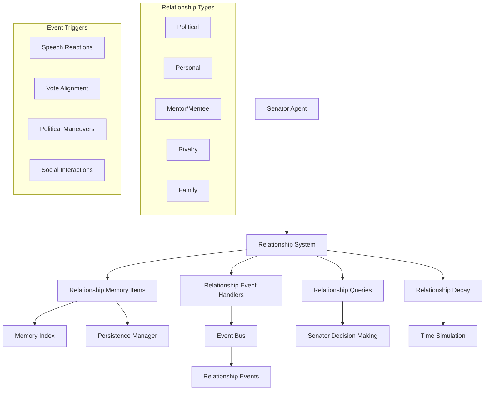
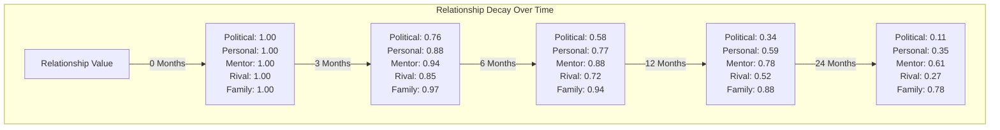

# Senator Relationship System Design

## Executive Summary

This document outlines a comprehensive design for an updated senator relationship system in the Roman Senate simulation. The new system leverages the recently added memory persistence, event-driven architecture, and memory indexing capabilities to create a more nuanced and dynamic representation of relationships between senators.

## 1. Current Limitations

The current relationship system has several limitations:

- **Single-Dimensional Relationships**: Relationships are represented as simple numeric values in a `relationship_scores` dictionary.
- **Limited Persistence**: While the system has memory persistence capabilities, relationship data isn't fully integrated with it.
- **Basic Event Integration**: Relationships are updated in specific event handlers without a unified system for event-based changes.
- **No Relationship Decay**: Relationships don't naturally decay over time.
- **Limited Context**: Little historical context for why relationships have certain values.
- **Retrieval Limitations**: No specialized queries for relationship data and inefficient use of the memory indexing system.

## 2. Proposed Architecture



## 3. Core Components

### 3.1 Relationship Memory Item

```python
class RelationshipMemoryItem(MemoryBase):
    """Records a relationship between two senators of a specific type."""
    
    def __init__(
        self,
        senator_id: str,
        target_senator_id: str,
        relationship_type: str,  # "political", "personal", "mentor", "rival", "family"
        relationship_value: float,
        timestamp: Optional[datetime.datetime] = None,
        importance: float = 0.6,
        decay_rate: float = 0.05,
        tags: Optional[List[str]] = None,
        emotional_impact: float = 0.0,
        context: str = ""
    ):
        # Add relationship to tags
        tags = tags or []
        if "relationship" not in tags:
            tags.append("relationship")
        if relationship_type not in tags:
            tags.append(relationship_type)
        if target_senator_id not in tags:
            tags.append(target_senator_id)
            
        super().__init__(timestamp, importance, decay_rate, tags, emotional_impact)
        self.senator_id = senator_id
        self.target_senator_id = target_senator_id
        self.relationship_type = relationship_type
        self.relationship_value = relationship_value
        self.context = context
        
    def to_dict(self) -> Dict[str, Any]:
        """Convert to dictionary representation."""
        data = super().to_dict()
        data.update({
            "senator_id": self.senator_id,
            "target_senator_id": self.target_senator_id,
            "relationship_type": self.relationship_type,
            "relationship_value": self.relationship_value,
            "context": self.context
        })
        return data
    
    @classmethod
    def from_dict(cls, data: Dict[str, Any]) -> 'RelationshipMemoryItem':
        """Create from dictionary representation."""
        # Parse timestamp from ISO format
        timestamp = datetime.datetime.fromisoformat(data["timestamp"])
        
        return cls(
            senator_id=data["senator_id"],
            target_senator_id=data["target_senator_id"],
            relationship_type=data["relationship_type"],
            relationship_value=data["relationship_value"],
            timestamp=timestamp,
            importance=data.get("importance", 0.6),
            decay_rate=data.get("decay_rate", 0.05),
            tags=data.get("tags", []),
            emotional_impact=data.get("emotional_impact", 0.0),
            context=data.get("context", "")
        )
```

### 3.2 Relationship Change Event

```python
class RelationshipChangeEvent(Event):
    """Event triggered when a relationship changes."""
    
    TYPE = "relationship_change"
    
    def __init__(
        self,
        senator_id: str,
        target_senator_id: str,
        relationship_type: str,
        old_value: float,
        new_value: float,
        change_value: float,
        reason: str,
        source_event_id: Optional[str] = None
    ):
        super().__init__()
        self.senator_id = senator_id
        self.target_senator_id = target_senator_id
        self.relationship_type = relationship_type
        self.old_value = old_value
        self.new_value = new_value
        self.change_value = change_value
        self.reason = reason
        self.source_event_id = source_event_id
        self.metadata = {
            "senator_id": senator_id,
            "target_senator_id": target_senator_id,
            "relationship_type": relationship_type,
            "old_value": old_value,
            "new_value": new_value,
            "change_value": change_value,
            "reason": reason,
            "source_event_id": source_event_id
        }
```

### 3.3 Relationship Manager

```python
class RelationshipManager:
    """
    Central system for managing senator relationships.
    
    Handles:
    1. Storing/retrieving relationship data via memory system
    2. Registering/handling relationship events
    3. Applying relationship decay over time
    4. Providing relationship query capabilities
    """
    
    # Define relationship types
    RELATIONSHIP_TYPES = [
        "political",  # Political alliance/opposition
        "personal",   # Personal friendship/animosity
        "mentor",     # Mentor/mentee relationship
        "rival",      # Direct rivalry/competition
        "family"      # Family connection
    ]
    
    # Default decay rates per relationship type (monthly)
    DECAY_RATES = {
        "political": 0.08,  # Political relationships change moderately fast
        "personal": 0.04,   # Personal relationships change slowly
        "mentor": 0.02,     # Mentor relationships very stable
        "rival": 0.05,      # Rival relationships moderately stable
        "family": 0.01      # Family connections extremely stable
    }
    
    def __init__(
        self,
        senator_id: str,
        event_bus: EventBus,
        memory: EnhancedEventMemory
    ):
        self.senator_id = senator_id
        self.event_bus = event_bus
        self.memory = memory
        
        # Cache of current relationship values for quick access
        self.relationship_cache = {}
        for rel_type in self.RELATIONSHIP_TYPES:
            self.relationship_cache[rel_type] = {}
            
        # Initialize from memory
        self._load_relationships_from_memory()
        
        # Register for events
        self._register_event_handlers()
    
    def get_relationship(
        self,
        target_senator_id: str,
        relationship_type: Optional[str] = None
    ) -> Union[float, Dict[str, float]]:
        """
        Get relationship value(s) with another senator.
        
        Args:
            target_senator_id: ID of the target senator
            relationship_type: Type of relationship to get, or None for all types
            
        Returns:
            Float value if type specified, dict of {type: value} if not
        """
        if relationship_type:
            return self.relationship_cache[relationship_type].get(target_senator_id, 0.0)
        
        return {
            rel_type: self.relationship_cache[rel_type].get(target_senator_id, 0.0)
            for rel_type in self.RELATIONSHIP_TYPES
        }
    
    def update_relationship(
        self,
        target_senator_id: str,
        relationship_type: str,
        change_value: float,
        reason: str,
        source_event_id: Optional[str] = None,
        publish_event: bool = True
    ) -> float:
        """
        Update relationship with another senator.
        
        Args:
            target_senator_id: ID of the target senator
            relationship_type: Type of relationship to update
            change_value: Value to add to relationship
            reason: Reason for the change
            source_event_id: Optional ID of event causing change
            publish_event: Whether to publish a RelationshipChangeEvent
            
        Returns:
            New relationship value
        """
        # Get current value
        old_value = self.relationship_cache[relationship_type].get(target_senator_id, 0.0)
        
        # Calculate new value (bounded between -1.0 and 1.0)
        new_value = max(-1.0, min(1.0, old_value + change_value))
        
        # Update cache
        self.relationship_cache[relationship_type][target_senator_id] = new_value
        
        # Create relationship memory item
        rel_memory = RelationshipMemoryItem(
            senator_id=self.senator_id,
            target_senator_id=target_senator_id,
            relationship_type=relationship_type,
            relationship_value=new_value,
            timestamp=datetime.datetime.now(),
            importance=0.6 + abs(change_value) * 0.4,  # Higher change = higher importance
            decay_rate=self.DECAY_RATES[relationship_type],
            emotional_impact=change_value,
            context=reason
        )
        
        # Store in memory
        self.memory.memory_index.add_memory(rel_memory)
        
        # Publish event if requested
        if publish_event and abs(new_value - old_value) > 0.001:
            event = RelationshipChangeEvent(
                senator_id=self.senator_id,
                target_senator_id=target_senator_id,
                relationship_type=relationship_type,
                old_value=old_value,
                new_value=new_value,
                change_value=change_value,
                reason=reason,
                source_event_id=source_event_id
            )
            self.event_bus.publish(event)
            
        return new_value
    
    def apply_time_decay(self, days_elapsed: int):
        """
        Apply time-based decay to relationships.
        
        Args:
            days_elapsed: Number of days that have passed
        """
        # For each relationship type and target
        for rel_type in self.RELATIONSHIP_TYPES:
            decay_rate = self.DECAY_RATES[rel_type]
            
            for target_id, value in self.relationship_cache[rel_type].items():
                if abs(value) < 0.01:
                    continue  # Skip near-zero relationships
                    
                # Convert monthly rate to daily and calculate decay amount
                daily_decay = decay_rate / 30  # Monthly rate to daily
                total_decay = daily_decay * days_elapsed
                
                # Calculate decay direction (relationships trend toward neutral)
                decay_direction = 1.0 if value > 0 else -1.0
                decay_amount = total_decay * decay_direction
                
                # Calculate new value
                new_value = value - decay_amount
                
                # Check if the decay crossed zero (avoid oscillation)
                if (value > 0 and new_value < 0) or (value < 0 and new_value > 0):
                    new_value = 0.0
                    
                # Only update if significant change
                if abs(new_value - value) > 0.01:
                    # Update the relationship cache directly
                    self.relationship_cache[rel_type][target_id] = new_value
                    
                    # Only create memory items for significant decay
                    if abs(new_value - value) > 0.05:
                        # Create a relationship memory item with low importance
                        rel_memory = RelationshipMemoryItem(
                            senator_id=self.senator_id,
                            target_senator_id=target_id,
                            relationship_type=rel_type,
                            relationship_value=new_value,
                            timestamp=datetime.datetime.now(),
                            importance=0.3,  # Lower importance for decay events
                            decay_rate=self.DECAY_RATES[rel_type],
                            emotional_impact=0.0,  # Neutral emotional impact for natural decay
                            context=f"Natural relationship decay over {days_elapsed} days"
                        )
                        
                        # Add to memory
                        self.memory.memory_index.add_memory(rel_memory)
    
    def get_relationship_history(
        self,
        target_senator_id: str,
        relationship_type: Optional[str] = None,
        limit: int = 10
    ) -> List[RelationshipMemoryItem]:
        """
        Get history of relationship changes.
        
        Args:
            target_senator_id: ID of the target senator
            relationship_type: Optional type to filter by
            limit: Maximum number of items to return
            
        Returns:
            List of relationship memory items, newest first
        """
        # Prepare query criteria
        criteria = {
            "tags": ["relationship", target_senator_id]
        }
        
        if relationship_type:
            criteria["tags"].append(relationship_type)
            
        # Query memory index
        memories = self.memory.memory_index.query(criteria)
        
        # Sort by timestamp (newest first) and limit
        sorted_memories = sorted(
            memories, 
            key=lambda m: m.timestamp,
            reverse=True
        )
        
        return sorted_memories[:limit]
        
    def get_overall_relationship(self, target_senator_id: str) -> float:
        """
        Calculate an overall relationship score across all types.
        
        Args:
            target_senator_id: ID of the target senator
            
        Returns:
            Weighted average relationship value
        """
        scores = self.get_relationship(target_senator_id)
        
        # Weighted average based on importance of each type
        weights = {
            "political": 0.3,
            "personal": 0.3,
            "mentor": 0.15,
            "rival": 0.2,
            "family": 0.05
        }
        
        weighted_sum = sum(scores[t] * weights[t] for t in self.RELATIONSHIP_TYPES)
        return weighted_sum
    
    def _register_event_handlers(self):
        """Register handlers for events that affect relationships."""
        self.event_bus.subscribe(SpeechEvent.TYPE, self._handle_speech_event)
        self.event_bus.subscribe(VoteEvent.TYPE, self._handle_vote_event)
        self.event_bus.subscribe(ReactionEvent.TYPE, self._handle_reaction_event)
        self.event_bus.subscribe(InterjectionEvent.TYPE, self._handle_interjection_event)
        
    def _handle_speech_event(self, event: SpeechEvent):
        """Process speech events for relationship impacts."""
        # Skip own speeches
        if event.speaker.get("id") == self.senator_id:
            return
            
        speaker_id = event.speaker.get("id")
        stance = event.stance
        topic = event.metadata.get("topic", "unknown")
        
        # Political impact based on stance alignment
        if hasattr(self, 'current_stance') and self.current_stance:
            if self.current_stance == stance:
                # Agreement strengthens political relationship
                self.update_relationship(
                    speaker_id,
                    "political",
                    0.05,
                    f"Agreed with stance on {topic}",
                    event.event_id
                )
            elif self.current_stance != "neutral" and stance != "neutral":
                # Disagreement weakens political relationship
                self.update_relationship(
                    speaker_id,
                    "political",
                    -0.05,
                    f"Disagreed with stance on {topic}",
                    event.event_id
                )
                
    def _handle_vote_event(self, event: VoteEvent):
        """Process vote events for relationship impacts."""
        proposal = event.metadata.get("proposal", "unknown proposal")
        my_vote = event.votes.get(self.senator_id)
        
        if not my_vote:
            return
            
        for senator_id, vote in event.votes.items():
            if senator_id == self.senator_id:
                continue
                
            if vote == my_vote:
                # Aligned votes strengthen political relationship
                self.update_relationship(
                    senator_id, 
                    "political",
                    0.1,  # Significant boost for vote alignment
                    f"Voted the same way ({vote}) on {proposal}",
                    event.event_id
                )
            else:
                # Opposed votes affect political relationship
                self.update_relationship(
                    senator_id,
                    "political",
                    -0.08,  # Notable decrease for opposed votes
                    f"Voted differently on {proposal} (I: {my_vote}, They: {vote})",
                    event.event_id
                )
                
    def _handle_reaction_event(self, event: ReactionEvent):
        """Process reaction events for relationship impacts."""
        # Skip own reactions
        if event.reactor.get("id") == self.senator_id:
            return
            
        reactor_id = event.reactor.get("id")
        reaction_type = event.reaction_type
        target_event_id = event.target_event.event_id
        
        # Check if this is a reaction to our speech
        if hasattr(event.target_event, "speaker") and event.target_event.speaker.get("id") == self.senator_id:
            # Someone reacted to our speech
            if reaction_type in ["agreement", "interest"]:
                # Positive reaction strengthens personal relationship
                self.update_relationship(
                    reactor_id,
                    "personal",
                    0.05,
                    f"Reacted positively to my speech ({reaction_type})",
                    target_event_id
                )
            elif reaction_type in ["disagreement", "skepticism"]:
                # Negative reaction affects personal relationship
                self.update_relationship(
                    reactor_id,
                    "personal",
                    -0.03,
                    f"Reacted negatively to my speech ({reaction_type})",
                    target_event_id
                )
                
    def _handle_interjection_event(self, event: InterjectionEvent):
        """Process interjection events for relationship impacts."""
        # Skip own interjections
        if event.interjector.get("id") == self.senator_id:
            return
            
        interjector_id = event.interjector.get("id")
        interjection_type = event.interjection_type
        
        # If we're the target of the interjection
        if event.target_speaker.get("id") == self.senator_id:
            if interjection_type == InterjectionType.SUPPORT:
                # Support interjection strengthens both relationships
                self.update_relationship(
                    interjector_id,
                    "political",
                    0.08,
                    "Supported me during a speech",
                    event.event_id
                )
                self.update_relationship(
                    interjector_id,
                    "personal",
                    0.05,
                    "Supported me during a speech",
                    event.event_id
                )
            elif interjection_type == InterjectionType.CHALLENGE:
                # Challenge interjection affects political relationship
                self.update_relationship(
                    interjector_id,
                    "political",
                    -0.08,
                    "Challenged me during a speech",
                    event.event_id
                )
            elif interjection_type == InterjectionType.EMOTIONAL:
                # Emotional interjection affects personal relationship
                self.update_relationship(
                    interjector_id,
                    "personal",
                    -0.1,
                    "Made an emotional outburst during my speech",
                    event.event_id
                )
    
    def _load_relationships_from_memory(self):
        """Initialize relationship cache from memory."""
        # Query memory for relationship items
        memories = self.memory.memory_index.query({"tags": ["relationship"]})
        
        # Group by target and type, keeping only the most recent
        latest_relationships = {}
        
        for memory in memories:
            if not isinstance(memory, RelationshipMemoryItem):
                continue
                
            key = (memory.target_senator_id, memory.relationship_type)
            
            if key not in latest_relationships or memory.timestamp > latest_relationships[key].timestamp:
                latest_relationships[key] = memory
                
        # Populate the cache
        for key, memory in latest_relationships.items():
            target_id, rel_type = key
            self.relationship_cache[rel_type][target_id] = memory.relationship_value
```

### 3.4 Integration with Senator Agent

```python
class RelationshipAwareSenatorAgent(EnhancedSenatorAgent):
    """Senator agent with enhanced relationship capabilities."""
    
    def __init__(self, *args, **kwargs):
        super().__init__(*args, **kwargs)
        
        # Initialize relationship manager
        self.relationship_manager = RelationshipManager(
            senator_id=self.senator["id"],
            event_bus=self.event_bus,
            memory=self.memory
        )
        
    async def decide_stance(self, topic: str, context: Dict) -> Tuple[str, str]:
        """Enhanced stance decision considering relationships."""
        # Get base stance from principle alignment
        base_stance, base_reasoning = await super().decide_stance(topic, context)
        
        # Find key senators with opinions on this topic
        key_senators = self._find_key_senators_for_topic(topic)
        
        # Calculate relationship influence
        relationship_influence = 0.0
        relationship_factors = []
        
        for senator_id, stance in key_senators.items():
            # Get overall relationship
            rel_score = self.relationship_manager.get_overall_relationship(senator_id)
            
            # Only strong relationships influence decisions
            if abs(rel_score) > 0.3:
                # Positive relationship pulls toward their stance
                # Negative relationship pushes away from their stance
                if stance == "support":
                    influence = rel_score * 0.2  # 20% weight to relationships
                elif stance == "oppose":
                    influence = -rel_score * 0.2
                else:
                    influence = 0.0
                    
                relationship_influence += influence
                
                # Record factor for explanation
                if abs(influence) > 0.05:
                    senator_name = self._get_senator_name(senator_id)
                    relationship_factors.append(
                        f"{senator_name}'s {stance} position ({rel_score:.1f} relationship)"
                    )
        
        # Apply relationship influence
        final_stance = base_stance
        if base_stance == "neutral" and abs(relationship_influence) > 0.2:
            # Relationships can sway neutral positions
            final_stance = "support" if relationship_influence > 0 else "oppose"
            
        # If relationships changed the stance, update reasoning
        if final_stance != base_stance:
            factors_text = ", ".join(relationship_factors)
            reasoning = f"{base_reasoning} However, I'm influenced by {factors_text}."
            
            # Record the relationship influence
            self.memory.add_observation(
                f"Stance on '{topic}' changed from {base_stance} to {final_stance} "
                f"due to relationship influences."
            )
            
            return final_stance, reasoning
            
        return base_stance, base_reasoning
        
    def _find_key_senators_for_topic(self, topic: str) -> Dict[str, str]:
        """
        Find key senators with known stances on a topic.
        
        Args:
            topic: The topic to find stances for
            
        Returns:
            Dictionary mapping senator IDs to stances
        """
        # In a real implementation, this would query the memory system
        # for senators who have spoken on this topic
        # For now, we'll return a simple mock implementation
        return {}
        
    def _get_senator_name(self, senator_id: str) -> str:
        """Get a senator's name from their ID."""
        # In a real implementation, this would look up the senator
        # For now, return a formatted version of the ID
        return senator_id.replace("senator_", "").replace("_", " ").title()
```

## 4. Relationship Decay Mechanism

The relationship decay mechanism simulates the natural erosion of relationships over time when there is no active interaction. Key features include:

### 4.1 Type-Specific Decay Rates

Different relationship types naturally decay at different rates:

```python
# Default monthly decay rates per relationship type
DECAY_RATES = {
    "political": 0.08,  # Political relationships change moderately fast
    "personal": 0.04,   # Personal relationships change slowly
    "mentor": 0.02,     # Mentor relationships very stable
    "rival": 0.05,      # Rival relationships moderately stable
    "family": 0.01      # Family connections extremely stable
}
```

### 4.2 Decay Visualization

The following chart shows how different relationship types would decay over time starting from a value of 1.0 (strongest positive relationship):



### 4.3 Decay Implementation

The key implementation is the `apply_time_decay` method that applies appropriate decay based on elapsed time.

## 5. Example Usage Scenarios

### 5.1 Speech Reaction

```python
# When a senator delivers a speech
speech_event = SpeechEvent(
    speaker={"id": "senator_cicero", "name": "Marcus Cicero", "faction": "Optimates"},
    content="I strongly oppose this land reform proposal...",
    stance="oppose",
    topic="Land Reform Act",
    speech_id="speech_123"
)

# The relationship manager processes this event through the _handle_speech_event method
```

### 5.2 Vote Alignment

```python
# Vote event
vote_event = VoteEvent(
    proposal="Land Reform Act",
    votes={
        "senator_cicero": "oppose",
        "senator_caesar": "support",
        "senator_cato": "oppose"
    }
)

# The relationship manager processes this event through the _handle_vote_event method
```

### 5.3 Relationship-based Decision Making

```python
# Inside RelationshipAwareSenatorAgent.decide_stance method
# Senators consider their relationships when deciding their stance on topics

# Simplified example of how a senator might be influenced
if self.relationship_manager.get_overall_relationship("senator_caesar") > 0.7:
    # Very strong positive relationship with Caesar
    # More likely to align with Caesar's position
    if caesar_stance == "support" and base_stance == "neutral":
        final_stance = "support"
        reason = "While I'm personally neutral, I support this due to my alliance with Caesar."
```

## 6. Data Schema for Relationship Storage

Each relationship is stored as a `RelationshipMemoryItem` in the memory system:

```json
{
  "senator_id": "senator_cicero",
  "target_senator_id": "senator_caesar",
  "relationship_type": "political",
  "relationship_value": -0.75,
  "timestamp": "2025-04-18T14:30:00",
  "importance": 0.8,
  "decay_rate": 0.08,
  "emotional_impact": -0.6,
  "tags": ["relationship", "political", "senator_caesar", "rivalry"],
  "context": "Opposed my motion on governance reforms"
}
```

## 7. Implementation Steps

1. Create the `RelationshipMemoryItem` class that inherits from `MemoryBase`
2. Implement the `RelationshipChangeEvent` class 
3. Develop the `RelationshipManager` class with:
   - Storage and retrieval methods
   - Event handlers
   - Decay mechanism
4. Create the `RelationshipAwareSenatorAgent` that integrates with the existing system
5. Update existing event handlers to use the relationship system
6. Add relationship querying to decision-making processes
7. Implement relationship visualization for debugging/monitoring

## 8. Conclusion

This design provides a comprehensive approach to enhancing the senator relationship system, leveraging the new features while maintaining backward compatibility. The system will make senator interactions more nuanced, persistent, and historically informed, improving the realism of the simulation.