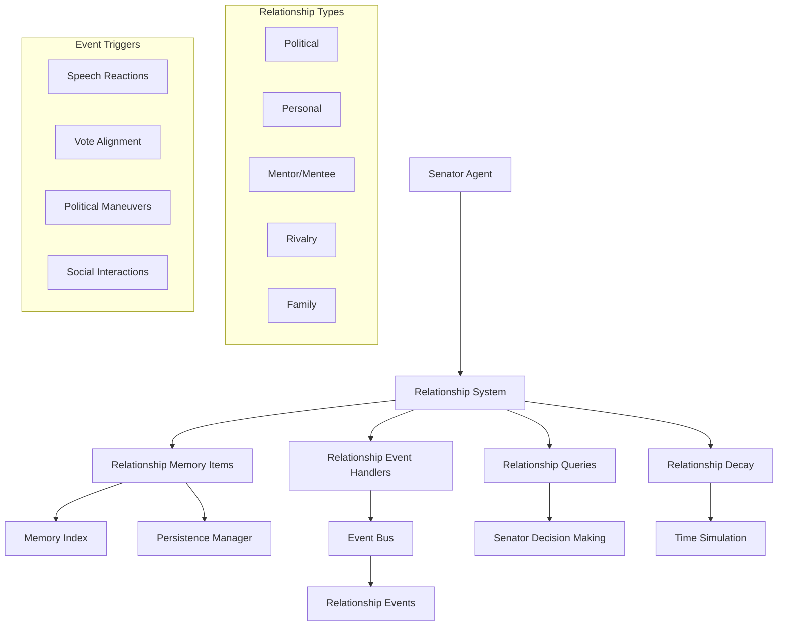
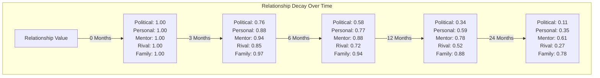

# Senator Relationship System Design

**Author:** Documentation Team  
**Version:** 2.0.0  
**Date:** April 19, 2025

## Table of Contents

- [Executive Summary](#executive-summary)
- [1. Current Limitations](#1-current-limitations)
- [2. Proposed Architecture](#2-proposed-architecture)
- [3. Core Components](#3-core-components)
  - [3.1 Relationship Memory Item](#31-relationship-memory-item)
  - [3.2 Relationship Change Event](#32-relationship-change-event)
  - [3.3 Relationship Manager](#33-relationship-manager)
  - [3.4 Integration with Senator Agent](#34-integration-with-senator-agent)
- [4. Relationship Decay Mechanism](#4-relationship-decay-mechanism)
  - [4.1 Type-Specific Decay Rates](#41-type-specific-decay-rates)
  - [4.2 Decay Visualization](#42-decay-visualization)
  - [4.3 Decay Implementation](#43-decay-implementation)
- [5. Example Usage Scenarios](#5-example-usage-scenarios)
  - [5.1 Speech Reaction](#51-speech-reaction)
  - [5.2 Vote Alignment](#52-vote-alignment)
  - [5.3 Relationship-based Decision Making](#53-relationship-based-decision-making)
- [6. Data Schema for Relationship Storage](#6-data-schema-for-relationship-storage)
- [7. Implementation Steps](#7-implementation-steps)
- [8. Conclusion](#8-conclusion)

## Executive Summary

This document outlines a comprehensive design for an updated senator relationship system in the Roman Senate simulation. The new system leverages the recently added memory persistence, event-driven architecture, and memory indexing capabilities to create a more nuanced and dynamic representation of relationships between senators.

The relationship system models the complex web of political and personal connections that existed in the Roman Senate, where alliances, rivalries, mentorships, and family ties all played crucial roles in political decision-making. By implementing this system, the simulation will achieve greater realism and dynamic behavior, with senators making decisions influenced by their relationships with others.

## 1. Current Limitations

The current relationship system has several limitations:

- **Single-Dimensional Relationships**: Relationships are represented as simple numeric values in a `relationship_scores` dictionary.
- **Limited Persistence**: While the system has memory persistence capabilities, relationship data isn't fully integrated with it.
- **Basic Event Integration**: Relationships are updated in specific event handlers without a unified system for event-based changes.
- **No Relationship Decay**: Relationships don't naturally decay over time.
- **Limited Context**: Little historical context for why relationships have certain values.
- **Retrieval Limitations**: No specialized queries for relationship data and inefficient use of the memory indexing system.

## 2. Proposed Architecture

The proposed architecture integrates the relationship system with the existing event system, memory persistence, and senator agent components:



This architecture provides:

1. **Multi-dimensional Relationships**: Different types of relationships with varying characteristics
2. **Event-Driven Updates**: Relationships change in response to simulation events
3. **Persistent Storage**: Relationship data is stored in the memory system
4. **Time-Based Decay**: Relationships naturally decay over time
5. **Decision Influence**: Relationships affect senator decision-making
6. **Historical Context**: Each relationship change is stored with context

## 3. Core Components

### 3.1 Relationship Memory Item

The `RelationshipMemoryItem` class extends the base `MemoryBase` class to store relationship data:

```python
class RelationshipMemoryItem(MemoryBase):
    """Records a relationship between two senators of a specific type."""
    
    def __init__(
        self,
        senator_id: str,
        target_senator_id: str,
        relationship_type: str,  # "political", "personal", "mentor", "rival", "family"
        relationship_value: float,
        timestamp: Optional[datetime.datetime] = None,
        importance: float = 0.6,
        decay_rate: float = 0.05,
        tags: Optional[List[str]] = None,
        emotional_impact: float = 0.0,
        context: str = ""
    ):
        # Add relationship to tags
        tags = tags or []
        if "relationship" not in tags:
            tags.append("relationship")
        if relationship_type not in tags:
            tags.append(relationship_type)
        if target_senator_id not in tags:
            tags.append(target_senator_id)
            
        super().__init__(timestamp, importance, decay_rate, tags, emotional_impact)
        self.senator_id = senator_id
        self.target_senator_id = target_senator_id
        self.relationship_type = relationship_type
        self.relationship_value = relationship_value
        self.context = context
        
    def to_dict(self) -> Dict[str, Any]:
        """Convert to dictionary representation."""
        data = super().to_dict()
        data.update({
            "senator_id": self.senator_id,
            "target_senator_id": self.target_senator_id,
            "relationship_type": self.relationship_type,
            "relationship_value": self.relationship_value,
            "context": self.context
        })
        return data
    
    @classmethod
    def from_dict(cls, data: Dict[str, Any]) -> 'RelationshipMemoryItem':
        """Create from dictionary representation."""
        # Parse timestamp from ISO format
        timestamp = datetime.datetime.fromisoformat(data["timestamp"])
        
        return cls(
            senator_id=data["senator_id"],
            target_senator_id=data["target_senator_id"],
            relationship_type=data["relationship_type"],
            relationship_value=data["relationship_value"],
            timestamp=timestamp,
            importance=data.get("importance", 0.6),
            decay_rate=data.get("decay_rate", 0.05),
            tags=data.get("tags", []),
            emotional_impact=data.get("emotional_impact", 0.0),
            context=data.get("context", "")
        )
```

Key features:
- Stores relationship data between two senators
- Includes relationship type and value
- Provides context for why the relationship has this value
- Integrates with the memory system for persistence
- Uses tags for efficient querying

### 3.2 Relationship Change Event

The `RelationshipChangeEvent` class extends the base `Event` class to notify the system of relationship changes:

```python
class RelationshipChangeEvent(Event):
    """Event triggered when a relationship changes."""
    
    TYPE = "relationship_change"
    
    def __init__(
        self,
        senator_id: str,
        target_senator_id: str,
        relationship_type: str,
        old_value: float,
        new_value: float,
        change_value: float,
        reason: str,
        source_event_id: Optional[str] = None
    ):
        super().__init__()
        self.senator_id = senator_id
        self.target_senator_id = target_senator_id
        self.relationship_type = relationship_type
        self.old_value = old_value
        self.new_value = new_value
        self.change_value = change_value
        self.reason = reason
        self.source_event_id = source_event_id
        self.metadata = {
            "senator_id": senator_id,
            "target_senator_id": target_senator_id,
            "relationship_type": relationship_type,
            "old_value": old_value,
            "new_value": new_value,
            "change_value": change_value,
            "reason": reason,
            "source_event_id": source_event_id
        }
```

Key features:
- Notifies the system when a relationship changes
- Includes both old and new values
- Provides the reason for the change
- Links back to the source event that caused the change
- Includes metadata for easy access to event details

### 3.3 Relationship Manager

The `RelationshipManager` class is the central component that manages relationships for a senator:

```python
class RelationshipManager:
    """
    Central system for managing senator relationships.
    
    Handles:
    1. Storing/retrieving relationship data via memory system
    2. Registering/handling relationship events
    3. Applying relationship decay over time
    4. Providing relationship query capabilities
    """
    
    # Define relationship types
    RELATIONSHIP_TYPES = [
        "political",  # Political alliance/opposition
        "personal",   # Personal friendship/animosity
        "mentor",     # Mentor/mentee relationship
        "rival",      # Direct rivalry/competition
        "family"      # Family connection
    ]
    
    # Default decay rates per relationship type (monthly)
    DECAY_RATES = {
        "political": 0.08,  # Political relationships change moderately fast
        "personal": 0.04,   # Personal relationships change slowly
        "mentor": 0.02,     # Mentor relationships very stable
        "rival": 0.05,      # Rival relationships moderately stable
        "family": 0.01      # Family connections extremely stable
    }
```

The `RelationshipManager` provides methods for:

1. **Getting Relationships**:
   ```python
   def get_relationship(
       self,
       target_senator_id: str,
       relationship_type: Optional[str] = None
   ) -> Union[float, Dict[str, float]]:
       """
       Get relationship value(s) with another senator.
       
       Args:
           target_senator_id: ID of the target senator
           relationship_type: Type of relationship to get, or None for all types
           
       Returns:
           Float value if type specified, dict of {type: value} if not
       """
   ```

2. **Updating Relationships**:
   ```python
   def update_relationship(
       self,
       target_senator_id: str,
       relationship_type: str,
       change_value: float,
       reason: str,
       source_event_id: Optional[str] = None,
       publish_event: bool = True
   ) -> float:
       """
       Update relationship with another senator.
       
       Args:
           target_senator_id: ID of the target senator
           relationship_type: Type of relationship to update
           change_value: Value to add to relationship
           reason: Reason for the change
           source_event_id: Optional ID of event causing change
           publish_event: Whether to publish a RelationshipChangeEvent
           
       Returns:
           New relationship value
       """
   ```

3. **Applying Time Decay**:
   ```python
   def apply_time_decay(self, days_elapsed: int):
       """
       Apply time-based decay to relationships.
       
       Args:
           days_elapsed: Number of days that have passed
       """
   ```

4. **Getting Relationship History**:
   ```python
   def get_relationship_history(
       self,
       target_senator_id: str,
       relationship_type: Optional[str] = None,
       limit: int = 10
   ) -> List[RelationshipMemoryItem]:
       """
       Get history of relationship changes.
       
       Args:
           target_senator_id: ID of the target senator
           relationship_type: Optional type to filter by
           limit: Maximum number of items to return
           
       Returns:
           List of relationship memory items, newest first
       """
   ```

5. **Calculating Overall Relationship**:
   ```python
   def get_overall_relationship(self, target_senator_id: str) -> float:
       """
       Calculate an overall relationship score across all types.
       
       Args:
           target_senator_id: ID of the target senator
           
       Returns:
           Weighted average relationship value
       """
   ```

6. **Event Handling**:
   ```python
   def _register_event_handlers(self):
       """Register handlers for events that affect relationships."""
       self.event_bus.subscribe(SpeechEvent.TYPE, self._handle_speech_event)
       self.event_bus.subscribe(VoteEvent.TYPE, self._handle_vote_event)
       self.event_bus.subscribe(ReactionEvent.TYPE, self._handle_reaction_event)
       self.event_bus.subscribe(InterjectionEvent.TYPE, self._handle_interjection_event)
   ```

### 3.4 Integration with Senator Agent

The `RelationshipAwareSenatorAgent` class extends the `EnhancedSenatorAgent` to use relationships in decision-making:

```python
class RelationshipAwareSenatorAgent(EnhancedSenatorAgent):
    """Senator agent with enhanced relationship capabilities."""
    
    def __init__(self, *args, **kwargs):
        super().__init__(*args, **kwargs)
        
        # Initialize relationship manager
        self.relationship_manager = RelationshipManager(
            senator_id=self.senator["id"],
            event_bus=self.event_bus,
            memory=self.memory
        )
        
    async def decide_stance(self, topic: str, context: Dict) -> Tuple[str, str]:
        """Enhanced stance decision considering relationships."""
        # Get base stance from principle alignment
        base_stance, base_reasoning = await super().decide_stance(topic, context)
        
        # Find key senators with opinions on this topic
        key_senators = self._find_key_senators_for_topic(topic)
        
        # Calculate relationship influence
        relationship_influence = 0.0
        relationship_factors = []
        
        for senator_id, stance in key_senators.items():
            # Get overall relationship
            rel_score = self.relationship_manager.get_overall_relationship(senator_id)
            
            # Only strong relationships influence decisions
            if abs(rel_score) > 0.3:
                # Positive relationship pulls toward their stance
                # Negative relationship pushes away from their stance
                if stance == "support":
                    influence = rel_score * 0.2  # 20% weight to relationships
                elif stance == "oppose":
                    influence = -rel_score * 0.2
                else:
                    influence = 0.0
                    
                relationship_influence += influence
                
                # Record factor for explanation
                if abs(influence) > 0.05:
                    senator_name = self._get_senator_name(senator_id)
                    relationship_factors.append(
                        f"{senator_name}'s {stance} position ({rel_score:.1f} relationship)"
                    )
        
        # Apply relationship influence
        final_stance = base_stance
        if base_stance == "neutral" and abs(relationship_influence) > 0.2:
            # Relationships can sway neutral positions
            final_stance = "support" if relationship_influence > 0 else "oppose"
            
        # If relationships changed the stance, update reasoning
        if final_stance != base_stance:
            factors_text = ", ".join(relationship_factors)
            reasoning = f"{base_reasoning} However, I'm influenced by {factors_text}."
            
            # Record the relationship influence
            self.memory.add_observation(
                f"Stance on '{topic}' changed from {base_stance} to {final_stance} "
                f"due to relationship influences."
            )
            
            return final_stance, reasoning
            
        return base_stance, base_reasoning
```

Key features:
- Integrates the relationship manager with the senator agent
- Uses relationships to influence stance decisions
- Provides explanations for relationship-influenced decisions
- Records relationship influences in memory

## 4. Relationship Decay Mechanism

The relationship decay mechanism simulates the natural erosion of relationships over time when there is no active interaction. Key features include:

### 4.1 Type-Specific Decay Rates

Different relationship types naturally decay at different rates:

```python
# Default monthly decay rates per relationship type
DECAY_RATES = {
    "political": 0.08,  # Political relationships change moderately fast
    "personal": 0.04,   # Personal relationships change slowly
    "mentor": 0.02,     # Mentor relationships very stable
    "rival": 0.05,      # Rival relationships moderately stable
    "family": 0.01      # Family connections extremely stable
}
```

### 4.2 Decay Visualization

The following chart shows how different relationship types would decay over time starting from a value of 1.0 (strongest positive relationship):



### 4.3 Decay Implementation

The key implementation is the `apply_time_decay` method that applies appropriate decay based on elapsed time:

1. For each relationship type and target senator:
   - Calculate the daily decay rate from the monthly rate
   - Calculate the total decay amount based on days elapsed
   - Determine decay direction (relationships trend toward neutral)
   - Apply decay and ensure it doesn't cross zero
   - Update the relationship cache
   - Create a memory item for significant decay

## 5. Example Usage Scenarios

### 5.1 Speech Reaction

```python
# When a senator delivers a speech
speech_event = SpeechEvent(
    speaker={"id": "senator_cicero", "name": "Marcus Cicero", "faction": "Optimates"},
    content="I strongly oppose this land reform proposal...",
    stance="oppose",
    topic="Land Reform Act",
    speech_id="speech_123"
)

# The relationship manager processes this event through the _handle_speech_event method
```

When a senator delivers a speech, the relationship manager:
1. Checks if the speaker is the senator itself (skips if so)
2. Gets the speaker's stance and topic
3. Compares with the senator's own stance
4. Updates political relationships based on stance alignment
5. Creates relationship memory items with context

### 5.2 Vote Alignment

```python
# Vote event
vote_event = VoteEvent(
    proposal="Land Reform Act",
    votes={
        "senator_cicero": "oppose",
        "senator_caesar": "support",
        "senator_cato": "oppose"
    }
)

# The relationship manager processes this event through the _handle_vote_event method
```

When senators vote on a proposal, the relationship manager:
1. Gets the senator's own vote
2. Compares with other senators' votes
3. Strengthens political relationships for aligned votes
4. Weakens political relationships for opposed votes
5. Creates relationship memory items with context

### 5.3 Relationship-based Decision Making

```python
# Inside RelationshipAwareSenatorAgent.decide_stance method
# Senators consider their relationships when deciding their stance on topics

# Simplified example of how a senator might be influenced
if self.relationship_manager.get_overall_relationship("senator_caesar") > 0.7:
    # Very strong positive relationship with Caesar
    # More likely to align with Caesar's position
    if caesar_stance == "support" and base_stance == "neutral":
        final_stance = "support"
        reason = "While I'm personally neutral, I support this due to my alliance with Caesar."
```

When deciding a stance on a topic, the relationship-aware senator:
1. Gets the base stance from principle alignment
2. Finds key senators with opinions on the topic
3. Calculates relationship influence for each key senator
4. Applies relationship influence to the base stance
5. Updates reasoning to explain relationship influences
6. Records the relationship influence in memory

## 6. Data Schema for Relationship Storage

Each relationship is stored as a `RelationshipMemoryItem` in the memory system:

```json
{
  "senator_id": "senator_cicero",
  "target_senator_id": "senator_caesar",
  "relationship_type": "political",
  "relationship_value": -0.75,
  "timestamp": "2025-04-18T14:30:00",
  "importance": 0.8,
  "decay_rate": 0.08,
  "emotional_impact": -0.6,
  "tags": ["relationship", "political", "senator_caesar", "rivalry"],
  "context": "Opposed my motion on governance reforms"
}
```

This schema:
- Identifies both senators in the relationship
- Specifies the relationship type and value
- Includes a timestamp for historical tracking
- Provides importance and decay rate for memory management
- Uses tags for efficient querying
- Includes context explaining why the relationship has this value

## 7. Implementation Steps

1. Create the `RelationshipMemoryItem` class that inherits from `MemoryBase`
2. Implement the `RelationshipChangeEvent` class 
3. Develop the `RelationshipManager` class with:
   - Storage and retrieval methods
   - Event handlers
   - Decay mechanism
4. Create the `RelationshipAwareSenatorAgent` that integrates with the existing system
5. Update existing event handlers to use the relationship system
6. Add relationship querying to decision-making processes
7. Implement relationship visualization for debugging/monitoring

## 8. Conclusion

This design provides a comprehensive approach to enhancing the senator relationship system, leveraging the new features while maintaining backward compatibility. The system will make senator interactions more nuanced, persistent, and historically informed, improving the realism of the simulation.

Key benefits include:
- More realistic senator behavior influenced by relationships
- Dynamic relationship changes based on interactions
- Natural relationship decay over time
- Persistent relationship data across simulation sessions
- Rich context for why relationships have certain values
- Integration with the existing event and memory systems

The implementation follows a modular approach, allowing for future extensions and refinements as the simulation evolves.