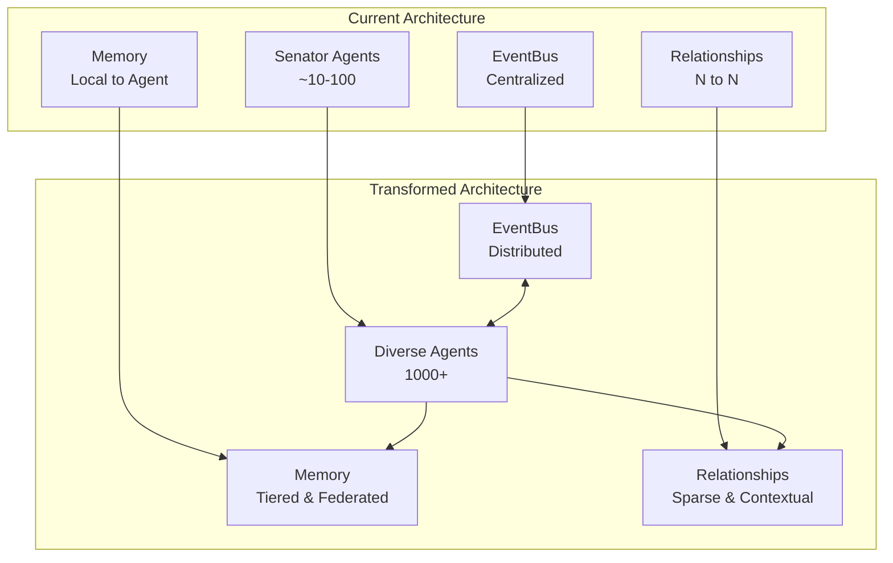
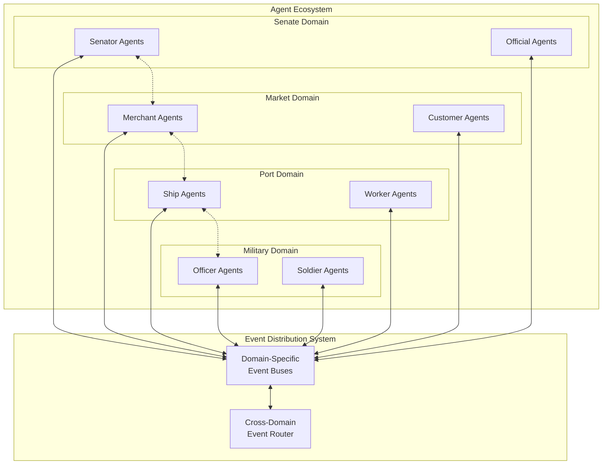

# Roman Senate AI Architecture Analysis Plan

**Focus:** Transforming the architecture to support thousands of diverse agents across multiple domains

**Author:** Architecture Team  
**Version:** 1.0.0  
**Date:** April 19, 2025

## 1. Current Architecture Assessment & Transformation Needs

- Analysis of current architecture components and scaling limitations
- Identification of transformation requirements for supporting thousands of agents
- Gap analysis between current design and large-scale agent ecosystem needs

## 2. Large-Scale Agent Ecosystem Architecture

### 2.1 Event System Transformation

- **Scalability bottlenecks in current EventBus implementation**
- **Distributed event processing architecture for 1000+ agents**
- Event filtering and subscription optimization for high-volume scenarios
- **Partitioning strategies for segregating event domains**
- **Publish-subscribe scaling patterns for cross-domain communication**
- **Real-time vs. batch event processing tradeoffs at scale**

### 2.2 Agent Factory & Management System

- **Agent instantiation and lifecycle management for 1000+ agents**
- **Dynamic agent type registry and capability discovery**
- **Resource allocation and throttling for concurrent agent processing**
- **Agent pooling and suspension strategies**
- **Hierarchical organization of agents (cities, regions, domains)**
- **Multi-threaded and distributed agent processing models**

### 2.3 Memory Systems Transformation

- **Current memory bottlenecks at scale**
- **Tiered memory architecture for efficient retrieval among thousands of agents**
- **Shared vs. individual memory organization patterns**
- **Memory federation and distribution strategies**
- **Caching and pruning approaches for memory optimization**
- **Summarization and compression techniques for historical data**
- **Retrieval optimization through indexing and spatial organization**

### 2.4 Relationship System Redesign

- **Addressing the n² relationship problem for thousands of agents**
- **Sparse relationship matrix implementation**
- **Dynamic relationship formation based on interaction frequency**
- **Group and faction-based relationship aggregation**
- **Contextual relationship activation to reduce active relationship tracking**
- **Relationship strength decay automation for inactive connections**

## 3. Technical Implementation Strategies

### 3.1 Infrastructure Requirements for Scale

- **Concurrency and parallelism requirements for processing thousands of agents**
- **Memory usage projections and optimization techniques**
- **Database vs. in-memory storage tradeoffs**
- **Serialization and deserialization optimization for agent state**
- **Compute resource allocation strategies**

### 3.2 Performance Optimization Patterns

- **Batched processing implementation for agent updates**
- **Asynchronous event dispatch with priority queuing**
- **Lazy loading and initialization techniques**
- **Just-in-time agent activation patterns**
- **Spatial optimization for locality-based interactions**

### 3.3 Architectural Transformation Roadmap

- **Phased approach to evolving the current architecture**
- **Compatibility layers during transition**
- **Testing strategies for validating scaled solutions**
- **Performance benchmarking methodology**
- **Migration path for existing senator agents to new architecture**

## 4. Domain-Specific Scaling Considerations

### 4.1 Senate Domain Scaling

- **Specialized optimizations for debate and voting at scale**
- **Faction-based processing optimization**
- **Committee and subgroup formation for workload distribution**

### 4.2 Market Domain Implementation

- **Market-specific event types and optimization**
- **Transaction processing at scale**
- **Supply-demand relationship modeling**
- **Price discovery with many agents**

### 4.3 Multi-Domain Interaction Scaling

- **Cross-domain influence mechanisms**
- **Resource and information flow between domains**
- **Agent role switching between contexts**
- **City-wide event propagation strategies**

## 5. Simulation Control and Monitoring

- **Centralized vs. distributed simulation control**
- **Observability and debugging in thousand-agent systems**
- **Performance monitoring and bottleneck detection**
- **Dynamic scaling and throttling mechanisms**
- **Visualization techniques for large-scale agent interactions**

## Appendix: Reference Diagrams

### System Architecture Transformation



### Agent Distribution and Interaction



### Memory and Relationship Architecture

```mermaid
flowchart TD
    subgraph "Agent Memory System"
        M1[Short-term Memory\nRecent Events]
        M2[Working Memory\nActive Relationships]
        M3[Long-term Memory\nDurable Knowledge]
        M4[Shared Memory\nCommon Knowledge]
    end
    
    subgraph "Relationship Tracking"
        R1[Active Relationships\nDirectly Tracked]
        R2[Group Relationships\nAggregated]
        R3[Potential Relationships\nDormant]
    end
    
    subgraph "Agent Instance"
        A[Agent]
    end
    
    A --> M1
    A --> M2
    A --> M3
    A --> M4
    
    A --> R1
    A --> R2
    R3 -.-> A