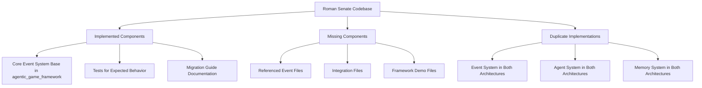
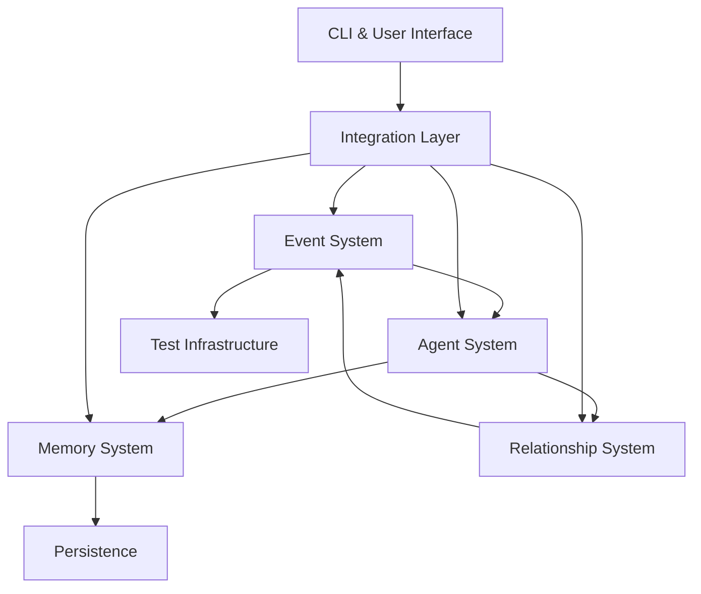
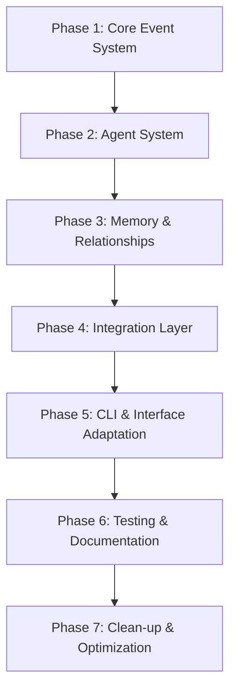

# Roman Senate Migration Plan

## 1. Current Status Assessment

### 1.1 Summary of Issues

1. **Missing Files Referenced in Code**:
   - Event system files (`src/roman_senate/core/events/base.py`, etc.)
   - Integration files (`src/roman_senate/integration/framework_events.py`, etc.)
   - Test files that reference non-existent implementations

2. **Placeholder Implementations**:
   - Partial implementations created to satisfy import requirements
   - Minimal stubs without actual functionality

3. **Duplicate Architecture**:
   - Event system implementations in `src/agentic_game_framework/events/` and `src/roman_senate/core/events/`
   - Multiple agent implementations across both architectures
   - Redundant memory and relationship systems

4. **Circular Dependencies**:
   - Classes extending or referencing components that don't exist yet

## 2. Dependency Analysis

## 3. Migration Strategy

The migration will follow a bottom-up, test-driven approach focusing on implementing minimally viable components to make tests pass first, then enhancing functionality.

### 3.1 Phased Approach

## 4. Implementation Plan

### Phase 1: Core Event System (Foundation)

**Goal**: Implement the core event system files needed to satisfy dependencies and pass tests.

#### Tasks:

1. **Complete Missing Event System Files**:
   - Create `src/roman_senate/core/events/base.py`
     - Implement a minimal version that extends or adapts `agentic_game_framework.events.base.BaseEvent`
   - Create `src/roman_senate/core/events/debate_events.py`
     - Define debate-specific event types that inherit from the base
   - Create `src/roman_senate/core/events/debate_manager.py`
     - Implement event orchestration for debates
   - Implement remaining event files referenced in imports

2. **Adapt Event Tests**:
   - Ensure `tests/core/events/test_base.py` and others pass with new implementations
   - Add necessary fixtures and mocks

3. **Documentation Update**:
   - Update event system documentation to reflect the actual implementation

### Phase 2: Agent System Migration

**Goal**: Implement agent components that rely on the event system.

#### Tasks:

1. **Complete Missing Agent Files**:
   - Create `src/roman_senate/agents/event_driven_senator_agent.py`
     - Implement agent that consumes and produces events
   - Create `src/roman_senate/agents/event_memory.py`
     - Implement memory system for tracking events

2. **Adapt Agent Tests**:
   - Make `tests/agents/test_event_memory.py` pass
   - Make `tests/agents/test_event_driven_senator_agent.py` pass

3. **Documentation Update**:
   - Update agent documentation to reflect events-based behavior

### Phase 3: Memory and Relationship Systems

**Goal**: Complete the memory and relationship systems that build on the event and agent foundations.

#### Tasks:

1. **Complete Memory System**:
   - Implement `src/roman_senate/agents/memory_base.py`
   - Implement `src/roman_senate/agents/memory_index.py`
   - Implement `src/roman_senate/agents/enhanced_event_memory.py`
   - Implement `src/roman_senate/agents/memory_persistence_manager.py`
   - Implement `src/roman_senate/agents/memory_items.py`

2. **Complete Relationship System**:
   - Implement `src/roman_senate/core/events/relationship_events.py`
   - Implement `src/roman_senate/agents/relationship_manager.py`

3. **Adapt Related Tests**:
   - Make memory and relationship tests pass

### Phase 4: Integration Layer

**Goal**: Create a proper integration layer between old and new architectures.

#### Tasks:

1. **Implement Integration Components**:
   - Create `src/roman_senate/integration/__init__.py`
   - Create `src/roman_senate/integration/framework_events.py`
   - Create `src/roman_senate/integration/framework_agents.py`
   - Create `src/roman_senate/integration/utils.py`

2. **Implement Demo**:
   - Create `src/roman_senate/examples/framework_integration_demo/framework_integration_demo.py`

3. **Integration Tests**:
   - Make `tests/core/events/test_event_system_integration.py` pass
   - Make `tests/agents/test_integration.py` pass

### Phase 5: CLI & Interface Adaptation

**Goal**: Update the CLI and user interfaces to work with the new architecture.

#### Tasks:

1. **Adapt CLI**:
   - Update `src/roman_senate/cli.py` to work with both architectures
   - Add migration flags/options if needed

2. **Example Scripts**:
   - Update example scripts to use the new architecture
   - Create backwards compatibility wrappers if needed

### Phase 6: Testing & Documentation

**Goal**: Ensure all tests pass and documentation is accurate.

#### Tasks:

1. **Test Verification**:
   - Run all tests to ensure they pass
   - Add missing tests for edge cases

2. **Documentation Completion**:
   - Update all documentation to reflect the actual implementation
   - Create migration guides for users

### Phase 7: Clean-up & Optimization

**Goal**: Remove deprecated code and optimize the new implementation.

#### Tasks:

1. **Code Cleanup**:
   - Remove duplicated code
   - Mark deprecated components

2. **Performance Optimization**:
   - Profile and optimize critical paths
   - Address any performance regressions

## 5. Specific File Migration Map

### 5.1 Event System Files

| File Path | Status | Migration Action |
|-----------|--------|-----------------|
| src/roman_senate/core/events/base.py | Missing | Create as adapter to agentic_game_framework/events/base.py |
| src/roman_senate/core/events/debate_events.py | Missing | Create based on test requirements |
| src/roman_senate/core/events/debate_manager.py | Missing | Create based on test requirements |
| src/roman_senate/core/events/relationship_events.py | Missing | Create as part of Phase 3 |

### 5.2 Agent System Files

| File Path | Status | Migration Action |
|-----------|--------|-----------------|
| src/roman_senate/agents/event_memory.py | Missing | Create based on test requirements |
| src/roman_senate/agents/event_driven_senator_agent.py | Missing | Create based on test requirements |
| src/roman_senate/agents/memory_base.py | Missing | Create as part of Phase 3 |
| src/roman_senate/agents/memory_index.py | Missing | Create as part of Phase 3 |
| src/roman_senate/agents/enhanced_event_memory.py | Missing | Create as part of Phase 3 |
| src/roman_senate/agents/memory_persistence_manager.py | Missing | Create as part of Phase 3 |
| src/roman_senate/agents/enhanced_senator_agent.py | Missing | Create as part of Phase 3 |
| src/roman_senate/agents/memory_items.py | Missing | Create as part of Phase 3 |
| src/roman_senate/agents/relationship_manager.py | Missing | Create as part of Phase 3 |

### 5.3 Integration Files

| File Path | Status | Migration Action |
|-----------|--------|-----------------|
| src/roman_senate/integration/framework_events.py | Missing | Create as part of Phase 4 |
| src/roman_senate/integration/framework_agents.py | Missing | Create as part of Phase 4 |
| src/roman_senate/integration/utils.py | Missing | Create as part of Phase 4 |
| src/roman_senate/examples/framework_integration_demo/framework_integration_demo.py | Missing | Create as part of Phase 4 |

## 6. Test Strategy

### 6.1 Test-Driven Approach

1. **Prioritize by Test Dependencies**:
   - Start with the most foundational tests (BaseEvent, EventBus)
   - Work up to higher-level component tests
   - Finally, tackle integration tests

2. **Minimal Implementation First**:
   - Implement just enough code to make tests pass
   - Refine implementations after tests are passing

3. **Integration Testing**:
   - After component tests pass, focus on integration tests
   - Ensure cross-component functionality works

### 6.2 Test Verification Matrix

| Test File | Dependencies | Implementation Priority |
|-----------|--------------|-------------------------|
| tests/agentic_game_framework/events/test_event_system.py | Base event system | High (Phase 1) |
| tests/core/events/test_base.py | Roman Senate event base | High (Phase 1) |
| tests/core/events/test_event_bus.py | Roman Senate event bus | High (Phase 1) |
| tests/core/events/test_debate_events.py | Debate events | Medium (Phase 1) |
| tests/core/events/test_debate_manager.py | Debate manager | Medium (Phase 1) |
| tests/agents/test_event_memory.py | Event memory | Medium (Phase 2) |
| tests/agents/test_event_driven_senator_agent.py | Event-driven agent | Medium (Phase 2) |
| tests/agents/test_relationship_system.py | Relationship system | Medium (Phase 3) |
| tests/core/events/test_event_system_integration.py | Full event system | Low (Phase 4) |
| tests/agents/test_integration.py | Full agent integration | Low (Phase 4) |

## 7. Risk Management

### 7.1 Identified Risks

1. **Circular Dependencies**:
   - **Risk**: Difficult to resolve circular dependencies in the codebase
   - **Mitigation**: Use dependency injection and apply the adapter pattern

2. **Test Coverage Gaps**:
   - **Risk**: Existing tests may not cover all functionality
   - **Mitigation**: Add tests for uncovered components during migration

3. **Interface Changes**:
   - **Risk**: API changes may break existing code
   - **Mitigation**: Create adapters and deprecate old APIs gradually

4. **Performance Regression**:
   - **Risk**: New architecture may introduce performance issues
   - **Mitigation**: Profile before and after migration, optimize critical paths